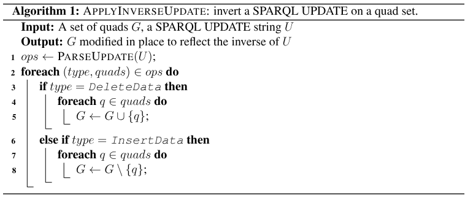
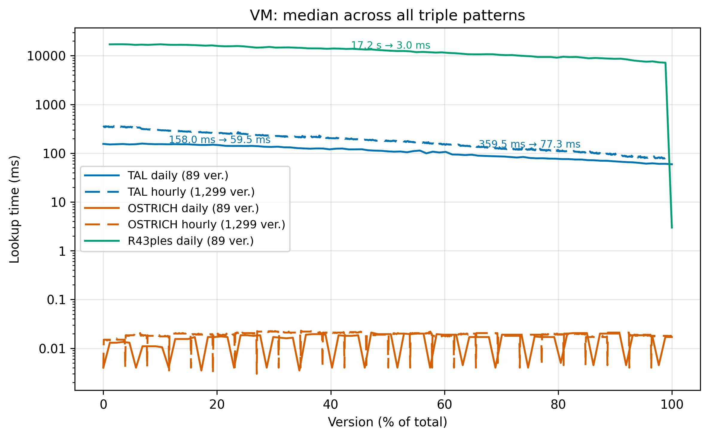
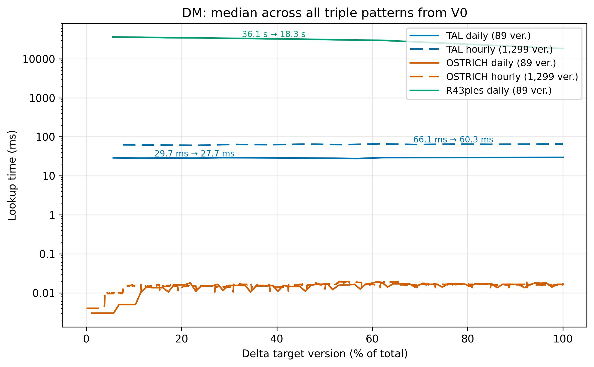
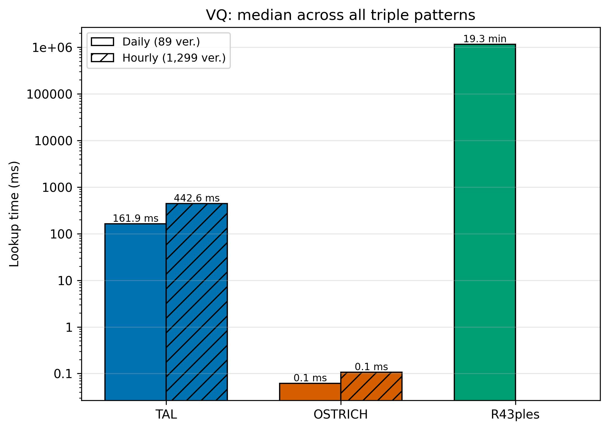

## La Novitade

### OC Meta

* Numero di quadruple nella provenance corretta: 8,451,129,250. Numero di quadruple nella provenance originale: 7,976,167,041. Buon segno. Paradossalmente, però, la provenanza nuova pesa meno, forse per una differenza nell'algoritmo di compressione o per assenza di spazi o per informazioni duplicate e cancellate. 40.73 GB vs 36.48 GB
* Qlever ha indicizzato tutta la provenance in quattro ore e mezza come quadruple. \~172GB

<div style="border: 1px solid #d0d7de; border-radius: 8px; padding: 16px; margin: 8px 0; background: #ffffff; font-family: -apple-system, BlinkMacSystemFont, 'Segoe UI', Helvetica, Arial, sans-serif; color: #1f2328;"><div style="display: flex; align-items: center; gap: 12px; margin-bottom: 12px;"><div><strong style="display: block; color: #1f2328;">arcangelo7</strong><span style="font-size: 0.85em; color: #656d76;">Mar 4, 2026</span><span style="font-size: 0.85em; color: #656d76;"> &middot; </span><a href="https://github.com/opencitations/oc_meta" style="font-size: 0.85em; color: #0969da; text-decoration: none;">opencitations/oc_meta</a></div></div><div style="margin: 12px 0; color: #1f2328;"><p>refactor(migration): generalize provenance_to_nquads to handle all RDF data</p>
<p>Rename script to rdf_to_nquads and add --mode parameter to select which
ZIP files to process: &#39;all&#39; (default), &#39;data&#39; (entity files only), or
&#39;prov&#39; (provenance se.zip files only).</p></div><div style="display: flex; justify-content: space-between; align-items: center; font-size: 0.85em;"><span style="font-family: monospace; color: #1a7f37; font-weight: 600;">+212</span><span style="font-family: monospace; color: #cf222e; font-weight: 600;">-62</span><a href="https://github.com/opencitations/oc_meta/commit/0233efede85ec12194f54d6648d5c8537cfe6db4" style="color: #0969da; text-decoration: none; font-weight: 500;">0233efe</a></div></div>

### API

<div style="border: 1px solid #d0d7de; border-radius: 8px; padding: 16px; margin: 8px 0; background: #ffffff; font-family: -apple-system, BlinkMacSystemFont, 'Segoe UI', Helvetica, Arial, sans-serif; color: #1f2328;"><div style="display: flex; align-items: center; gap: 12px; margin-bottom: 12px;"><div><strong style="display: block; color: #1f2328;">arcangelo7</strong><span style="font-size: 0.85em; color: #656d76;">Mar 3, 2026</span><span style="font-size: 0.85em; color: #656d76;"> &middot; </span><a href="https://github.com/opencitations/sparqlite" style="font-size: 0.85em; color: #0969da; text-decoration: none;">opencitations/sparqlite</a></div></div><div style="margin: 12px 0; color: #1f2328;"><p>feat: add HTTP method selection with GET default for read queries [release]</p></div><div style="display: flex; justify-content: space-between; align-items: center; font-size: 0.85em;"><span style="font-family: monospace; color: #1a7f37; font-weight: 600;">+169</span><span style="font-family: monospace; color: #cf222e; font-weight: 600;">-81</span><a href="https://github.com/opencitations/sparqlite/commit/98e7e1f531d451e518cc8f567835271c0f41c589" style="color: #0969da; text-decoration: none; font-weight: 500;">98e7e1f</a></div></div>

Aggiungere il GET a sparqlite mi è servito per generare un sottoinsieme di Index direttamente dall'endpoint pubblico, dato che tale endpoint accetta soltanto GET e non POST. Il sottoinsieme mi è servito per aggiungere dei test specifici per l'API di Index al repository oc\_api

<div style="border: 1px solid #d0d7de; border-radius: 8px; padding: 16px; margin: 8px 0; background: #ffffff; font-family: -apple-system, BlinkMacSystemFont, 'Segoe UI', Helvetica, Arial, sans-serif; color: #1f2328;"><div style="display: flex; align-items: center; gap: 12px; margin-bottom: 12px;"><div><strong style="display: block; color: #1f2328;">arcangelo7</strong><span style="font-size: 0.85em; color: #656d76;">Mar 3, 2026</span><span style="font-size: 0.85em; color: #656d76;"> &middot; </span><a href="https://github.com/opencitations/oc_meta" style="font-size: 0.85em; color: #0969da; text-decoration: none;">opencitations/oc_meta</a></div></div><div style="margin: 12px 0; color: #1f2328;"><p>feat(migration): add predicate discovery, graph-less and non-recursive modes to extract_subset</p>
<p>Bump sparqlite to 1.2.0 and add unit tests.</p></div><div style="display: flex; justify-content: space-between; align-items: center; font-size: 0.85em;"><span style="font-family: monospace; color: #1a7f37; font-weight: 600;">+267</span><span style="font-family: monospace; color: #cf222e; font-weight: 600;">-37</span><a href="https://github.com/opencitations/oc_meta/commit/9f701d18afef68331526958d18cb194d2bcc79a1" style="color: #0969da; text-decoration: none; font-weight: 500;">9f701d1</a></div></div>

<div style="border: 1px solid #d0d7de; border-radius: 8px; padding: 16px; margin: 8px 0; background: #ffffff; font-family: -apple-system, BlinkMacSystemFont, 'Segoe UI', Helvetica, Arial, sans-serif; color: #1f2328;"><div style="display: flex; align-items: center; gap: 12px; margin-bottom: 12px;"><div><strong style="display: block; color: #1f2328;">arcangelo7</strong><span style="font-size: 0.85em; color: #656d76;">Mar 3, 2026</span><span style="font-size: 0.85em; color: #656d76;"> &middot; </span><a href="https://github.com/opencitations/oc_api" style="font-size: 0.85em; color: #0969da; text-decoration: none;">opencitations/oc_api</a></div></div><div style="margin: 12px 0; color: #1f2328;"><p>test: set up test infrastructure for API query</p></div><div style="display: flex; justify-content: space-between; align-items: center; font-size: 0.85em;"><span style="font-family: monospace; color: #1a7f37; font-weight: 600;">+31891</span><span style="font-family: monospace; color: #cf222e; font-weight: 600;">-247</span><a href="https://github.com/opencitations/oc_api/commit/184ed24b35da7fbd9a0bf03719e9d19cb4021226" style="color: #0969da; text-decoration: none; font-weight: 500;">184ed24</a></div></div>

<div style="border: 1px solid #d0d7de; border-radius: 8px; padding: 16px; margin: 8px 0; background: #ffffff; font-family: -apple-system, BlinkMacSystemFont, 'Segoe UI', Helvetica, Arial, sans-serif; color: #1f2328;"><div style="display: flex; align-items: center; gap: 12px; margin-bottom: 12px;"><div><strong style="display: block; color: #1f2328;">arcangelo7</strong><span style="font-size: 0.85em; color: #656d76;">Mar 4, 2026</span><span style="font-size: 0.85em; color: #656d76;"> &middot; </span><a href="https://github.com/opencitations/oc_api" style="font-size: 0.85em; color: #0969da; text-decoration: none;">opencitations/oc_api</a></div></div><div style="margin: 12px 0; color: #1f2328;"><p>test(index): add index API tests with real citation data</p>
<p>Citations from DOI 10.1162/qss_a_00292 (OpenCitations Meta paper).</p></div><div style="display: flex; justify-content: space-between; align-items: center; font-size: 0.85em;"><span style="font-family: monospace; color: #1a7f37; font-weight: 600;">+4248</span><span style="font-family: monospace; color: #cf222e; font-weight: 600;">-446</span><a href="https://github.com/opencitations/oc_api/commit/25107ff2725cd435964d859b6fa4df57dafb100b" style="color: #0969da; text-decoration: none; font-weight: 500;">25107ff</a></div></div>

<div style="border: 1px solid #d0d7de; border-radius: 8px; padding: 16px; margin: 8px 0; background: #ffffff; font-family: -apple-system, BlinkMacSystemFont, 'Segoe UI', Helvetica, Arial, sans-serif; color: #1f2328;"><div style="display: flex; align-items: center; gap: 12px; margin-bottom: 12px;"><div><strong style="display: block; color: #1f2328;">arcangelo7</strong><span style="font-size: 0.85em; color: #656d76;">Mar 4, 2026</span><span style="font-size: 0.85em; color: #656d76;"> &middot; </span><a href="https://github.com/opencitations/oc_api" style="font-size: 0.85em; color: #0969da; text-decoration: none;">opencitations/oc_api</a></div></div><div style="margin: 12px 0; color: #1f2328;"><p>fix(index): split UNION in venue OPTIONAL to fix Virtuoso SPARQL evaluation bug</p>
<p>Virtuoso incorrectly evaluates subsequent OPTIONAL blocks when a
preceding OPTIONAL contains a UNION with a transitive property path
(frbr:partOf+) that produces no matches. This caused empty author and
source metadata for non-JournalArticle entities (e.g. fabio:Expression),
leading to wrong author_sc and journal_sc values in citation results.</p>
<p>Splitting the single OPTIONAL with UNION into two separate OPTIONALs
sharing the same ?venue variable is semantically equivalent and avoids
the bug.</p>
<p>Also adds integration tests for author self-citation, journal
self-citation, negative timespan, and month/day precision in timespan
calculations, with real data from OpenCitations.</p></div><div style="display: flex; justify-content: space-between; align-items: center; font-size: 0.85em;"><span style="font-family: monospace; color: #1a7f37; font-weight: 600;">+200</span><span style="font-family: monospace; color: #cf222e; font-weight: 600;">-8</span><a href="https://github.com/opencitations/oc_api/commit/9adb0f6a726c986459435c6769d0b441ef863c8e" style="color: #0969da; text-decoration: none; font-weight: 500;">9adb0f6</a></div></div>
)
![[Pasted image 20260304162504.png]]

Quando un'entità non è un fabio:JournalArticle e non ha frbr:partOf, nessun ramo del UNION matcha. In teoria l'OPTIONAL dovrebbe semplicemente non produrre risultati e passare oltre. Invece Virtuoso, quando incontra un UNION con un property path transitivo (frbr:partOf+) che non matcha, "rompe" gli OPTIONAL successivi, facendoli restituire stringhe vuote. Quindi, per esempio, ci saranno sicuramente delle citazioni per cui author self citation risulta false quando dovrebbe essere true.

<div style="border: 1px solid #d0d7de; border-radius: 8px; padding: 16px; margin: 8px 0; background: #ffffff; font-family: -apple-system, BlinkMacSystemFont, 'Segoe UI', Helvetica, Arial, sans-serif; color: #1f2328;"><div style="display: flex; align-items: center; gap: 12px; margin-bottom: 12px;"><div><strong style="display: block; color: #1f2328;">arcangelo7</strong><span style="font-size: 0.85em; color: #656d76;">Mar 4, 2026</span><span style="font-size: 0.85em; color: #656d76;"> &middot; </span><a href="https://github.com/opencitations/oc_api" style="font-size: 0.85em; color: #0969da; text-decoration: none;">opencitations/oc_api</a></div></div><div style="margin: 12px 0; color: #1f2328;"><p>refactor(index): remove dead code and replace dateutil.parser with strptime</p>
<p>Remove unreachable code paths (encode, isinstance else branches,
multi=False, reverse=False, defensive key checks) and replace
dateutil.parser.parse with datetime.strptime using date padding.
Add mock tests for SPARQL endpoint failures to reach 100% coverage.</p></div><div style="display: flex; justify-content: space-between; align-items: center; font-size: 0.85em;"><span style="font-family: monospace; color: #1a7f37; font-weight: 600;">+76</span><span style="font-family: monospace; color: #cf222e; font-weight: 600;">-136</span><a href="https://github.com/opencitations/oc_api/commit/6d9696f2bf68a6d7a6a15c6980520fb4786d045b" style="color: #0969da; text-decoration: none; font-weight: 500;">6d9696f</a></div></div>

<div style="border: 1px solid #d0d7de; border-radius: 8px; padding: 16px; margin: 8px 0; background: #ffffff; font-family: -apple-system, BlinkMacSystemFont, 'Segoe UI', Helvetica, Arial, sans-serif; color: #1f2328;"><div style="display: flex; align-items: center; gap: 12px; margin-bottom: 12px;"><div><strong style="display: block; color: #1f2328;">arcangelo7</strong><span style="font-size: 0.85em; color: #656d76;">Mar 4, 2026</span><span style="font-size: 0.85em; color: #656d76;"> &middot; </span><a href="https://github.com/opencitations/oc_api" style="font-size: 0.85em; color: #0969da; text-decoration: none;">opencitations/oc_api</a></div></div><div style="margin: 12px 0; color: #1f2328;"><p>fix(index): align v1 SPARQL queries with v2 and add v1 tests</p>
<p>The v1 __get_omid_of used plain literals only, failing to resolve DOIs
stored as typed literals (^^xsd:string). The __br_meta_metadata had a
UNION inside OPTIONAL that triggered a Virtuoso evaluation bug,
corrupting GROUP_CONCAT results for authors. Both issues caused
inconsistent author_sc values between v1 and v2 for the same citations.</p>
<p>Port the typed literal UNION and the split OPTIONAL fixes from v2.
Replace bare except clauses with except RequestException and return
({}, []) instead of (None, None) from __br_meta_metadata to resolve
pyright errors. Add dedicated v1 test file, rename v2 tests, extract
shared helpers into conftest, and exclude ramose.py from coverage.</p></div><div style="display: flex; justify-content: space-between; align-items: center; font-size: 0.85em;"><span style="font-family: monospace; color: #1a7f37; font-weight: 600;">+271</span><span style="font-family: monospace; color: #cf222e; font-weight: 600;">-109</span><a href="https://github.com/opencitations/oc_api/commit/6664e25899acb960b9beb153c47747b6cb762412" style="color: #0969da; text-decoration: none; font-weight: 500;">6664e25</a></div></div>

### Aldrovandi

<div style="border: 1px solid #d0d7de; border-radius: 8px; padding: 16px; margin: 8px 0; background: #ffffff; font-family: -apple-system, BlinkMacSystemFont, 'Segoe UI', Helvetica, Arial, sans-serif; color: #1f2328;"><div style="display: flex; align-items: center; gap: 12px; margin-bottom: 12px;"><div><strong style="display: block; color: #1f2328;">arcangelo7</strong><span style="font-size: 0.85em; color: #656d76;">Feb 28, 2026</span><span style="font-size: 0.85em; color: #656d76;"> &middot; </span><a href="https://github.com/dharc-org/changes-metadata-manager" style="font-size: 0.85em; color: #0969da; text-decoration: none;">dharc-org/changes-metadata-manager</a></div></div><div style="margin: 12px 0; color: #1f2328;"><p>feat(zenodo): generate methods description from knowledge graph</p></div><div style="display: flex; justify-content: space-between; align-items: center; font-size: 0.85em;"><span style="font-family: monospace; color: #1a7f37; font-weight: 600;">+260</span><span style="font-family: monospace; color: #cf222e; font-weight: 600;">-29</span><a href="https://github.com/dharc-org/changes-metadata-manager/commit/b9515d8655821d67da668860cb0741d4929c8f01" style="color: #0969da; text-decoration: none; font-weight: 500;">b9515d8</a></div></div>

<div style="border: 1px solid #d0d7de; border-radius: 8px; padding: 16px; margin: 8px 0; background: #ffffff; font-family: -apple-system, BlinkMacSystemFont, 'Segoe UI', Helvetica, Arial, sans-serif; color: #1f2328;"><div style="display: flex; align-items: center; gap: 12px; margin-bottom: 12px;"><div><strong style="display: block; color: #1f2328;">arcangelo7</strong><span style="font-size: 0.85em; color: #656d76;">Feb 28, 2026</span><span style="font-size: 0.85em; color: #656d76;"> &middot; </span><a href="https://github.com/dharc-org/changes-metadata-manager" style="font-size: 0.85em; color: #0969da; text-decoration: none;">dharc-org/changes-metadata-manager</a></div></div><div style="margin: 12px 0; color: #1f2328;"><p>feat(zenodo): add funding metadata to generated configs</p></div><div style="display: flex; justify-content: space-between; align-items: center; font-size: 0.85em;"><span style="font-family: monospace; color: #1a7f37; font-weight: 600;">+19</span><span style="font-family: monospace; color: #cf222e; font-weight: 600;">-1</span><a href="https://github.com/dharc-org/changes-metadata-manager/commit/22f0c9849435f3b1a27364e8de209caa6e6233f0" style="color: #0969da; text-decoration: none; font-weight: 500;">22f0c98</a></div></div>

[https://sandbox.zenodo.org/records/449574](https://sandbox.zenodo.org/records/449574)
[https://sandbox.zenodo.org/records/449576](https://sandbox.zenodo.org/records/449576)
[https://sandbox.zenodo.org/records/449570](https://sandbox.zenodo.org/records/449570)
[https://sandbox.zenodo.org/records/449572](https://sandbox.zenodo.org/records/449572)

<div style="border: 1px solid #d0d7de; border-radius: 8px; padding: 16px; margin: 8px 0; background: #ffffff; font-family: -apple-system, BlinkMacSystemFont, 'Segoe UI', Helvetica, Arial, sans-serif; color: #1f2328;"><div style="display: flex; align-items: center; gap: 12px; margin-bottom: 12px;"><div><strong style="display: block; color: #1f2328;">arcangelo7</strong><span style="font-size: 0.85em; color: #656d76;">Mar 4, 2026</span><span style="font-size: 0.85em; color: #656d76;"> &middot; </span><a href="https://github.com/dharc-org/changes-metadata-manager" style="font-size: 0.85em; color: #0969da; text-decoration: none;">dharc-org/changes-metadata-manager</a></div></div><div style="margin: 12px 0; color: #1f2328;"><p>feat(zenodo): generate table for DMP</p></div><div style="display: flex; justify-content: space-between; align-items: center; font-size: 0.85em;"><span style="font-family: monospace; color: #1a7f37; font-weight: 600;">+103</span><span style="font-family: monospace; color: #cf222e; font-weight: 600;">-63</span><a href="https://github.com/dharc-org/changes-metadata-manager/commit/13437de4c495323c31a5d0f23d2ce00172e3ed34" style="color: #0969da; text-decoration: none; font-weight: 500;">13437de</a></div></div>

| Numero su DMP | Caso di studio | Autore/i                                                                                                                                                                                                                                         | Tipo    | Titolo                                                                               | Data pubblicazione | DOI | URL                                                                                    | Repository | Licenza                                               | Note |
| ------------- | -------------- | ------------------------------------------------------------------------------------------------------------------------------------------------------------------------------------------------------------------------------------------------ | ------- | ------------------------------------------------------------------------------------ | ------------------ | --- | -------------------------------------------------------------------------------------- | ---------- | ----------------------------------------------------- | ---- |
|               | Aldrovandi     | Bordignon, Alice \[orcid:0009-0008-3556-0493]; Bonifazi, Federica \[orcid:0009-0000-8466-5541]; Massari, Arcangelo \[orcid:0000-0002-8420-0696]; Moretti, Arianna \[orcid:0000-0001-5486-7070]; Barzaghi, Sebastian \[orcid:0000-0002-0799-1527] | Dataset | Carta nautica - Digital Cultural Heritage Object - Aldrovandi Digital Twin           | 2026-02-28         |     | [https://sandbox.zenodo.org/records/466512](https://sandbox.zenodo.org/records/466512) | Zenodo     | cc0-1.0 (Metadata license); cc0-1.0 (Content license) |      |
|               | Aldrovandi     | Bordignon, Alice \[orcid:0009-0008-3556-0493]; Bonifazi, Federica \[orcid:0009-0000-8466-5541]; Massari, Arcangelo \[orcid:0000-0002-8420-0696]; Moretti, Arianna \[orcid:0000-0001-5486-7070]; Barzaghi, Sebastian \[orcid:0000-0002-0799-1527] | Dataset | Carta nautica - Optimized Digital Cultural Heritage Object - Aldrovandi Digital Twin | 2026-02-28         |     | [https://sandbox.zenodo.org/records/466514](https://sandbox.zenodo.org/records/466514) | Zenodo     | cc0-1.0 (Metadata license); cc0-1.0 (Content license) |      |
|               | Aldrovandi     | Bonifazi, Federica \[orcid:0009-0000-8466-5541]; Massari, Arcangelo \[orcid:0000-0002-8420-0696]; Moretti, Arianna \[orcid:0000-0001-5486-7070]; Barzaghi, Sebastian \[orcid:0000-0002-0799-1527]                                                | Dataset | Carta nautica - Raw - Aldrovandi Digital Twin                                        | 2026-02-28         |     | [https://sandbox.zenodo.org/records/466516](https://sandbox.zenodo.org/records/466516) | Zenodo     | cc0-1.0 (Metadata license)                            |      |
|               | Aldrovandi     | Bonifazi, Federica \[orcid:0009-0000-8466-5541]; Massari, Arcangelo \[orcid:0000-0002-8420-0696]; Moretti, Arianna \[orcid:0000-0001-5486-7070]; Barzaghi, Sebastian \[orcid:0000-0002-0799-1527]                                                | Dataset | Carta nautica - Processed raw model - Aldrovandi Digital Twin                        | 2026-02-28         |     | [https://sandbox.zenodo.org/records/466518](https://sandbox.zenodo.org/records/466518) | Zenodo     | cc0-1.0 (Metadata license)                            |      |

### Time Agnostic Library

> Temporal SPARQL extensions require either native support in triplestores or an external processing layer that translates extended queries into operations executable on standard endpoints. Since no temporal SPARQL extension has been adopted by mainstream triplestores or standardized by the W3C, the former path remains unavailable, and the latter results in the same architectural pattern as a library operating directly on standard SPARQL, with the addition of a non-standard query syntax. The approach presented here avoids this intermediate layer: users write standard SPARQL queries, and the library handles temporal reconstruction transparently, ensuring compatibility with any compliant triplestore.

<div style="border: 1px solid #d0d7de; border-radius: 8px; padding: 16px; margin: 8px 0; background: #ffffff; font-family: -apple-system, BlinkMacSystemFont, 'Segoe UI', Helvetica, Arial, sans-serif; color: #1f2328;"><div style="display: flex; align-items: center; gap: 12px; margin-bottom: 12px;"><div><strong style="display: block; color: #1f2328;">arcangelo7</strong><span style="font-size: 0.85em; color: #656d76;">Mar 2, 2026</span><span style="font-size: 0.85em; color: #656d76;"> &middot; </span><a href="https://github.com/opencitations/time-agnostic-library" style="font-size: 0.85em; color: #0969da; text-decoration: none;">opencitations/time-agnostic-library</a></div></div><div style="margin: 12px 0; color: #1f2328;"><p>feat(benchmark): add R43ples benchmark scripts and analysis integration</p></div><div style="display: flex; justify-content: space-between; align-items: center; font-size: 0.85em;"><span style="font-family: monospace; color: #1a7f37; font-weight: 600;">+879</span><span style="font-family: monospace; color: #cf222e; font-weight: 600;">-21</span><a href="https://github.com/opencitations/time-agnostic-library/commit/ccb99ea31af8fc76c5bb9ab33e310db0525ae0f0" style="color: #0969da; text-decoration: none; font-weight: 500;">ccb99ea</a></div></div>

Cose belle: [https://ctan.mirror.garr.it/mirrors/ctan/macros/latex/contrib/algorithm2e/doc/algorithm2e.pdf](https://ctan.mirror.garr.it/mirrors/ctan/macros/latex/contrib/algorithm2e/doc/algorithm2e.pdf)



<div style="border: 1px solid #d0d7de; border-radius: 8px; padding: 16px; margin: 8px 0; background: #ffffff; font-family: -apple-system, BlinkMacSystemFont, 'Segoe UI', Helvetica, Arial, sans-serif; color: #1f2328;"><div style="display: flex; align-items: center; gap: 12px; margin-bottom: 12px;"><div><strong style="display: block; color: #1f2328;">arcangelo7</strong><span style="font-size: 0.85em; color: #656d76;">Mar 4, 2026</span><span style="font-size: 0.85em; color: #656d76;"> &middot; </span><a href="https://github.com/opencitations/time-agnostic-library" style="font-size: 0.85em; color: #0969da; text-decoration: none;">opencitations/time-agnostic-library</a></div></div><div style="margin: 12px 0; color: #1f2328;"><p>feat!: replace DeltaQuery modified dict with net delta quad sets</p>
<p>DeltaQuery.run_agnostic_query() now returns additions and deletions
as sets of N3-encoded quad tuples instead of raw SPARQL UPDATE strings
keyed by timestamp. Add AgnosticEntity.get_delta() for computing net
deltas directly on a single entity without SPARQL query overhead.</p>
<p>BREAKING CHANGE: DeltaQuery output replaces &quot;modified&quot; dict with
&quot;additions&quot; and &quot;deletions&quot; sets of quad tuples.</p></div><div style="display: flex; justify-content: space-between; align-items: center; font-size: 0.85em;"><span style="font-family: monospace; color: #1a7f37; font-weight: 600;">+301</span><span style="font-family: monospace; color: #cf222e; font-weight: 600;">-129</span><a href="https://github.com/opencitations/time-agnostic-library/commit/d0f4f95d6ca27a5a805e125c031b959091b84321" style="color: #0969da; text-decoration: none; font-weight: 500;">d0f4f95</a></div></div>







### Domande

* Ho scoperto che YAGO (ovvero Wikidata con entità human-readable) ha un timeout di 1 minuto sulle query sia SPARQL che API. Lo dicono qui: [https://yago-knowledge.org/sparql](https://yago-knowledge.org/sparql). Usano Blazegraph. Lo so perché c´è una cartella blazegraph sul loro repo: [https://github.com/yago-naga/yago-website](https://github.com/yago-naga/yago-website). Idea per un articolo: confronto su come servizi su dataset RDF di grandi dimensioni in giro per il mondo gestiscono il problema della scalabilità vs come facciamo noi.
* Per la tabella con i record del DMP per i vari casi studio dello Spoke 4 io faccio continuare la numerazione dall'ultima riga già presente oppure lascio vuoto e ci pensiamo dopo?
  * Inoltre nella colonna licenza metto entrambe le licenze? CC0 sempre per i metadati più eventualmente quella dei dati
* Mario mi confermi che per le API di Index e Meta utilizziamo sempre e solo il fork locale di Ramose e mai la libreria? Mi ripeti il motivo di questa cosa? Perché adesso devo lavorare su Ramose e non vorrei che per l'API rimanesse il fork.

```python
  # ramose 1.0.8                                                    
  self.preprocess(par_dict, self.i, self.addon)             
  query = self.i["sparql"]                                                       
  for param in par_dict:
      query = query.replace("[[%s]]" % param, str(par_dict[param]))
      
  # fork
  self.preprocess(par_dict, self.i, self.addon)
  # Gestione parametri lista
  par_dict = {p_k: [par_dict[p_k]] if not isinstance(par_dict[p_k], list) else par_dict[p_k] for p_k in par_dict}
  combinations = product(*par_dict.values())
  parameters_comb = []
  for combination in combinations:
      parameters_comb.append(dict(zip(list(par_dict.keys()), list(combination))))
  list_of_res = []
  for par_dict in parameters_comb:
      query = self.i["sparql"]
      for param in par_dict:
          query = query.replace("[[%s]]" % param, str(par_dict[param]))
```

Con il fork locale, quando un utente cerca per DOI un'entita' che ha piu' OMID associati (perche' ad esempio ci sono duplicati nel database), RAMOSE esegue una query SPARQL separata per ciascun OMID e poi unisce i risultati. Il pacchetto installato non puo' farlo perche' non sa gestire il caso in cui il preprocessor restituisce più valori da iterare. In pratica: un DOI potrebbe risolvere a piu' bibliographic resource distinte in OpenCitations Meta. Il fork permette di interrogare Index per ciascuna di esse e aggregare le citazioni.

* [https://reuse.software/spec-3.3/](https://reuse.software/spec-3.3/) e [https://www.linuxfoundation.org/licensebestpractices](https://www.linuxfoundation.org/licensebestpractices)
* wl.py in oc-api è solo in oc-api o è condiviso tra vari servizi?
* Siamo consapevoli del fatto che la V1 di index fa una query diretta all'end point di Meta? Cioè proprio tramite query SPARQL a un servizio esterno.
