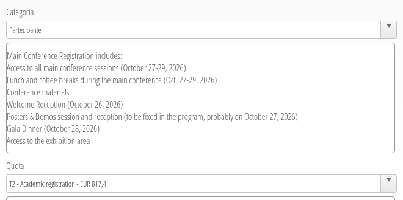
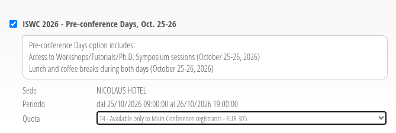

## La Novitade

### HERITRACE

<strong style="display: block; color: #1f2328;">arcangelo7</strong>Jul 25, 2026 &middot; <a href="https://github.com/opencitations/time-agnostic-library" style="font-size: 0.85em; color: #0969da; text-decoration: none;">opencitations/time-agnostic-library</a>

feat(entity): make historical provenance scans opt-in [release]

<a href="https://github.com/opencitations/time-agnostic-library/commit/0efc873a3e2ce6f3cde296e1bdb4b8d604276c23" style="color: #0969da; text-decoration: none; font-weight: 500;">0efc873</a>

<strong style="display: block; color: #1f2328;">arcangelo7</strong>Jul 25, 2026 &middot; <a href="https://github.com/opencitations/heritrace" style="font-size: 0.85em; color: #0969da; text-decoration: none;">opencitations/heritrace</a>

fix(history): query historical reverse relations only when display rules need them

<a href="https://github.com/opencitations/heritrace/commit/0f34ea00ccb51c1b8c338cdf74d688691e386839" style="color: #0969da; text-decoration: none; font-weight: 500;">0f34ea0</a>

<strong style="display: block; color: #1f2328;">arcangelo7</strong>Jul 26, 2026 &middot; <a href="https://github.com/opencitations/heritrace" style="font-size: 0.85em; color: #0969da; text-decoration: none;">opencitations/heritrace</a>

perf(time-vault): list deletions without replaying entity history and warm-up

Rendering a page rebuilt the whole history of every deleted entity in the
store, so it never finished on datasets the size of OpenCitations Meta. The
deletion snapshot already records the pre-deletion state, so the listing now
reads it from there.

<a href="https://github.com/opencitations/heritrace/commit/09a8b474a918ecd9318d7463b325d566fa2364f1" style="color: #0969da; text-decoration: none; font-weight: 500;">09a8b47</a>

### SPARQL Service Description

<strong style="display: block; color: #1f2328;">arcangelo7</strong>Jul 26, 2026 &middot; <a href="https://github.com/opencitations/oc_sparql" style="font-size: 0.85em; color: #0969da; text-decoration: none;">opencitations/oc_sparql</a>

feat: expose service descriptions

Adds /index/description, /meta/description and /.well-known/void, and
content-negotiated between turtle/jsonld/rdf+xml/n-triples/html.

Kept away from /index and /meta since those already serve the
YASQE/YASR query UI on GET with no query string; a Link header on that
existing response now points at the sibling description.

<a href="https://github.com/opencitations/oc_sparql/commit/25012c75f1fd7acae3dd9f048ce5e360fc1c1beb" style="color: #0969da; text-decoration: none; font-weight: 500;">25012c7</a>

[https://github.com/opencitations/oc\_sparql/pull/6](https://github.com/opencitations/oc_sparql/pull/6)

### Contratto che vai Legge n. che trovi

> il titolare di incarichi post-doc dell’Ateneo di Bologna dichiara di essere consapevole che, prima dell'inizio dello svolgimento dell'attività, deve acquisire la prescritta autorizzazione rilasciata dal Direttore del Dipartimento, sentito il tutor, così come previsto dal Regolamento per la disciplina dei contratti di ricerca ai sensi dell'art. 22 della Legge n. 240/2010, emanato con D.R. 1620/2025 e ss.mm.ii.

### time-agnostic-library (perché sì, i nomi overly generic esistevano anche prima di ChatGPT)

BEAR-B-instant, SV: 21.046 versioni × 62 pattern = 1,3M query x 6 esecuzioni (1 warmup + 5 ripetizioni) = 7,8M esecuzioni

La scorsa esecuzione ha impiegato circa 1,11s per esecuzione = 8,7M s = 3,3 mesi. Bravi tutti.

Direi che l'harness va modificata per funzionare in parallelo.

Il parallelismo è attaccabile? Sì. tracemalloc misura l'heap del processo, quindi i numeri di memory peak restano validi. Ma dato che le query girano insieme sulla stessa macchina e sullo stesso endpoint, il numero che pubblicherei non sarebbe più la latenza per query ma il throughput sotto carico. Inoltre, TAL già parallelizza internamente ovunque è possibile.

## Domande

### ISWC

Nell'email relativa al camera ready, si dice che è gradito uno screenshot dell'iscrizione alla conferenza. Ora, nell'improbabile caso in cui io vinca il premio per la tesi di dottorato, dovrei poter partecipare gratuitamente. Come funziona? Si viene rimborsati?

In ogni caso dubito fortemente di poter ricevere l'anticipo prima del 6 agosto.

L'iscrizione alla conferenza, che include la cena di gala costa 817,4 euro per gli early birds (fino al 31 agosto).

Mentre l'iscrizione alla pre-conference costa 305 euro più i costi annessi di pernottazione e consumazione.

### Una riflettazione

Ad oggi l'unico modo per riconoscere uno snapshot di cancellazione è la presenza di prov:invalidatedAtTime sull'ultimo snapshot. Questa informazione non è indicizzabile, perché prov:invalidatedAtTime è presente anche su tutti e gli altri snapshot. Quindi recuperare tutte le entità cancellate è un'operazione che non scala by design.

***

Che licenza ha il logo di OpenCitations?

***

Ad agosto potrò usare ServerGrosso?
