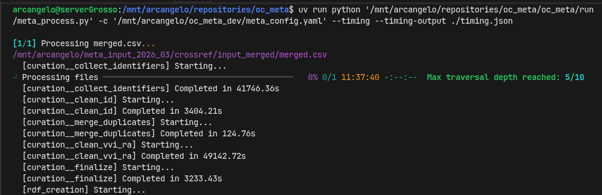
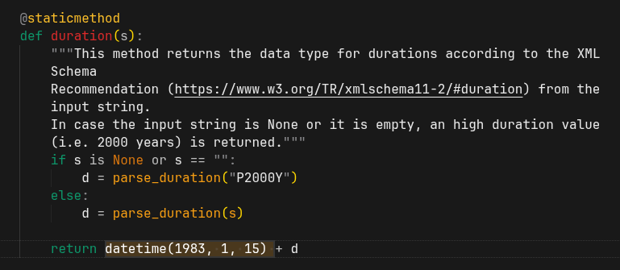
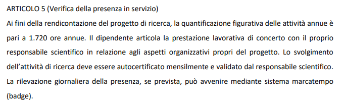
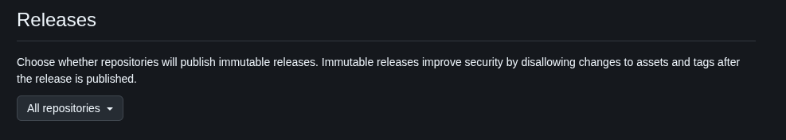

## La Novitade

### Qlevergate

> QLever's data structures for the original triples are highly compressed and optimized for query processing. The data structures for the update triples are currently less optimized. The performance difference is negligible when the number of update triples is small compared to the number of original triples, but it becomes significant when there are many update triples. ([https://docs.qlever.dev/rebuild-index/](https://docs.qlever.dev/rebuild-index/))

| Fase                 | Tempo per file (su 43 file) |
| -------------------- | --------------------------- |
| collect\_identifiers | 340-490s                    |
| storage              | 150s → 1623s                |

collect\_identifiers resta stabile (nel suo fare schifo). storage cresce drammaticamente.

> To rebuild the index efficiently, QLever provides the command qlever rebuild-index, which directly rebuilds the index from the existing data structures. With a Ryzen 9 9950X (16 cores) and NVMe SSD, this takes less than one minute for 500 million triples.

Ho realizzato che rebuild-index ha una complessità che non è lineare al numero di triple aggiunte, ma alla dimensione totale dell'indice. Impiega meno che ricostruire l'indice da zero. ma impiega comunque più dei 1623 secondi cioè 20 minuti. Di conseguenza è impensabile ricostruire l'indice ogni mille righe e allo stesso tempo è impensabile aggiornare QLEVER tramite query SPARQL.

### Meta

Ho eseguito dei benchmark per trovare la miglior combinazione tra numero di ID all'interno di una query SPARQL su Qlever e numero di query in contemporanea. e ho trovato che l'ideale è avere 30 ID in una query con 25 query in contemporanea.

<div style="border: 1px solid #d0d7de; border-radius: 8px; padding: 16px; margin: 8px 0; background: #ffffff; font-family: -apple-system, BlinkMacSystemFont, 'Segoe UI', Helvetica, Arial, sans-serif; color: #1f2328;"><div style="display: flex; align-items: center; gap: 12px; margin-bottom: 12px;"><div><strong style="display: block; color: #1f2328;">arcangelo7</strong><span style="font-size: 0.85em; color: #656d76;">Mar 28, 2026</span><span style="font-size: 0.85em; color: #656d76;"> &middot; </span><a href="https://github.com/opencitations/oc_meta" style="font-size: 0.85em; color: #0969da; text-decoration: none;">opencitations/oc_meta</a></div></div><div style="margin: 12px 0; color: #1f2328;"><p>perf(curator): parallelize identifier collection for large CSVs</p>
<p>Add ProcessPoolExecutor-based parallel processing for the identifier
extraction phase when row count exceeds min_rows_parallel threshold.</p></div><div style="display: flex; justify-content: space-between; align-items: center; font-size: 0.85em;"><span style="font-family: monospace; color: #1a7f37; font-weight: 600;">+307</span><span style="font-family: monospace; color: #cf222e; font-weight: 600;">-98</span><a href="https://github.com/opencitations/oc_meta/commit/21e66595d74dd9b0b55c983643fd6f41c300e28d" style="color: #0969da; text-decoration: none; font-weight: 500;">21e6659</a></div></div>

<div style="border: 1px solid #d0d7de; border-radius: 8px; padding: 16px; margin: 8px 0; background: #ffffff; font-family: -apple-system, BlinkMacSystemFont, 'Segoe UI', Helvetica, Arial, sans-serif; color: #1f2328;"><div style="display: flex; align-items: center; gap: 12px; margin-bottom: 12px;"><div><strong style="display: block; color: #1f2328;">arcangelo7</strong><span style="font-size: 0.85em; color: #656d76;">Mar 28, 2026</span><span style="font-size: 0.85em; color: #656d76;"> &middot; </span><a href="https://github.com/opencitations/oc_meta" style="font-size: 0.85em; color: #0969da; text-decoration: none;">opencitations/oc_meta</a></div></div><div style="margin: 12px 0; color: #1f2328;"><p>perf(cleaner): replace iterative replace() calls with str.translate()</p>
<p>Use precomputed translation tables for hyphen and space normalization.
This reduces O(n*k) string operations to O(n) where k is the number of
characters to normalize.</p></div><div style="display: flex; justify-content: space-between; align-items: center; font-size: 0.85em;"><span style="font-family: monospace; color: #1a7f37; font-weight: 600;">+28</span><span style="font-family: monospace; color: #cf222e; font-weight: 600;">-13</span><a href="https://github.com/opencitations/oc_meta/commit/cfe64e60b4608ab14f11071ed21317360dafa07c" style="color: #0969da; text-decoration: none; font-weight: 500;">cfe64e6</a></div></div>

<div style="border: 1px solid #d0d7de; border-radius: 8px; padding: 16px; margin: 8px 0; background: #ffffff; font-family: -apple-system, BlinkMacSystemFont, 'Segoe UI', Helvetica, Arial, sans-serif; color: #1f2328;"><div style="display: flex; align-items: center; gap: 12px; margin-bottom: 12px;"><div><strong style="display: block; color: #1f2328;">arcangelo7</strong><span style="font-size: 0.85em; color: #656d76;">Apr 1, 2026</span><span style="font-size: 0.85em; color: #656d76;"> &middot; </span><a href="https://github.com/opencitations/oc_meta" style="font-size: 0.85em; color: #0969da; text-decoration: none;">opencitations/oc_meta</a></div></div><div style="margin: 12px 0; color: #1f2328;"><p>refactor: unify entity storage with EntityStore and prefix MetaIDs</p>
<p>Introduces EntityStore class that combines entity data storage, merge
tracking (Union-Find), and bidirectional identifier lookups. Replaces
separate brdict, radict, idbr, idra dictionaries with a single unified
store.</p></div><div style="display: flex; justify-content: space-between; align-items: center; font-size: 0.85em;"><span style="font-family: monospace; color: #1a7f37; font-weight: 600;">+1658</span><span style="font-family: monospace; color: #cf222e; font-weight: 600;">-1300</span><a href="https://github.com/opencitations/oc_meta/commit/77147bf1535ad18227a0ad90a3457beb62de00ab" style="color: #0969da; text-decoration: none; font-weight: 500;">77147bf</a></div></div>

<div style="border: 1px solid #d0d7de; border-radius: 8px; padding: 16px; margin: 8px 0; background: #ffffff; font-family: -apple-system, BlinkMacSystemFont, 'Segoe UI', Helvetica, Arial, sans-serif; color: #1f2328;"><div style="display: flex; align-items: center; gap: 12px; margin-bottom: 12px;"><div><strong style="display: block; color: #1f2328;">arcangelo7</strong><span style="font-size: 0.85em; color: #656d76;">Apr 2, 2026</span><span style="font-size: 0.85em; color: #656d76;"> &middot; </span><a href="https://github.com/opencitations/oc_meta" style="font-size: 0.85em; color: #0969da; text-decoration: none;">opencitations/oc_meta</a></div></div><div style="margin: 12px 0; color: #1f2328;"><p>perf(finder): replace rdflib Graph with dict-based triple store</p>
<p>ResourceFinder stored triples in an rdflib Graph (local_g) and
maintained per-subject Graph copies in prebuilt_subgraphs. Both
structures carry substantial overhead from rdflib&#39;s indexing and
object allocation.</p>
<p>Replace them with plain dicts: _spo (subject -&gt; predicate -&gt; [objects])
and _po_s (predicate+object -&gt; {subjects}). All query methods now use
dict lookups instead of Graph.triples() iteration. The get_subgraph
method reconstructs an rdflib Graph on demand for oc_ocdm compatibility.</p>
<p>This also removes the everything_everywhere_allatonce Graph from
Curator and the local_g parameter from ResourceFinder&#39;s constructor.</p></div><div style="display: flex; justify-content: space-between; align-items: center; font-size: 0.85em;"><span style="font-family: monospace; color: #1a7f37; font-weight: 600;">+540</span><span style="font-family: monospace; color: #cf222e; font-weight: 600;">-690</span><a href="https://github.com/opencitations/oc_meta/commit/8a1afe77f02b9c0a092059ed0d9b22abdcab070a" style="color: #0969da; text-decoration: none; font-weight: 500;">8a1afe7</a></div></div>

* Artemis II è crashata a causa di doi.org/10.36962/doi:10.36962/ecs107/3-5/2025-14. Un DOI col prefisso doi: incluso nel DOI. Il mio codice rimuoveva il prefisso a un certo punto, senza prevedere la possibilità che il prefisso fosse parte del valore letterale.

```python
if identifier.startswith(br_id_schema):
	identifier = identifier.replace(f"{br_id_schema}:", "")
```

```python
if identifier.startswith(f"{br_id_schema}:"):
	identifier = identifier.split(":", 1)[1]
```

<div style="border: 1px solid #d0d7de; border-radius: 8px; padding: 16px; margin: 8px 0; background: #ffffff; font-family: -apple-system, BlinkMacSystemFont, 'Segoe UI', Helvetica, Arial, sans-serif; color: #1f2328;"><div style="display: flex; align-items: center; gap: 12px; margin-bottom: 12px;"><div><strong style="display: block; color: #1f2328;">arcangelo7</strong><span style="font-size: 0.85em; color: #656d76;">Apr 4, 2026</span><span style="font-size: 0.85em; color: #656d76;"> &middot; </span><a href="https://github.com/opencitations/oc_meta" style="font-size: 0.85em; color: #0969da; text-decoration: none;">opencitations/oc_meta</a></div></div><div style="margin: 12px 0; color: #1f2328;"><p>refactor!: switch check_results output from text report to structured JSON</p>
<p>The text report was not machine-readable, making it unusable by pipeline
orchestrators. Output is now a JSON file with status (PASS/FAIL), per-file
stats, errors, and warnings. Exit code 1 on errors, 0 otherwise.</p>
<p>BREAKING CHANGE: output format changed from plain text to JSON</p></div><div style="display: flex; justify-content: space-between; align-items: center; font-size: 0.85em;"><span style="font-family: monospace; color: #1a7f37; font-weight: 600;">+468</span><span style="font-family: monospace; color: #cf222e; font-weight: 600;">-328</span><a href="https://github.com/opencitations/oc_meta/commit/68bbab2f4e48ac1efa36c86603526a7444bb55d0" style="color: #0969da; text-decoration: none; font-weight: 500;">68bbab2</a></div></div>

<div style="border: 1px solid #d0d7de; border-radius: 8px; padding: 16px; margin: 8px 0; background: #ffffff; font-family: -apple-system, BlinkMacSystemFont, 'Segoe UI', Helvetica, Arial, sans-serif; color: #1f2328;"><div style="display: flex; align-items: center; gap: 12px; margin-bottom: 12px;"><div><strong style="display: block; color: #1f2328;">arcangelo7</strong><span style="font-size: 0.85em; color: #656d76;">Apr 4, 2026</span><span style="font-size: 0.85em; color: #656d76;"> &middot; </span><a href="https://github.com/opencitations/oc_meta" style="font-size: 0.85em; color: #0969da; text-decoration: none;">opencitations/oc_meta</a></div></div><div style="margin: 12px 0; color: #1f2328;"><p>perf(finder): batch VVI queries with SPARQL VALUES clauses</p>
<p>Replace individual per-VVI SPARQL queries with batched VALUES queries
grouped by pattern (issue+volume, issue-only, volume-only). This reduces
the number of round-trips to the triplestore. Also track and display the
max traversal depth reached during subgraph resolution.</p></div><div style="display: flex; justify-content: space-between; align-items: center; font-size: 0.85em;"><span style="font-family: monospace; color: #1a7f37; font-weight: 600;">+84</span><span style="font-family: monospace; color: #cf222e; font-weight: 600;">-48</span><a href="https://github.com/opencitations/oc_meta/commit/5172a2661a4c576ffb055dbe774157471bca2600" style="color: #0969da; text-decoration: none; font-weight: 500;">5172a26</a></div></div>



27 ore per la fase di curatela relativa a 2.7 milioni di righe di CSV. Ottimo che la massima ricorsione raggiunta nello scoprire nuovi soggetti di cui recuperare il grafo sia quella attesa

### oc\_ds\_converter

<div style="border: 1px solid #d0d7de; border-radius: 8px; padding: 16px; margin: 8px 0; background: #ffffff; font-family: -apple-system, BlinkMacSystemFont, 'Segoe UI', Helvetica, Arial, sans-serif; color: #1f2328;"><div style="display: flex; align-items: center; gap: 12px; margin-bottom: 12px;"><div><strong style="display: block; color: #1f2328;">arcangelo7</strong><span style="font-size: 0.85em; color: #656d76;">Mar 25, 2026</span><span style="font-size: 0.85em; color: #656d76;"> &middot; </span><a href="https://github.com/opencitations/oc_ds_converter" style="font-size: 0.85em; color: #0969da; text-decoration: none;">opencitations/oc_ds_converter</a></div></div><div style="margin: 12px 0; color: #1f2328;"><p>fix(crossref): skip citing entities without DOI references</p></div><div style="display: flex; justify-content: space-between; align-items: center; font-size: 0.85em;"><span style="font-family: monospace; color: #1a7f37; font-weight: 600;">+94</span><span style="font-family: monospace; color: #cf222e; font-weight: 600;">-2</span><a href="https://github.com/opencitations/oc_ds_converter/commit/f2f16b889059ec1fb7ce867b0c2c51b04d356901" style="color: #0969da; text-decoration: none; font-weight: 500;">f2f16b8</a></div></div>

### RAMOSE

<div style="border: 1px solid #d0d7de; border-radius: 8px; padding: 16px; margin: 8px 0; background: #ffffff; font-family: -apple-system, BlinkMacSystemFont, 'Segoe UI', Helvetica, Arial, sans-serif; color: #1f2328;"><div style="display: flex; align-items: center; gap: 12px; margin-bottom: 12px;"><div><strong style="display: block; color: #1f2328;">arcangelo7</strong><span style="font-size: 0.85em; color: #656d76;">Mar 31, 2026</span><span style="font-size: 0.85em; color: #656d76;"> &middot; </span><a href="https://github.com/opencitations/ramose" style="font-size: 0.85em; color: #0969da; text-decoration: none;">opencitations/ramose</a></div></div><div style="margin: 12px 0; color: #1f2328;"><p>feat: port oc_api improvements to upstream ramose</p>
<p>Backport four changes that diverged in oc_api&#39;s local copy of ramose.py:</p>
<ul>
<li>use raw strings for all regex patterns (Python 3.12+ DeprecationWarning)</li>
<li>use persistent requests.Session with 60s timeout for SPARQL queries</li>
<li>add endpoint_override parameter to APIManager constructor</li>
<li>add optional html_meta_description support in generated documentation</li>
</ul></div><div style="display: flex; justify-content: space-between; align-items: center; font-size: 0.85em;"><span style="font-family: monospace; color: #1a7f37; font-weight: 600;">+43</span><span style="font-family: monospace; color: #cf222e; font-weight: 600;">-23</span><a href="https://github.com/opencitations/ramose/commit/011fd616fffc06db34c8114726499909db95ef56" style="color: #0969da; text-decoration: none; font-weight: 500;">011fd61</a></div></div>

<div style="border: 1px solid #d0d7de; border-radius: 8px; padding: 16px; margin: 8px 0; background: #ffffff; font-family: -apple-system, BlinkMacSystemFont, 'Segoe UI', Helvetica, Arial, sans-serif; color: #1f2328;"><div style="display: flex; align-items: center; gap: 12px; margin-bottom: 12px;"><div><strong style="display: block; color: #1f2328;">arcangelo7</strong><span style="font-size: 0.85em; color: #656d76;">Mar 31, 2026</span><span style="font-size: 0.85em; color: #656d76;"> &middot; </span><a href="https://github.com/opencitations/ramose" style="font-size: 0.85em; color: #0969da; text-decoration: none;">opencitations/ramose</a></div></div><div style="margin: 12px 0; color: #1f2328;"><p>build!: migrate from poetry to uv and update python support</p>
<p>Bump supported Python versions from 3.7-3.10 to 3.10-3.13.</p>
<p>Fix store_documentation to unpack the tuple returned by
get_documentation. Fix duplicate closing brace in CSS. Add guard
in clean_log for malformed log lines. Move logging import to
module level.</p>
<p>BREAKING CHANGE: minimum Python version raised from 3.7 to 3.10</p></div><div style="display: flex; justify-content: space-between; align-items: center; font-size: 0.85em;"><span style="font-family: monospace; color: #1a7f37; font-weight: 600;">+512</span><span style="font-family: monospace; color: #cf222e; font-weight: 600;">-482</span><a href="https://github.com/opencitations/ramose/commit/edc1eca5def8f2e82f88257ad42da717395a6e31" style="color: #0969da; text-decoration: none; font-weight: 500;">edc1eca</a></div></div>

<div style="border: 1px solid #d0d7de; border-radius: 8px; padding: 16px; margin: 8px 0; background: #ffffff; font-family: -apple-system, BlinkMacSystemFont, 'Segoe UI', Helvetica, Arial, sans-serif; color: #1f2328;"><div style="display: flex; align-items: center; gap: 12px; margin-bottom: 12px;"><div><strong style="display: block; color: #1f2328;">arcangelo7</strong><span style="font-size: 0.85em; color: #656d76;">Apr 2, 2026</span><span style="font-size: 0.85em; color: #656d76;"> &middot; </span><a href="https://github.com/opencitations/ramose" style="font-size: 0.85em; color: #0969da; text-decoration: none;">opencitations/ramose</a></div></div><div style="margin: 12px 0; color: #1f2328;"><p>test: replace stale API checks with local meta integration tests</p>
<p>The old tests depended on external APIs that no longer return
responses.</p>
<p>Add integration tests backed by a local OpenCitations Meta dataset served
through QLever, and update CI/CD to run pytest with coverage, publish the
coverage badge, and trigger releases.</p></div><div style="display: flex; justify-content: space-between; align-items: center; font-size: 0.85em;"><span style="font-family: monospace; color: #1a7f37; font-weight: 600;">+36872</span><span style="font-family: monospace; color: #cf222e; font-weight: 600;">-9468</span><a href="https://github.com/opencitations/ramose/commit/4d00724fe095903d4ba26cbec8ae6a07623beb76" style="color: #0969da; text-decoration: none; font-weight: 500;">4d00724</a></div></div>

LOL 

[https://opencitations.github.io/ramose/coverage/](https://opencitations.github.io/ramose/coverage/)

[https://github.com/opencitations/oc\_api/pull/32](https://github.com/opencitations/oc_api/pull/32)

<div style="border: 1px solid #d0d7de; border-radius: 8px; padding: 16px; margin: 8px 0; background: #ffffff; font-family: -apple-system, BlinkMacSystemFont, 'Segoe UI', Helvetica, Arial, sans-serif; color: #1f2328;"><div style="display: flex; align-items: center; gap: 12px; margin-bottom: 12px;"><div><strong style="display: block; color: #1f2328;">arcangelo7</strong><span style="font-size: 0.85em; color: #656d76;">Apr 4, 2026</span><span style="font-size: 0.85em; color: #656d76;"> &middot; </span><a href="https://github.com/opencitations/ramose" style="font-size: 0.85em; color: #0969da; text-decoration: none;">opencitations/ramose</a></div></div><div style="margin: 12px 0; color: #1f2328;"><p>feat: add multi-source SPARQL, SPARQL Anything, OpenAPI export, and pluggable formats</p>
<p>Based on: opencitations/ramose#20 and the extensions-feature branch.</p>
<p>Co-authored-by: Sergey Slinkin</p></div><div style="display: flex; justify-content: space-between; align-items: center; font-size: 0.85em;"><span style="font-family: monospace; color: #1a7f37; font-weight: 600;">+2672</span><span style="font-family: monospace; color: #cf222e; font-weight: 600;">-96</span><a href="https://github.com/opencitations/ramose/commit/06fe6da389846ab908edf76643db73c1f3e1e0b5" style="color: #0969da; text-decoration: none; font-weight: 500;">06fe6da</a></div></div>

### Index

<div style="border: 1px solid #d0d7de; border-radius: 8px; padding: 16px; margin: 8px 0; background: #ffffff; font-family: -apple-system, BlinkMacSystemFont, 'Segoe UI', Helvetica, Arial, sans-serif; color: #1f2328;"><div style="display: flex; align-items: center; gap: 12px; margin-bottom: 12px;"><div><strong style="display: block; color: #1f2328;">arcangelo7</strong><span style="font-size: 0.85em; color: #656d76;">Mar 25, 2026</span><span style="font-size: 0.85em; color: #656d76;"> &middot; </span><a href="https://github.com/opencitations/index" style="font-size: 0.85em; color: #0969da; text-decoration: none;">opencitations/index</a></div></div><div style="margin: 12px 0; color: #1f2328;"><p>chore: set up REUSE 3.3 license compliance</p></div><div style="display: flex; justify-content: space-between; align-items: center; font-size: 0.85em;"><span style="font-family: monospace; color: #1a7f37; font-weight: 600;">+759</span><span style="font-family: monospace; color: #cf222e; font-weight: 600;">-768</span><a href="https://github.com/opencitations/index/commit/af81fb6d3ca2c7e180285dc42af279f42b910f32" style="color: #0969da; text-decoration: none; font-weight: 500;">af81fb6</a></div></div>

### oc\_ocdm

<div style="border: 1px solid #d0d7de; border-radius: 8px; padding: 16px; margin: 8px 0; background: #ffffff; font-family: -apple-system, BlinkMacSystemFont, 'Segoe UI', Helvetica, Arial, sans-serif; color: #1f2328;"><div style="display: flex; align-items: center; gap: 12px; margin-bottom: 12px;"><div><strong style="display: block; color: #1f2328;">arcangelo7</strong><span style="font-size: 0.85em; color: #656d76;">Mar 28, 2026</span><span style="font-size: 0.85em; color: #656d76;"> &middot; </span><a href="https://github.com/opencitations/oc_ocdm" style="font-size: 0.85em; color: #0969da; text-decoration: none;">opencitations/oc_ocdm</a></div></div><div style="margin: 12px 0; color: #1f2328;"><p>fix(graph)!: make res_type a required parameter in GraphEntity</p>
<p>res_type was incorrectly defaulting to None despite being mandatory for
every entity. Swap parameter order so res_type comes before the optional
res, update all GraphSet factory methods accordingly, and modernize type
annotations throughout both modules.</p>
<p>BREAKING CHANGE: GraphEntity.<strong>init</strong> signature changed — res_type is
now the third positional argument (required), res is fourth (optional).</p></div><div style="display: flex; justify-content: space-between; align-items: center; font-size: 0.85em;"><span style="font-family: monospace; color: #1a7f37; font-weight: 600;">+73</span><span style="font-family: monospace; color: #cf222e; font-weight: 600;">-77</span><a href="https://github.com/opencitations/oc_ocdm/commit/0cf909b06857f5e5e217d28264584a9e3dfa28b6" style="color: #0969da; text-decoration: none; font-weight: 500;">0cf909b</a></div></div>

<div style="border: 1px solid #d0d7de; border-radius: 8px; padding: 16px; margin: 8px 0; background: #ffffff; font-family: -apple-system, BlinkMacSystemFont, 'Segoe UI', Helvetica, Arial, sans-serif; color: #1f2328;"><div style="display: flex; align-items: center; gap: 12px; margin-bottom: 12px;"><div><strong style="display: block; color: #1f2328;">arcangelo7</strong><span style="font-size: 0.85em; color: #656d76;">Mar 28, 2026</span><span style="font-size: 0.85em; color: #656d76;"> &middot; </span><a href="https://github.com/opencitations/oc_ocdm" style="font-size: 0.85em; color: #0969da; text-decoration: none;">opencitations/oc_ocdm</a></div></div><div style="margin: 12px 0; color: #1f2328;"><p>refactor(graph): fix type annotations and restructure merge as template method</p>
<p>Replace merge method overrides across the entity hierarchy with a
template method pattern to resolve typing violations.</p>
<p>GraphEntity.merge now uses Self for the other parameter, enforces
same-type checking at runtime via short_name comparison, and delegates
property-specific merging to _merge_properties hooks that subclasses
implement instead of overriding merge directly.</p></div><div style="display: flex; justify-content: space-between; align-items: center; font-size: 0.85em;"><span style="font-family: monospace; color: #1a7f37; font-weight: 600;">+83</span><span style="font-family: monospace; color: #cf222e; font-weight: 600;">-72</span><a href="https://github.com/opencitations/oc_ocdm/commit/ea35689a7079b44871ee3c55c5af784f87f4813e" style="color: #0969da; text-decoration: none; font-weight: 500;">ea35689</a></div></div>
#### Problema

Ogni sottoclasse di entity sovrascriveva `merge` per aggiungere la propria logica di copia delle proprietà. Il metodo `merge` usa `Self` come tipo del parametro `other`, perchè il merge ha senso solo tra entità dello stesso tipo. Il punto è che quando una sottoclasse sovrascrive un metodo e ne restringe il tipo di un parametro, sta violando il principio di sostituzione di Liskov:

> Se q(x) è una proprietà che si può dimostrare essere valida per oggetti x di tipo T, allora q(y) deve essere valida per oggetti y di tipo S dove S è un sottotipo di T

un `BibliographicResource.merge` che accetta solo `BibliographicResource` è più restrittivo di `GraphEntity.merge` che accetta qualsiasi `GraphEntity`. Pyright segnalava ogni singolo override come errore.

#### Soluzione

`merge` è definito una sola volta in `GraphEntity`. Si occupa della parte fissa dell'algoritmo (quella che vale per tutti i tipi di entity) e delega il lavoro specifico a un hook `_merge_properties`, che le sottoclassi implementano al posto di sovrascrivere `merge`.

Lo scheletro di `merge`:

```
GraphEntity.merge(other: Self)

1. verifica che other.short_name == self.short_name
2. redireziona le triple che puntavano a other verso self
3. risolve rdf:type (con la logica di prefer_self)
4. copia la label
5. aggiorna i flag di merge e la merge list
6. segna other come da cancellare
7. chiama self._merge_properties(other, prefer_self)
```

Ogni sottoclasse sovrascrive solo `_merge_properties`. La catena di `super()._merge_properties()` fa sì che ogni livello della gerarchia contribuisca con la sua parte, dal piu' generale al più specifico.

`GraphEntity.merge` confronta `other.short_name` con `self.short_name` e lancia `TypeError` se non corrispondono. Questo sostituisce i decoratori `@accepts_only` che prima stavano su ogni override di `merge` nelle sottoclassi: un unico punto di controllo al posto di dodici sparsi nella gerarchia.

### Domande

#### Migrazione index da setuptools a uv

Attualmente setup.py esegue queste operazioni al momento dell'import:

* Crea la directory \~/.opencitations/index/logs/
* Copia config.ini e lookup.csv nella home dell'utente

Con pyproject.toml non è possibile eseguire codice arbitrario durante l'installazione. Vorrei capire cosa sono quei file prima di procedere.



### shacl-extractor

[https://github.com/skg-if/shacl-extractor/issues/4](https://github.com/skg-if/shacl-extractor/issues/4)

<div style="border: 1px solid #d0d7de; border-radius: 8px; padding: 16px; margin: 8px 0; background: #ffffff; font-family: -apple-system, BlinkMacSystemFont, 'Segoe UI', Helvetica, Arial, sans-serif; color: #1f2328;"><div style="display: flex; align-items: center; gap: 12px; margin-bottom: 12px;"><div><strong style="display: block; color: #1f2328;">arcangelo7</strong><span style="font-size: 0.85em; color: #656d76;">Mar 30, 2026</span><span style="font-size: 0.85em; color: #656d76;"> &middot; </span><a href="https://github.com/skg-if/shacl-extractor" style="font-size: 0.85em; color: #0969da; text-decoration: none;">skg-if/shacl-extractor</a></div></div><div style="margin: 12px 0; color: #1f2328;"><p>feat: generate sh:in for controlled vocabulary properties</p>
<p>Support the {prefix:val1 prefix:val2 ...} syntax in dc:description
annotations to declare a fixed set of allowed named individuals.
The extractor emits sh:in with an rdf:List of IRIs instead of
sh:class or sh:node. Both prefixed names and absolute IRIs are
accepted inside the braces.</p></div><div style="display: flex; justify-content: space-between; align-items: center; font-size: 0.85em;"><span style="font-family: monospace; color: #1a7f37; font-weight: 600;">+141</span><span style="font-family: monospace; color: #cf222e; font-weight: 600;">-5</span><a href="https://github.com/skg-if/shacl-extractor/commit/9b3b90f19c8d209dae082b55a013aefedb531d2a" style="color: #0969da; text-decoration: none; font-weight: 500;">9b3b90f</a></div></div>

### Release immutabili



Ho attivato le release immutabili su tutti i repository dell'organizzazione opencitations su GitHub

#### Licenze

Se io genero un file SHCL automaticamente utilizzando un software a partire da un file OWL che ha una certa licenza, Il file generato, quale licenza avrà?

#### Ramose

C'è una ragione per cui ramose è un unico file di 1000 e passa righe?

* Time agnostic library
* Workshop
