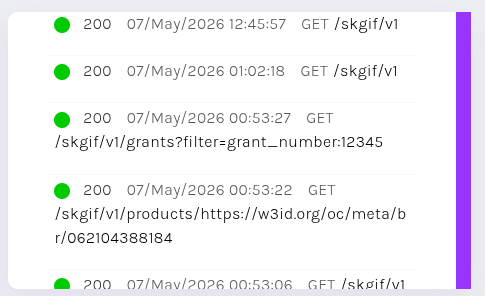
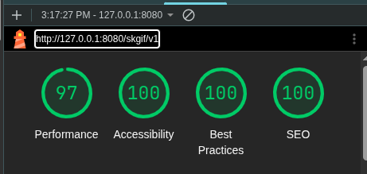

## La Novitade

### Meta

<div style="border: 1px solid #d0d7de; border-radius: 8px; padding: 16px; margin: 8px 0; background: #ffffff; font-family: -apple-system, BlinkMacSystemFont, 'Segoe UI', Helvetica, Arial, sans-serif; color: #1f2328;"><div style="display: flex; align-items: center; gap: 12px; margin-bottom: 12px;"><div><strong style="display: block; color: #1f2328;">arcangelo7</strong><span style="font-size: 0.85em; color: #656d76;">May 5, 2026</span><span style="font-size: 0.85em; color: #656d76;"> &middot; </span><a href="https://github.com/opencitations/oc_ocdm" style="font-size: 0.85em; color: #0969da; text-decoration: none;">opencitations/oc_ocdm</a></div></div><div style="margin: 12px 0; color: #1f2328;"><p>perf(counter_handler): cache counters in RAM with lazy loading and flush [release]</p>
<p>Counter files are now read into memory on first access per supplier prefix
and written back to disk on flush() or <strong>del</strong></p></div><div style="display: flex; justify-content: space-between; align-items: center; font-size: 0.85em;"><span style="font-family: monospace; color: #1a7f37; font-weight: 600;">+574</span><span style="font-family: monospace; color: #cf222e; font-weight: 600;">-239</span><a href="https://github.com/opencitations/oc_ocdm/commit/d8e24651207cda29e85467193771fd4cc0fd730a" style="color: #0969da; text-decoration: none; font-weight: 500;">d8e2465</a></div></div>

<div style="border: 1px solid #d0d7de; border-radius: 8px; padding: 16px; margin: 8px 0; background: #ffffff; font-family: -apple-system, BlinkMacSystemFont, 'Segoe UI', Helvetica, Arial, sans-serif; color: #1f2328;"><div style="display: flex; align-items: center; gap: 12px; margin-bottom: 12px;"><div><strong style="display: block; color: #1f2328;">arcangelo7</strong><span style="font-size: 0.85em; color: #656d76;">May 7, 2026</span><span style="font-size: 0.85em; color: #656d76;"> &middot; </span><a href="https://github.com/opencitations/oc_meta" style="font-size: 0.85em; color: #0969da; text-decoration: none;">opencitations/oc_meta</a></div></div><div style="margin: 12px 0; color: #1f2328;"><p>feat(curator): add identifiers_only mode for lightweight ID-only curation</p>
<p>Skip VVI/RA cleaning, equalizer, and limit finder depth to 1 when
identifiers_only is set in config.</p></div><div style="display: flex; justify-content: space-between; align-items: center; font-size: 0.85em;"><span style="font-family: monospace; color: #1a7f37; font-weight: 600;">+89</span><span style="font-family: monospace; color: #cf222e; font-weight: 600;">-83</span><a href="https://github.com/opencitations/oc_meta/commit/1c487ae94ba41e5053e07afc90ff3a4dca858145" style="color: #0969da; text-decoration: none; font-weight: 500;">1c487ae</a></div></div>

20 giorni stimati per openalex. L'info dir non era il collo di bottiglia. Il collo di bottiglia rimane rdflib durante la scrittura su file. Non ha alcun senso. La struttura dell'RDF è predicibile, si può serenamente manipolare direttamente il json finale, se l'output richiesto è in json-ld. Anche per altri formati immagino, ma al momento non me ne preoccupo.

E il context? Beh, il context è pura sostituzione di stringhe, niente di complesso.

<div style="border: 1px solid #d0d7de; border-radius: 8px; padding: 16px; margin: 8px 0; background: #ffffff; font-family: -apple-system, BlinkMacSystemFont, 'Segoe UI', Helvetica, Arial, sans-serif; color: #1f2328;"><div style="display: flex; align-items: center; gap: 12px; margin-bottom: 12px;"><div><strong style="display: block; color: #1f2328;">arcangelo7</strong><span style="font-size: 0.85em; color: #656d76;">May 7, 2026</span><span style="font-size: 0.85em; color: #656d76;"> &middot; </span><a href="https://github.com/opencitations/oc_ocdm" style="font-size: 0.85em; color: #0969da; text-decoration: none;">opencitations/oc_ocdm</a></div></div><div style="margin: 12px 0; color: #1f2328;"><p>perf(storer): bypass rdflib JSON-LD parse/serialize with orjson fast path</p>
<p>rdflib&#39;s Dataset.parse + serialize for JSON-LD costs ~676ms per file
(282ms parse + 359ms serialize). This adds a direct JSON manipulation
path using orjson that skips rdflib entirely when output_format is json-ld,
reducing the same operation to ~13ms.</p>
<p>New components:</p>
<ul>
<li>Reader.load_jsonld_dict(): reads JSON-LD files via orjson with
automatic CURIE expansion when a matching context is present</li>
<li>_entity_to_jsonld_dict(): converts TripleLite triples to JSON-LD
dicts using indexed SPO lookups</li>
<li>_JsonLdDoc: mutable indexed wrapper over JSON-LD with O(1) entity
upsert/remove using a single dict as source of truth</li>
<li>_compact_jsonld/_expand_jsonld: CURIE compaction/expansion</li>
</ul>
<p>store_all() and store_graphs_in_file() branch to the fast path
transparently. The rdflib path remains for non-json-ld formats.</p>
<p>[release]</p></div><div style="display: flex; justify-content: space-between; align-items: center; font-size: 0.85em;"><span style="font-family: monospace; color: #1a7f37; font-weight: 600;">+769</span><span style="font-family: monospace; color: #cf222e; font-weight: 600;">-45</span><a href="https://github.com/opencitations/oc_ocdm/commit/4ef1d542cef9db90e63d80614cbcb36a303d0626" style="color: #0969da; text-decoration: none; font-weight: 500;">4ef1d54</a></div></div>

Ora il tempo previsto è 9 giorni. È la metà, ma speravo meglio.

Il processo è crashato dopo alcuni csv per segmentation fault. pycurl non è thread safe. Non ha senso usarlo con Qlever visto che Qlever gestisce bene richieste parallele. La seconda più veloce è urrlib, che è la stessa usata da SPARQLWrapper. Varrebbe comunque la pena usare sparqlite per via del connection pooling, ma il keep alive causa rallentamenti con Qlever che non c'erano su Virtuoso. Tanto vale tornare a SPARQLWrapper e ritornare JSON.

### RAMOSE

<div style="border: 1px solid #d0d7de; border-radius: 8px; padding: 16px; margin: 8px 0; background: #ffffff; font-family: -apple-system, BlinkMacSystemFont, 'Segoe UI', Helvetica, Arial, sans-serif; color: #1f2328;"><div style="display: flex; align-items: center; gap: 12px; margin-bottom: 12px;"><div><strong style="display: block; color: #1f2328;">arcangelo7</strong><span style="font-size: 0.85em; color: #656d76;">May 5, 2026</span><span style="font-size: 0.85em; color: #656d76;"> &middot; </span><a href="https://github.com/opencitations/ramose" style="font-size: 0.85em; color: #0969da; text-decoration: none;">opencitations/ramose</a></div></div><div style="margin: 12px 0; color: #1f2328;"><p>feat(hash_format): add #disable_params to suppress built-in query parameters</p>
<p>Allow API and operation sections in .hf spec files to declare
#disable_params with a comma-separated list (or * for all) of built-in
parameters to suppress. Disabled parameters are ignored at runtime and
omitted from generated HTML and OpenAPI documentation.</p>
<p>The directive merges across levels: operation-level extends API-level.</p></div><div style="display: flex; justify-content: space-between; align-items: center; font-size: 0.85em;"><span style="font-family: monospace; color: #1a7f37; font-weight: 600;">+314</span><span style="font-family: monospace; color: #cf222e; font-weight: 600;">-11</span><a href="https://github.com/opencitations/ramose/commit/8c43ffde76f40ce973f1f8a1ba39c1eeae0517a9" style="color: #0969da; text-decoration: none; font-weight: 500;">8c43ffd</a></div></div>

<div style="border: 1px solid #d0d7de; border-radius: 8px; padding: 16px; margin: 8px 0; background: #ffffff; font-family: -apple-system, BlinkMacSystemFont, 'Segoe UI', Helvetica, Arial, sans-serif; color: #1f2328;"><div style="display: flex; align-items: center; gap: 12px; margin-bottom: 12px;"><div><strong style="display: block; color: #1f2328;">arcangelo7</strong><span style="font-size: 0.85em; color: #656d76;">May 5, 2026</span><span style="font-size: 0.85em; color: #656d76;"> &middot; </span><a href="https://github.com/opencitations/ramose" style="font-size: 0.85em; color: #0969da; text-decoration: none;">opencitations/ramose</a></div></div><div style="margin: 12px 0; color: #1f2328;"><p>feat(skgif): add mock endpoints for missiong entity types and handle empty filters</p>
<p>SKG-IF spec requires all 7 entity types to be served. OpenCitations only
has data for products, persons, organisations, and venues. The remaining
types (grants, topics, datasources) now return empty results instead of
404, with full filter validation per the spec.</p>
<p>Product filters valid in SKG-IF but absent in OpenCitations (affiliations,
funding, abstracts) now return empty results via FILTER(false) injection
instead of raising ValueError. Filter descriptions in the .hf spec
distinguish between filters with data and those accepted but always empty.</p></div><div style="display: flex; justify-content: space-between; align-items: center; font-size: 0.85em;"><span style="font-family: monospace; color: #1a7f37; font-weight: 600;">+294</span><span style="font-family: monospace; color: #cf222e; font-weight: 600;">-27</span><a href="https://github.com/opencitations/ramose/commit/0d889c7e9493b93a90942e5f6aea93ef0c1f7d7a" style="color: #0969da; text-decoration: none; font-weight: 500;">0d889c7</a></div></div>

#### Paginazione e cache

La paginazione deve essere necessariamente aggiunta in post e non iniettata nella query SPARQL, perché Ramose consente una serie di operazioni di post processing come ad esempio filter, sort e require che operano su tutti i risultati. Se noi applicassimo la paginazione nella query SPARQL e poi applicassimo i filtri otterremmo dei risultati falsi

* Filter verrebbe eseguito solo su tot righe, quindi il client vedrebbe un numero inferiore di pagine a quelle reali
* Sort ordinerebbe solo quelle tot righe, quindi l'ordinamento sarebbe sbagliato tra pagine diverse
* Require avrebbe lo stesso problema del filter
  L'alternativa sarebbe tradurre filter/sort/require in clausole SPARQL. O si fa tutto in SPARQL o tutto in post, non si può mischiare.

Come fare la paginazione? Per esempio facendo come [GitHub API](https://docs.github.com/en/rest/using-the-rest-api/using-pagination-in-the-rest-api) e la maggior parte delle REST API paginate, ovvero usando un header Link nella risposta HTTP [https://www.rfc-editor.org/rfc/rfc8288](https://www.rfc-editor.org/rfc/rfc8288)

```
Link: </v1/metadata/doi:10.1162/qss_a_00292?page=3&page_size=10>; rel="next",
      </v1/metadata/doi:10.1162/qss_a_00292?page=1&page_size=10>; rel="prev",
      </v1/metadata/doi:10.1162/qss_a_00292?page=1&page_size=10>; rel="first",
      </v1/metadata/doi:10.1162/qss_a_00292?page=5&page_size=10>; rel="last"
```

Per la cache va bene SQLite

<div style="border: 1px solid #d0d7de; border-radius: 8px; padding: 16px; margin: 8px 0; background: #ffffff; font-family: -apple-system, BlinkMacSystemFont, 'Segoe UI', Helvetica, Arial, sans-serif; color: #1f2328;"><div style="display: flex; align-items: center; gap: 12px; margin-bottom: 12px;"><div><strong style="display: block; color: #1f2328;">arcangelo7</strong><span style="font-size: 0.85em; color: #656d76;">May 6, 2026</span><span style="font-size: 0.85em; color: #656d76;"> &middot; </span><a href="https://github.com/opencitations/ramose" style="font-size: 0.85em; color: #0969da; text-decoration: none;">opencitations/ramose</a></div></div><div style="margin: 12px 0; color: #1f2328;"><p>feat(operation): add result caching and pagination</p>
<p>SQLite-backed cache stores processed results (post-filter, pre-pagination)
so subsequent requests skip SPARQL execution. Pagination via page/page_size
query parameters slices cached or fresh results and emits RFC 8288 Link
headers. Per-operation cache control via #cache_duration and #cache_disable.</p>
<p>ValueError from invalid pagination params returns 400.</p>
<p>Closes: #15, #16</p></div><div style="display: flex; justify-content: space-between; align-items: center; font-size: 0.85em;"><span style="font-family: monospace; color: #1a7f37; font-weight: 600;">+550</span><span style="font-family: monospace; color: #cf222e; font-weight: 600;">-25</span><a href="https://github.com/opencitations/ramose/commit/3d6876985f8d8ffba2f19e176e0eddfd09307c07" style="color: #0969da; text-decoration: none; font-weight: 500;">3d68769</a></div></div>

<div style="border: 1px solid #d0d7de; border-radius: 8px; padding: 16px; margin: 8px 0; background: #ffffff; font-family: -apple-system, BlinkMacSystemFont, 'Segoe UI', Helvetica, Arial, sans-serif; color: #1f2328;"><div style="display: flex; align-items: center; gap: 12px; margin-bottom: 12px;"><div><strong style="display: block; color: #1f2328;">arcangelo7</strong><span style="font-size: 0.85em; color: #656d76;">May 6, 2026</span><span style="font-size: 0.85em; color: #656d76;"> &middot; </span><a href="https://github.com/opencitations/ramose" style="font-size: 0.85em; color: #0969da; text-decoration: none;">opencitations/ramose</a></div></div><div style="margin: 12px 0; color: #1f2328;"><p>feat(paging): pass request URL to format converters for SKG-IF pagination</p>
<p>Format converters now receive request_url as a parameter, allowing
to_skgif to extract pagination metadata directly from the URL and wrap
responses in the expected SKG-IF envelope.</p>
<p>Also: exec() returns a 4-tuple (status, body, content_type, headers),
with Link header.</p></div><div style="display: flex; justify-content: space-between; align-items: center; font-size: 0.85em;"><span style="font-family: monospace; color: #1a7f37; font-weight: 600;">+291</span><span style="font-family: monospace; color: #cf222e; font-weight: 600;">-145</span><a href="https://github.com/opencitations/ramose/commit/dd5a2d9f52a83690fec0f2e3f54acd7790554564" style="color: #0969da; text-decoration: none; font-weight: 500;">dd5a2d9</a></div></div>

<div style="border: 1px solid #d0d7de; border-radius: 8px; padding: 16px; margin: 8px 0; background: #ffffff; font-family: -apple-system, BlinkMacSystemFont, 'Segoe UI', Helvetica, Arial, sans-serif; color: #1f2328;"><div style="display: flex; align-items: center; gap: 12px; margin-bottom: 12px;"><div><strong style="display: block; color: #1f2328;">arcangelo7</strong><span style="font-size: 0.85em; color: #656d76;">May 6, 2026</span><span style="font-size: 0.85em; color: #656d76;"> &middot; </span><a href="https://github.com/opencitations/ramose" style="font-size: 0.85em; color: #0969da; text-decoration: none;">opencitations/ramose</a></div></div><div style="margin: 12px 0; color: #1f2328;"><p>build: move pysparql-anything to optional dependency</p>
<p>The 154MB SPARQL Anything jar download should not be forced on users
who only need standard SPARQL endpoint querying. The import is now
lazy, triggered only when the sparql-anything engine is actually used.</p>
<p>Install with: pip install ramose[sparql-anything]</p></div><div style="display: flex; justify-content: space-between; align-items: center; font-size: 0.85em;"><span style="font-family: monospace; color: #1a7f37; font-weight: 600;">+24</span><span style="font-family: monospace; color: #cf222e; font-weight: 600;">-5</span><a href="https://github.com/opencitations/ramose/commit/4208bcd4ec2627a8eeb7ca1b0a33e0e0e05ca6b2" style="color: #0969da; text-decoration: none; font-weight: 500;">4208bcd</a></div></div>

<div style="border: 1px solid #d0d7de; border-radius: 8px; padding: 16px; margin: 8px 0; background: #ffffff; font-family: -apple-system, BlinkMacSystemFont, 'Segoe UI', Helvetica, Arial, sans-serif; color: #1f2328;"><div style="display: flex; align-items: center; gap: 12px; margin-bottom: 12px;"><div><strong style="display: block; color: #1f2328;">arcangelo7</strong><span style="font-size: 0.85em; color: #656d76;">May 7, 2026</span><span style="font-size: 0.85em; color: #656d76;"> &middot; </span><a href="https://github.com/opencitations/ramose" style="font-size: 0.85em; color: #0969da; text-decoration: none;">opencitations/ramose</a></div></div><div style="margin: 12px 0; color: #1f2328;"><p>fix(paging): delegate pagination to format converters</p>
<p>Custom formats can change the number of entities in the output (e.g.
collapsing multiple CSV rows into one object), so row-level pagination
in RAMOSE produces wrong total_items and corrupts data by slicing
mid-entity. When a custom format is configured, skip row slicing and
let the converter count entities, validate page bounds, and slice.</p></div><div style="display: flex; justify-content: space-between; align-items: center; font-size: 0.85em;"><span style="font-family: monospace; color: #1a7f37; font-weight: 600;">+60</span><span style="font-family: monospace; color: #cf222e; font-weight: 600;">-21</span><a href="https://github.com/opencitations/ramose/commit/5b79cfba21e64d3237f3eb4eebb6ea3fa2e980c1" style="color: #0969da; text-decoration: none; font-weight: 500;">5b79cfb</a></div></div>

<div style="border: 1px solid #d0d7de; border-radius: 8px; padding: 16px; margin: 8px 0; background: #ffffff; font-family: -apple-system, BlinkMacSystemFont, 'Segoe UI', Helvetica, Arial, sans-serif; color: #1f2328;"><div style="display: flex; align-items: center; gap: 12px; margin-bottom: 12px;"><div><strong style="display: block; color: #1f2328;">arcangelo7</strong><span style="font-size: 0.85em; color: #656d76;">May 7, 2026</span><span style="font-size: 0.85em; color: #656d76;"> &middot; </span><a href="https://github.com/opencitations/ramose" style="font-size: 0.85em; color: #0969da; text-decoration: none;">opencitations/ramose</a></div></div><div style="margin: 12px 0; color: #1f2328;"><p>fix(docs): hide result fields type when default format is custom</p>
<p>Operations with a custom #default_format (e.g., SKG-IF)
were showing tabular &quot;Result fields type&quot; in the HTML documentation,
which doesn&#39;t reflect the actual output structure. Now the section is
suppressed when default_format points to a non-builtin converter.</p></div><div style="display: flex; justify-content: space-between; align-items: center; font-size: 0.85em;"><span style="font-family: monospace; color: #1a7f37; font-weight: 600;">+22</span><span style="font-family: monospace; color: #cf222e; font-weight: 600;">-713</span><a href="https://github.com/opencitations/ramose/commit/ce4b52ea4150081699458a11e17893fb5898d723" style="color: #0969da; text-decoration: none; font-weight: 500;">ce4b52e</a></div></div>

### Accessibilità

A me sembra che la documentazione di RAMOSE sia difficile da leggere. Contrasti bassi, evidenziazioni che coprono le scritte, font a 10px per i parametri delle chiamate. Ho verificato questi problemi anche usando Lighthouse di Chrome.

<div style="border: 1px solid #d0d7de; border-radius: 8px; padding: 16px; margin: 8px 0; background: #ffffff; font-family: -apple-system, BlinkMacSystemFont, 'Segoe UI', Helvetica, Arial, sans-serif; color: #1f2328;"><div style="display: flex; align-items: center; gap: 12px; margin-bottom: 12px;"><div><strong style="display: block; color: #1f2328;">arcangelo7</strong><span style="font-size: 0.85em; color: #656d76;">May 7, 2026</span><span style="font-size: 0.85em; color: #656d76;"> &middot; </span><a href="https://github.com/opencitations/ramose" style="font-size: 0.85em; color: #0969da; text-decoration: none;">opencitations/ramose</a></div></div><div style="margin: 12px 0; color: #1f2328;"><p>fix(docs): improve accessibility and readability of HTML documentation</p>
<p>Replace cascading em font sizes with rem to prevent compounding that
produced illegible ~9px text in nested parameter lists. Enforce 16px
minimum across all text elements. Fix WCAG AA color contrast failures
by replacing grey (#808080) with #595959 and darkening inline code
color. Narrow link highlight gradient from 50% to 70% so it reads as
an underline rather than covering descenders. Add word-breaking to
the API calls box for long URLs, let operation cards expand beyond
fixed height, and add missing lang attribute on <html>.</p></div><div style="display: flex; justify-content: space-between; align-items: center; font-size: 0.85em;"><span style="font-family: monospace; color: #1a7f37; font-weight: 600;">+111</span><span style="font-family: monospace; color: #cf222e; font-weight: 600;">-103</span><a href="https://github.com/opencitations/ramose/commit/4eff0a5e6e21deef35c6d5aef1781becbb942a22" style="color: #0969da; text-decoration: none; font-weight: 500;">4eff0a5</a></div></div>

overflow-wrap: break-word delle chiamate, per evitare overflow a destra



Prima:

Dopo:


Il 97% di performance è legato al fatto che CSS e JS non sono minificati in modalità di debug, ma evidentemente lo sono in produzione perché nginx o chi per lui usa gzip.

### oc\_ocdm

<div style="border: 1px solid #d0d7de; border-radius: 8px; padding: 16px; margin: 8px 0; background: #ffffff; font-family: -apple-system, BlinkMacSystemFont, 'Segoe UI', Helvetica, Arial, sans-serif; color: #1f2328;"><div style="display: flex; align-items: center; gap: 12px; margin-bottom: 12px;"><div><strong style="display: block; color: #1f2328;">arcangelo7</strong><span style="font-size: 0.85em; color: #656d76;">May 7, 2026</span><span style="font-size: 0.85em; color: #656d76;"> &middot; </span><a href="https://github.com/opencitations/oc_ocdm" style="font-size: 0.85em; color: #0969da; text-decoration: none;">opencitations/oc_ocdm</a></div></div><div style="margin: 12px 0; color: #1f2328;"><p>docs: replace Sphinx with Starlight Astro documentation</p>
<p>All guides are written against the current v11 API (plain str,
triplelite) with OpenCitations Meta examples throughout.</p>
<p>Pages: quick start, entities, identifiers, reading, storing,
provenance (with SVG diagrams ported from old docs), counter handlers.</p></div><div style="display: flex; justify-content: space-between; align-items: center; font-size: 0.85em;"><span style="font-family: monospace; color: #1a7f37; font-weight: 600;">+7212</span><span style="font-family: monospace; color: #cf222e; font-weight: 600;">-1199</span><a href="https://github.com/opencitations/oc_ocdm/commit/d015c49c140192df626196c66db33ed12b97ebe9" style="color: #0969da; text-decoration: none; font-weight: 500;">d015c49</a></div></div>

## Domande

* Ruben
  * Why are usage (rate/request/result size) limits implemented?
  * What specific limits are implemented on the SPARQL endpoint you maintain?
  * Do the implemented rate limits work?
  * Are you (as an endpoint maintainer) willing to implement a metadata schema to advertise these limits to users?
* RAMOSE
  * field\_type va oscurato solo se vengono bloccati gli output in CSV e JSON. In caso contrario bisogna esplicitare che si riferisce solo a quelli
