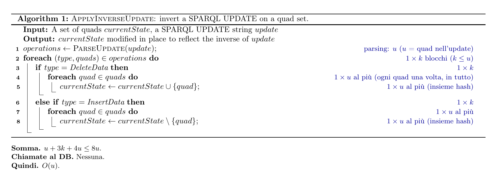
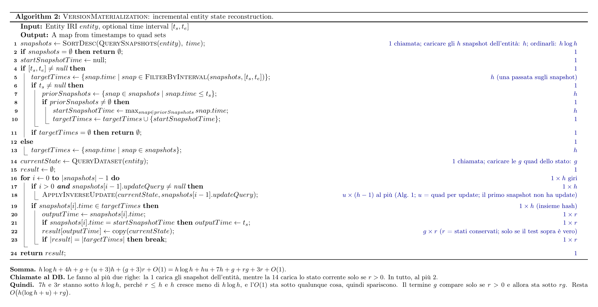
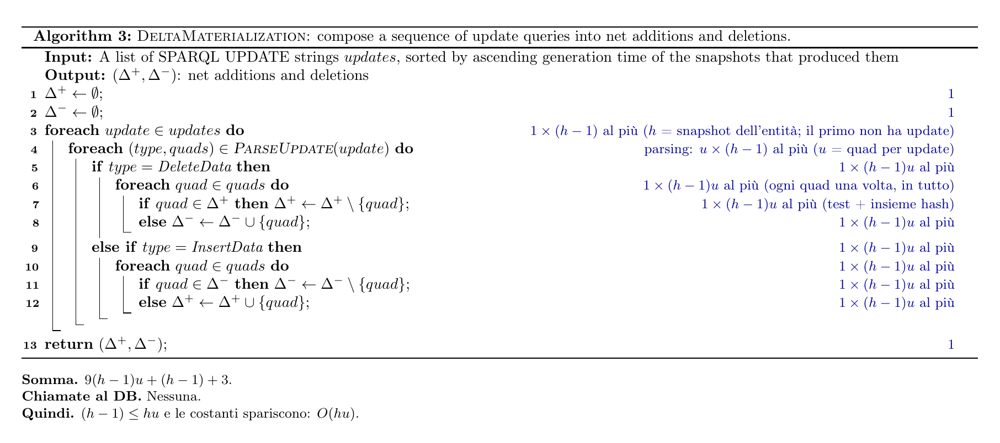
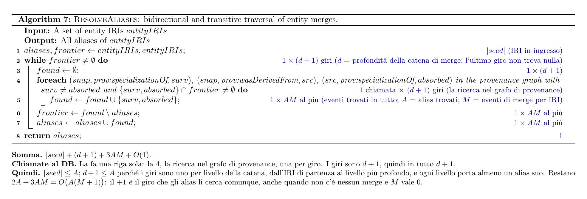
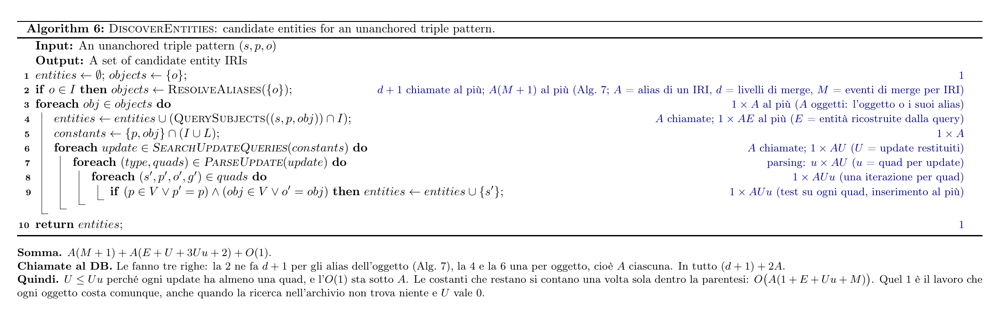
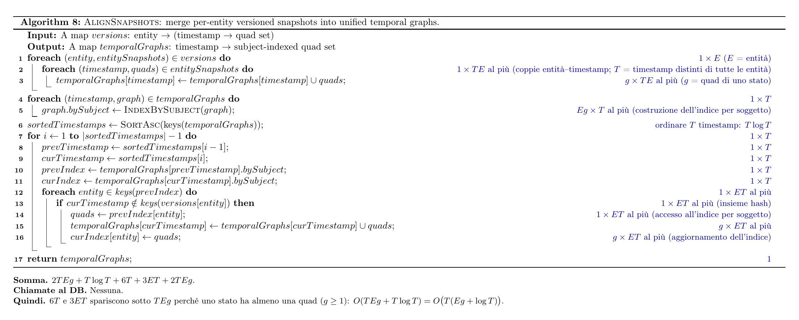
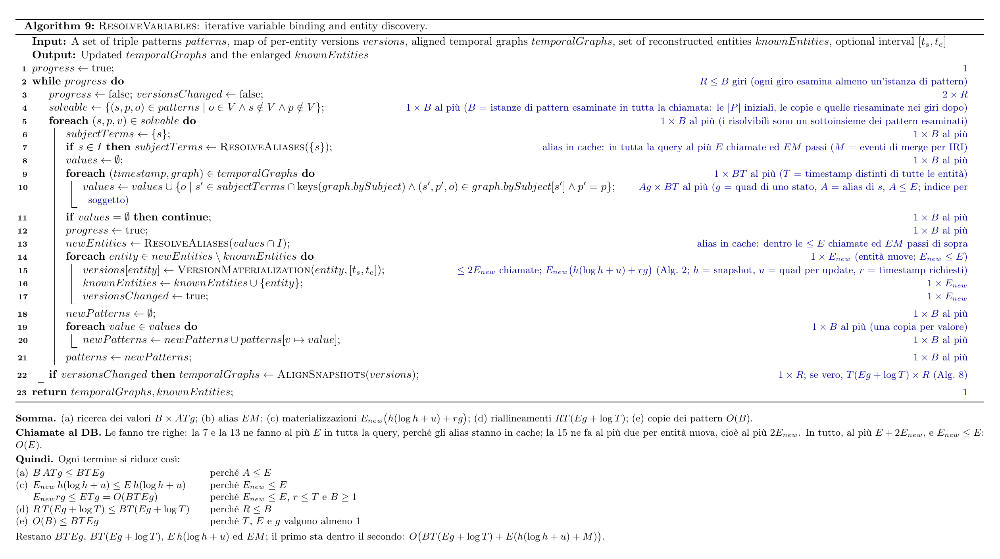
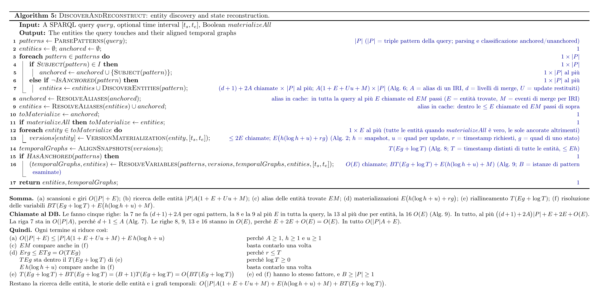
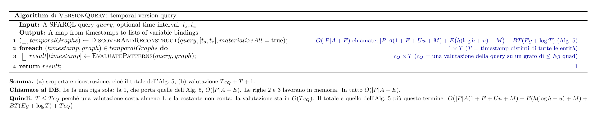
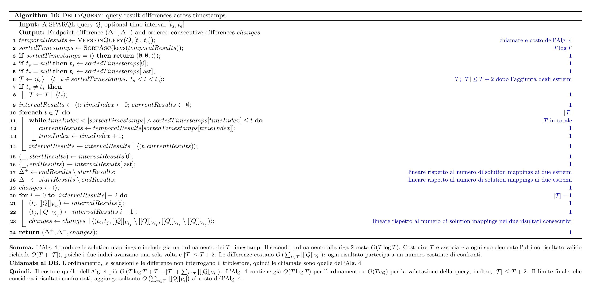

## La Novitade

### time-agnostic-library

<strong style="display: block; color: #1f2328;">arcangelo7</strong>Aug 7, 2026 &middot; <a href="https://github.com/opencitations/time-agnostic-library" style="font-size: 0.85em; color: #0969da; text-decoration: none;">opencitations/time-agnostic-library</a>

feat(query): support merge-aware entity histories

<a href="https://github.com/opencitations/time-agnostic-library/commit/6a965689f6f2e17a71e92eec9af3cd26dcf37aca" style="color: #0969da; text-decoration: none; font-weight: 500;">6a96568</a>

<strong style="display: block; color: #1f2328;">arcangelo7</strong>Aug 26, 2026 &middot; <a href="https://github.com/opencitations/time-agnostic-library" style="font-size: 0.85em; color: #0969da; text-decoration: none;">opencitations/time-agnostic-library</a>

perf(query): filter quads before isolated version reconstruction

<a href="https://github.com/opencitations/time-agnostic-library/commit/f3c430ca47bb8b77ead7cdc54286a0e02a04b584" style="color: #0969da; text-decoration: none; font-weight: 500;">f3c430c</a>

<strong style="display: block; color: #1f2328;">arcangelo7</strong>Sep 3, 2026 &middot; <a href="https://github.com/opencitations/time-agnostic-library" style="font-size: 0.85em; color: #0969da; text-decoration: none;">opencitations/time-agnostic-library</a>

feat!: compare delta query solution mappings across versions

BREAKING CHANGE: DeltaQuery removes changed_properties and returns additions, deletions, changes, and merges as solution mappings instead of per-entity quad records.

<a href="https://github.com/opencitations/time-agnostic-library/commit/a14f83dc4cec25e3f8637816256304c9e146d8d3" style="color: #0969da; text-decoration: none; font-weight: 500;">a14f83d</a>

### Complessità algoritmica

Obiettivo: capire come cresce il lavoro al crescere dell'input. Trovare un limite superiore, un peggio di così non può andare.

Mattone di cui ho letto solo 40 pagine [https://cs.ucf.edu/\~sharma/Algorithms\_notes.pdf](https://cs.ucf.edu/~sharma/Algorithms_notes.pdf) chiedendo a ChatGPT di spiegarmi  ogni riga salvo poi scoprire che quello è un libro di appunti di un prof, non il vero manuale

Partiamo da una roba facile.

Qui l'input è formato da due cose: una query di update, cioè un elenco di quadruple, e lo stato corrente dell'entità, cioè il set da modificare. Chiamiamo **u** il numero di quadruple dell'update.

Il parsing costa **u** passi, perché DELETE DATA e INSERT DATA sono liste piatte di quadruple, senza strutture annidate, quindi basta una sola lettura. Il parsing restituisce **k** blocchi di update, con k al massimo u, perché ogni blocco contiene almeno una quadrupla.

Poi ogni quadrupla richiede una sola operazione, aggiungerla o toglierla dal set, operazione che costa un passo in media (perché da quando ho implementato un hashmap in C so che O(1) esiste solo nelle fiabe).

Quindi T <= 3k + 5u <= 8u (caso 1 quadrupla per blocco), quindi O(u)

QuerySnapshots è una richiesta al triplestore: prima chiamata. Torna h snapshot. SortDesc li ordina per data. Lato codice uso la funzione sorted di Python, che usa [Timsort](https://en.wikipedia.org/wiki/Timsort), che ha performance nel caso peggiore O(n log n), come il merge sort. Ma in realtà vedo che non c'è nessun algoritmo di ordinamento che può fare meglio di così nel libro di Cormen.

Gli algoritmi 5, 6, 7, 8 e 9 vanno studiati prima del 4, perché il 4 è la loro somma dei loro costi. La 6 usa la 7, quindi tocca alla 7

L'algoritmo 4 è solo un orchestratore, quasi tutto il lavoro lo fanno gli algoritmi 2, 5, 7 e 8 e qui si sommano i loro costi.

### SKG-IF

422 Unprocessable Entity: [https://github.com/skg-if/api/blob/de137849ae5ba478995b97c8cc87f8772fc9fb74/openapi/ver/current/skg-if-openapi.yaml#L289-L291](https://github.com/skg-if/api/blob/de137849ae5ba478995b97c8cc87f8772fc9fb74/openapi/ver/current/skg-if-openapi.yaml#L289-L291)

E poi, risposta conforme a RFC7807: [https://github.com/skg-if/api/blob/main/openapi/ver/current/skg-if-openapi.yaml#L417-L432](https://github.com/skg-if/api/blob/main/openapi/ver/current/skg-if-openapi.yaml#L417-L432)

[https://www.rfc-editor.org/info/rfc7807/](https://www.rfc-editor.org/info/rfc7807/)

[https://github.com/skg-if/api/issues/98](https://github.com/skg-if/api/issues/98)

<strong style="display: block; color: #1f2328;">arcangelo7</strong>Sep 5, 2026 &middot; <a href="https://github.com/opencitations/ramose" style="font-size: 0.85em; color: #0969da; text-decoration: none;">opencitations/ramose</a>

feat(skg-if): complete the contract exposure

<a href="https://github.com/opencitations/ramose/commit/2228ca3f8a8a8d3142a5229cf0921022c0d52e60" style="color: #0969da; text-decoration: none; font-weight: 500;">2228ca3</a>

[https://api-stg.opencitations.net/skg-if/v1](https://api-stg.opencitations.net/skg-if/v1)

### Benchmark

<strong style="display: block; color: #1f2328;">arcangelo7</strong>Sep 5, 2026 &middot; <a href="https://github.com/opencitations/ramose" style="font-size: 0.85em; color: #0969da; text-decoration: none;">opencitations/ramose</a>

chore(benchmarks): add SERVICE versus orchestration harness

<a href="https://github.com/opencitations/ramose/commit/d243662f719ebd630625d7f8f767a7f1c84bf4a6" style="color: #0969da; text-decoration: none; font-weight: 500;">d243662</a>

## Domande

* E-mail formale all'editor in chief di Journal of Web Semantics.
