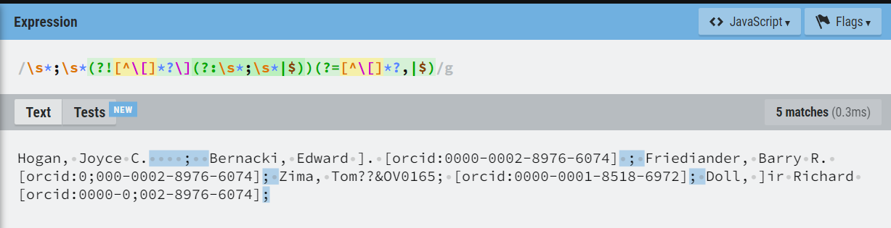

## Cosa ho fatto

* Tutta la configurazione di Meta è stata spostata in un file YAML, che è stato documentato sia tramite commenti sul file stesso che nel README della repository. Ora il processo si lancia semplicemente con il seguente comando:

  ```bash
  python -m meta.run.meta_process -c meta/config.yaml
  ```

* Per i seguenti due casi, prima analizzo i problemi e poi espongo la soluzione che li considera entrambi:
  * Su Crossref l’articolo con DOI [10.1097/00043764-198107000-00013](https://api.crossref.org/works/10.1097/00043764-198107000-00013) ha un autore di nome “Edward ]. Bernacki”. Il suo vero nome è “Edward J. Bernacki”. In pratica, la J si è trasformata in una parentesi quadra chiusa. Io non so come sia possibile una cosa del genere, a meno di non aver usato un OCR.
    * Piccolo trivia: indovina un po’ qual è la casa editrice? Esatto, Ovid Technologies.
    * La presenza di una parentesi quadra chiusa in un nome rompe l’espressione regolare per dividere una stringa in una lista di autori, perché tale espressione regolare esclude quei punti e virgola a cui seguono parentesi quadre chiuse, al fine di catturare solo i punti e virgola al di fuori di una coppia di parentesi quadre:

      ```python
      '\s*;\s*(?=[^\]]*(?:\[|$))'
      ```

      La presenza di una parentesi quadra chiusa all’interno del nome della persona fa sì che il punto e virgola precedente venga ignorato, unendo in un solo autore due autori diversi.

  * Su Crossref l’articolo con DOI [10.1097/01.alc.0000168168.43419.54](https://api.crossref.org/works/10.1097/01.alc.0000168168.43419.54) ha un autore di nome “Tom??\&OV0165; Zima” (che corrisponde nella realtà a Tomáš Zima). Un autore di cognome Zima è presente su ORCID relativamente a quel documento, quindi nel CSV di input per Meta tale autore compare come ‘Zima, Tom??\&OV0165; \[orcid:0000-0001-8518-6972]’.
    * La casa editrice in questo caso è Wiley.
    * La presenza del punto e virgola nel nome rompe la sintassi, per cui risultano due autori, uno di nome ‘Zima, Tom??\&OV0165’ e l’altro senza nome ma con ORCID ‘0000-0001-8518-6972’.

  * Ecco come ho gestito entrambe le eccezioni.

    Per affrontare la prima, invece di un positive lookahead, ho utilizzato un negative lookahead con la seguente regola: se dopo il punto e virgola preceduto e seguito da zero o più spazi trovi il seguente pattern, allora non considerare tale punto e virgola. Il pattern negativo è qualunque carattere esclusa parentesi quadra aperta zero o più volte, seguito da parentesi quadra chiusa e infine punto e virgola preceduto e seguito da zero o più spazi oppure la fine della stringa.

    Per affrontare la seconda, ho aggiunto un positive lookahead che impone, dopo il punto e virgola, la presenza di qualunque carattere diverso da parentesi quadra aperta zero o più volte seguito da una **virgola**. La virgola, infatti, è un elemento obbligatorio all’interno di un nome di un autore, anche in assenza di un nome proprio. In alternativa, è ammessa anche la fine della stringa dopo il punto e virgola. Questo positive lookahead viene utilizzato solo per **autori** ed **editor**, **non** per i **publisher**.

    ```python
    '\s*;\s*(?![^\[]*?\](?:\s*;\s*|$))(?=[^\[]*?,|$)'
    ```

    * Il nuovo pattern supera tutti i test preesistenti più quello nuovo aggiunto per testare questa singola eccezione.
    * Qui puoi provare a rompere questa espressione regolare: [regexr.com/6db3h](http://regexr.com/6db3h)

      

* Su Crossref l’articolo con DOI [10.1097/00115550-200201000-00001](https://api.crossref.org/works/10.1097/00115550-200201000-00001) ha un autore di nome “Andr\[eacute] Boezaart”. Inoltre, il DOI punta a una risorsa inesistente. Sono comunque riuscito a trovare il documento, a cui è associato il seguente DOI: [10.1053/rapm.2002.29732](http://dx.doi.org/10.1053/rapm.2002.29732). Il vero nome dell’autore, ovviamente, è “André Boezaart”.
  * La casa editrice in questo caso è BMJ, la quale pubblica, tra le molte riviste, Gut, che abbiamo menzionato nel nostro paper a proposito del DOI fantasma.

  * eacute viene catturato come id e, non avendo alcuno schema, solleva eccezioni.

    ```python
    '\[\s*(.*?)\s*\]'
    ```

  * Ho modificato l’espressione regolare per catturare gli id rendendo mandatoria la presenza dello schema all’interno delle parentesi quadre. Prima dei due punti dev’esserci qualunque carattere che non sia una parentesi quadra zero o più volte. Questo per evitare che in ‘Boezaart, Andr\[eacute] \[meta:123]’ l’id catturato sia ‘\[eacute] \[meta:123]’. In alternativa, anche le parentesi quadre vuote contenenti uno o più spazi rappresentano un match valido.

    ```python
    '((?:\[\s*[^\]\[]*?:.*?\s*\])|(?:\[\s*?\]))'
    ```

  * Qui puoi provare a rompere questa espressione regolare: [regexr.com/6dc0s](http://regexr.com/6dc0s)

    

* Ho introdotto un nuovo modulo, master\_of\_regex.py, che contiene la definizione di tutte le espressioni regolari usate da Meta. Ne ho sentito il bisogno perché molte espressioni vengono usate in punti diversi e mi sembra opportuno modificarle in un punto solo. Tutte le espressioni sono state documentate.

* La stessa regola di capitalizzazione dei titoli è stata applicata anche ai nomi degli agenti responsabili (author, editor, publisher).

* Novità relative all’implementazione del **multiprocessing**:
  * Ho fatto alcune verifiche: nei CSV grezzi in input non c’è sempre un publisher. Laddove c’è, esso ha quasi sempre un id (campo member in Crossref). C’è solo un’eccezione, ovvero ‘American Fisheries Society’, che non ha id nel dump di gennaio, ma lo ha utilizzando l’API di Crossref.
  * Ho scritto un programma che separa i csv grezzi per publisher. Per evitare di sovraccaricare la RAM con un indice immenso o di utilizzare un database (e.g. MongoDB), i CSV in output hanno come nome l’id del publisher (o il suo nome in assenza di id). In questo modo, i nomi dei file sono le chiavi dell’indice e il processo è snello e rapido.

* Ho spostato l’ambiente di sviluppo da Windows a Linux tramite WSL, ovvero **Linux** (Ubuntu) dentro Windows. La ragione iniziale era che **Ray** non esiste per Windows, ma è stata comunque una buona cosa per **testare** la **compatibilità** in vista del futuro passaggio al test server di OpenCitations.
  * Ho corretto alcuni bug legati ai percorsi dei file.

## Domande

* Credo che ci sia stato un fraintendimento in oc\_ocdm per quanto riguarda il supplier\_prefix. Ad esempio, il supplier\_prefix di Meta è 060. oc\_ocdm non mette 060 come prefisso del valore incrementale dell’entità, ma somma 060 al valore incrementale dell’entità. Quindi, la prima entità di Meta è la numero 1060 e non 0601. Il problema è che negli indici di Meta il prefisso risulta corretto, quindi dal secondo CSV in poi quasi ogni entità risulta in conflitto.

  ```python
  def _generate_new_res(g: Graph, count: str) -> URIRef:
  		return URIRef(str(g.identifier) + count)
  		# Dovrebbe essere il contrario
  		# URIRef(count + str(g.identifier))
  ```

  * Posso modificare direttamente oc\_ocdm senza disturbare Simone ogni volta?

* A volte i DOI assegnati da Crossref sono validi ma puntano a risorse inesistenti (e.g. [10.1097/00115550-200201000-00001](https://api.crossref.org/works/10.1097/00115550-200201000-00001)). In questo caso, il DOI è da ritenersi valido o invalido?

* Credi che dovrei aggiungere una regola per trasformare \[eacute] in ‘é’?

* In Meta, come in molte altre librerie che ho usato in passato, le espressioni regolari vengono definite come raw strings tramite il prefisso -r. Da quello che ho capito, la differenza è che il backslash viene interpretato come tale e non come escaping. Tuttavia, ciò non fa alcuna differenza all’atto pratico, perché la libreria re di Python interpreta comunque il backslash come escaping. Perché allora molti utilizzano le raw string per definire espressioni regolari?

* Anche il dump di Crossref con dl=1 nell’URL sembra essere corrotto.

* Se un autore non ha id nel CSV, ma un autore con lo stesso nome e cognome è già presente nel triplestore relativamente alla stessa risorsa bibliografica, Meta assume che siano la stessa persona. Sei d’accordo con questo comportamento? Chiaramente, esso fallisce nel caso in cui due persone omonime siano coautrici dello stesso articolo.

* Ti condivido un file di input per Meta, non processato da Meta, in cui il 99% dei documenti ha come casa editrice Ovid Technologies. Molti simboli sono sostituiti da ‘???’, sia nei titolo che nei numeri di pagina. Ad esempio, compare ‘143???147’ anziché ‘143-147’, oppure ‘The ???Anemic??? Patient’ anziché ‘The “Anemic” Patient’. Non so neanche che domanda porre.

  [attachments/329b629c70f54989af067fc5331c5a4a.csv](/notes/attachments/329b629c70f54989af067fc5331c5a4a)

* Ci sono tre parametri di Meta che non ho documentato perché non ho capito, ovvero dir\_split\_number, items\_per\_file e default\_dir. Tutti e tre vengono usati dallo Storer di oc\_ocdm. Fabio ha impostato i primi due a 10000 e 1000, scrivendo che il primo dev’essere multiplo del secondo. A cosa servono questi tre parametri?

* A quanto pare, ci sono articoli con centinaia di autori, per esempio questo: [https://doi.org/10.1007/JHEP07(2020)237](https://doi.org/10.1007/JHEP07\(2020\)237). Problema: il modulo csv solleva un’eccezione in caso di campi il cui testo è più grande di 128KB. Questo valore è personalizzabile tramite csv.field\_size\_limit(). Non so però dire quale sia un valore ragionevolmente grande. sys.maxsize, il massimo possibile da un sistema a 64 bit (2^64-1), causa un errore di Overflow.

* Ho trovato 5877 documenti su Crossref in cui il campo ‘publisher’ contiene un punto e virgola. Nei CSV grezzi in input per Meta, non sembra esserci modo per distinguere quando il punto e virgola separa due publisher diversi e quando invece fa parte del nome di un unico publisher. Faccio qualche esempio:

  * Un solo publisher:
    * Nuclear Regulatory Commission, Washington, DC (USA). Div. of Accident Evaluation\*\*;\*\* Pacific Northwest Lab., Richland, WA (USA) ([https://api.crossref.org/works/10.2172/6538281](https://api.crossref.org/works/10.2172/6538281))
    * Taylor & Francis ([https://api.crossref.org/works/10.1201/noe0750305136.bmatt1](https://api.crossref.org/works/10.1201/noe0750305136.bmatt1))
    * John Wiley \&amp; Sons, Inc. ([https://api.crossref.org/works/10.1002/9781119264408.ch24](https://api.crossref.org/works/10.1002/9781119264408.ch24))
  * Più di un publisher:
    * J. Munroe;London, J.Chapman ([https://api.crossref.org/works/10.5962/bhl.title.10392](https://api.crossref.org/works/10.5962/bhl.title.10392))
    * Harper Collins (UK); University of California Press (US) ([https://api.crossref.org/works/10.1093/actrade/9780004990231.book.1](https://api.crossref.org/works/10.1093/actrade/9780004990231.book.1))

  A questo proposito ho alcune domande:

  * Nel dump di Crossref il campo member è uno solo. Com’è possibile che ci siano publisher multipli con un solo campo member?
  * Nel dump di Crossref di gennaio c’è solo un publisher senza id, ovvero ‘American Fisheries Society’. In realtà, l’id è presente se si utilizza l’API di Crossref, quindi in realtà tutti i publisher hanno un id. Posso contare sul fatto che i publisher abbiano sempre un id e utilizzarlo nell’espressione regolare per individuare un publisher in una riga che contiene un punto e virgola?

* Cosa ne pensi di usare un **delimitatore diverso** da punto e virgola per i CSV grezzi in input? Per esempio ‘ ;and; ‘. Questa sequenza di caratteri compare 0 volte nei campi ‘id’, ‘author’, ‘venue’, ‘editor’ e ‘publisher’ dei CSV grezzi ricavati dal dump di Crossref. Non sto dicendo che non comparirà mai, ma mi sembra decisamente più gestibile di punto e virgola. Dopodiché, in output, per l’utente finale, si potrebbe ripristinare lo spazio come delimitatore.

* La mia nuova mail istituzionale è [arcangelo.massari@unibo.it](mailto:arcangelo.massari@unibo.it), senza il 2.
