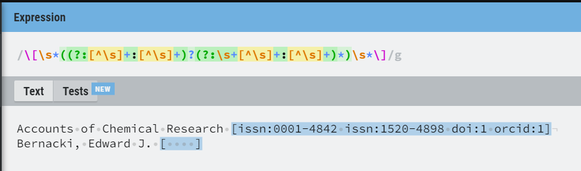

## Cosa ho fatto

1. Novità relative al **salvataggio** in **json-ld**:
   * Ora il processo di meta lancia anche il metodo [store\_all](https://github.com/opencitations/oc_ocdm/blob/95d5d2aac7dd16f74d25622be92679fd572cf772/oc_ocdm/storer.py#L131) di oc\_ocdm, che salva l’output in formato json-ld nel percorso `BASE_DIR/jsonld/TIPO_ENTITÀ/PREFISSO/DIR_SPLIT_NUMBER/`

   * Ho aggiunto un **plugin** di nome **csv\_generator**, che genera i CSV in output di Meta a partire dal triplestore.
     * Tale plugin è fatto per essere lanciato **dopo** il processo di **Meta**, nel caso in cui Meta salvi i dati in formato json-ld e non csv.
     * Questo script cicla su tutte le risorse bibliografiche del triplestore da 1 a counter, dove counter è il numero presente nel contatore br.txt all’interno dell’info\_dir.
     * Per il salvataggio dei CSV viene utilizzato lo stesso sistema dei file jsonld.
       * Ogni file CSV in output contiene al massimo n righe, dove n è un parametro impostabile (`items_per_file`).
       * Ogni cartella contiene massimo m file, dove m è un parametro impostabile (`dir_split_number`).
       * Il nome di ogni file corrisponde al valore del contatore nel momento della generazione del file. Per esempio, il primo file contenente al massimo 100 righe si chiama 100.csv e contiene le risorse bibliografiche da meta:br/1 a meta:br/100.
       * La root directory è base/supplier\_prefix.
       * **Vantaggio**: è possibile trovare rapidamente le risorse bibliografiche.
       * **Svantaggio**: è possibile trovare rapidamente **soltanto** le risorse bibliografiche e nessun altro tipo di entità.
     * Se il processo viene interrotto, riparte **automaticamente** dall’ultima risorsa processata + 1.
     * csv\_generator si lancia tramite il comando:

       ```bash
       python -m meta.run.csv_generator -c path/to/config.yaml
       ```

   * Ora che ho finalmente capito il senso dei parametri dir\_split\_number e items\_per\_file, li ho documentati.

   * Ho documentato csv\_generator nel README.

2. Aggiunta la virgola e tutti i tipi di parentesi ai caratteri proibiti nei nomi degli autori.

3. Ho reso più stringente l’espressione regolare per catturare gli id

   * Gli id devono essere separati da spazi e devono contenere uno schema e un valore letterale separati da due punti.
   * Sono ammessi uno o più spazi vicino alle parentesi quadre e tra un id e l’altro.
   * Sono ammesse le parentesi quadre vuote.

   ```python
   \[\s*((?:[^\s]+:[^\s]+)?(?:\s+[^\s]+:[^\s]+)*)\s*\]
   ```

   

   [regexr.com/6e6ev](http://regexr.com/6e6ev)

4. Nuova funzione get\_pages, che ritorna l’intervallo di pagine a partire da un item di Crossref.
   * 583-584 → 583-584
   * G27 → G27 (documenti nativi digitali; e.g., PeerJ)
   * iv-vii → iv-vii (numeri romani; e.g., prefazioni)
   * IV-L → IV-L
   * kj-hh → None (le lettere che non corrispondono a numeri romani vengono scartate)
   * 583b-584 → 583-584 (se sono presenti sia numeri che lettere e c’è un intervallo, le lettere vengono rimosse e i numeri conservati)

5. Meta si occupa ora di **normalizzare** gli **spazi**. Più nello specifico, vengono sostituiti con U+0020 ‘SPACE’ i caratteri:
   * U+0009 ‘Character Tabulation’
   * U+00AD ‘No-break space’
   * U+200B ‘Zero width space’ (andata a capo opzionale)
   * U+202F ‘Narrow no-break space’
   * U+2003 ‘Em space’
   * U+2005 ‘Four-Per-Em Space’
   * U+2009 ‘Thin space’ (1⁄5 o 1⁄6 di em)

6. Ho testato la funzione **normalize** del modulo **unicodedata** su tutti i casi riguardanti spazi e trattini previsti finora. Purtroppo, fallisce con troppi di essi, quindi continuerò a usare un approccio manuale.

7. Ho aggiornato tutti i dati grezzi sulla base del dump di ORCID del 2021.

8. Il match dell’ORCID ora sfrutta anche l’iniziale del nome nel caso ci siano due autori con lo stesso cognome.

9. Meta ha processato tutto il dump di Crossref gennaio 2022 considerando solo le prime 10 righe di ogni CSV grezzo in input. Ciò è stato utile per individuare i bug più ovvi e facilitare la loro comprensione e risoluzione:
   1. Ho compreso il bug che attribuivo erroneamente al sistema di cache e che faceva crashare vvi\_action: a volte il campo “volume” contiene un non-breaking space, che porta alla creazione di un volume inesistente e, successivamente, a un KeyError.
      * Questo bug ha scoperchiato un vaso di Pandora, perché mi ha portato a indagare quali campi contengano non-breaking space. Ecco il numero di occorrenze per campo sul dump di Gennaio 2022 {'title': 387254, 'issue': 609, 'volume': 1051, 'venue': 5392, 'author': 363, 'page': 4}.
      * Nel dubbio, ho applicato la normalizzazione degli spazi e lo strip a tutti i campi.
   2. Risolto un bug per cui lo stesso ORCID veniva assegnato erroneamente a due coautori nel caso in cui il cognome del secondo fosse compreso nel cognome del primo. Il bug è stato risolto aggiungendo come condizione il match delle iniziali del nome.
   3. Risolto un bug causato dalla presenza delle parentesi quadre nel nome di un autore su ORCID (e.g. Adam \[Thean Chor] Leow, [https://orcid.org/0000-0002-0280-7735](https://orcid.org/0000-0002-0280-7735)). L’errore è stato risolto tramite un’espressione regolare.
   4. Risolto un bug che si verificava nel caso l’id conflittuale fosse presente nel campo ‘id’ del CSV (e non nel campio “venue”, com’è più frequente)

10. Ho finalmente capito cosa Fabio aveva previsto quando ha aggiunto tutti quei controlli su entità conflittuali sul triplestore, ovvero più entità con lo stesso identificatore.
    * Ciò si verifica quando due entità apparentemente diverse si scoprono essere la stessa entità dopo essere stata entrambe caricate sul triplestore. Dato che il triplestore non può essere modificato, queste due entità non possono essere unite e si genera un conflitto, che viene registrato nei log.
    * Esempio concreto sul dump di gennaio 2022. Ognuno dei seguenti punti rappresenta la stessa venue in righe diverse di CSV diversi:

      * `Soil Science Society Of America Journal [issn:0361-5995]`
        * Non esiste, viene creata l’entità `meta:br/06062802` con id  `meta:id/06066117`
      * `Soil Science Society Of America Journal [issn:1435-0661]`
        * Non esiste, viene creata l’entità `meta:br/06098322` con id `meta:id/060112513`
      * `Soil Science Society Of America Journal [issn:0361-5995 issn:1435-0661]`
        * Quante entità hanno id `issn:0361-5995` e `issn:1435-0661` sul triplestore? Più di una. Conflitto!
        * Crea una nuova entità, `meta:br/060217650`, avente come identificatori i già menzionati `meta:id/06066117` e `meta:id/060112513`
      * Da questo momento in poi, `Soil Science Society Of America Journal` sarà sempre conflittuale laddove compaia almeno uno dei succitati ISSN.

      

11. Ho analizzato tramite cProfiler quali sono le operazioni nell’intero meta\_process che richiedono più tempo. La seguente visualizzazione rappresenta il tempo impiegato per processare un singolo CSV.

    

    * Il modulo più dispendioso è il curator (477/925s)
    * All’interno del curator, l’operazione più dispendiosa è l’interrogazione del triplestore (378/477s)
    * Tra le varie interrogazioni del triplestore, la più dispendiosa è [retrieve\_br\_from\_id](https://github.com/opencitations/meta/blob/c20066317885f804a5abbc0743cf34e523da6d83/lib/finder.py#L17) (169/378s)

    Questi risultati sono stati la scoperta dell’acqua calda e non ho trovato margini di miglioramento, a meno di non cambiare triplestore.

    Ho sostituito pymantic con SPARQLWrapper (aggiornata 1 anno fa vs. 11 giorni va; usata da 25 repo vs. 2.8k).

## Domande

1. Al momento i trattini dentro i titoli non vengono normalizzati, perché penso sia impossibile prevedere se un trattino venga usato come trattino, come segno meno o altro. Sei d’accordo?

2. C’è un problema per quanto riguarda il **multi-processing**. Nel dump di Crossref di gennaio 2022 ci sono 3189 venue pubblicate da più di un publisher considerando il **member**, e i publisher coinvolti sono 824. Ad esempio:

   1. `APSIPA Transactions on Signal and Information Processing [issn:2048-7703]` è stata pubblicata sia da `Cambridge University Press (CUP) [crossref:56]` ([https://api.crossref.org/works/10.1017/atsip.2021.12](https://api.crossref.org/works/10.1017/atsip.2021.12)) che da `Now Publishers [crossref:432]` ([https://api.crossref.org/works/10.1017/atsip.2016.18](https://api.crossref.org/works/10.1017/atsip.2016.18)). Come si nota, il prefisso è il medesimo e corrisponde a Cambridge University Press.
   2. `The EMBO Journal [issn:1460-2075]` è stato pubblicato sia da `Wiley [crossref:311]` ([https://api.crossref.org/works/10.1093/emboj/cdf308](https://api.crossref.org/works/10.1093/emboj/cdf308)) che da `EMBO [crossref:79]` ([https://api.crossref.org/works/10.15252/embj.201695756](https://api.crossref.org/works/10.15252/embj.201695756)). In questo caso, i prefissi sono diversi.

   Ciò significa che non si possono dividere i CSV per publisher, perché si corre il rischio che la stessa venue sia in CSV diversi. Cosa ne pensi?

3. Nei CSV in output generati a partire dal triplestore, in caso di riga contenente un volume o un issue, deve esserci il publisher? Se sì, come faccio a ricavarlo dal triplestore, dato che, come abbiamo visto esistono venue pubblicate da più di un publisher? In altre parole, un volume potrebbe contenere risorse bibliografiche pubblicate da publisher diversi.

4. A volte i campi “volume” e “issue” di Crossref non contengono solo numeri. Ecco alcuni esempi:

   * “volume”:
     * vol. 23/4
     * Vol. 39 N°1
     * Vol. 10, N° 2-3
     * Vol. 35 N° spécial 1
     * Vol. XXXIII N° 2
   * “issue”:
     * Numéro 45
     * n° 2339-2340
     * Volume 14 Issue 5 - CUDES 2019

   Cosa ne pensi?
