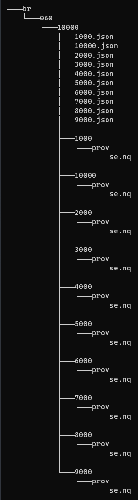

## Cosa ho fatto

* **IdentifierManager** è stato integrato in Meta.
  * Ogni ISBN, ISSN, DOI e ORCID viene validato e normalizzato. Tali controlli sono ridondanti rispetto a quelli già effettuati dal preprocessor di Crossref, ma rendono Meta autonomo da esso.
  * ISSNManager si occupa ora di dichiarare invalido l’ISSN 0000-0000, che viene quindi filtrato ovunque.
  * Ho aggiunto `use_doi_api_service` ai parametri di configurazione di Meta. Se True, l’API di DOI viene utilizzata per validare i DOI. Un oggetto di tipo CSVManager fa da cache per non validare due volte lo stesso DOI.
  * Questa modifica ha rotto tutti i test di Fabio e alcuni dei miei che utilizzavano id fittizi. Aggiustarli è stato un delirio. Avevo 85 file modificati nella staging area prima del commit.

    

* Meta può adesso funzionare in **multi-processing**
  * Nuovo parametro `run_in_multiprocess`. Se True, Meta lavora in multi-processo utilizzando tutti i processori della macchina in uso.
  * Ogni processo ha un supplier\_prefix diverso e una directory per gli info\_dir diversa.

    

* Ho aggiunto il **web content**, la **proceedings series** e la **peer review** ai tipi di risorsa bibliografica previsti dall’OCDM e di conseguenza da oc\_ocdm.
  * [https://github.com/opencitations/metadata/pull/11](https://github.com/opencitations/metadata/pull/11)
  * [https://github.com/opencitations/corpus/pull/3](https://github.com/opencitations/corpus/pull/3)
  * [https://github.com/opencitations/oc\_ocdm/pull/21](https://github.com/opencitations/oc_ocdm/pull/21)

* Risolto un bug in oc\_ocdm per cui la mancanza dell’encoding causava un IOError quando si andava a leggere un file json-ld codificato utf-8.
  * [https://github.com/opencitations/oc\_ocdm/pull/22](https://github.com/opencitations/oc_ocdm/pull/22)

* Ho compreso, documentato e ripristinato il funzionamento del parametro `rdf_output_in_chunks`.

* Novità relative all’articolo per ***Scientometrics***:
  * Ho scritto una funzione che seleziona un numero di righe **casuale** o **semi-casuale** dalla lista di citazioni corrette.

    [2020-2021-grasshoppers-code/evaluation.py at main · open-sci/2020-2021-grasshoppers-code](https://github.com/open-sci/2020-2021-grasshoppers-code/blob/main/evaluation.py)

    * Se si specificano delle **regex**, le citazioni saranno scelte in modo che ogni pattern appaia lo stesso numero di volte all'interno del totale desiderato di citazioni.
      * Il totale desiderato non sarà raggiunto se alcuni pattern non appaiono in quantità sufficiente. Di fatto, facendo in modo da avere 10 campioni per pattern, si ottengono 193 righe per 23 pattern.
      * Dato che più regex possono matchare uno stesso DOI, ha priorità la regex che ha effettivamente corretto quel DOI. Se più regex hanno corretto uno stesso DOI, ha priorità quella che lo ha corretto prima.
    * È possibile specificare una serie di **citazioni obbligatorie** e una serie di **citazioni preferibili**. Il primo insieme sarà sempre presente nel risultato finale, il secondo dipende da come i pattern specificati sono rappresentati all’interno della popolazione di citazioni preferibili.
      * Questi argomenti servono a riutilizzare le citazioni già verificate nella prima submission dell’articolo. Purtroppo, è stato possibile riutilizzarne solo 21 citazioni su 100.
      * Le citazioni obbligatorie riutilizzate sono state le due problematiche discusse nell’articolo.

## Domande

* Qual è la struttura di cartelle e sottocartelle prevista per salvare la provenance? La directory base può coincidere con quella dei dati? È corretto il risultato d’esempio in Figura 1?

  

  Figura 1 Albero della directory contenente dati e provenance relativi alle risorse bibliografiche

* Con quale serializzazione bisogna salvare la provenance? Va bene N-Quads? No, json.

* Per configurare Meta è necessario specificare ben 5 percorsi. Mi sembra eccessivo, preferirei specificarne solo uno, la directory base, dopodiché le altre directory vengono impostate automaticamente di conseguenza. Più specificamente:

  * Gli info dir in base\_dir/info\_dir
  * I CSV in base\_dir/csv
  * Gli indici in base\_dir/indexes
  * La cache in base\_dir/cache.txt
  * Le directory dei file rdf in base\_dir/rdf

  Cosa ne pensi? Va bene.

* A cosa serve il parametro `default_dir` di oc\_ocdm? Di default è impostato a “\_”. È il prefisso di ciò che non ha prefisso. È deprecato.

* Se i CSV in output di Meta hanno come nome il timestamp di generazione, in parallelo molti se non tutti i file vengono sovrascritti. Cosa ne pensi? Aggiungo il supplier\_prefix di ogni processo al nome?

* Ecco cosa ha risposto Simone sul rendere thread-safe oc\_ocdm:

  > Questo è un problema non da poco e purtroppo non ho così tanto tempo da dedicarci. Ci avevo già ragionato su e credo che il modo più veloce per risolvere il problema sia quello di implementare una qualche forma di lock sugli info\_file, in modo che solo un processo alla volta possa modificare/leggere lo stesso info\_file. A questo scopo, avevo già individuato la libreria [tox-dev/py-filelock](https://github.com/tox-dev/py-filelock). Un altro problema su cui invece non riesco nemmeno a cominciare a ragionare (perché mi esplode il cervello) è il fatto che nulla vieta a due processi di fare modifiche diverse alla stessa entità e poi di fare l’update su di un triplestore oppure su di un file RDF: allo stato attuale, il risultato di queste modifiche sarebbe aleatorio e verrebbe fuori un misto di entrambe. Perciò, a prescindere dal discorso degli info\_file, bisogna assolutamente assicurarsi che tutti i processi lavorino su entità diverse.

  L’eventualità di cui parla Simone, quella della modifica contemporanea alle stesse entità, si verifica sistematicamente nel caso degli autori nella situazione attuale. Cosa ne pensi?

* Quando lancio Meta in multiprocessing si verificano problemi nella lettura e serializzazione dei file RDF di output (JSON-LD per i dati e N-Quads per la provenance). Questo errore è causato da due processi che cercano di leggere e scrivere contemporaneamente lo stesso file. Ciò si verifica anche se i processi lavorano su prefissi diversi, perché tutti i processi lavorano sullo stesso triplestore, dove si trovano tutti i prefissi.
  * Ho arginato il problema facendo lavorare Curator e Creator in parallelo, mentre lo Storer di oc\_ocdm in sequenza (la generazione della provenance avviene in parallelo).

  * Ipotizzando di avere 24 processori, vengono generati 24 futures che eseguono Curator, Creator e generazione della provenance su 24 file CSV di input. Dopodiché, l’output di questi futures viene processato dallo Storer in sequenza, che aggiorna file e triplestore. Questo meccanismo di ripete in blocchi di 24 finché non sono stati processati tutti i file di input.

    ```python
    while len(files_to_be_processed) > 0:
    		with ProcessPoolExecutor() as executor:
    	      results = [executor.submit(meta_process.curate_and_create, filename, worker_number) for filename, worker_number in zip(files_to_be_processed, workers)]
    	      for f in as_completed(results):
    	          res_storer, prov_storer, processed_file = f.result()
    	          meta_process.store_data_and_prov(res_storer=res_storer, prov_storer=prov_storer)
    	          files_to_be_processed.remove(processed_file)
    ```

  * Il problema di questa soluzione è che il CSV in input più grosso fa da collo di bottiglia.

  * Cosa faccio? Chiedo a Simone di implementare solo il lock sui file? Lo implemento io? Accetto la mia soluzione di compromesso? Hai soluzioni migliori?
