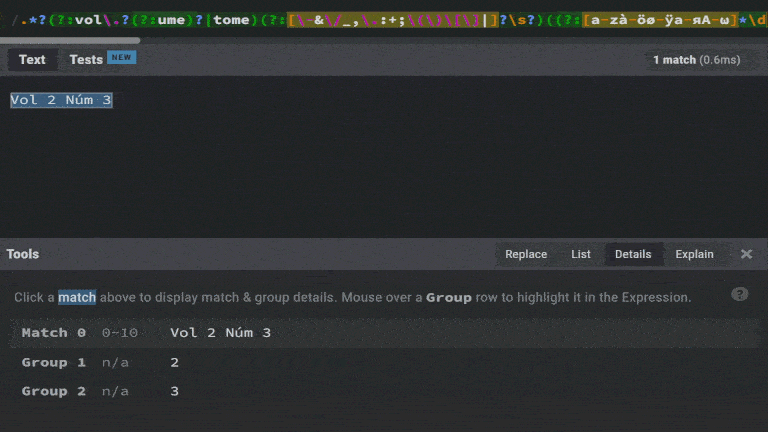

## Cosa ho fatto

* Ho pubblicato la **documentazione** su come produrre **CSV** contenti metadati e citazioni per OCMeta e CROCI.

* Ecco quali funzionalità di Meta sono state testate con successo su oc\_ficlit:
  * Generazione dell’indice DOI-ORCID
  * Generazione della lista di publishers su Crossref.
  * Generazione della lista di DOI presenti su COCI.
  * Tutti i 143 test di Meta sono stati superati.

* Ho studiato il caso dei campi ‘**issue**’ e ‘**volume**’ invalidi. Segue un elenco di tutti i pattern validi e invalidi presenti nel dump di Crossref. Tutti i pattern sono case insensitive. È sottointeso che ogni pattern è preceduto da ^ e seguito da \$.

    <aside>
    👉 I pattern validi **non** servono a creare delle whitelist, che abbiamo filosoficamente bocciato durante il nostro incontro del [[Tu vuo far el phdino/27-01-2022]]. Servono solo a individuare il 100% dei pattern invalidi.

    </aside>

  * Ecco i casi che ho ritenuto **validi** sia per numeri che per volumi. Per ogni pattern valido riporto il pattern e un esempio, separati da due punti.

    Alcune variabili per rendere i pattern più leggibili:

    * separators = `-\s&\/_,\.:;\|`
    * alphabets = `a-zà-öø-ÿ\u0430-я\u0391-ω`
      * basic latin, latin-1 supplement, cyrillic, greek
    * numero = `(?:№|no?(?!v)\.?|n[º°]\.?|n[uú]m(?:[eé]ro)?|number)`
    * vi\_pattern **= `((?:[{alphabets}]*\d[{alphabets}\d]*|[ivxlcdm]+)(?:\s?(?:[{separators}]|and|\()\s?[{alphabets}\d]+\)?)*?)`**: 4, S10, 10S, 5B, 8S2, 7AB, 123-124, 1 and 2, 1&2, 1/2, 1S-2, 1/2/3, 1\_2, V, V-VI, I-6, 2(415) 2, 1(7), 7-8 (10), 7-8(10), 7-8 (10)

        <aside>
        👉 In vi_pattern ogni combinazione prima del separatore deve contenere almeno un numero arabo o romano, onde evitare match universali

        </aside>

    1. `[{alphabets}{separators}\s]+{vi_pattern}`: ovvero, parole e separatori e infine un numero di volume o issue. Alcuni sottoinsiemi notevoli:
       1. `\(?s(uppl([eéi]ment(ary|um)?))?\)?\s?(part)?\s?(s?{vi_pattern})?`: Supplement 1, Supplement s1, Supplementum 2, Supplimentary 2014, Supplément 1, Supplement Part 4
       2. `historica\svol\.\s\d+,\d+(-\d+)?`: Historica vol. 24,1-2, Historica vol. 4,2 (nonostante il termine vol., finora ho visto questo pattern comparire correttamente come issue)
    2. `({vi_pattern}_)?({vi_pattern}\s)?[\(_]?supp?(plement|pl)?l?[\s\._]*({vi_pattern}|[{alphabets}])?\)?\.?`: sup1, 1\_suppl, Sup 1, Suppl.1, Suppl. 1, 1 Suppl, suppl\_1, Supl.A
    3. `[{alphabets}\d]*,?\s?part[\s_1]\d(\sof\s{vi_pattern})?(,\sno?\.\s?{vi_pattern})?`: “Part 2”, ”5, Part 1”,  ”6, Part 1 of 2”, ”4 Part 1”, “Part 1, No. 1”
    4. `{vi_pattern}*[_\s]?pt?[_\s\.]{vi_pattern}`: Pt\_3, Pt 3, 3 pt 3, 3\_pt\_3, 12 P.2
    5. `(ed|pt|d)\sinside(d|r)`: ED Insided
    6. `p(ublish\s)?a(head\sof\s)?p(rint)?`: Publish Ahead of Print, PAP
    7. `預刊文章`: 預刊文章 (significa prestampa in cinese)
    8. `[\u0621-\u064A]+`: ovvero, qualunque combinazione di caratteri arabi. Ci vorrebbe Nooshin per una validazione più puntuale.
    9. `(\[\d{4}\]\s)?(\d+\s)?vl?r(\s\([a-z]+\))?`: \[1905] VLR ([10.25291/vr/1905-vlr-104](http://doi.org/10.25291/vr/1905-vlr-104)), 1 VLR (Eq)
    10. `{vi_pattern}\s\[\+CDROM\]`: 4 \[+CDROM]
    11. `([{alphabets}]+\.)?[{alphabets}]+\.?`: Esp. ([10.11606/1807-5509202000034nesp051](https://doi.org/10.11606/1807-5509202000034nesp051)), n.esp
    12. `[{alphabets}]+-\d+`: PGI-4, PGIE-2, IE-7
    13. `[{alphabets}]+(_[{alphabets}]+)+`: Clin\_Sect, Dermatol\_Sect, Electro\_Ther, Epidem\_State\_Me
    14. `{numero}:?\s?{vi_pattern}(,?\s(\d{{4}}|\({vi_pattern}\)))?`: № 12 2012 ([10.17513/ejnh.33863](https://doi.org/10.17513/ejnh.33863)), No. 8A, nº 1, N°7, numero 3, Number: 6
    15. `\d+\(\d+\)\d{4}`: 2(27)2017
    16. `([{alphabets}]+\s\d{{4}}\s)?\(?(jan(uary)?|feb(ruary)?|mar(ch)?|apr(il)?|may|jun(e)?|jul(y)?|aug(ust)?|sep(tember)?|oct(ober)?|(nov|dec)(ember)?|spring|summer|autumn|winter)(\s\d{{4}})?\)?`: (July 2013) ([10.1515/jdrg-2013-0005](https://doi.org/10.1515/jdrg-2013-0005)), Index 1973 Mar
    17. `[‹<\()]?[{alphabets}]+?([{separators}\s]?[{alphabets}])*[\)›>]?`: Abstracts, ‹Digitale Bildung›, MOC-PS CME Coll
    18. `[{alphabets}\d\-'/]+(,?\s[{alphabets}\d\-'/]+)+`: 6 Undesrtanding, s2 Fourth JSH S, s1 worldsleep07, 13 Chain-Type I, “2 Chemistry, Ph”, 13 Schuler's Pr, 1 Factor VIII/v
    19. `\({vi_pattern}\/{vi_pattern}\)\s[{alphabets}]+(-[{alphabets}]+)?`: (13/72) Education, (13/72) Language-Literature

  * Sono **pattern** validi solo per i **volumi**:

      <aside>
      👉 Se tali pattern vengono trovati nel campo ‘issue’ e il campo ‘volume’ è vuoto, il contenuto viene spostato nel campo ‘volume’ e il campo ‘issue’ viene svuotato. Tuttavia, se il campo ‘issue’ contiene un volume e il campo ‘volume’ contiene un numero, i due valori vengono scambiati.

      </aside>

    1. `original\sseries,\svolume\s\d+`: Original Series, Volume 1
    2. `(vol(ume)?|tome|cilt)\s?[{separators}]?\s?{vi_pattern}`: Vol 71, volume 3, “Vol, 7”, vol.7, vol .74, Tome 1 (volume in francese e bosniaco), Cilt: 1 (volume in turco)

  * Sono **pattern** validi solo per i **numeri**:

      <aside>
      👉 Se tali pattern vengono trovati nel campo ‘volume’ e il campo ‘issue’ è vuoto, il contenuto viene spostato nel campo ‘issue’ e il campo ‘volume’ viene svuotato. Tuttavia, se il campo ‘issue’ contiene un volume e il campo ‘volume’ contiene un numero, i due valori vengono scambiati.

      </aside>

    1. `issue[\.,]?\s{vi_pattern}`: issue 2
    2. `({vi_pattern}\s)?e?sp?e?(ecial)?[\s_\-\.](issue)?(_number_)?[\s_-]?({vi_pattern})?(["“][{alphabets}\s]+?["”])?`: Special Issue 2, 1 special issue, Special Issue "Urban Morphology”, Special\_Issue\_Number\_2, Special-Issue-1, Special 13, Especial 2, esp.2,, spe.2, 1 S.2
    3. `\(s\)`: (S)
    4. `özel(\ssayı|\(special\))?(\s{vi_pattern})?`: Özel Sayı 5, ÖS1 (significa numero speciale in turco)
    5. `({numero}[{separators}\s]?)?hors[{separators}\s]série[{separators}\s]{vi_pattern}`: N° Hors série 10, Hors-série 5 (significa numero speciale in francese)
    6. `특별호`: 특별호 (significa numero speciale in coreano)
    7. `sayı[{separators}\s]\s?{vi_pattern}`: Sayı: 24 (Sayı vuol dire numero in turco)
    8. `issues?\s{vi_pattern},\s(supplement|part)\s{vi_pattern}`: Issue 11, Supplement 6
    9. `issue\s{vi_pattern}\.?\spp\.\s[a-z\d]+[^a-z\d]+[a-z\d]+`: Issue 2. pp. 94-185
       1. Le pagine non si riferiscono all’articolo, ma al numero stesso. Pertanto, non è un errore.

  * Sono invece pattern **invalidi**:

    1. `.*?(vol\.?(ume)?|tome)[{separators}]?\s?{vi_pattern}[{separators}\s]*({numero}|issues?)[{separators}\s]*(sp[eé]cial\s)?{vi_pattern}.*`: Vol 2 Núm 3, Volume 15-Issue 1, Lang.- Lit. Volume 10 numéro 2, Vol. 14 Issue 1, Vol. 39 N°1, Vol. 10, N° 2-3, Vol. 35 N° spécial 1, Vol. XXXIII N° 2, Volume 14 Issue 5, “Vol.10, No.3”, “Vol.10, №3”, Tome II - N°1
       1. Il numero di volume viene inserito nel campo volume, quello di issue nel campo issue
    2. `{vi_pattern},\s?{numero}\s?{vi_pattern}`: ‘[13,N°2](http://doi.org/10.3917/rac.043.0327)’, ‘[9, n° 4](http://doi.org/10.3917/rac.029.0449)’, [13,N°4](http://doi.org/10.3917/rac.045.095310.3917/rac.045.0953)
       1. Idem.
    3. `tập\s?{vi_pattern},?\s?số\s?{vi_pattern}`:  Tập 55, Số 3 (Tập significa volume in vietnamita)
       * Idem
    4. `issues?\s{vi_pattern}\svol\.?(?:ume)?\s{vi_pattern}(?:.*?\d{{4}}.*?)?`: Issue 1 Volume 21, 2020
       1. Idem, più l’anno.
    5. `{vi_pattern}\s?\({vi_pattern}'\d{{4}}\)`: [17 (1'2020)](http://doi.org/10.37627/2311-9489-17-2020-1.89-98), [19 (1'2021)](http://doi.org/10.37627/2311-9489-19-2021-1.135-143), [14 (2'2018)](http://doi.org/10.37627/2311-9489-14-2018-2.52-59)
       1. Idem.
    6. `cilt[{separators}\s]\s?{vi_pattern}[{separators}\s]sayı[{separators}\s]\s?{vi_pattern}(?:[{separators}\s]\s?temmuz\s\d{4})?`: Cilt:13 Sayı:3 (in turco, cilt vuol dire volume e sayı vuol dire numero), Cilt 21 Sayı 3 Temmuz 2020 (Temmuz vuol dire anno in turco)
       * Idem.
    7. `&na;|n\/a`: \&NA;, n/a
       1. Il campo viene cancellato.
    8. `[\:\-\.`ё/]`: -, ., [`]\([http://doi.org/10.18535/ijsrm/v8i10.el01](http://doi.org/10.18535/ijsrm/v8i10.el01)), ё, /, [:](http://doi.org/10.1097/01.blo.0000188557.65387.fc)
       1. Idem.
    9. `\${[{alphabets}]+(\.[{alphabets}]+)?}`: \${articleBase.volume}
       1. Idem.
    10. `[&\/_,:;\|`'#]\s\*{vi\_pattern}\`: .38,  /4, [#0](http://doi.org/10.4000/rccsar.108)
        1. Il carattere iniziale viene rimosso
    11. `[\->+]{vi_pattern}`: >6, -1
        1. Boh. Rimuovere il segno che precede il numero non è garanzia di correggere l’informazione.
           1. issue >3: [10.1136/bjsm.37.3.197](http://doi.org/10.1136/bjsm.37.3.197) (non c’è alcun numero)
           2. issue -1: [10.1188/13.cjon.a1-a7](http://doi.org/10.1188/13.cjon.a1-a7) (ma il numero è il 2)
           3. issue >6: [10.1136/jcp.56.6.412](http://doi.org/10.1136/jcp.56.6.412) (non c’è alcun numero)
           4. issue >90001: [10.1136/oem.60.suppl\_1.i40](http://doi.org/10.1136/oem.60.suppl_1.i40) (non c’è alcun numero)
           5. issue >14: [10.1242/dev.00531](http://doi.org/10.1242/dev.00531) (il numero è veramente il 14)
           6. issue -1: [10.1243/14680874jer511](http://doi.org/10.1243/14680874jer511) (il numero è veramente l’1)
           7. Issue +1: La rivista Annals of Oncology \[issn:0923-7534] registra i supplementi come ‘+{numero\_supplemento}’: [10.1023/a:1008303300675](https://www.hal.inserm.fr/inserm-00765646v1/html_references)
        2. Non avviene alcuna correzione.
    12. `{numero}?[{separators}]?\s?{vi_pattern}[&\/_,:;\|`'(\[{{]`: "74,", "S10,", "1(3)/", "19`", No. 4.
        * Il carattere finale viene rimosso
    13. `{vi_pattern}[\.+]`: 501., [1+](http://doi.org/10.1023/a:1008252008916)
        1. Boh. Rimuovere il segno che segue il numero non è garanzia di correggere l’informazione.
           1. issue 1+: [10.1023/a:1008252008916](http://doi.org/10.1023/a:1008252008916). Non sembra esserci alcun issue.
           2. issue 2+: [10.1023/a:1008890302597](http://doi.org/10.1023/a:1008890302597). Non sembra esserci alcun issue.
           3. issue 501.: [10.12693/aphyspola.111.649](http://doi.org/10.12693/aphyspola.111.649). L’issue è il numero 5. Non so come si sia arrivati a “501.”. Lo stesso identico caso ha 16 occorrenze.
        2. Non avviene alcuna correzione.
    14. `{vi_pattern}\(\)`: 3()
        * Le parentesi chiuse vuote finali vengono rimosse
    15. `{vi_pattern}(?:â\x80(?:\x92|\x93|\x94)|�+|â|\?+){vi_pattern}`: 5â\x80\x926, 12���13, 38â39, 3???4
        * Sono errori di encoding (ad esempio, â\x80\x9\[234] corrisponde a vari caratteri simili al trattino). Vengono conservati solo i numeri agli estremi e separati da un trattino.
    16. `n[�?]+{vi_pattern}`: n�183, N�1,NF, N�31-32, N?44, N��49
        * I caratteri � e ? vengono trasformati in uno spazio.
    17. `{vi_pattern}\s?\(first\sserie`: [85 (First Serie](http://doi.org/10.3366/scot.2013.0047)
        * → 85 (First Series)

      <aside>
      👉 Se un valore è contemporaneamente invalido in assoluto e invalido perché si trova nel campo sbagliato, tale valore viene prima corretto e poi spostato nel campo giusto, se opportuno.

      </aside>

  * Dai pattern invalidi individuati si possono ricavare 6 classi di errori:
    1. Volume e numero nello stesso campo.
    2. Errori di prefisso.
    3. Errori di suffisso.
       1. Suffisso invalido o mancante.
    4. Errori di encoding.
    5. Volume classificato come numero.
    6. Numero classificato come volume.

  * La correzione automatica, laddove possibile, avviene sempre inserendo l’informazione da conservare in capturing group e quella da scartare in non-capturing group.

    

  * Tutti i pattern sono stati testati utilizzando **tutti** gli esempi citati.

  * Ho controllato a mano il 100% dei match e delle correzioni. Laddove c’è un match, la stringa catturata è sempre quella intesa, così come la correzione effettuata.

  * Ho controllato 10 correzioni per pattern e sono risultate tutte congruenti con la realtà.

  * Ecco alcune statistiche basate sul dump di Crossref. Per una migliore leggibilità riporto in tabella un esempio basato su ciascun pattern al posto del pattern stesso.

    [attachments/8df623d649894ffbad8ee56b30204be0.csv](/notes/attachments/8df623d649894ffbad8ee56b30204be0)

* Ora Meta processa i file in ordine di nome decrescente nel caso il nome del file sia un numero. In questo modo, in caso di crash, si ha la certezza che il processo riparta da dove si era interrotto, semplificando il debug.

## Domande

Nessuna domanda.
