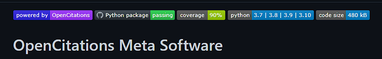
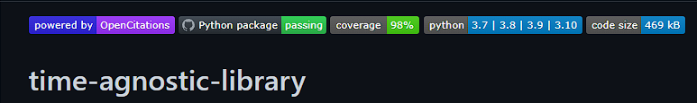

## Cosa ho fatto

* Ho trovato una race condition e ho dovuto interrompere oc\_meta. Essa si verifica se due processi provano a **modificare** contemporaneamente una stessa entità già preprocessata.
  * Ad esempio, se un agente responsabile è stato preprocessato solo con il cognome, se due processi provano ad aggiungere contemporaneamente il nome sollevano una race condition.
  * Soluzioni:
    1. In fase di preprocessing di autori ed editor, il nome aggiunto al triplestore è quello che contiene il maggior numero di informazioni, non solo per quanto riguarda la presenza del nome e cognome, ma anche per la loro lunghezza.
       * Peroni, S.; Peroni,; Peroni, Silvio; P.,Silvio> Peroni, Silvio
    2. Le risorse bibliografiche il cui id compare in più file contemporaneamente devono essere preprocessate per intero. Non è un problema, sono 1991.
* Risolto un **bug** in **oc\_meta** che si verificava se una **venue** nel CSV apparentemente diversa da una già presente sul triplestore si scopriva poi essere la stessa venue. In quel caso, il **merge** tra **volumi** e **issue** dell’**entità temporanea** e di quella con **MetaId** non avveniva correttamente.
* Ho aggiunto a oc\_meta un sistema per **stoppare** e **riavviare gentilmente** i processi.
  * È copia-incollato da

    [script/stopper.py at master · opencitations/script](https://github.com/opencitations/script/blob/master/support/stopper.py)

  * All’avvio, oc\_meta genera automaticamente i file **gentle\_run** e **gentle\_stop**
    * Su **UNIX** viene data loro estensione .sh, su **Windows** .bat
    * Sono già compilati con la directory corretta in cui creare e cancellare il file .stop

  * Ogni singolo processo controlla la presenza del file **.stop** **prima** di avviare i lavori e, se lo trova, **ritorna immediatamente**.
    * La libreria `multiprocess` di Python non fornisce un sistema per rimuovere dalla Pool dei task già inoltrati. Pertanto, sono i singoli task a controllare la presenza del file .stop.

  * gentle\_run.sh/.bat non si limita a eliminare il file .stop, ma è anche uno shortcut per avviare oc\_meta più velocemente.

  * Se oc\_meta viene avviata da terminale, il file .stop viene cancellato.
* Novità relative a **time-agnostic-library**
  * La libreria è ora pienamente compatibile con **OpenLink Virtuoso**.
    * Nuovo parametro di configurazione `virtuoso_full_text_search`, che accetta un valore booleano.

    * Virtuoso permette sia di indicizzare specifiche proprietà in specifici grafi, sia tutti i valori letterali. Per ottenere quest’ultimo risultato, si usa l’interfaccia **ISQL** e si lanciano i comandi:

      * `DB.DBA.RDF_OBJ_FT_RULE_ADD (null, null, 'All');`
      * `DB.DBA.VT_INC_INDEX_DB_DBA_RDF_OBJ ();`

          <aside>
          👉 Di default, Virtuoso aggiorna l’indice testuale solo in batch lanciando esplicitamente quest’ultimo comando, ma è possibile configurarlo perché l’indice venga sincronizzato automaticamente.

          </aside>

    * Una volta creato l’indice, basta usare il preficato **bif:contains** nella query, in maniera speculare a Blazegraph.

      ```sparql
      PREFIX bif: <bif:>
      SELECT DISTINCT ?updateQuery 
      WHERE {
          ?snapshot <https://w3id.org/oc/ontology/hasUpdateQuery> ?updateQuery.
          ?updateQuery bif:contains 
      		"'https://github.com/arcangelo7/time_agnostic/ra/15519' AND 'http://purl.org/spar/pro/isHeldBy'".
      }
      ```

  * `poetry run test` si occupa ora di scaricare da Zenodo e lanciare anche Virtuoso, oltre agli altri triplestore già testati.

  * I test sono ora multi-piattaforma. Ciò vuol dire che, a seconda che vengano lanciati su Windows, Linux o MacOS, i triplestore che lo necessitano vengono avviati con script diversi.

  * Ricapitolando, `poetry run test`:
    1. Se i dati sono assenti. scarica uno zip contenente Blazegraph, GraphDB, Fuseki e Virtuoso da Zenodo con relativi dati e indici testuali.
    2. Estrae l’archivio.
    3. Libera tutte le porte che verranno occupate dai triplestore (9999, 29999, 7200, 3030, 8890, 8891, 1111, 1112).
    4. Lancia tutti i triplestore utilizzando gli script opportuni a seconda del sistema operativo.
    5. Esegue i test.
* Ho misurato la **coverage** di [oc\_meta](https://github.com/opencitations/oc_meta) e [time-agnostic-library](https://github.com/opencitations/time-agnostic-library), che è rispettivamente del 90% e 98%.

  

  

## Domande
