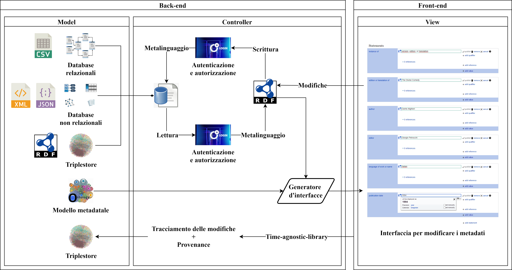
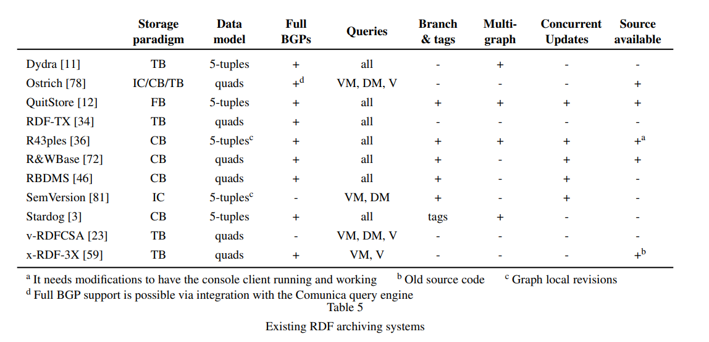
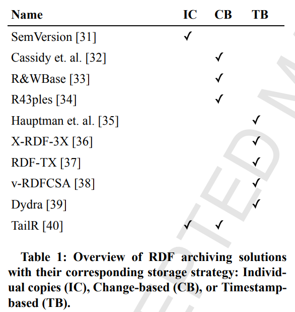

## Cosa ho fatto

* Per quanto riguarda il **progetto** di **dottorato**:
  * Ho **integrato** i **suggerimenti** ricevuti durante l’ultimo incontro e nei commenti su Overleaf
  * Ho realizzato una **diagramma** per mostrare l’**architettura** del **framework**

    

* Ho scritto il demo paper per Ulite-ws

* Novità relative a *Performing live time-traversal queries on RDF datasets*:

  * Ho completato tutti i **benchmark**. Ecco i risultati: [https://arcangelo7.github.io/files/](https://arcangelo7.github.io/files/)
    * Sono una valanga di numeri, ma non sarà necessario inserirli tutti. Alcune tipologie di query verranno accorpate, perché bisogna modificare la tassonomia per rispondere a una delle obiezioni dei revisori, per cui si rimanda a [Tu vuo far el phdino/07-06-2022 In preparazione alla lettera di rispost](/notes/tu-vuo-far-el-phdino/07-06-2022-in-preparazione-alla-lettera-di-rispost)
  * Cancellando tutto il capitolo sui related works l’articolo è lungo 7500/7000 parole, considerando anche le tabelle. Se si escudono le tabelle, il computo si attesta intorno alle 6000/7000 parole. Il problema è che le tabelle contengono per lo più numeri e singoli caratteri che vengono contati come parole.

  [Lettera di risposta ai revisori](Lettera%20di%20risposta%20ai%20revisori%205fb3cbc0a37b4c1dab)

  * Vecchia vs nuova tassonomia di Fernàndez et al. sulle query SPARQL temporali

    Vecchia tassonomia

    1. **Version materialization**. The request to obtain a full version of a specific resource
    2. **Single-version structured query**. Queries made on a specific version of a resource
    3. **Cross-version structured query**. Queries made on different versions of a resource
    4. **Delta materialization**. The request to get the differences between two versions of a specific resource
    5. **Single-delta structured queries**. The equivalent of 2), but satisfied with deltas instead of versions
    6. **Cross-delta structured queries**. The equivalent of
       3\), but satisfied with deltas instead of versions

    Nuova tassonomia, in cui le query sono chiamate “query atoms”

    1. **Version materialization** retrieves data using a query targeted at a single version
    2. **Delta materialization** retrieves query’s result change sets between two versions
    3. **Version query** annotates a query’s results with the versions in which they are valid
    4. **Cross­-version join** joins the results of two queries between two versions
    5. **Change materialization** returns a list of versions in which a given query produces consecutively different results

  * Considerazioni sulle differenze tra la vecchia e la nuova tassomia:
    * La materializzazione dell’intera storia di un’entità è scomparsa. Ora version materialization è l’equivalente di una single-version structured query
    * Version query e change-materialization introducono una novità, ovvero la restituzione dei tempi in cui una certa query è valida. Il mio software restituisce sempre tali annotazioni
    * Delta materialization e cross-version join sono gli equivalenti di cross-delta query e cross-version query

  * Ho scoperto che il confronto tra software per effettuare query agnostiche sul tempo esiste già in letteratura, proprio in quell’articolo *Towards Fully-fledged Archiving for RDF Datasets* che due revisori mi hanno chiesto di citare.

    * È curioso che da questo come dal mio confronto emerga che OSTRICH può fare solo version materialization, delta materialization e version queries, ma che uno dei revisori nenché autore di OSTRICH, mi abbia scritto che il suo software può fare anche cross-version structured queries. Devo approfondire.

    

  * Anche il confronto tra politiche di archiviazione esisteva già in letteratura, sempre in articolo che non conoscevo e che mi è stato suggerito da un revisore (Ruben Taelman)

    

* Ho risolto un **bug** di **oc\_meta**, per cui, dato un MetaID, la funzione incaricata di recuperare altri **id associati** sul triplestore non considerava la possibilità che non ci fossero affatto altri id associati.
  * Di conseguenza, veniva creato un id vuoto “:”, che faceva crashare il Creator.
  * Fortunatamente, questo bug non ha avuto conseguenze ed è stato sufficiente risolverlo, senza riavviare il processo.

* Risolto un **bug** di **oc\_meta** per cui la cache non veniva aggiornata **tempestivamente**, in quanto le **callback** non venivano eseguite subito dopo il termine di un future. Ciò aveva conseguenze anche sulla barra di caricamento, per cui sembrava che il processo richiedesse molto più tempo di quello realmente necessario.
  * La libreria `multiprocessing` di Python non possiede un vero e proprio metodo per triggerare una callback, a parte il parametro `callback` di `apply_async`, che però riceve come unico argomento il risultato del future e non è possibile passare altri argomenti.
  * Al contrario, la libreria `concurrent.futures` possiede la funzione `as_completed`, che triggera le callback appena una chiamata asincrona ritorna un risultato. Tuttavia, non posso usare `concurrent.futures` perché ho bisogno del parametro `maxtasksperchild` di `multiprocessing`.
  * **Soluzione**: integrare la callback direttamente alla fine della funzione lanciata come asincrona. L’unica rinuncia è la barra di caricamento, ma non è un problema, perché la cache stessa è una sorta di barra di caricamento.

## Domande

* Per il progetto di dottorato ho scritto 20,845 caratteri (spazi inclusi) su 20,000 massimi consentiti (titolo, indice e bibliografia esclusi). Sono 8 pagine. È un problema?
* Cosa si intende per “shape” di una query SPARQL?
* Non so cosa rispondere al revisore che ha obiettato 1) L’assenza di pseudocodice 2) L’assenza di complessità degli algoritmi 3) L’assenza di formalizzazione della cache
* Domande relative al bando di dottorato:
  * Posso menzionare tra le pubblicazioni gli articoli non ancora “issued”? Per esempio, quello per Scientometrics, per TPDL e per ULITE-ws.
  * Posso menzionare il software come pubblicazione, anche se non menzionato dalle pubblicazioni ammesse dal bando?
  * Per quanto riguarda le pubblicazioni, il sistema mi chiede di caricare un PDF. Va bene un PDF contenente una bibliografia?
