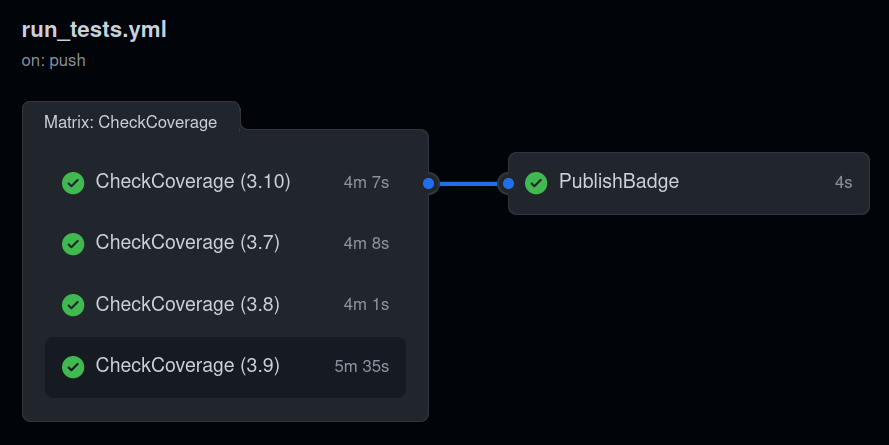

## Cosa ho fatto

### Novità relative all’articolo su time-agnostic-library

* Sia l’articolo che la lettera di risposta sono pronti. L’articolo è lungo 6954 parole secondo Overleaf.
* Misurando le dimensioni della cache, mi sono accorto di un comportamento anomalo da parte di **Fuseki**, che aumenta enormemente le **dimensioni** del database a qualunque comando di update, compresi i **drop**. Esiste un comando per compattarne le dimensioni senza perdere funzionalità (`curl -XPOST http://server:port/$/compact/<datasetname>`), ma non capisco a cosa sia dovuto questo comportamento. Per dare qualche misura, il peso è passato da 2 GB a 400 MB con la compressione, che è comunque il doppio del peso della cache per gli altri triplestore.
* La coverage viene aggiornata a ogni push automaticamente.
* Ho portato la **coverage** dal 99 al **100%**.

### Novità relative all’API di OC Meta

* È ora possibile cercare uno o più **MetaId** tramite l’operazione **/metadata/**
* Ho potenziato l’operazione /metadata/, che adesso permette di cercare una **combinazione** arbitraria di **schemi** di identificativi e non uno schema alla volta come prima.
  * Prima: /metadata/{scheme}/{literal\_values} (e.g., /metadata/doi/10.1007/978-1-4020-9632-7\_\_10.1088/0022-3727/39/14/017
  * Ora: /metadata/{identifiers} (e.g., /metadata/doi:10.1007/978-1-4020-9632-7\_\_issn:1588-2861\_\_meta:br/1)
  * Ecco la nuova **espressione regolare** per validare l’input di /metadata/: `(doi|issn|isbn|meta|pmid|pmcid|url|wikidata|wikipedia):[^__]+(__(doi|issn|isbn|meta|pmid|pmcid|url|wikidata|wikipedia):[^__]+)*`
  * Ho aggiunto l’**espressione regolare** per validare l’input di /**author**/ ed /**editor**/, ovvero la stessa usata da **oc\_identfiermanager**: `([0-9]{4}-){3}[0-9]{3}[0-9X]`
  * Infine, ho aggiunto l’**espressione regolare** per le **ricerche testuali**: `(id|editor|author|title|venue|publisher|volume|issue)=((?!&&|\|\|).)+((&&|\|\|)(id|editor|author|title|venue|publisher|volume|issue)=((?!&&|\|\|).)+)*`
* Il **match** su **foaf:name** è **imperfetto**, così da gestire quei nomi di persona registrati senza disambiguare tra nome e cognome.

### Novità relative al crowdsourcing

* Ho aggiunto ‘**hadPrimarySource**’ ai metadati di provenance delle issue depositate su **Zenodo**.
* Diamo un caloroso benvenuto a **crocibot**, che ora ha un account GitHub e uno su Zenodo.
  * I depositi delle issue su Zenodo avverranno a suo nome.
  * I token di accesso a GitHub e a Zenodo sono i suoi, quindi le risposte alle issue avvengono a nome suo.
  * Il token salvato sul server è il suo. Avere quel token non serve a niente, perché crocibot non può modificare il codice della repository, pur essendone membro.
* I depositi vengono processati tutti i **sabati** alle **00:01**, così se ci sono problemi gli utenti se ne accorgono lunedì e io ho il tempo di risolverli.
* Il **server** controlla se ci sono nuove issue da processare **ogni minuto** tramite **crontab**. In questo modo, non è più possibile eseguire comandi sul server modificando la repository GitHub.
* Ho aggiornato la **documentazione** dei **CSV** esplicitando le **schemi** degli **identificativi** supportati nei vari campi. Quindi ho **citato** tale documentazione e l’atto di convegno che ne è derivato nel **README** del repo.

### Novità relative a OC Meta

* Caso curioso: [10.1097/01.rct.0000185385.35389.cd](https://doi.org/10.1097/01.rct.0000185385.35389/.cd)

* Mi sono accorto che **GitHub Actions** non eseguiva realmente i **test** a causa di un **crash silenzioso**.
  * Ho sistemato il problema e ho **automatizzato** il controllo della **coverage** e la pubblicazione del **badge**, che viene pubblicato solo dopo che tutti i test sono passati su tutte le versioni di Python specificate.

    

* Ho portato la coverage dal 90% al 94%.

* Ho integrato oc\_idmanager in oc\_meta

* A quanto pare una **casa editrice** può avere **più di un identificatore su Crossref**. È Il caso della Korea Distribution Science Association, che ha identificatori crossref:5248 e crossref:6452. Al momento, questa è l’unica entità conflittuale in OC Meta.
  * In questo caso risolverò il problema con un **merge manuale**. Per il futuro, ho modificato il codice del preprocessing perché tenga in considerazione questa eventualità.

* Ho scritto del codice per **zippare** i file **json-ld** preservando la **gerarchia** delle directory.

* Mi sono accorto di un **problema** **catastrofico** riguardante OC Meta. Mi ero dimentato che le modifiche proposte in questa [pull request](https://github.com/opencitations/oc_ocdm/pull/28) per rendere oc\_ocdm thread-safe erano solo in locale. Finora Meta ha lavorato in maniera non thread-safe. Bisogna far ripartire il processo dall’inizio.
  * Per evitare questa questa svista si ripeta, ho aggiunto un test che fallisce se oc\_ocdm genera race conditions.
  * Ho scritto a Simone, che ha prontamente rilasciato la nuova versione di oc\_ocdm.
  * Ho riavviato Meta utilizzando l’ultimo dump di Crossref.

* Le **entità HTML** vengono **esplicitate** nei nomi delle **case editrici**.

* La funzione per **parificare** i dati sul **CSV** a quelli sul **triplestore** veniva inutilmente lanciata **due volte**. Ora viene lanciata solo \*\*\*\*una.

### Altro

* È un problema che possiamo risolvere facilmente usando la stessa funzione che usa OC Meta per gestire i titoli. Non title() semplice, ma title() solo se non ci sono maiuscole nelle parole, eccezion fatta per quei titoli interamente maiuscoli

[https://twitter.com/pure\_suggest/status/1573169355499704320?t=89uzuVNW9E7vxf4qal9CdA\&s=19](https://twitter.com/pure_suggest/status/1573169355499704320?t=89uzuVNW9E7vxf4qal9CdA\&s=19)

* Ho automatizzato l’esecuzione dei test, la misurazione della coverage e il rilascio del badge per oc\_idmanager

## Domande

* Posso cominciare a scrivere l’articolo su OC Meta?
* Il default di exist in oc\_idmanager è False. Secondo me dovrebbe essere True, perché è il risultato che si ottiene se non si usano API e in quel caso ritornare False significa rimuovere degli identificatori dal risultato. Secondo me, exist dovrebbe ritornare False solo in caso di 404.
* Nell’id manager attuale c’è una nuova funzione syntax\_ok, che controlla l’identificatore tramite espressione regolare. A me sembra che questa funzione abbia senso solo per DOI, visto che per gli altri identificatori è meno precisa di check\_digit. Cosa ne pensate?
