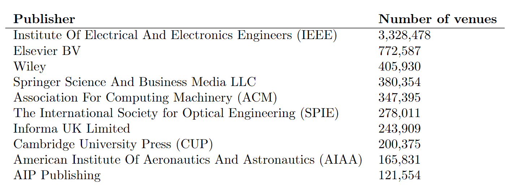

## Novità

* Ho scritto del codice nel repo `prov_utils` per modificare una data proprietà nei file di provenance da un certo valore a un’altro. Funziona in parallelo e si lancia da riga di comando.
  * L’ho utilizzato per modificare il proprietà `prov:wasAttributedTo` dal mio ORCID a `“[https://w3id.org/oc/meta/prov/pa/1](https://w3id.org/oc/meta/prov/pa/1)”`
* Ho scritto del codice per calcolare il delta degli id tra due versioni di COCI.
  * L’ho usato per generare la lista di DOI da processare per aggiornare Meta con COCI ottobre. Sono 1,042,005 DOI.
* Risolto un bug in Meta per cui l’ISSN 0000-0000 veniva trasformato in None e faceva crashare il software. Ora viene rimosso.
* Meta ha ingerito COCI ottobre.
* Index ha ingerito COCI ottobre e DOCI
* Ho scritto il blogpost su Meta.
* Ho scritto il codice per estrarre la mappatura MetaID-ID dai CSV in output di Meta

  * Ci sono i MetaID di tutti i tipi di entità (campi id, author, editor, venue e publisher)

  ### indexapi\_v2: metadata

  * L’output di /metadata/ è coerente con la struttura delle tabelle di Meta
    * doi → id
    * year → pub\_date
    * author: ‘{first\_name}, {given\_name} \[{ids}]’
    * source\_title/id → venue
    * Ora c’è anche il campo editor

  * I campi reference e citations contengono liste di MetaID

  * L’utente specifica lo schema degli identificativi in input e gli identificatori nell’output vengono distinti per schema. La query viene riscritta in maniera tale che doi: venga sostituito “[http://dx.doi.org/”](http://dx.doi.org/”) con e pmid: venga sostituito con “[https://pubmed.ncbi.nlm.nih.gov/”](https://pubmed.ncbi.nlm.nih.gov/”)

  * Vengono fatte due query a Meta.
    1. La prima viene effettuata in fase di preprocess e serve per trovare tutti gli identificatori dell’input.
    2. La seconda viene effettuata in fase di postprocess e serve per trasformare trovare i MetaID delle citazioni, in modo tale da disambiguarle automaticamente.

  * Esempio di input /metadata/doi:10.1016/j.compedu.2018.11.010\_\_pmid:1234

  * Ecco la nuova query:

    ```sparql
    PREFIX cito: <http://purl.org/spar/cito/>
    SELECT DISTINCT 
    	?id 
    	?citation_count 
    	?citation (GROUP_CONCAT(distinct ?cited_doi; separator="; ") as ?reference)
    WHERE {
    	VALUES ?citing_id { [[ids]] }
    	BIND(IRI(?citing_id) AS ?citing)
        BIND(
            REPLACE(REPLACE(STR(?citing_id), 
                "https://pubmed.ncbi.nlm.nih.gov/", "pmid:"), 
                "http://dx.doi.org/", "doi:") 
            AS ?id)
        OPTIONAL {
    	    ?citing ^cito:hasCitingEntity / cito:hasCitedEntity ?cited .
    	    BIND(
            	REPLACE(REPLACE(STR(?cited), 
                	"https://pubmed.ncbi.nlm.nih.gov/", "pmid:"), 
                	"http://dx.doi.org/", "doi:") 
            	AS ?cited_doi)
    	}
    	OPTIONAL {
    	    SELECT ?citing (count(distinct ?citing_source) as ?c_count) (GROUP_CONCAT(distinct ?citing_source; separator="; ") as ?citation) {
    	        VALUES ?citing_id { [[ids]] }
    	        BIND(IRI(?citing_id) AS ?citing)
    	        ?citing ^cito:hasCitedEntity ?c .
          		?c cito:hasCitingEntity ?source .
    			BIND(
              		REPLACE(REPLACE(STR(?source), 
                		"https://pubmed.ncbi.nlm.nih.gov/", "pmid:"), 
                		"http://dx.doi.org/", "doi:") 
              		AS ?citing_source)
    	    } GROUP BY ?citing
    	}
    	BIND(IF(bound(?c_count), ?c_count, 0) as ?citation_count)
    } GROUP BY ?id ?citation_count ?citation
    LIMIT 50000
    ```

  * Le api vengono testate automaticamente a ogni push. La coverage attuale è dell’88%.

  ### indexapi\_v2: references, citations

  * Sia nell’input che nell’output vengono specificati gli schemi degli identificativi.

  ### indexapi\_v2: citation-count, reference-count

  * Nell’input viene specificato lo schema dell’identificativo.
  * Il conteggio finale si basa su MetaID.

  ### nociapi\_v1

  * I vari metodi ricevono in input un PMID anziché un DOI.
* Ho disambiguato le venue in Meta senza id per titolo e questo è il risultato. Riporto il prima e il dopo

  

  

  * Ho solo usato come chiave il titolo in minuscolo al posto dell’id, non ho creato dei cluster di nomi simili. È sensato come risultato?
  * Ovviamente ho usato lo stesso criterio anche per contare le venue e il numero di risorse per tipo.
* Ho capito perché i citati in COCI non di Crossref non restituivano nulla tramite API. Perché la query SPARQL dava per obbligatoria la presenza del timespan, che per quei DOI non c’è.

## Domande

* L’API di Index utilizza Unpaywall per recuperare la versione open access dato un DOI. E se c’è un identificatore che non è un DOI? Lol

* Che separatore uso per i campi di /metadata/ che contengono liste di ID? Attualmente viene utilizzato il punto e virgola, ma Meta usa lo spazio. Usare spazio

  ```python
  [{'id': 'doi:10.1016/j.compedu.2018.11.010; meta:br/06220662347', 
  'citation_count': '3', 
  'citation': 'meta:br/06150578417; meta:br/06150578486; meta:br/06150578485', 
  'reference': 'meta:br/06150903011; meta:br/061701938723; meta:br/062403286732', 
  'author': 'Voogt, Joke [orcid:0000-0001-5035-9263]; Smits, Anneke [orcid:0000-0003-4396-7177]; Farjon, Daan', 
  'editor': '', 
  'pub_date': '2019-03', 
  'title': 'Technology Integration Of Pre-Service Teachers Explained By Attitudes And Beliefs, Competency, Access, And Experience', 
  'venue': 'Computers & Education [issn:0360-1315]', 
  'volume': "130", 
  'issue': '', 
  'page': '81-93', 
  'oa_link': ''}]
  ```

* Attualmente le API di DOCI, POCI e COCI ritornano identificatori secchi, senza prefisso. Dovrebbero ritornarli col prefisso?
  * DOCI e POCI col prefisso in versione 1
  * COCI col prefisso in versione 2
  * Il campo oci diventa id e dentro ci va oci:
  * Il campo citing e cited contiene liste di identificativi, con prefisso
