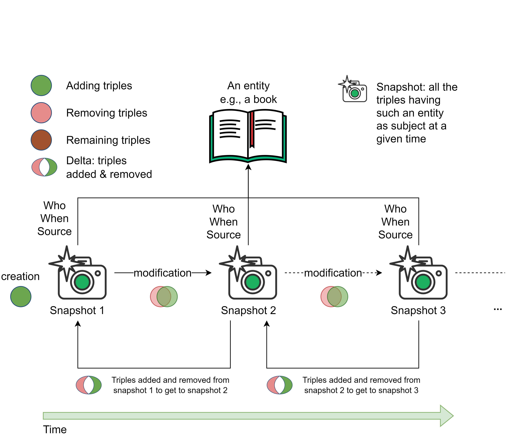

## Novità

### Articolo Meta

* Ho ricreato la descrizione di alto livello arricchita del livello di provenance di OCDM e l’ho inserita nell’articolo

  

### indexapi\_v2

/metadata/

* L’API di Unpaywall non viene più chiamata e il campo “oalink” è stato rimosso
* citation\_count si basa sui MetaID, non viene ottenuto tramite query a Index

/citations/, /references/ e /citation/

* Campo “oci” → Campo “id”. Contiene una lista di oci con prefisso separati da spazio (un solo oci per /citation/)
* Campi “citing” e “cited”: contengono una lista di identificatori con prefisso recuperati da Meta, compreso il MetaID
* Campo “creation”: data di pubblicazione del citante recuperata da Meta
* Campo “timespan”: calcolato a partire dalle date di creazione del citante e del citato recuperate da Meta
* Campi “journal\_sn” e “author\_sc”: calcolati a partire dagli ISSN e ORCID recuperati da Meta.
* La fonte non viene più specificata.

Ho gestito le seguenti eccezioni (in entrambi i casi, la citazione viene ignorata):

* id non esiste su Meta
* id in input non esiste su Index

I DOI vengono cercati su Index sia preceduti da [https://doi.org/](https://doi.org/) che da [http://dx.doi.org/](http://dx.doi.org/)

### coci\_v2 e doci\_v2

* Tutte le operazioni specificano lo schema degli identificatori nell’output, ma non nell’input
* Il campo “oci” diventa “id” nelle operazioni citations, references e citation
* /metadata/
  * I campi “reference” e “citation” contengono liste di DOI e non di OMID, sulla base dei quali viene calcolato il “citation\_count”

### meta

* Ho aggiunto lo schema `datacite:datacite` a oc\_ocdm e Meta.
* Ho aggiornato il sito con le informazioni su Meta.
* Risolto un bug per cui risorse con volumi e issue non di tipo “journal volume”, “journal issue” o “journal article” mantenevano l’informazione sul volume e l’issue, salvo poi causare un crash durante la creazione dell’RDF. Ora, in quel caso, il volume e l’issue vengono eliminati.

## Domande

* `get_duration` in [index/citation.py](https://github.com/opencitations/index/blob/master/index/python/src/oci/citation.py) può generare timespan negativi. Come mai?
* Come faccio a modificare l’ontologia SPAR Datacite?
