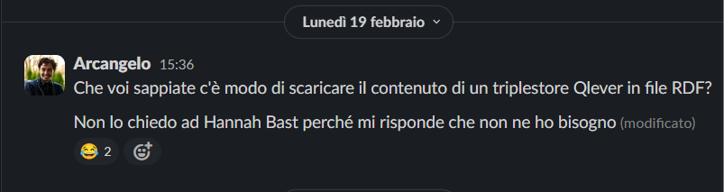

## Novità

**Meta**

* Il caricamento della provenance su Blazegraph è fallito dopo 2,841,672,341 triple (623G)

  > ERROR: Banner.java:160: Uncaught exception in thread
  > java.lang.RuntimeException: java.util.concurrent.ExecutionException: java.lang.RuntimeException: java.util.concurrent.ExecutionException: java.lang.AssertionError: Record exists for offset in cache: offset=2147483616

* qlever è stato aggiornato. Ora si installa con pip. Questo rende il debugging molto più semplice (prima era un file bash). Il nuovo Qleverfile è incompatibile col precedente

* Conti

* 4,236,383,245

* 4,236,389,321

* 4,236,377,424

* 4,236,287,257

* 4,236,287,257

* 4,236,287,432

  * Numero di triple di provenance nell’RDF: 5,540,033,781
  * Numero di triple di dati nell’RDF: 4,236,287,432
  * Numero di triple sul triplestore: 4,236,377,424
  * Numero di triple nei file RDF scaricati dal triplestore: 4,236,377,424
  * Il numero di file di dati è lo stesso numero di file di provenance: 1,074,955

    <aside>
    ⚠️ **Numero di triple nei file RDF riorganizzati per Meta: 4,236,365,132**

    </aside>

  Test su un subset

  ```bash
  mkdir -p ../kb_1 && ls -1 | head -1 | xargs -I{} cp {} ../kb_1/
  ```

  * 1 file
    * Numero di triple nell’RDF: 1,000,000
    * Numero di triple nei file RDF riorganizzati per Meta: 1,000,000
  * 10 file
    * Numero di triple nell’RDF: 10,000,000
    * Numero di triple nei file RDF riorganizzati per Meta: 9,995,386
    * E se processo i file come ConjunctiveGraph anziché come JSON? 10,000,000

* Qlever

  * Ho caricato di nuovo la provenance su qlever. 6,7h usando 5,000,000 come batch size. Decisamente più veloce che usare 1,000,000. In teoria serve più RAM, in pratica la RAM è un problema di cui solo i nostri antenati hanno memoria. 1.1T

    ```yaml
    Parse input             :   2.9 h
    Build vocabularies      :   2.3 h
    Convert to global IDs   :   0.5 h
    Permutation PSO & POS   :   0.4 h
    Permutation SPO & SOP   :   0.2 h
    Permutation OSP & OPS   :   0.3 h
    TOTAL index build time  :   6.7 h
    ```

  * Ho aperto un issue per chiedere di aggiungere una funzionalità di export: [https://github.com/ad-freiburg/qlever/issues/1291](https://github.com/ad-freiburg/qlever/issues/1291)

  

  

* Il numero di triple di provenance mi sembra basso
  * Script che controlla la provenance

    * Controlla che per ogni entità ci sia un grafo di provenance

    * Controlla che

      ```python
          required_predicates = [
              (PROV.generatedAtTime, "generatedAtTime", None),
              (PROV.specializationOf, "specializationOf", subject),
              (PROV.wasAttributedTo, "wasAttributedTo", None),
              (RDF.type, 'type', PROV.Entity)
          ]
      ```

    * Genera dei log se non trova qualcosa

    * Ho trovato degli snapshot di entità sottoposte a merge in cui lo snapshot 1 ha solo il tempo di invalidazione

    ```bash
        "errors": {
            "Provenance entity not found": 25140,
            "generatedAtTime property missing": 26151,
            "specializationOf property error": 26151,
            "wasAttributedTo property missing": 26151,
            "type property error": 25140
        }
    ```

**RML**

* Non c’è modo di invertire automaticamente una funzione. Bisogna definire manualmente l’inverso della funzione.

**Expert Committee Meeting**

* Silvio:
  * Useremo questo contributo per migliorare la qualità di OpenCitations
* Anastasia:
  * Usi shacl per la validazione? Ni
    * Ci sono lavori per migliorare l’efficienza di shacl, validando solo il sottografo più rilevante
  * C’è un modo per derivare parte dello shacl direttamente dall’RML
  * Usi CSVW? No perché è fatto per input ideali
* Philippa Sheil:
  * Hai coinvolto practitioners?
    * Not yet, ma sarà fondamentale per valutare la qualità del lavoro e la sua effettiva usabilità
    * Silvio: lavoriamo in un dipartimento di filologia. Mancanza di metadati per risorse di natura umanistica. Questo sistema pootrebbe essere usato per permetrere a umanisti di caricare la bibliografia dei loro lavori in questo grande grafo.
* Rick Bonnie
  * Chi è il caso d’uso>
    * Umanisti e social sciences
  * È open scource?
  * Finna.fi

## Domande

* [https://adho.org/2024/02/15/dsh-dh2023-conference-proceedings-call-for-papers/](https://adho.org/2024/02/15/dsh-dh2023-conference-proceedings-call-for-papers/)

  > Long articles of up to 6,000 words in length (notes & bibliography excluded) should take up theoretical issues in digital humanities or report on completed work, including at least preliminary evaluation of its results. While there is more room for shorter articles for description of work at earlier stages, we emphasize that short papers of no more than 2,000 words (notes & bibliography excluded) should make scholarly points and not merely report on DH project activities. All submissions will be evaluated by at least two independent referees.
* L’articolo di Meta è stato pubblicato il 14 febbraio. È normale che il suo DOI non faccia ancora la redirezione? [https://doi.org/10.1162/qss\_a\_00292](https://doi.org/10.1162/qss_a_00292)
