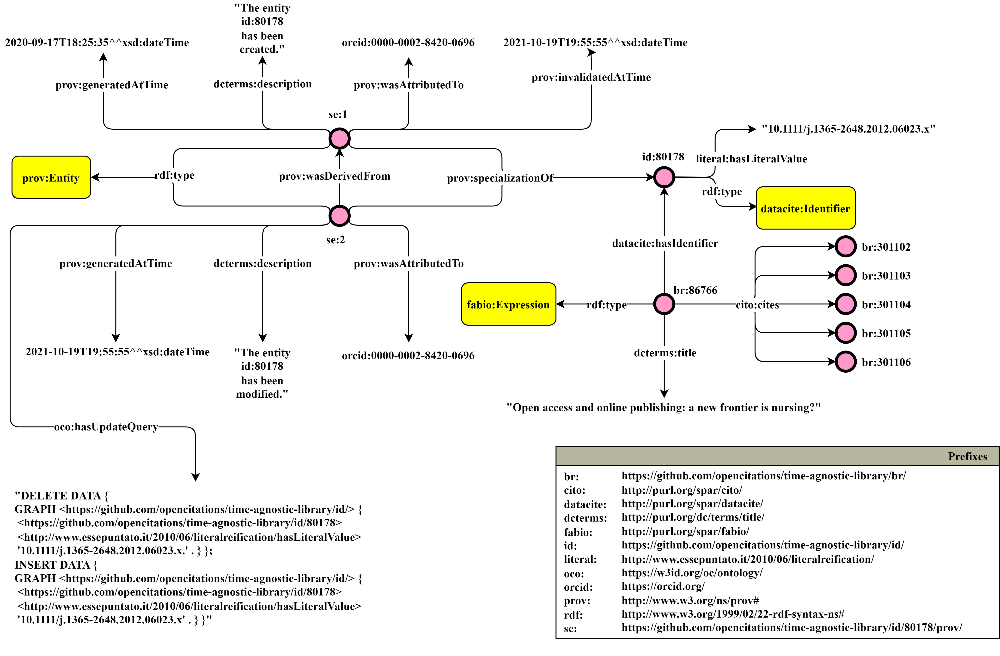

## Novità

**Articolo per JWS su time-agnostic library**

* Revisore #2 ha detto che non abbiamo descritto formalmente i delta, ma questo non è vero, li abbiamo descritti sia a parole che con il diagramma Graffoo. A Revisore #2 sono quindi risultati poco chiari gli esempi successivi, ad esempio non ha capito in che modo si può capire quale sia tn-1 se il tempo non è indicato negli snapshot. Per rispondere, ho esteso il diagramma di esempio con più metadati sugli snapshot (prima mancavano tempi di generazione, invalidazione, descrizione e agenti responsabili).

**Meta**

* Due articoli diversi in tutto ma con lo stesso DOI. L’argomento sembra vagamente simile, ma cambiano titolo, autori, abstract.
  * [https://pubmed.ncbi.nlm.nih.gov/15370649/](https://pubmed.ncbi.nlm.nih.gov/15370649/)
  * [https://pubmed.ncbi.nlm.nih.gov/15849057/](https://pubmed.ncbi.nlm.nih.gov/15849057/)
* Risolto un bug per cui la fusione tra due ra nello stesso file non aggiornava le ra già registrate per risorse identiche già incontrate.
* Meta corregge automaticamente l’ordine dei ruoli. Non ci sono race condition perché i ruoli sono diversi in ogni documento e i documenti elaborati da due processi paralleli sono diversi per costruzione.
  * Vengono risolti anche casi in cui una ruolo ha due has next
