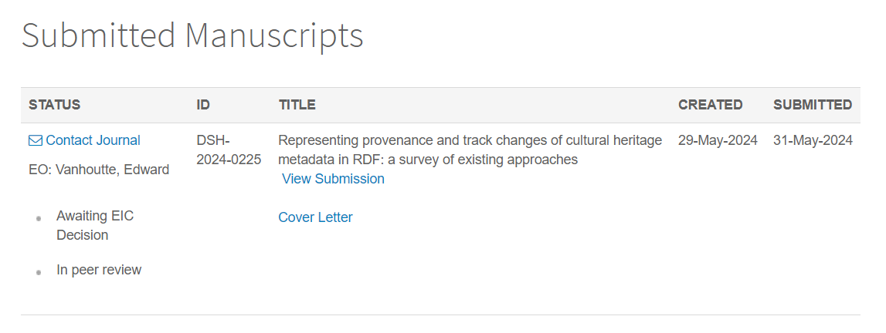

## La Novitade

### Meta

* Ho fatto uno script per controllare se ci fossero righe invalide i cui id non sono coinvolti in citazioni e no, il 100% delle righe invalide è coinvolta in citazioni. Quindi le tengo senza venue
* Involontariamente, aggiornare il workflow di Meta per Virtuoiso ha portato a galla bug altrimenti invisibili. Dalle query SPARQL salvate su file mi sono accorto che il triplestore veniva aggiornato multiple volte anche su esecuzioni successive dper le stesse risorse, cosa che dovrebbe accadere solo in presenza di conflitti.
  * Risolto un bug per cui le venue non venivano deduplicate correttamente. In pratica, ogni volta veniva creata una nuova venue con un nuovo omid e associata alla br, preesistente. Idem per volume e issue. Su Meta ci sono tante venue, volumi e issue isolati per questo motivo. Il problema si è verificato quando ho riscritto il codice di Meta in modo da fare un’unica query all’inizio e recuperare tutte le info da grafo in memoria. Quello che accadeva era che la venue nel CSV aveva la precedenza su quella nel triplestore. La venue nel triplestore veniva usata solo se il campo venue era vuoto. Ho aperto una issue su github.
  * [https://github.com/opencitations/oc\_meta/issues/27](https://github.com/opencitations/oc_meta/issues/27)
  * Mi sono accorto che Virtuoso non stava sempre deduplicando le risorse, perché la query sparql sugli id che utilizzava l’indice testuale accettava anche match parziali. Il numero di risorse restituito da tale query differiva ogni volta.

### HERITRACE

* Il motivo per cui gli agenti non avevano il campo per creare l'identificatore era un errore di raggruppamento nella query SPARQL sullo shacl. Non stavo raggruppando per classe, quindi i predicati in comune tra classi diversi venivano considerati come lo stesso predicato e veniva tenuta solo la prima occorrenza
* Ho risolto il bug per cui tutti i menu a tendina di uno stesso predicati avevo lo stesso id e si aprivano e chiudevano all’unisono.
* Risolto un bug per cui il pulsante di aggiunta di un nuovo valore per un cerco predicato aggiungeva in fondo tutti i pulsanti di aggiunta di predicati annidati (ad esempio, il pulsante per aggiungere un nuovo autore spostava in fondo i pulsanti di aggiunta di nuovi id di ciascun autore)

## Domande

* Come rendo sistematico il controllo sulle righe invalide con citazioni? Da quando carichiamo in  Meta metadati senza citazioni?  E se vogliamo caricare sempre i metadati di risorse con citazioni per non rompere il workflow che ormai ha Meta come pilastro, ha ancora senso il concetto di riga invalida? Una riga è valida se ha un id e se ha citazioni, quindi sempre se ha un id stando al fatto che in Meta ricordavo che finissero solo risorse con citazioni
