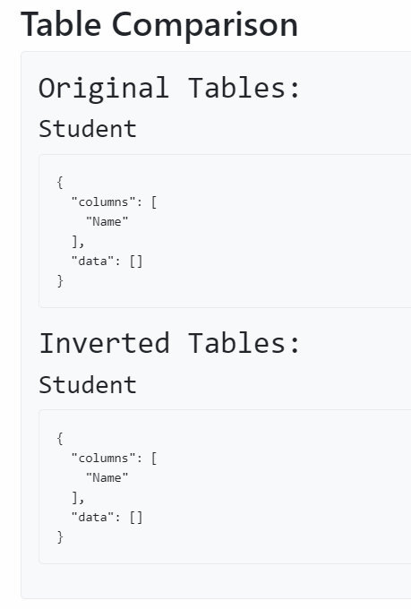

## La Novitade

### Meta

* Software per controllare che i risultati dei merge delle br siano ok

### HERITRACE

* Logica per creare nuovi predicati di entità esistenti (identica a quella per entità nuove)
  * Validazione backend identica a quella per la modifica
  * Validazione frontend indentica a quella per la creazione
* Modificare l'ordine cancella tutto le entità e le ricrea nell'ordine corretto. Anche aggiungere un nuovo elemento alla lista degli elementi ordinati ha lo stesso effetto.

  * è anche possibile aggiungere e riordinare contemporaneamente. Logica lato server identica, usiamo un id temporaneo che viene mappato a quello mintato

    <aside>
    ❓

  * Problema con l'inversione. Le entità collegate cancellate (gli ar) non vengono ricreati, viene ricreato soltanto il collegamento tra la br e le ar

    </aside>

### RML

* Se il DataFrame è vuoto, crea solo la tabella senza inserire dati: null ≠ \[]

  

* La query di inversione ricava informazioni sul datatype
  * Gli oggetti per riferimenti perdevano l'informazione sul datatype, perchè accadeva questo

    ```python
    ```


\# Before
lines.append(f"OPTIONAL{{?{subject\_reference} {predicate} ?{plain\_object\_reference}.")
lines.append(f"OPTIONAL{{BIND(ENCODE\_FOR\_URI(STR(?{plain\_object\_reference})) as ?{object\_reference}\_encoded)}}")
lines.append(f"FILTER(!BOUND(?{object\_reference}\_encoded) || !BOUND(?{plain\_object\_reference}) || ENCODE\_FOR\_URI(STR(?{plain\_object\_reference})) = ?{object\_reference}\_encoded)")

```
    # After
    lines.append(f"OPTIONAL{{?{subject_reference} {predicate} ?{plain_object_reference}. \
    	BIND(DATATYPE(?{plain_object_reference}) AS ?{object_reference}_datatype)}}")
```


\`\`\`

* Gestione blank node in subject template
  * Gestire i blank node generati tramite template potrebbe non avere senso, in quanto i blank sono per definizione nodi anonimi, e recuperare all'indietro un valore da un qualcosa di anonimo non ha senso. Oltre al fatto che rdflib di default anonimizza i blank node, non preserva i loro nomi originali. Ho dovuto creare un parser custom per preservare il nome originale. In ogni caso, si perde l'informazione sul datatype.
  * We need to extract the variables used in its template (e.g., `ID` in `"students{ID}"`) to retrieve the necessary data
    * We bind the blank node subject to a variable (e.g., `?1`), but since we cannot use its value directly, we use it as a starting point to extract the variables
    * Extract variables from the template
      * We parse the template and generate SPARQL query parts that extract the variables used in the template.
      * We handle each variable in the template by splitting the template into parts before and after the variable, and using `STRAFTER` and `STRBEFORE` functions to extract the variable's value from the blank node identifier.
  * Esempio

```
        _:students10 [http://xmlns.com/foaf/0.1/name](http://xmlns.com/foaf/0.1/name) "Venus" .
```

```sparql
        SELECT ?Name ?ID_encoded ?ID_datatype WHERE {
        	?subject <[http://xmlns.com/foaf/0.1/name](http://xmlns.com/foaf/0.1/name)> ?Name .
        	BIND(STRAFTER(STR(?subject), 'students') as ?ID_encoded)
        }
```

* Gestione inversioni che non ritornano risultato per eccezioni
* [https://www.overleaf.com/6777119729fdrvvtkydprp#7caa2a](https://www.overleaf.com/6777119729fdrvvtkydprp#7caa2a)

## Domande

* Perchè Tijs si è preoccupato di fare ENCODE\_FOR\_URI per gli oggetti?
* è permesso dato un sbirciatina ai dati di partenza?
* I still don't known what to do with views
