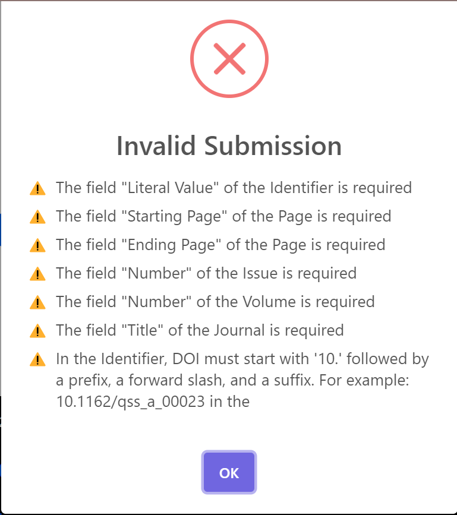

## La Novitade

### Meta

* Bug di fusione entità: durante la fusione offline di entità interconnesse, il sistema recupera e riaggiunge erroneamente dati di entità già fuse, generando snapshot di provenance incoerenti. Questo accade perché il database viene aggiornato solo alla fine del processo, non riflettendo lo stato intermedio delle fusioni. La soluzione proposta è di eseguire e salvare tutte le fusioni correlate come un'unica operazione atomica, aggiornando il database solo al completamento di ciascun gruppo di fusioni interconnesse
  * Ho controllato i risultati con un software apposito dopo questa modifica e il problema si era risolto
  * Ho aggiunto dei controlli sulla provenance per il giro successivo
    * Verifica della presenza di almeno due snapshot per ogni entità.
    * Controllo che i numeri degli snapshot siano consecutivi e corrispondano alla loro posizione nella sequenza.
    * Verifica della presenza del tempo di generazione (prov:generatedAtTime) per ogni snapshot.
    * Controllo del tempo di invalidazione (prov:invalidatedAtTime):
      * Presente per tutti gli snapshot tranne l'ultimo di un'entità sopravvissuta.
      * Assente per l'ultimo snapshot di un'entità sopravvissuta.
    * Verifica delle relazioni prov:wasDerivedFrom:
      * Assenti per il primo snapshot di un'entità.
      * Una sola relazione che punta allo snapshot precedente per tutti gli snapshot intermedi.
      * Multiple relazioni per l'ultimo snapshot dell'entità sopravvissuta (snapshot di merge), pari al numero di entità fuse più uno.
    * Controllo che lo snapshot di merge sia derivato dal suo snapshot precedente e dagli ultimi snapshot di tutte le entità fuse.
    * Verifica che l'ultimo snapshot di un'entità cancellata sia invalidato.
    * Controllo della correttezza dell'URI dello snapshot, che deve seguire il formato: nome\_entità/prov/se/numero\_snapshot.
* Ci sono una manciata di blocchi di risorse interconnesse da fondere che contengono un gran numero di risorse e portano a un’esaurimento della memoria RAM e quindi alla terminazione improvvisa di database o redis, causando risultati inconsistenti in alcune fusioni. Soluzione: nella fusione in parallelo con più di 4 workers ignorare i file che contengono più di 10000 risorse.
  * Smaltisco il grosso con 60 workers
  * Processo i blocchi da più di 10000 risorse (390 file) con 4 processi

### HERITRACE

* Aggiungere solo proprietà opzionali senza compilare niente triggera un warning che informa l’utente che non è stata fatta alcuna modifica

* Maggiore contesto per i messaggi di errore

  

* data-max-items e data-min-items anche in about.jinja

* Nuovo parametro di configurazione, fetchUriDisplay. A seconda della classe, al posto dell’uri dell’entità viene visualizzata un valore dinamico configurabile tramite query sparql (as usual)

  * Il nome della variabile di binding non è rilevante. Prendo il primo binding e il primo (e unico) valore come stringa da visualizzare al posto dell’URI dell’entità
  * L’URI dell’entità viene sostituito con la stringa personalizzata ovunque compaia, persino nella descrizione dello snapshot

    <aside>
    🪄

  La query per gli articoli ritorna un riferimento bibliografico in APA style, prendendo in considerazione un gran numero di valori opzionali

  La query per gli ar ritorna un riferimento al nome dell’agente e al titolo della br che fa da contesto (idem le pagine)

  Gli agenti hanno gli id tra parentesi quadre

  Nei BookChapter c’è In: book title

  La query generica per le expression tiene conto di tutte le possibilità

    </aside>

  ```sparql
  PREFIX dcterms: <http://purl.org/dc/terms/>
  PREFIX fabio: <http://purl.org/spar/fabio/>
  PREFIX foaf: <http://xmlns.com/foaf/0.1/>
  PREFIX pro: <http://purl.org/spar/pro/>
  PREFIX prism: <http://prismstandard.org/namespaces/basic/2.0/>
  PREFIX frbr: <http://purl.org/vocab/frbr/core#>
  PREFIX xsd: <http://www.w3.org/2001/XMLSchema#>
  SELECT ?display
  WHERE {
    {
      SELECT ?title ?pubDate ?journalTitle ?volumeNumber ?issueNumber ?startPage ?endPage
             (GROUP_CONCAT(DISTINCT CONCAT(?familyName, ", ", SUBSTR(?givenName, 1, 1), "."); SEPARATOR = " & ") AS ?authorList)
      WHERE {
        [[uri]] a fabio:JournalArticle .
        OPTIONAL { [[uri]] dcterms:title ?title . }
        OPTIONAL {
          ****[[uri]] pro:isDocumentContextFor ?authorRole .
          ?authorRole pro:withRole pro:author ;
                      pro:isHeldBy ?author .
          OPTIONAL { ?author foaf:familyName ?familyName . }
          OPTIONAL { ?author foaf:givenName ?givenName . }
        }
        OPTIONAL { [[uri]] prism:publicationDate ?pubDateRaw . 
                   BIND(IF(DATATYPE(?pubDateRaw) = xsd:gYear, STR(?pubDateRaw),
                        IF(DATATYPE(?pubDateRaw) IN (xsd:date, xsd:dateTime), SUBSTR(STR(?pubDateRaw), 1, 4),
                        STR(?pubDateRaw)))) AS ?pubDate)
                 }
        OPTIONAL {
          [[uri]] frbr:partOf ?issue .
          ?issue a fabio:JournalIssue ;
                 frbr:partOf ?volume .
          ?volume a fabio:JournalVolume ;
                  fabio:hasSequenceIdentifier ?volumeNumber ;
                  frbr:partOf ?journal .
          ?journal dcterms:title ?journalTitle .
          OPTIONAL { ?issue fabio:hasSequenceIdentifier ?issueNumber . }
        }
        OPTIONAL {
          [[uri]] frbr:embodiment ?embodiment .
          OPTIONAL { ?embodiment prism:startingPage ?startPage . }
          OPTIONAL { ?embodiment prism:endingPage ?endPage . }
        }
      }
      GROUP BY ?title ?pubDate ?journalTitle ?volumeNumber ?issueNumber ?startPage ?endPage
    }
    
    BIND(CONCAT(
      COALESCE(?authorList, ""),
      IF(BOUND(?authorList) && BOUND(?pubDate), " ", ""),
      IF(BOUND(?pubDate), CONCAT("(", ?pubDate, ")"), ""),
      IF(BOUND(?title), CONCAT(
        IF(BOUND(?authorList) || BOUND(?pubDate), ". ", ""),
        ?title
      ), ""),
      IF(BOUND(?journalTitle), CONCAT(
        IF(BOUND(?authorList) || BOUND(?pubDate) || BOUND(?title), ". ", ""),
        ?journalTitle
      ), ""),
      IF(BOUND(?volumeNumber), CONCAT(", ", ?volumeNumber), ""),
      IF(BOUND(?issueNumber), CONCAT("(", ?issueNumber, ")"), ""),
      IF(BOUND(?startPage) || BOUND(?endPage), ", ", ""),
      COALESCE(?startPage, ""),
      IF(BOUND(?startPage) && BOUND(?endPage), "-", ""),
      COALESCE(?endPage, ""),
      "."
    ) AS ?displayWithDot)

    BIND(REPLACE(?displayWithDot, "^[., ]+|[., ]+$", "") AS ?displayTrimmed)
    BIND(IF(STRLEN(?displayTrimmed) > 0, CONCAT(?displayTrimmed, "."), ?displayTrimmed) AS ?display)
  }
  ```

* Ho ridisegnato il catalogo:
  * entità raggruppate per classe con o senza shacl
  * Viene visualizzato il numero di entità per classe
  * Vengono ignorate le classe di virtuoso
  * Posso selezionare il numero di entità da visualizzare per una determinata classe
  * La paginazione mostra l’ultima pagina. Pulsanti per andare rapidamente alla prima e all’ultima pagina

* Nuovi tipi (shape e regole di visualizzazione)
  * fabio:BookChapter
  * fabio:ProceedingPaper
  * fabio:Proceedings

* Valori obbligatori multipli per proprietà e validazione valori obbligatori nel backend

* Date
  * Valore data assegnato solo agli input che corrispondono alla lunghezza della data (data-date-type="year" `value="{{ triple[2] }}"`)
    * Se cambio formato il valore viene inferito

* Prestazioni: @lru\_cache(maxsize=None) sulle query sulle shacl

* shouldBeDisplayed a livello di classe. Posso comunque modificare le entità con shouldBeDisplayed a false.

* priority

* Il pulsante cancel ripristina l’ordine degli elementi, la data originale e gli evvetti grafici legati alla cancellazione

### time-agnostic-library

* related entities histories=True → Oggetti ricostruiti in maniera ricorsiva
