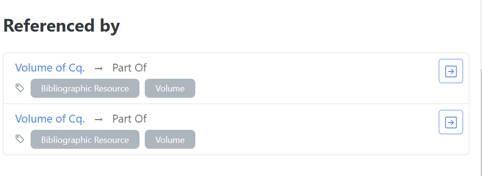

## La Novitade

### Meta

* Cache per entità già importate nel processo di merge. Testato.  Non è bastato.
* Aggiungi un sistema di importazione in batch al Reader di oc\_ocdm. Testato. Apparentemente questo ha risolto il problema.
* Ho creato nuovi test più completi per la procedura di test prima di apportare le modifiche, per essere certo che le modifiche non rompessero niente.
* Mi sono accorto che in nessun caso il processo si occupa di eliminare gli orfani. Per esempio, gli ar rimangono. Andranno cancellati a

### HERITRACE

* Risolto l’annoso bug che coinvolgeva le proprietà con shape multiple opzionali

* Ho reso configurabile anche il sottitolo oltre al titolo

* Aggiunta fabio:Series, chiamata Miscellany. Aggiunto fabio:Article, che è frbr:partOf una fabio:Series.

* Non cercare entità esistenti al livello di profondità 0

* Francesca mi ha chiesto l’elenco dei contenuti di un contenitore, ad esempio l’elenco di volumi di una rivista. Ho generalizzato il problema introducendo una nuova sezione Referenced by

  

* Francesca mi ha chiesto:
  * Come faccio a cancellare un’intera scheda? Boooooh
    * Aggiunta la possibilità di cancellare un’intera entità. ovviamente si può ripristinare tramite la macchina del tempo
  * Come sono ordinate le schede nel catalogo? Boooooh

    ```yaml
      - class: "http://purl.org/spar/fabio/JournalArticle"
        priority: 1
        shouldBeDisplayed: true
        displayName: "Journal Article"
        displayProperties:
          - *type_property
          - *identifier_property
          - *title_property
          - *abstract_property
          - *keyword_property
          - *document_context_property
          - *publication_date_property
          - *embodiment_property
          - *issue_volume_journal_container_property
        sortableBy:
          - property: "http://purl.org/dc/terms/title"
            sortOrder: ["asc", "desc"]
          - property: "http://prismstandard.org/namespaces/basic/2.0/publicationDate" 
            sortOrder: ["desc", "asc"]
          - property: "http://purl.org/spar/pro/isDocumentContextFor"
            shape: "http://schema.org/AuthorShape"
            sortOrder: ["asc", "desc"]
    ```

    * Rifatto tutto il catalogo con React in modo da in maniera asincrona l’aggiornamento dei dati nel momento in cui si usano i controlli (ordine, paginazione, per page)
    * L’ordine sfrutta shacl per mostrare icone personalizzate (A-Z per stringhe, Oldest first per date, Low-High High-Low per numeri). In assenza di proprietà di ordinamento l’ordine è per URI.

* Ask for more results
  * ORDER BY DESC(?scoreValue) ASC(?entity)
