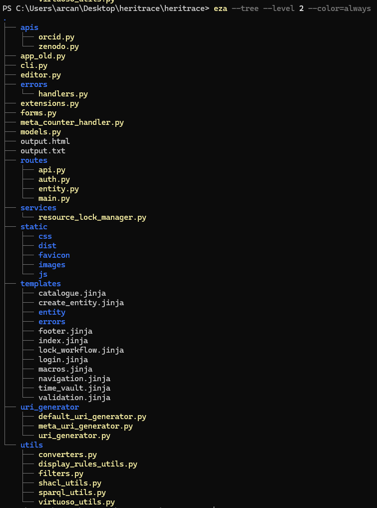

### Meta

* Controlli sugli id fusi (dati, provenance e triplestore) superati con successo
* Il software per controllare i risultati della fusione delle risorse bibliografiche (dati, provenance e database) era troppo lento poiché apriva e chiudeva un file per ogni entità. Ho ottimizzato lo script raggruppando le entità per file, così da aprire e chiudere ciascun file una sola volta. Questo ha ridotto il tempo di esecuzione dei controlli da svariati giorni a poco più di un'ora.
* [https://github.com/opencitations/oc\_meta/issues/37](https://github.com/opencitations/oc_meta/issues/37)

### HERITRACE

* Sono tristissimo. Ho provato a riscrivere /about come component React ma si è rivelata un impresa titanica. Riproverò in futuro

* Esiste un HTTP status code 423 Locked. E usiamolo allora

  ### Sistema di Locking per la Modifica delle Risorse

  

  * **Verifica preliminare**
    * All'avvio della modifica, il sistema controlla se la risorsa è già in uso
    * Se la risorsa è bloccata, viene mostrato un messaggio con il nome dell'utente che la sta modificando
  * **Acquisizione del lock**
    * Se la risorsa è disponibile, viene acquisito un lock temporaneo (5 minuti)
    * Il lock contiene informazioni sull'utente e il timestamp
    * Solo dopo l'acquisizione del lock l'interfaccia entra in modalità modifica
  * **Mantenimento del lock**
    * Il sistema rinnova automaticamente il lock ogni 4 minuti
    * Se il rinnovo fallisce (lock perso), l'utente viene avvisato e forzato ad uscire dalla modalità modifica
    * La sessione di modifica viene terminata automaticamente dopo 5 minuti di inattività
  * **Rilascio del lock**
    * Il lock viene rilasciato automaticamente in questi casi:
      * L'utente esce esplicitamente dalla modalità modifica
      * L'utente chiude la finestra/tab del browser
      * La sessione scade per inattività
    * Prima del rilascio, in presenza di modifiche non salvate, viene chiesta conferma all'utente
  * **Persistenza**
    * I lock vengono gestiti tramite Redis con chiavi temporanee
    * Ogni lock è associato univocamente alla risorsa tramite il suo URI
    * Il sistema garantisce la pulizia automatica dei lock scaduti

* Il backend era contenuto in un unico file [app.py](http://app.py) di oltre 4.000 righe, rendendolo difficile da leggere e mantenere. L'ho riorganizzato utilizzando i blueprint di Flask: le diverse componenti del backend sono ora registrate come blueprint separati. Ad esempio, ci sono blueprint dedicati per le route delle entità, per l'API, per la gestione degli errori, per l'autenticazione e per le route principali dell'applicazione come l'indice. Inoltre, ho raggruppato le funzioni accessorie in utility separate per la gestione delle regole di visualizzazione, dei filtri, di shacl, SPARQL e Virtuoso.

  

  

* Le proprietà modificate nella lista delle modifiche, sia nella linea del tempo che nella versione di una singola entità, seguono ora lo stesso ordine specificato nelle regole di visualizzazione, mantenendo così la coerenza con tutte le altre visualizzazioni dell'entità.

* Ho risolto un bug nel ripristino delle versioni delle entità cancellate. In precedenza, quando si ripristinava un'entità cancellata, il sistema cercava le entità correlate nel dataset corrente anziché nella provenance. Questo causava la ricreazione da zero di tutte le entità correlate, anche quando erano ancora presenti (ad esempio, nel caso di orfani non cancellati). La soluzione sfrutta ora la provenance, che contiene già le informazioni sulle entità correlate in ogni temporalità. Il sistema controlla lo stato attuale di queste entità nel dataset in modo diretto, senza ricorsione, poiché quest'ultima è già stata gestita dalla time-agnostic library.

* Dopo aver gestito le entità orfane, ho identificato un caso particolare: i role in time. Pur non essendo tecnicamente orfani, ha senso eliminarli. La soluzione deriva dal fatto che trattiamo questi ruoli come "intermediate relation" nel sistema, ovvero come proxy tra due entità. Non siamo interessati al proxy in sé, ma alle entità che collega. Quindi, se un'entità viene classificata come proxy (intermediate relation), non ha senso mantenerla quando viene cancellata una delle entità agli estremi della relazione, che sia la risorsa bibliografica o l'agente. Nel sistema di controllo degli orfani, queste entità vengono gestite come le entità orfane, con le stesse opzioni configurabili: richiesta all'utente se cancellare o mantenere, cancellazione automatica o mantenimento automatico.

### oc\_ocdm

### time-agnostic-library

## Domande

* Sto riflettendo su un limite di HERITRACE che difficilmente può essere superato. Attualmente permettiamo di definire query SPARQL per ottenere nomi leggibili delle entità invece degli URI. Quando questo viene applicato alle versioni storiche, incluse le entità cancellate, ricostruiamo anche le entità correlate, consentendo query SPARQL che includono informazioni sugli oggetti e sui loro oggetti correlati. Tuttavia, non è possibile eseguire query SPARQL che coinvolgano i soggetti, cioè le entità che hanno come soggetto l'entità principale. Per esempio, non possiamo fare una query SPARQL nel passato che restituisca "pagina 50-74 di Open Citations Meta", perché OpenCitations Meta si riferisce al soggetto della manifestazione. Mentre ha senso ricostruire ricorsivamente le entità correlate (oggetti e oggetti di oggetti) nella Time-Agnostic Library, la gestione dei soggetti è più problematica: trovare le entità che fanno riferimento a quella principale nel dataset corrente è semplice, ma cercarle nella provenance è complesso e richiederebbe troppe risorse solo per ottenere un nome leggibile. Mi chiedo quindi se sia meglio mantenere questa limitazione o trovare un modo per superarla.
