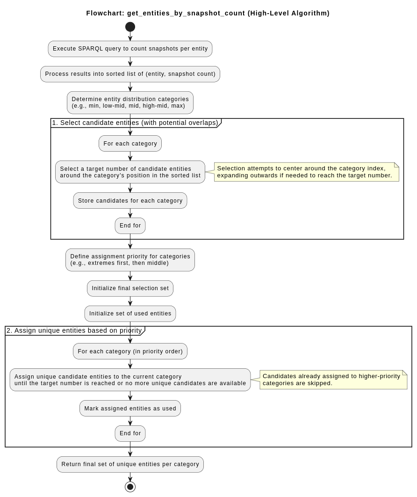

# La Novitade

## Virtuoso Utilities

### Bulk load

* Come funziona? [https://vos.openlinksw.com/owiki/wiki/VOS/VirtBulkRDFLoaderScript](https://vos.openlinksw.com/owiki/wiki/VOS/VirtBulkRDFLoaderScript)

  1. **Blocco globale**. La procedura rdf\_loader\_run utilizza una tabella chiamata ldlock con un'unica riga. Prima di tentare di ottenere un batch di file da caricare, esegue un SELECT id INTO xx FROM ldlock WHERE id = 0 FOR UPDATE. Questo FOR UPDATE acquisisce un lock esclusivo su quella riga. Poiché c'è solo una riga, questo agisce di fatto come un mutex globale per la fase di acquisizione del lavoro. Solo un processo rdf\_loader\_run alla volta può superare questo punto e procedere a chiamare ld\_array. Tutti gli altri processi paralleli rimarranno in attesa su questo lock.
  2. Blocco sulla Coda (LOAD\_LIST in ld\_array): La procedura ld\_array, chiamata subito dopo aver acquisito il lock su ldlock, esegue un SELECT TOP 100 ... FROM DB.DBA.LOAD\_LIST WHERE LL\_STATE = 0 FOR UPDATE. Anche qui, il FOR UPDATE acquisisce lock esclusivi sulle righe selezionate dalla tabella LOAD\_LIST per evitare che altri processi prendano gli stessi file.
  3. Serializzazione Intrinseca. La combinazione del lock globale su ldlock e dei lock sulle righe in LOAD\_LIST all'interno di ld\_array introduce significativi punti di serializzazione e contesa nel meccanismo di distribuzione del lavoro. Sebbene più processi rdf\_loader\_run possano essere avviati in parallelo, solo uno alla volta può effettivamente superare il lock su ldlock e acquisire un batch di file da LOAD\_LIST. Gli altri rimangono in attesa (Locks are held for a long time). Questo limita drasticamente il parallelismo effettivo nella fase cruciale di assegnazione del lavoro.
  4. Deadlock. Il deadlock (40001) gestito esplicitamente nel codice rdf\_loader\_run si verifica probabilmente quando più processi sono in attesa l'uno dell'altro per questi lock (su ldlock o su LOAD\_LIST), magari in combinazione con altri lock acquisiti durante il commit/rollback delle transazioni parziali. Il gestore di deadlock semplicemente fa un rollback e ritenta, ma non risolve la causa sottostante della contesa.
  5. Caricamento Effettivo (ld\_file). Il caricamento vero e proprio del file (tramite TTLP o RDF\_LOAD\_RDFXML) avviene solo dopo che un processo ha superato con successo entrambi i punti di blocco e ha ottenuto un batch di file. La contesa qui è possibile (sugli indici RDF), ma il problema principale sembra essere la contesa prima di arrivare a questo punto.

  * Il problema potrebbe derivare dall'elevato numero di file rdf di piccole dimensioni, che richiede quindi una frequente distribuzione del lavoro. Si potrebbe ottimizzare la procedura di esportazione in nquads per limitare il numero finale di file? No, perché ld\_array limita comunque a 2MB le dimensioni del batch, quindi paradossalmente caricherei un solo file alla volta e peggiorerei la sitazione.
  * Idea! Ignorare totalmente la funzionalità di Virtuoso per "semplificare" la vita tenendo traccia dei file da caricare in un'unica tabella e implementare la stessa funzione in Python
    * Utilizzare sempre TTLP per caricare i dati direttamente nelle tabelle di Virtuoso bypassando SPARQL ([https://docs.openlinksw.com/virtuoso/fn\_ttlp/](https://docs.openlinksw.com/virtuoso/fn_ttlp/))
    * Lanciare TTLP in multiprocessing dopo aver disattivato i checkpoint e i log, come già faceva lo script ufficiale di Virtuoso\
      \- Aspettare che tutti i processi abbiano terminato\
      \- Effettuare un checkpoint manuale e riabilitare i checkpoint automatici e i log
    * Risultati preliminari promettenti, 16 ore previste per caricare tutta la provenance. Problema: con 9 worker Virtuoso crasha dopo pochi minuti. Diminuiamo il numero di worker a 2. 30 ore previste, 5 milioni di triple al minuto (con lo script di virtuoso erano molto meno di 1 milione al minuto in realtà, dato che in una notte ne ha caricate 30 milioni essendo di fatto inutilizzabile).
    * Stranamente, anche così vedo il log \* Monitor: Locks are held for a long time, quindi la tabella ldlock non era l'unico problema
    * ... E dopo 3 giorni pieni di elucubrazioni e tentativi di far funzionare la parallelizzazione falliti mi sono accorto di una scomoda e semplice verità: IL CARICAMENTO SERIALE È UNA FOTTUTA SCHEGGIA
      * In meno di un minuto ha fatto quando il caricamento parallelo col problema dei lock in 24 ore
      * Ho riprovato su ServerGrosso e niente, è tornato lento, finché non mi sono accorto che sul mio PC avevo usato file compressi, su ServerGrosso file .nq. Una volta compressi i file anche su ServerGrosso sono riuscito a ottenere le stesse prestazioni.
      * Perché il bulk loader di Virtuoso funziona meglio con file compressi? Non ne ho idea, ma ho qualche ipotesi. Secondo me i file compressi introducono una latenza che lascia a Virtuoso un po' di agio per gestire tutto l'ambaradam.
      * L'ambaradam sarebbe:
        * Spostare i dati dai cosiddetti "buffer sporchi" ai buffer (sempre in RAM) e infine mapparli sulle pagine del database (sul disco). Se il numero di scritture è troppo elevato rispetto alla velocità di Virtuoso di fare queste operazioni il sistema va in sovraccarico e nel migliore dei casi impose un rallentamento artificiale, nel peggiore crasha. Il rallentamento artificiale di Virtuoso è più invasivo della leggera latenza introdotta dalla necessità di decomprimere i file.
* Ho aggiornato lo script per obbligare l'uso di file nq.gz e e usare unicamente il single process.
* Bulk load fatto, qualche dato
  * 7,544,653,255 di quadruple
  * 1,307,782,669 di snapshot
  * Il database pesa 703G
  * Ci ha messo 5 giorni, 4 ore, 43 minuti e 40 secondi
* Dopodiché ho perso tutto, perché a quanto pare bisogna fare un checkpoint manuale dopo aver fatto un bulk load, perché il bulk load disattiva alcuni mettanismi acidi di Virtuoso per aumentare la velocità dell'importazione.
* Interestingly, dopo aver rilanciato il bulk load con MaxCheckpointRemap a 1/4 del peso del database considerando che ogni pagina sono 8k, le dimensioni finali del database non sono cambiate. Questo è buono, appunto perché MaxCheckpointRemap non si può conoscere fin dall'inizio.
* Ora lo script per lanciare Virtuoso modifica anche automaticamente i valori di MaxCheckpointRemap per impostarli a 1/4 del peso totale del database misurato in pagine da 8K. Nel caso il database non esista si può dare una stima delle dimensioni con il parametro estimated\_db\_size\_gb, in base al quale verranno impostati MaxCheckpointRemap

### HERITRACE

#### Primary source

* La primary source di default veniva usata sempre, non solo per le risorse iniziali.
  * Interfaccia per richiedere la primary source a ogni creazione di una nuova entità. È opzionale.
  * Viene suggerita la primary source presente nel file di configurazione inizialmente, preformattata, dopodiché è possibile salvare un nuovo default (nel Redis)
  * Query a Zenodo con debounce per formattazione automatica
* Stesso discorso anche per la pagina di modifica. In caso di orfani compare prima l'alert degli orfani e poi quello della primary source. Lo trovo un po' frustrante.
* Per le risorse simili, ho aggiunto il pulsante Load more (quindi logica di offset e paginazione).
  * Non ha senso che ci sia per le Similar resources e non per le linked resources, però...
  * L'ho aggiunto anche per linked resources, che ho ribattezzato "Resources Referencing This", per non confondermi con i link uscenti.
  * N.B. Sia le references che le similar resource vengono caricate in maniera asincrona, rendendo più veloce il caricamento iniziale della pagina
  * Coma fare a capire se ci sono altre risorse e mostrare il pulsante Load more senza fare un count e di fatto trovandole tutte ogni volta?
    * Idea: cercarne il numero richiesto + 1. Se c'è quel + 1 allora viene mostrato il pulsante Load more.

#### La pazza sgravazione

* Nuovo sistema pazzo sgravato per definire la logica secondo cui due entità sono simili

```yaml
common_similarity_properties:
  title_identifier_or: &title_identifier_or
    # Se non dico niente è un OR
    - "http://purl.org/dc/terms/title"
    - "http://purl.org/spar/datacite/hasIdentifier"
  sequence_identifier_and_container_and: &sequence_identifier_and_container_and
    # Se voglio un AND devo specificarlo
    - and:
      - "http://purl.org/spar/fabio/hasSequenceIdentifier"
      - "http://purl.org/vocab/frbr/core#partOf"
  agent_names_identifier_or: &agent_names_identifier_or
    # Anche qui di base è un OR, ma posso aggiungere un AND annidato
    - "http://xmlns.com/foaf/0.1/name"
    - and:
        - "http://xmlns.com/foaf/0.1/familyName"
        - "http://xmlns.com/foaf/0.1/givenName"
    - "http://purl.org/spar/datacite/hasIdentifier"
  identifier_value_scheme_and: &identifier_value_scheme_and
    - and:
      - "http://www.essepuntato.it/2010/06/literalreification/hasLiteralValue"
      - "http://purl.org/spar/datacite/usesIdentifierScheme"

classes:
  - class: "http://purl.org/spar/fabio/Expression"
    priority: 2
    shouldBeDisplayed: false
    displayName: "Bibliographic Resource"
    similarity_properties: *title_identifier_or
```

#### Special Issue

* Non si può fare. È certamente possibile creare due shape, una per la issue e l'altra per la special issue, ma rimane il fatto che sono due fabio:JournalIssue. Ora, Heritrace è pensato per rendere tutto opzionale, quindi anche lo shacle è opzionale. Per questo le regole di visualizzazione si basano sulle classi e non sulle shape. Basarle in maniera opzionale sulle classe e sulle shape imporrebbe un ripensamento dell'intera applicazione.

#### Le citazioni

```yaml
- class: "http://purl.org/spar/fabio/JournalArticle"
  displayProperties:
    - property: "http://www.w3.org/1999/02/22-rdf-syntax-ns#type"
      displayName: "Type"
      shouldBeDisplayed: true
      supportsSearch: false
    
    - virtual_property: "http://purl.org/spar/cito/cites"
      displayName: "Citations"
      shouldBeDisplayed: true
      implementedVia:
        class: "http://purl.org/spar/cito/Citation"
        sourceProperty: "http://purl.org/spar/cito/hasCitingEntity"
        targetProperty: "http://purl.org/spar/cito/hasCitedEntity"
    
    - virtual_property: "http://purl.org/spar/cito/isCitedBy"
      displayName: "Cited By"
      shouldBeDisplayed: true
      implementedVia:
        class: "http://purl.org/spar/cito/Citation"
        sourceProperty: "http://purl.org/spar/cito/hasCitedEntity"
        targetProperty: "http://purl.org/spar/cito/hasCitingEntity"
```

#### Bugfix

* Nella pagina di creazione di un'entità, al primo caricamento, il modulo basato sul tipo di entità selezionata non veniva generato correttamente poiché non veniva rilevata alcuna selezione. Questo problema si verificava solo quando si accedeva alla pagina tramite un link diretto; al contrario, ricaricando la pagina, la questione si risolveva automaticamente. Ho risolto il problema modificando il metodo di lettura del valore del tipo di entità selezionato, garantendo così il corretto funzionamento sia quando si accede tramite link, sia quando si naviga normalmente.
* Bottone di conferma del merge primary e non danger. Non è necessario un avviso aggiuntivo, poiché la pagina di merge rappresenta già un ulteriore passaggio che funge da conferma.
* Il bug di vecchia data, in cui l'etichetta del contenitore per issue, volume e journal appariva come "miscellany", è stato finalmente risolto. Il problema era causato dall'incapacità del sistema di trovare l'etichetta corretta per la proprietà, poiché essa era dinamica. Tuttavia, avevo già sviluppato un sistema per affrontare questo tipo di situazione, che consiste nell'assegnare etichette basate sulla forma attraverso la chiave "displayRules". Ho applicato con successo questa soluzione anche alla proprietà "part of", risolvendo così il problema.

## Time Agnostic Library

* Script per individuare le entità su cui basare il benchmark in base agli stessi principi di BEAR:
  1. Seleziona un set rappresentativo di entità da un database di provenienza basandosi sul numero di snapshot
     
  2. Cerca entità altamente dinamiche, ovvero in cui una specifica proprietà è cambiata spesso (title, hasLiteralValue). Restituisce la lista che contiene gli URI delle entità con il maggior numero di modifiche registrate per la proprietà specificata.

## Umanistica Digitale

* ~~Europeana non rilevante, Omega e Semantic Mediawiki già fatto~~
* ~~si può estendere la tabella con Arco di Aldo e Valentina~~
* ~~non è un paper extended di Spampinato. Riferimento all'articolo spampinato. È a me stesso nel convegno con doi di arxiv.~~
* ~~c'è bisogno della sezione 2.1 per rispondere a Paolo Manghi. Dire che il reviewer sopra ha detto che manca roba.~~
* ~~La discussione riprende per aggiungete HERITRACE, che lì non c'è.~~
* ~~per le immagini, lasciare la navigazione solo nel primo. Provare a stampare~~

## Domande

* Una delle attività previste per il never-ending super massive UnaEuropa black workshop hole è la pubblicazione di un conference proceeding su UnaEuropa Culturale Heritage Series ([https://doi.org/10.60923/uech2024-1](https://doi.org/10.60923/uech2024-1)). Io parlerò di HERITRACE, ma non vorrei bruciarmi altri articoli o ripetere cose già dette in quelli già pubblicat. Come posso fare?
