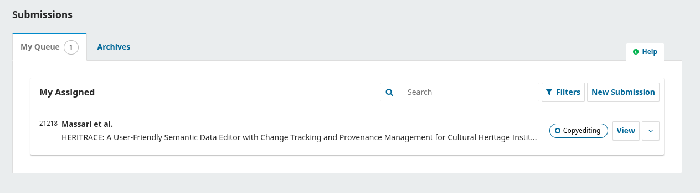

# La Novitade

## Meta

* Ho aggiornato il README per Übermensch e per me stesso, perché ogni volta faccio fatica a ricordare i vari passaggi. Ora viene documentato precisamente cosa fare per produrre Meta, quindi
  1. Workflow di Meta
     1. Preprocess input: rimuove i duplicati dall'input, filtra entità che esistono già in REDIS (tutti gli id presenti), separa i file di input troppo grossi in unità più piccole
     2. Processo principale di Meta
     3. Come caricare manualmente le novità sul triplestore nel caso in cui qualcosa andasse storto durante il processo di Meta
  2. Come testare
  3. Come rilasciare una release (commit semantici)
* Aggiornato il workflow per usare solo triplestore per dati e procenance. I dati non vengono più salvati su file
* Tolto il parametro rdf\_output\_in\_chunks, mantenuto output\_rdf\_dir. Nuovo parametro generate\_rdf\_output di default a True.
  * Viene usato anche dal MetaEditor e dallo script per controllare i risultati di Meta
* Nuovo parametro triplestore\_provenance\_url che fa da contraltare a triplestore\_url
* Aggiornati i test per controllare i risultati sui triplestore e non sui file
* Problema: come si fa con i CSV? In passato venivano generati da zero ogni volta a partire dall'RDF, ma ora l'RDF non c'è più
  * Soluzione: aggiungere i nuovi CSV a quelli storici precedentemente generati. Nuovo script di disambiguazione. Se un record esiste già lo sovrascrive con quello nuovo. Se si escludono a priori le entità preesistenti quest'ultimo caso non si verifica mai.
* Ho creato l'indice testuale del db di provenance. Pessima idea
  * 83ore
  * Da 800G a 1.1T
* Per processare 1 file da 3000 righe Meta ha impiegato 40 minuti. Non è possibile, dev'esserci un bug
  * Il passaggio problematico è il recupero delle informazioni sull'albero issue/volume/journal. Questo è l'unico caso in cui faccio una query al di fuori delle query iniziali per salvare tutte le informazioni nel grafo locale. Si tratta di un CONSTRUCT. Vuoi vedere che i CONSTRUCT sono lenti su Virtuoso?
  * Ho convertito la query da CONSTRUCT a SELECT, ma senza miglioramenti significativi.
  * Ho convertito la transitive closure + in una query con UNION sempre con un SELECT
  * Una cosa che ho notato è che Virtuoso rallenta progressivamente se gli si fanno query di seguito troppo in fretta. È come se avesse una protezione anti ddos. Le prima 350 query le fa in pochi secondi, dopodiché impiega un secondo a query e poi progressivamente sempre di più. Non mi è chiaro e non trovo documentazione esplicita su come fare a disabilitare questo blocco.
  * La soluzione più ovvia è stata quindi raccogliere le informazioni su volumi e issue a partire dalle venue in batch all'inizio come già facevamo in caso di campo id vuoto. Ora viene fatto sempre.
    * Un miglioramento involontario ma conseguente è che adesso in RAM c'è un albero di issue volume venue minimo e non completo, sufficiente alla disambiguazione.
    * Avrei potuto fare di meglio, tipo trovando anche gli id delle venue in batch e poi anche volumi e issue pure in batch, ma già così siamo passati da oltre un'ora a file a massimo cinque minuti.

### Preprocess

* Ho esteso lo script per utilizzare opzionalmente uno SPARQL endpoint oltre a un Redis per verificare l'esistenza di un'entità, poiché il Redis non so mai dove sta ed è scomodo cambiare ambiente ogni volta per questa operazione.

#### Jalc

```
Processing Report:
==================================================
Storage type used: SPARQL
Total input files processed: 1054
Total input rows: 345220
Rows discarded (duplicates): 3225
Rows discarded (existing IDs): 341313
Rows written to output: 682
```

#### Crossref

```
Processing Report:
==================================================
Storage type used: SPARQL
Total input files processed: 1628
Total input rows: 53719658
Rows discarded (duplicates): 3277876
Rows discarded (existing IDs): 48042992
Rows written to output: 2398790

Percentages:
Duplicate rows: 6.1%
Existing IDs: 89.4%
Processed rows: 4.5%
```

### Check results

* Esteso il controllo dei risultati per controllare anche la provenance su database:
  1. Esistenza di almeno uno snapshot associato all'entità (prov:specializationOf)
  2. Attributi obbligatori dello snapshot

## Virtuoso Utilities

### Launch Virtuoso

* Rimossi parametri che non andrebbero mai cambiati per semplificare l'utilizzo
  * Immagine di Virtuoso
  * Versione di Virtuoso
  * Posizione del database all'interno del container
  * numero massimo di righe per il ritorno dei CONSTRUCT

### Rebuild full text index

* Nuovo script per ricostruire l'indice testuale di Virtuoso

### Download quadstore

Caricamento su Pipy così si può installare globalmente con pipx e usare come una utility di sistema

## HERITRACE

* Shape gestite anche nel catalogo, about, entity-history, entity-version e time-vault
  * Ho fatto la prova del nome mettendo solo shape nelle regole di visualizzazione e mai classi e ora funziona tutto
  * Ma la vera follia è stata mostrare separatamente le classi con shape diverse nel catalogo, perché l'unico modo per capire che due entità con la stessa classe hanno shape diverse è guardare i predicati. Per farlo ho creato un indice che viene creato solo una volta all'avvio dell'applicazione con tutte le classi che hanno shape multiple. A quel punto, solo per queste classi, recuperiamo anche i predicati e applichiamo l'euristica per assegnare le shape. Ovviamente poi il componente react deve selezionare le classi basandosi sia sulla classe che sulla shape.
* Mi ero scordato di aggiungere la selezione della primary source per i merge.
* Ho aggiunto un meccanismo di retry centralizzato per tutte le query SPARQL (una sotto classe di SparqlWrapper)
* Resoconto dell'efffort per aggiungere le regole basate su classe/shape

```bash
heritrace-py3.13arcangelo@at-at:~/Desktop/repositories/heritrace$ git log --since="2025-05-10" --until="2025-05-31" --numstat | awk '{add+=$1; d
el+=$2} END {print "Aggiunte:", add, "Cancellazioni:", del}'
Aggiunte: 64586 Cancellazioni: 53746
```

* Ho rifatto la navbar perché Bootstrap ha anche rotto

### Bugfix

* Il render degli oggetti veniva fatto due volte, sia dal backend che dal frontend, Ora se ne occupa solo il backend
* Stavo continuando a pre-calcolare le risorse collegate nel backend, risorse che poi venivano passate come argomento all'api che blocca le risorse in fase di modifica. Ora anche quell'operazione è asincrona. Sfruttiamo data di jQuery per salvare nel container se le risorse sono già state caricate o no. Se no aspettiamo. No timeout
  * Non dovrebbero comunque esserci problemi perché per quanto l'utente clicca su modifica è ragionevole pensare che il database abbia già restituito le prima cinque risorse collegate

## Time Agnostic Library

* Finora related\_entities\_history in AgnosticEntity permetteva di individuare ricorsivamente entità oggetto collegate ed entità fuse collegate.
* BREAKING CHANGE: parametri distinti include\_related\_objects, include\_merged\_entities, include\_reverse\_relations sia per distinguere i vari comportamenti, sia per aggiungere ricorsivamente le entità che hanno quella corrente come oggetto.
* Servono 3 parametri separati per ragioni di efficienza in contesti diversi. Non ha sempre senso recuperare tutto.
* Ho rimosso la funzionalità di cache che è contorta, obsoleta, poco funzionale, e da ripensare
* Non c'è bisogno di adottare un parser custom per evitare il lock usando rdflib, perché rdflib ha risolto il problema nella versione 7.0.0 [https://github.com/RDFLib/rdflib/pull/2267](https://github.com/RDFLib/rdflib/pull/2267). Ho eliminato tutti i lock da time-agnostic-library e i test continuano a passare. Molto bene!
  * Le conseguenze
    * Aggiornare oc\_ocdm
      * pyshacl = "^0.30.1" (che dipende da rdflib). È compatibile con Python>3.9, quindi oc\_ocdm non è più compatibile con Python 3.7 e 3.8.
      * Con l'occasione ho aggiunto il workflow di release automatica a oc\_ocdm + virtuoso con docker per i test
    * Aggiornare rdflib\_ocdm
    * Ovviamente aggiornare HERITRACE. Ora, purtroppo non ho un benchmark per misurare il prima e il dopo, ma io una differenza sensibile nel caricamento delle pagine l'ho notata. Purtroppo però non è bastato a risolvere il problema del Time Vault, che rimane lentissimo ad aprirsi

## rdlib\_ocdm

* Rimossa dipendenza inutile da time-agnostic-library
* Aggiunta copertura per redis counter handler e reader

## Umanistica Digitale



## Digital Scholarship in the Humanities


