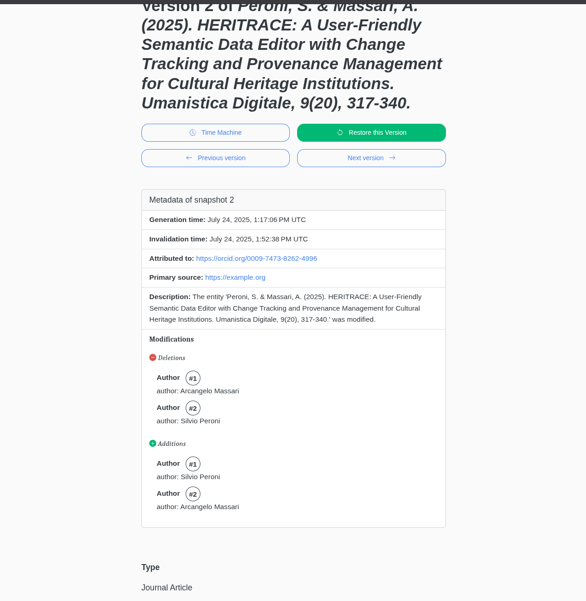

# La Novitade

## HERITRACE

### 12 fattori

* Ora HERITRACE si può configurare solo tramite variabili d'ambiente e non più tramite file config.py, che viene invece utilizzato internamente per le reflections.

```
ORPHAN_HANDLING_STRATEGY=ASK
PROXY_HANDLING_STRATEGY=ASK

COUNTER_HANDLER_CLASS=default_components.meta_counter_handler.MetaCounterHandler
URI_GENERATOR_CLASS=default_components.meta_uri_generator.MetaURIGenerator
```

## Feat

* Ho reso più sofisticato l'info box che riassume le modifiche fatte in un determinato snapshot in maniera tale da evidenziare meglio il cambio di ordine di proprietà ordinate o in generale l'ordine di proprietà ordinate anche considerando l'eventualità di avere proprietà ordinate che hanno come oggetti differenti shape o in generale avere differenti catene di proprietà ordinate Adesso viene mostrato un beige di fianco a una proprietà ordinata che mostra l'ordine all'interno della catena.
  

## Bugfix

* Non stavo ancora gestendo il caso in cui devo recuperare l'etichetta associata a un predicato che appartiene a un'entità che ha molteplici predicati identici, i quali però hanno come oggetti shape diverse. Il nostro caso è quello di autori publisher editor. Per farlo ho reso più sofisticata la funzione che già calcolava il miglior match per una shape a partire dalle triple di un'entità in maniera tale che non consideri soltanto la classe e i predicati ma anche, se presente, il valore di sh:hasValue, ovvero un valore obbligatorio per una determinata shape che assume la priorità massima per determinare il match rispetto ai predicati e alle classi.
* Le entità proxy devono essere saltate non solo nella direzione dell'arco, ma anche in quella opposta nella visualizzazione delle Resources Referencing This
  

## API

* Ho notato che le dipendenze di oc-api sono in un requirements.txt. Questo è pericoloso, sia perché non sono indicate le versioni delle dipendenze, sia perché non c'è alcun sistema automatico che controlli se le dipendenze sono reciprocamente compatibili. Si rischiano bug estremamente difficili da debuggare. Propongo di passare a uv per il dependency management in tutta l'infrastruttura.
* Ho notato che ramose è presente in oc-api non come dipendenza, ma come file python. No buono
* [https://github.com/opencitations/oc\_api/pull/1](https://github.com/opencitations/oc_api/pull/1)

## Domande

* Una parte molto consistente degli argomenti di cui devo parlare nella tesi di dottorato si trovano all'interno di articoli pubblicati. Ora, la domanda che mi sto ponendo è: posso essere tacciato di plagio di me stesso? Cioè, sono tenuto a porre molta attenzione nell'esprimere concetti che ho espresso altrove con altre parole? Però i concetti in sé per sé non me li posso reinventare.

> Care e cari, con ogni probabilità la seduta di Collegio per il passaggio d’anno sarà venerdì 26 Settembre 2025 alle ore 10. Manderò a inizio Settembre ufficiale convocazione e ordine del giorno, ma intanto salvate la data. Ricordo a chi ricade in questa scadenza di caricare i materiali sulla piattaforma dottorandi.unibo.it entro il 15 di Settembre e di sollecitare poi i propri supervisori per l’approvazione entro la data del Collegio. Ovviamente l’adempimento riguarda solo 38, 39, 40 ciclo in regime ordinario, quindi NON i PNRR PE (approvazione prevista per Febbraio). Dovranno quindi procedere al passaggio d’anno: 38 (compresa approvazione per tesi) Collina (Iannucci), Giagnolini (Tomasi), Mattioni (Marmo), Massari (Peroni), Schimmenti (Vitali) \[...]
> Non sarà richiesta una presentazione della attività perché il Collegio esaminerà i materiali in piattaforma. Organizzeremo invece per Febbraio 2026 una giornata di dialogo e scambio sulle ricerche individuali. Invito in particolare Dottorande/i del 40 ciclo a verificare il monte CD acquisiti rispetto alle indicazioni date nella tabella crediti dottorali online. Ricordo infine che sempre in sede di Collegio sarà necessario approvare anche i revisori degli elaborati finali per Dottorande/i del 38 ciclo in regime ordinario. Due ufficiali e due supplenti. Vi invito quindi a riflettere con i vostri supervisori sui nomi dei potenziali reviewers.

* So, la tesi deve essere pronta per il 15 settembre?
* Chi scelgo come reviewer?
