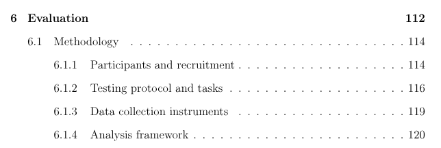
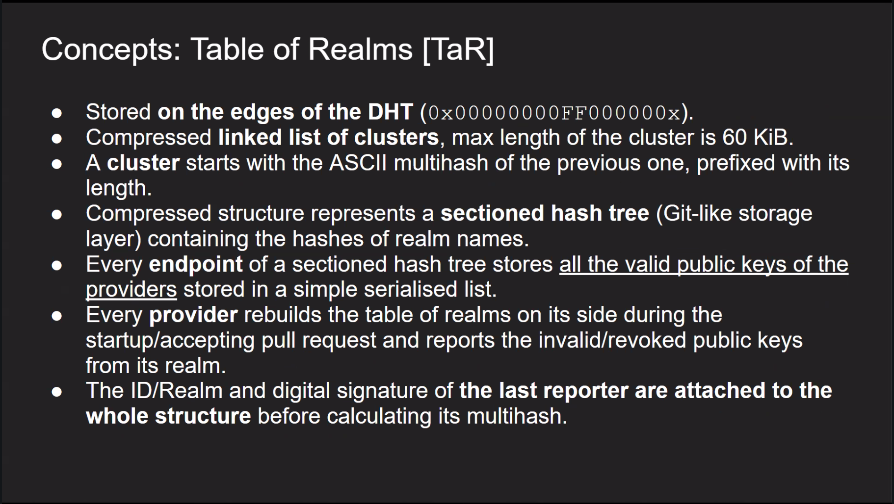
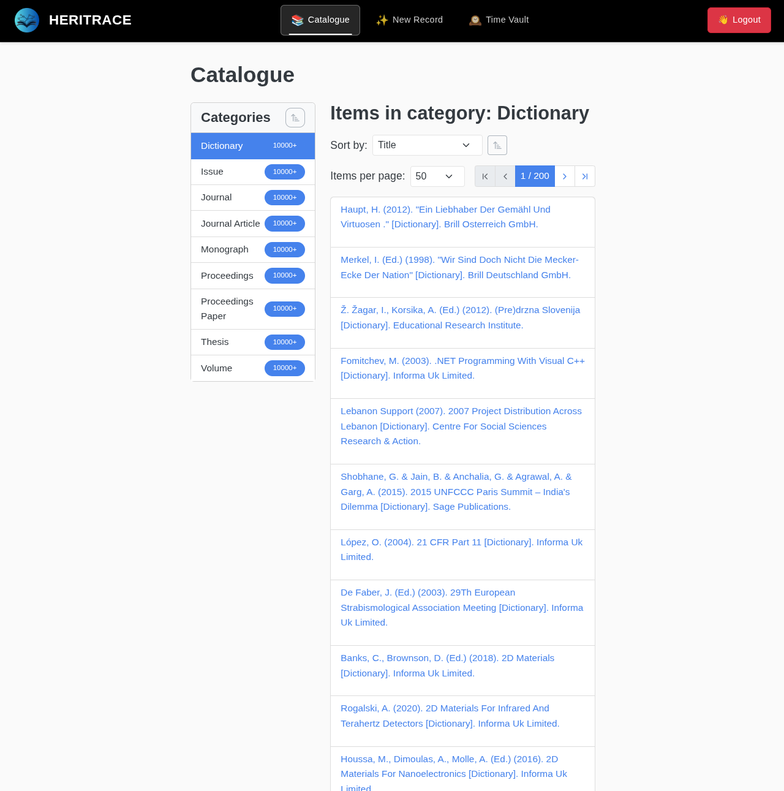

# La Novitade

## La tesi

### L'architettura


### ParaText

* Ho esteso il capitolo sui casi d'uso aggiungendo una sottosezione su Paratext dopo quella su OpenCitations Meta.
* Se OpenCitations Meta evidenzia problemi di curatela su vasta scala, Paratext mette in luce una sfida differente: la gestione di dati in domini che richiedono conoscenze altamente specialistiche. In questi contesti risulta essenziale che gli esperti di dominio possano modificare agilmente i dati senza ricorrere a un tecnico. Questa autonomia operativa, tuttavia, diventa impraticabile quando i dati sono in RDF, poiché il formato richiede competenze tecniche che gli studiosi di dominio tipicamente non possiedono, creando una dipendenza da figure intermediarie che rallenta la cura dei dati.
* Ho preso a piene mani dall'articolo scritto con Francesca, modificandone la narrativa e il punto di vista.

### Evaluation

* "Ecological validity"
  * S. Kieffer, U. B. Sangiorgi and J. Vanderdonckt, "ECOVAL: A Framework for Increasing the Ecological Validity in Usability Testing," 2015 48th Hawaii International Conference on System Sciences, Kauai, HI, USA, 2015, pp. 452-461, doi: [10.1109/HICSS.2015.61](https://doi.org/10.1109/HICSS.2015.61)


* [https://doi.org/10.5281/zenodo.17313842](https://doi.org/10.5281/zenodo.17313842)



### HERITRACE

* Ho descritto il meccanismo di configurazione delle entità simili, con la logica booleana delle proprietà che segnalano la somiglianza, e anche una sezione più di alto livello sull'interfaccia di fusione che mancava.

## dPID




## Crowdsourcing

* Ho rimosso la necessità di usare il label deposit sugli issue di deposito perché richiedeva di dare dei permessi troppo ampi a OJS. Adesso vengono identificati come issue di deposito quelli che hanno il titolo formattato con deposit spazio dominio spazio schema due punti valore letterale.
* Ora che ci penso, non abbiamo alcun sistema per distinguere le issue di test da quelle non di test all'interno del repository, se non il fatto che nei test solitamente stiamo usando localhost come dominio. perché ora come ora andremo a processare anche quelle di test un domani e a caricarle sul Zenodo normalmente. Ora se il dominio è localhost il record non viene salvato su Zenodo. Ho anche aggiunto la chiave domain ai dati caricati su Zenodo, visto che mancava.

```json
{
    "data": {
        "title": issue_title,
        "domain": domain,
        "metadata": metadata,
        "citations": citations,
    },
    "provenance": {
        "generatedAtTime": created_at,
        "wasAttributedTo": f"https://api.github.com/user/{user_id}",
        "hadPrimarySource": had_primary_source,
    }
}
```

* Ho aggiornato il token di CROCIBOT dato che sono cambiate le regole di GitHub negli ultimi tre anni e l'ultimo era stato creato tre anni fa. Adesso bisogna dare permessi espliciti per lettura e scrittura delle issue perché sono arrivati i fine grain tokens. In teoria potrei utilizzare il token di default e in questo modo risponderebbe alle issue l'account GitHub Action generico, ma no, io voglio che risponda CROCIBOT e in futuro gli vorrei anche dare una faccina.
* [https://github.com/opencitations/crowdsourcing/issues/15](https://github.com/opencitations/crowdsourcing/issues/15)
  * Ho trovato un possibile bug nel validatore, nel senso che teoricamente non dovremmo mai avere dei metadati in più. Cioè, adesso viene controllato se abbiamo dei metadati in meno, ma se ne mettiamo in più il risultato risulta comunque valido. Ad esempio, in questo caso, abbiamo una riga senza identificatori e, anzi, abbiamo più righe senza alcun identificatore e comunque la issue risulta valida, quindi alla fine processeremo anche questi metadati che però non sono coinvolti in nessuna citazione.

## HERITRACE

* Ho risolto un bug lato UI per cui un vecchio sistema di cache dei template per ogni entità che doveva servire a migliorare le performance e avere una copia dei template e dei sotto-template senza bisogno di fare query sul DOM ogni volta. Ecco quel sistema era prono ad errori e con il il nuovo sistema di caricamento asincrono dei template non abbiamo più alcun bisogno di questo ulteriore escamotage che creava più problemi che altro. Ad esempio trovavo il template sbagliato nel caso in cui c'erano più template per un identificatore e più shape per un identificatore.
* It just works

```yaml
  is_cited_by_property: &is_cited_by_property
    displayName: "Is Cited By"
    isVirtual: true
    shouldBeDisplayed: true
    fetchValueFromQuery: *citing_entity_from_value_query
    implementedVia:
      target:
        class: "http://purl.org/spar/cito/Citation"
        shape: "http://schema.org/ReverseCitationShape"
      fieldOverrides:
        "http://www.w3.org/1999/02/22-rdf-syntax-ns#type":
          shouldBeDisplayed: false
          value: "http://purl.org/spar/cito/Citation"
        "http://purl.org/spar/cito/hasCitedEntity":
          shouldBeDisplayed: false
          value: "${currentEntity}"
        "http://purl.org/spar/cito/hasCitingEntity":
          displayName: "Citing Resource"
        "http://purl.org/spar/cito/hasCitationCharacterization":
          displayName: "Citation Type"

```

* Il motivo per cui HERITRACE su OpenCitations Meta non si avviava è che provava a inizializzare i contatori su Redis. Ovviamente questa cosa non è fattibile con tutto il database di dati e provenance di Meta. Quindi ho esteso HERITRACE per consentire di aggiungere anche un database Redis con dei contatori dall'esterno e saltare in questo modo l'inizializzazione.
* risolto questo problema mi sono accorto che non si riesce ad aprire neanche il catalogo per ovvi motivi
  * Le classi vengono precaricate all'inizio o da SHACL se c'è o dalle regole di visualizzazione se non c'è SHACL è in ultima istanza dal database. Per ogni classe viene applicato un limite configurabile. Se quel limite viene superato nel catalogo viene mostrato limite+.Il default è 10,000
    
* Aggiunti anche CATALOGUE\_DEFAULT\_PER\_PAGE=5 e CATALOGUE\_ALLOWED\_PER\_PAGE=5,10,20
* Ho rimosso l'ordinamento di default per soggetto. Se l'utente non specifica alcun criterio di ordinamento nelle regole di visualizzazione, non viene applicato alcun criterio di ordinamento, perché l'ordinamento è pesantissimo in presenza di un gran numero di risorse per classe.

## Altro

* Sto imparando l'inglese, tutte le settimane il giovedì dalle 15 alle 18 fino a dicembre.
* Ho ricevuto un'email da Oxford University Press secondo cui Arcangelo ha richiesto ad Arcangelo di pagare l'articolo e dice che bisogna pagare entro 30 giorni a partire dal 10.
