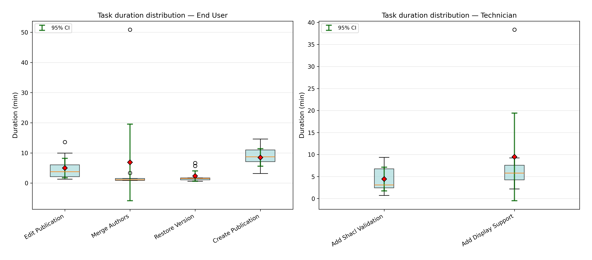
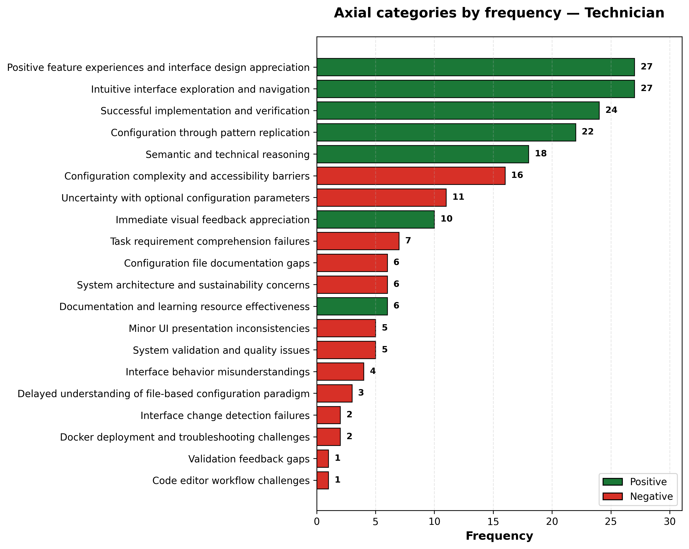
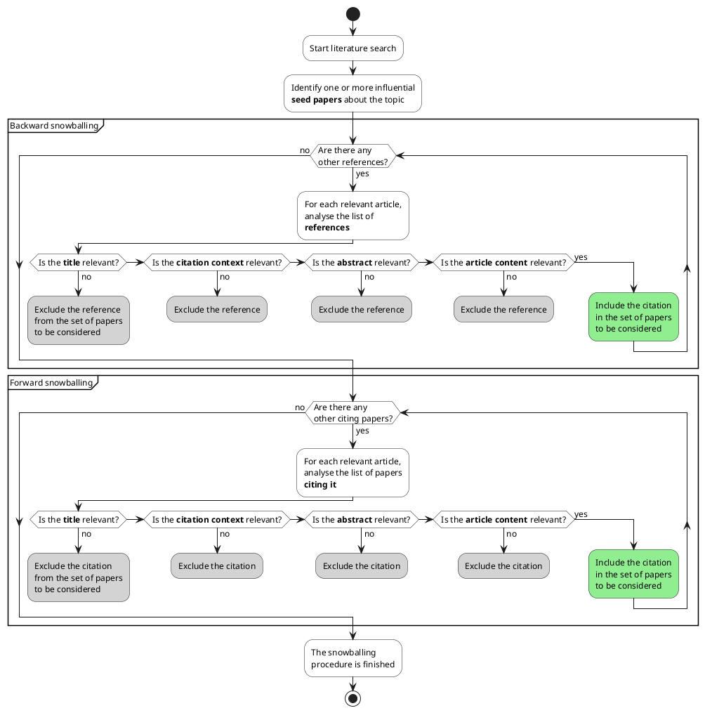

# La Novitade

## Tesi

* James Lewis e Jeff Sauro, che sono gli inventori delle sottoscale del SUS, in un articolo del 2017 hanno ritrattato l'uso delle sottoscale introdotte nel 2009 e hanno consigliato di considerare il SUS come una misura unidimensionale.
* Mi sono accorto di questo problema perché stavo cercando di capire quali range utilizzare per indicare che il risultato era stato con una buona usabilità o con una cattiva usabilità per le sottometriche e in letteratura non trovavo niente di tutto ciò, laddove invece per il SUS considerato come scala unidimensionale la letteratura è abbastanza uniforme a riguard. Dopodiché ho scoperto che semplicemente le sottometriche non vengono utilizzate.
* Lewis, J. R., & Sauro, J. (2017). Revisiting the factor structure of the System Usability Scale. *Journal of Usability Studies*, 12(4), 183-192. DOI: [10.5555/3190867.3190870](https://dl.acm.org/doi/10.5555/3190867.3190870)
  * **Le sottoscale non si ripetono negli studi successivi**: Dopo il 2009, molti ricercatori hanno provato a verificare se gli item 4 e 10 formassero davvero una sottoscala separata (Learnability), ma ogni studio ha trovato raggruppamenti diversi e contraddittori.
  * **Un campione molto grande conferma il problema**: Analizzando oltre 9000 questionari, gli autori hanno scoperto che il SUS ha effettivamente due dimensioni, ma sono quelle "sbagliate": divide semplicemente le domande formulate positivamente da quelle negative.
  * **Onestà scientifica**: Gli autori ammettono che il loro studio del 2009, pur essendo stato molto citato e influente, si è rivelato non corretto alla luce dei dati successivi.
  * **Non ci sono alternative convincenti**: Non esistono prove solide che il SUS misuri qualcosa di più complesso dell'usabilità generale. Meglio usarlo come punteggio unico piuttosto che cercare di estrarre informazioni che probabilmente non ci sono.
* Ho reso più autoesplicativa l'immagine del SUS, del box plot, evidenziando in blu scuro la linea della mediana in maniera tale che faccia più contrasto sia nel box dei tecnici che arancione che in quello degli end user che è azzurro. Poi ho aggiunto una didascalia in basso per spiegare i vari elementi del box e come vengono calcolati, oltre ovviamente a rimuovere le sottometriche.
  
* Similmente, ho cercato di rendere la distinzione tra le varie sottometriche del grafico a barre più leggibile nel caso in cui il grafico venga stampato in bianco e nero. L'ho fatto aggiungendo delle lineette diverse per ogni sottometrica e dando un bordo nero ai numeri delle percentuali per renderli più leggibili su qualunque sfondo: 
* Analisi delle durate
  * Jeff Sauro and James R. Lewis. 2010. Average task times in usability tests: what to report? In Proceedings of the SIGCHI Conference on Human Factors in Computing Systems (CHI '10). Association for Computing Machinery, New York, NY, USA, 2347–2350. [https://doi.org/10.1145/1753326.1753679](https://doi.org/10.1145/1753326.1753679)
    
  * box (scatola celeste): contiene il 50% centrale dei dati (Q3-Q1)
    * IQR piccolo: tempi concentrati, task prevedibile (restore version)
    * IQR grande: tempi dispersi, task variabile (create publication)
  * Linea arancione dentro il box: mediana
    * Mediana al centro del box = distribuzione simmetrica
    * Mediana verso il basso = coda lunga sopra (outlier alti)
    * Mediana verso l'alto = coda lunga sotto (outlier bassi)
  * Perché usare la mediana e non la media? Non influenzata da valori estremi
  * Diamante rosso (♦): media
    * Quando il diamante rosso è lontano dalla linea arancione la media non è rappresentativa.
  * Whiskers (baffi neri): mostrano il **range normale** dei dati (esclusi outlier)
    * Whisker alto si estende fino al MASSIMO valore che è  ≤ Q3 + 1.5×IQR
    * Whisker basso si estende fino al MINIMO valore che è ≥ Q1 - 1.5×IQR
    * Whiskers corti (restore version): task prevedibile
    * Whiskers lunghi (add display support): task imprevedibile
    * Perché 1,5? Perché Tukey, che introdusse il boxplot in un libro intitolato Exploratory Data Analysis nel 1977, utilizzò 1,5. Da allora è rimasta come convenzione che permette di confrontare meglio i grafici boxplot anche se studi più recenti hanno identificato sue possibili limitazioni ma è più che altro uno standard de facto,
  * Cerchietti (○): outliers. ciò che non è nella distruibuzione sopra descritta.
  * Barre verdi (I): intervallo di confidenza 95%.
    * CI 95% = media ± (t × standard error)
      * t = valore dalla distribuzione t-Student (dipende da n partecipanti e livello confidenza)
        * William Sealy Gosset (che lavorava alla Guinness con lo pseudonimo "Student") nel 1908 si chiese: "Quando ho POCHI dati (es. 9 utenti), quanto devo allargare l'intervallo di confidenza per essere sicuro al 95%?"
        * La sua risposta fu la distribuzione t.
        * Il valore t dipende da due cose:
          1. Gradi di libertà (df = degrees of freedom) df = n - 1. Perché n-1? il numero di valori che sono liberi di variare quando calcoli una statistica, ovvero tutti meno la media, per via della formula della deviazione standard, in cui per calcolare gli scarti dalla media devi prima calcolare la media, quindi quel valore non può cambiare.
             Std = √\[ Σ(xᵢ - x̄)² / (n-1) ]
          2. Livello di confidenza desiderato, ovvero 95% nel nostro caso.
             C'è una tabella da consultare: [https://en.wikipedia.org/wiki/Student%27s\_t-distribution#Table\_of\_selected\_values](https://en.wikipedia.org/wiki/Student%27s_t-distribution#Table_of_selected_values)
      * Standard Error = Std / √n (errore standard della media)
* Io sinceramente rimuoverei del tutto la stima dei tempi massimi che avevo fatto, perché è arbitraria e mi espone a delle obiezioni ovvie, come ad esempio il fatto che dato che questi numeri erano troppo alti rispetto alla durata attuale dei task io li ho scelti apposta troppo alti per non far fallire i task. Secondo me conviene fare per l'analisi quantitativa la stessa cosa che abbiamo fatto per l'analisi qualitativa, cioè lasciare che la verità emerga dai dati. Dai dati emerge che c'è molta variabilità su alcuni task e quindi sono i task sui quali lavorare di più, togliendo completamente l'informazione inutile e controproducente dei tempi massimi. Anche perché in questo modo potrei considerare come task che hanno avuto successo i task che hanno sforato i tempi massimi, semplificando anche gli istogrammi e la lettura dei risultati.
* Nuovi grafici per grounded analysis
  
  

### Grafici da rifare

Io ci farei un workshop su sta roba perché è veramente utile.

# Domande

* Devo citare gli articoli pubblicati quando un capitolo è tratto da essi. Tuttavia, io non ho mai pubblicato niente sulle time traversal queries. Di conseguenza posso anche non citare niente in quel capitolo, giusto?
