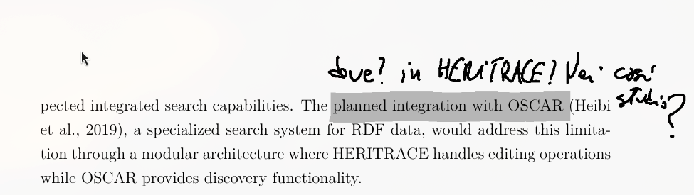
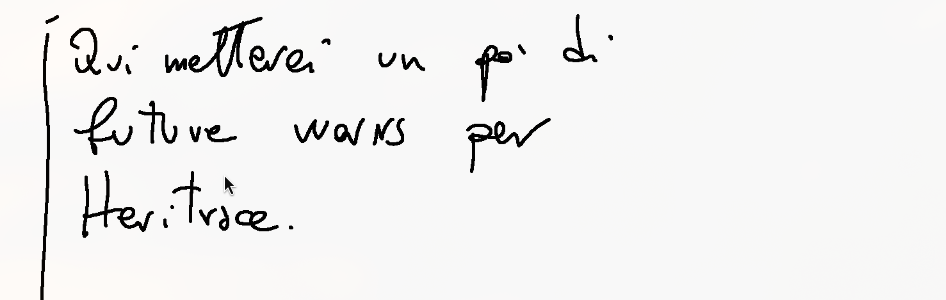

# La Novitade

## Tesi

* Perché RML e non SPARQL Anything? Due motivi:
  1. SPARQL Anything è un sistema pensato per l'accesso ai dati query-time. Non c'è un mapping persistente che può essere invertito.
  2. SPARQL Anything supporta diversi formati di dati ma non supporta nessun database compresi i database relazionali su cui è il focus dell'inversione.
     * Obiezione vostro onore! La query SPARQL Anything è il mapping!
     * No. Una query dice COSA estrarre, è selettiva. Un mapping dice COME trasformare sistematicamente tutti i dati dalla sorgente a RDF.
     * Si può usare un forno a microonde come ferma-porta? Forse sì. Ma perché farlo quando esiste il ferma-porta?

# Domande

* Anastasia
