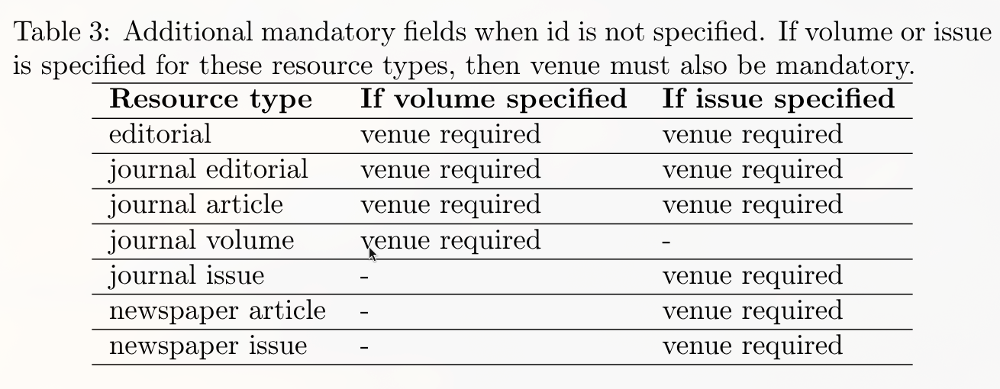

# La Novitade

## Meta

* Adesso l'aggiornamento dei file RDF per dati provenance, nonché la generazione delle query SPARQL per aggiornare i database avvengono in parallelo usando il multi-threading, trattandosi di operazioni I/O-bound non CPU intensive, che quindi verrebbero penalizzate dalla duplicazione intera della memoria necessaria per generare nuovi processi (o almeno così spero).
* Dopodiché, i database vengono aggiornati anche in questo caso in parallelo subito dopo che sono stati generati i file con le query SPARQL, senza aspettare che venga completata la modifica dei file RDF. Tutto questo deve concludersi prima che parta il processing del file CSV successivo.
* Precedentemente i file con le query SPARQL si chiamavano {timestamp\_fino\_ai\_microsecondi}*{numero\_di\_triple\_aggiunte}*{numero\_di\_triple\_tolte}.sparql. Questo potrebbe causare delle race condition nel momento in cui abbiamo due thread paralleli che generano query SPARQL, nel momento in cui due query contengono la stessa quantità di triple aggiunte tolte e sono generate nel nostro micro secondo, che è una cosa altamente probabile data la nostra dimensionalità. Di conseguenza, adesso invece del timestamp utilizzo l'MD5 della query SPARQL contenuta.
* Le tempistiche previste rimangono proibitive, si parla di oltre 3000 ore per processare il nuovo dump di Crossref. Per diagnosticare correttamente la malattia prima di elaborare una cura ho realizzato un benchmark che genera dati sintetici di input per Meta data una certa dimensionalità, ovvero il numero di righe, e misura le tempistiche per ogni singolo passaggio.
  * Il generatore di dati riceve in input un seed che poi viene passato alla funzione random di Python in maniera tale che restituisca sempre lo stesso risultato tra run diverse per renderle confrontabili, con un seed di default che è ovviamente 42.
* Su un CSV di 1000 righe l'introduzione del parallelismo sull'I/O sposta da 166s a 163s. Molto male! Il multi threading su Python è veramente una ciofeca. Proviamo col multi processing: 114s.
  * Ho dovuto rendere pickable alcuni oggetti che non lo erano in oc\_ocdm: [https://github.com/opencitations/oc\_ocdm/commit/348a88ea41d400bca425814b5db271f68c4a658a](https://github.com/opencitations/oc_ocdm/commit/348a88ea41d400bca425814b5db271f68c4a658a)
  * AbstractSet, RedisCounterHandler e SqliteCounterHandler.
    * `__getstate__`: dimmi come serializzare
      * Ad esempio, tolgo la connessione al database
    * `__setstate__`: dimmi come deserializzare
      * Ad esempio, ricreo la connessione al database
* A causa di un merge passato ci siamo ritrovati con diverse catene di ordini di autore rotti perché il sistema di merge di oc\_ocdm non gestiva e attualmente non gestisce le catene degli autori in caso di merge. Finora Meta correggeva questi casi al volo ricostruendo le catene con delle euristiche, ma i risultati sono veramente mediocri perché mi sono reso conto che ci sono diverse catene che hanno adesso autori duplicati. Quindi su quello va fatto poi un lavoro a parte, anche recuperando i metadati originali dagli articoli che sono stati corrotti. Anche per ragioni di performance ho eliminato queste correzioni al volo che vanno a rompere il principio di separazione delle responsabilità.
* Il processo effettivo di Meta tuttavia rimane lentissimo. Utilizzando Strace mi sono accorto che il processo è bloccato su una specifica risorsa di CERN Atlas che contiene quasi 3000 autori. In teoria io avevo implementato un sistema di silenziamento per l'aggiornamento degli autori, per cui se c'erano già autori preesistenti il sistema non doveva aggiornare le catene degli autori. Evidentemente c'è un bottleneck da qualche parte che non sto vedendo.
  * Ho quindi aggiornato il benchmark per sopportare il pre-caricamento, cioè un sistema per testare il recupero di entità preesistenti simulando proprio la presenza di un paper come quello di CERN Atlas.
  * I risultati hanno dimostrato buone performance anche in questo caso, non solo, ma come mi aspettavo, gli autori e comunque il record è stato processato solo alla prima run, quella di pre-caricamento, mentre alla seconda non ci sono stati nuovi aggiornamenti. C'è da dire che processare un unico record la seconda volta con 3000 autori ha richiesto 68 secondi in totale e quasi 2742MB di RAM al picco. La prima 294 secondi e sempre 2742MB. Ci sono margini di miglioramento ma comunque non ho capito perché Meta impiega ore, possibile che ci siano tanti casi come questo in ciascun file in tutti i file? C'è un problema di SWAP della RAM? Effettivamente Redis è crashato un paio di volte.
  * Mi sono accorto che la funzione di silenziamento era attiva solo per il curator e non per il creator, che riprocessava inutilmente le 3000 entità autori per poi rilevare che non c'erano differenze con la condizione preesistente. Quindi ho aggiunto la funzione di silenziamento anche al creator, che si attiva solo se la br è preesistente e conteneva già autori. Questa modifica ha portato la seconda esecuzione **da 66 secondi a 27**!
* Eppure il software in produzione continua a essere lentissimo. Comincio a sospettare che si tratti di un problema di RAM. Mario ha già aumentato la RAM dal 200 a 300 GB, ma arrivava al 93% prima e continua ad arrivare al 93% anche adesso con la memoria di swap completamente occupata. Potrebbe essere che il problema sia semplicemente il processare 10.000 righe alla volta oppure che il continuo ad avere su Redis la cache con i file con le query SPARQL già processate per i dump precedenti.

## SPARQLWrapper

* [https://github.com/RDFLib/sparqlwrapper/issues/248](https://github.com/RDFLib/sparqlwrapper/issues/248)
* La mia pezza: [https://github.com/opencitations/oc\_meta/commit/83823e66eb074698f6e2a5e7eddf29f94deb149f](https://github.com/opencitations/oc_meta/commit/83823e66eb074698f6e2a5e7eddf29f94deb149f)

## Infrastruttura

* Guide aggiornate, convertite in Starlight e aggiunta la documentazione su come documentare usando Starlight: [https://opencitations.github.io/repository\_setup\_guides/](https://opencitations.github.io/repository_setup_guides/)
* Nuova documentazione CSV: [https://github.com/opencitations/crowdsourcing/blob/main/docs/csv\_documentation-v1\_1\_2.pdf](https://github.com/opencitations/crowdsourcing/blob/main/docs/csv_documentation-v1_1_2.pdf)
  * Corrette date
  * Rimosse colonne citazioni non più supportate
  * O -> OR
  * Tabella separata per i casi in cui non c'è l'id
    
  * Ho scordato qualcosa Elia?
