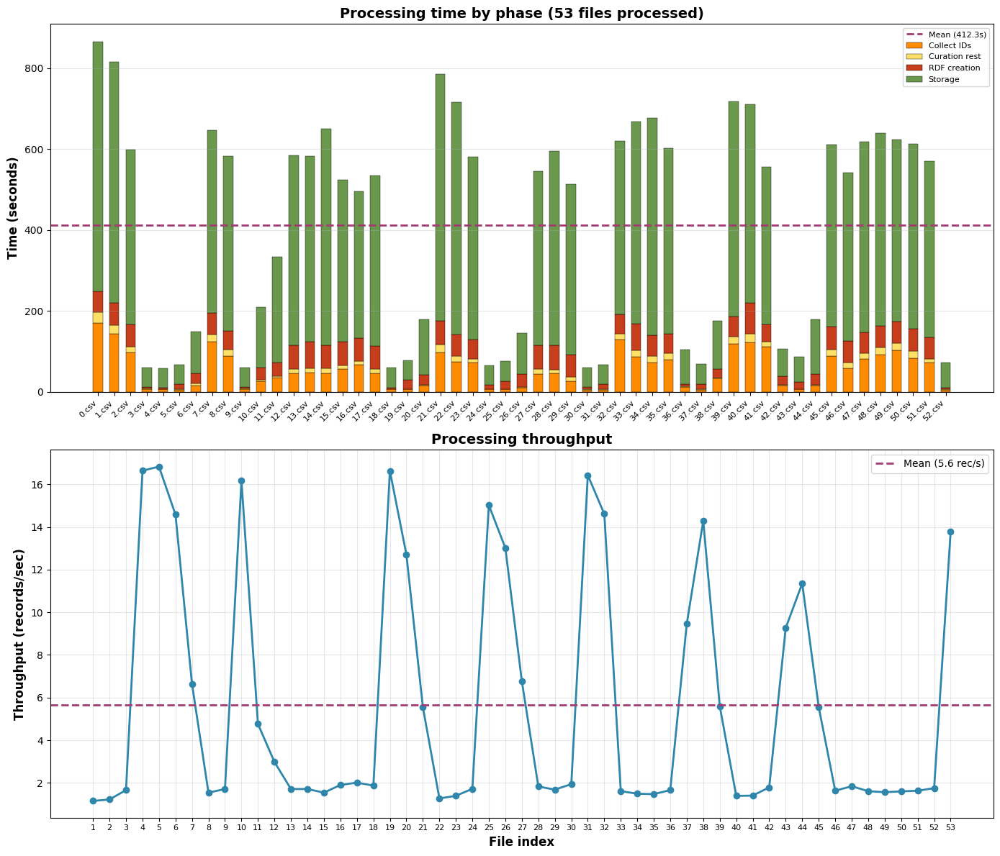
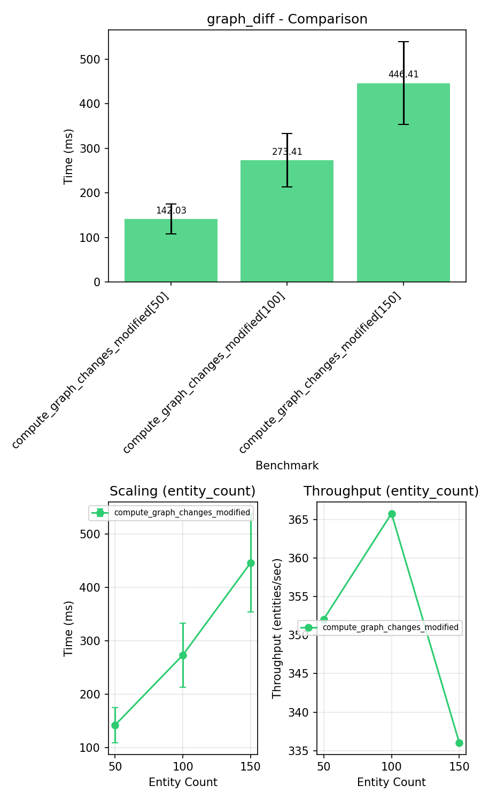
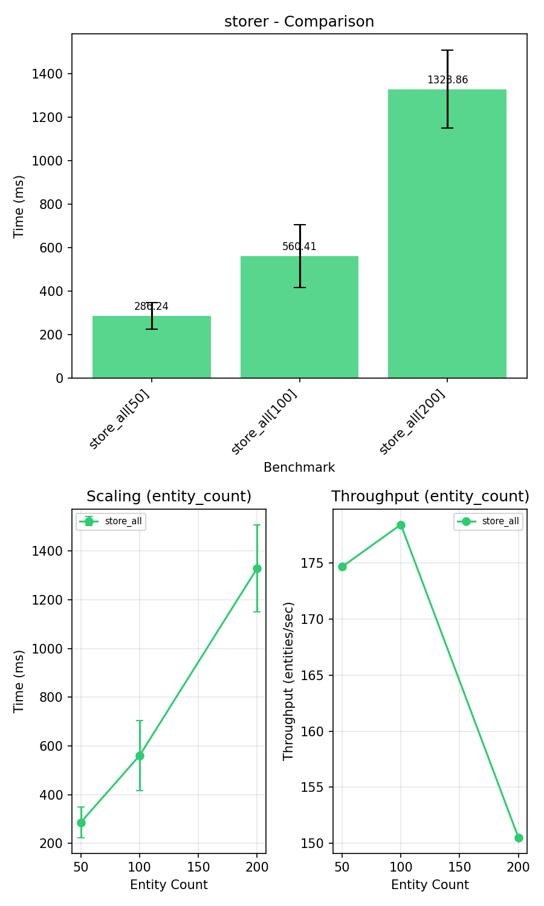
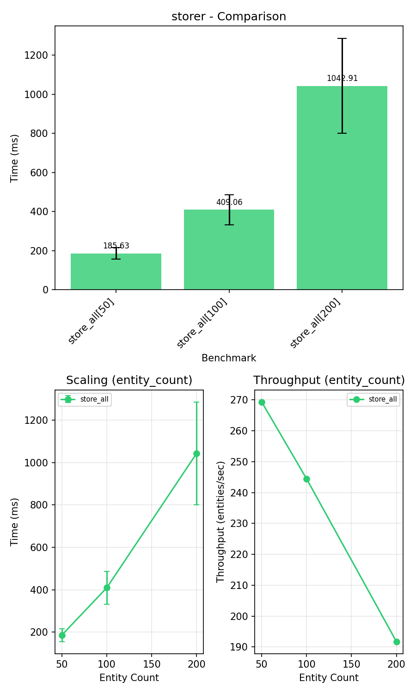
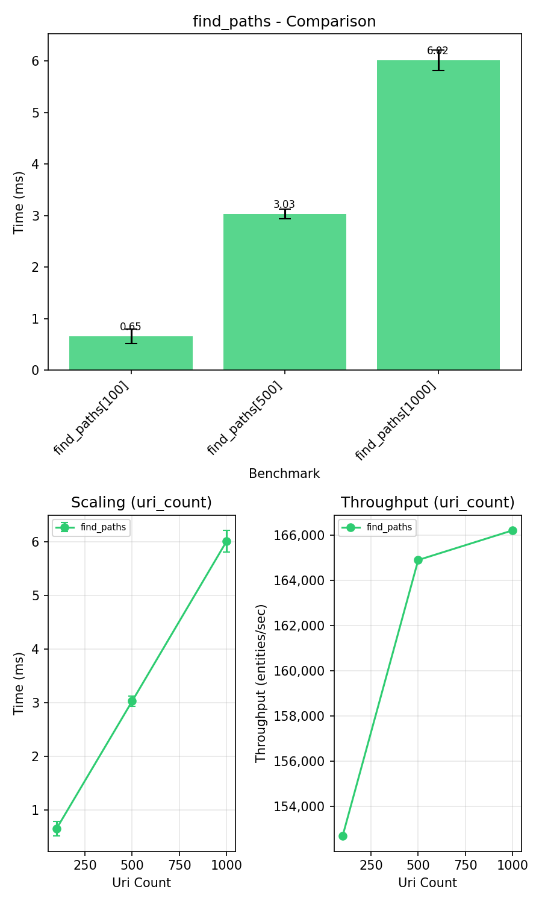
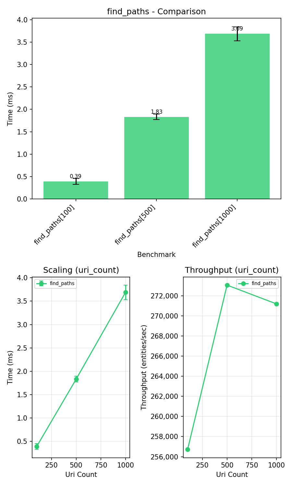

## La Novitade

## oc\_meta

Arrivato pressoché alla fine dell'ingestione di Crossref, il database dei dati è diventato inutilizzabile e ha smesso di ricevere sia query di lettura che di scrittura. Nei log ho trovato un'infinità di log, gigabyte e gigabyte di log, che segnalavano un'inconsistenza nella paginazione. L'unica spiegazione che riesco a dare è che eseguire bulk load troppo frequenti spacchi il database.

Si ricomincia d'accapo, senza bulk load.



<div style="border: 1px solid #d0d7de; border-radius: 8px; padding: 16px; margin: 8px 0; background: #ffffff; font-family: -apple-system, BlinkMacSystemFont, 'Segoe UI', Helvetica, Arial, sans-serif; color: #1f2328;">
  <div style="display: flex; align-items: center; gap: 12px; margin-bottom: 12px;">
    
    <div>
      <strong style="display: block; color: #1f2328;">arcangelo7</strong>
      <span style="font-size: 0.85em; color: #656d76;">Dec 5, 2025</span>
      <span style="font-size: 0.85em; color: #656d76;"> · </span>
      <a href="https://github.com/opencitations/oc_meta" style="font-size: 0.85em; color: #0969da; text-decoration: none;">opencitations/oc_meta</a>
    </div>
  </div>
  <div style="margin: 12px 0; color: #1f2328;">
    <p>refactor: migrate from SPARQLWrapper to sparqlite</p>

  </div>
  <div style="display: flex; justify-content: space-between; align-items: center; font-size: 0.85em;">
    <span style="font-family: monospace; color: #1a7f37; font-weight: 600;">+1233</span>
    <span style="font-family: monospace; color: #cf222e; font-weight: 600;">-1646</span>
    <a href="https://github.com/opencitations/oc_meta/commit/b0b71bd2b910d43806bc7e30494218783d61bac4" style="color: #0969da; text-decoration: none; font-weight: 500;">b0b71bd</a>
  </div>
</div>

### oc\_ocdm

[https://pytest-benchmark.readthedocs.io/en/latest/](https://pytest-benchmark.readthedocs.io/en/latest/)

<div style="border: 1px solid #d0d7de; border-radius: 8px; padding: 16px; margin: 8px 0; background: #ffffff; font-family: -apple-system, BlinkMacSystemFont, 'Segoe UI', Helvetica, Arial, sans-serif; color: #1f2328;">
  <div style="display: flex; align-items: center; gap: 12px; margin-bottom: 12px;">
    
    <div>
      <strong style="display: block; color: #1f2328;">arcangelo7</strong>
      <span style="font-size: 0.85em; color: #656d76;">Dec 3, 2025</span>
      <span style="font-size: 0.85em; color: #656d76;"> · </span>
      <a href="https://github.com/opencitations/oc_ocdm" style="font-size: 0.85em; color: #0969da; text-decoration: none;">opencitations/oc_ocdm</a>
    </div>
  </div>
  <div style="margin: 12px 0; color: #1f2328;">
    <p>feat: add benchmark infrastructure</p>
<p>Add pytest-benchmark configuration and benchmarks for
testing provenance generation, reading e writing operations.</p>

  </div>
  <div style="display: flex; justify-content: space-between; align-items: center; font-size: 0.85em;">
    <span style="font-family: monospace; color: #1a7f37; font-weight: 600;">+8252</span>
    <span style="font-family: monospace; color: #cf222e; font-weight: 600;">-12</span>
    <a href="https://github.com/opencitations/oc_ocdm/commit/e357300c25129ab7d4d3412500d881c21cb8fe5e" style="color: #0969da; text-decoration: none; font-weight: 500;">e357300</a>
  </div>
</div>

```python
class MockEntity:
    def __init__(self, current_graph, preexisting_graph):
        self.g = current_graph
        self.preexisting_graph = preexisting_graph
        self.to_be_deleted = False


class TestGraphDiff:
    @pytest.mark.benchmark(group="graph_diff")
    @pytest.mark.parametrize("entity_count", [50, 100, 150])
    def test_compute_graph_changes_modified(
        self, benchmark, redis_counter_handler, entity_count
    ):
        def setup():
            graph_set, brs = create_populated_graph_set(
                redis_counter_handler, entity_count
            )
            entities = []
            for entity in graph_set.res_to_entity.values():
                preexisting = Graph()
                for triple in entity.g:
                    preexisting.add(triple)
                mock = MockEntity(entity.g, preexisting)
                entities.append(mock)
            for i, br in enumerate(brs):
                br.has_title(f"Modified Title {i}")
            return (entities,), {}

        def compute_changes(entities):
            results = []
            for entity in entities:
                result = _compute_graph_changes(entity, "graph")
                results.append(result)
            return results

        result = benchmark.pedantic(
            compute_changes, setup=setup, rounds=BENCHMARK_ROUNDS
        )
        assert len(result) >= entity_count * 14
        entities_with_changes = sum(
            1 for to_insert, to_delete, n_added, n_removed in result
            if n_added > 0 or n_removed > 0
        )
        assert entities_with_changes == entity_count, (
            f"Expected {entity_count} entities with changes, "
            f"got {entities_with_changes}"
        )
```

Esegue il test e genera automaticamente statistiche.

Diff con grafi isomorfi: 

Diff tra set: 

<div style="border: 1px solid #d0d7de; border-radius: 8px; padding: 16px; margin: 8px 0; background: #ffffff; font-family: -apple-system, BlinkMacSystemFont, 'Segoe UI', Helvetica, Arial, sans-serif; color: #1f2328;">
  <div style="display: flex; align-items: center; gap: 12px; margin-bottom: 12px;">
    
    <div>
      <strong style="display: block; color: #1f2328;">arcangelo7</strong>
      <span style="font-size: 0.85em; color: #656d76;">Dec 4, 2025</span>
      <span style="font-size: 0.85em; color: #656d76;"> · </span>
      <a href="https://github.com/opencitations/oc_ocdm" style="font-size: 0.85em; color: #0969da; text-decoration: none;">opencitations/oc_ocdm</a>
    </div>
  </div>
  <div style="margin: 12px 0; color: #1f2328;">
    <p>fix(query_utils): replace isomorphic graph comparison with set operations [release]</p>
<p>Use simple set difference instead of to_isomorphic() and graph_diff()
for detecting changes between graphs. This is valid because OCDM never
uses blank nodes (all resources have URIs).</p>

  </div>
  <div style="display: flex; justify-content: space-between; align-items: center; font-size: 0.85em;">
    <span style="font-family: monospace; color: #1a7f37; font-weight: 600;">+429</span>
    <span style="font-family: monospace; color: #cf222e; font-weight: 600;">-1168</span>
    <a href="https://github.com/opencitations/oc_ocdm/commit/56500794eca31ca7b2a28f4a86d15b4b2c4a3713" style="color: #0969da; text-decoration: none; font-weight: 500;">5650079</a>
  </div>
</div>

<div style="border: 1px solid #d0d7de; border-radius: 8px; padding: 16px; margin: 8px 0; background: #ffffff; font-family: -apple-system, BlinkMacSystemFont, 'Segoe UI', Helvetica, Arial, sans-serif; color: #1f2328;">
  <div style="display: flex; align-items: center; gap: 12px; margin-bottom: 12px;">
    
    <div>
      <strong style="display: block; color: #1f2328;">arcangelo7</strong>
      <span style="font-size: 0.85em; color: #656d76;">Dec 4, 2025</span>
      <span style="font-size: 0.85em; color: #656d76;"> · </span>
      <a href="https://github.com/opencitations/oc_ocdm" style="font-size: 0.85em; color: #0969da; text-decoration: none;">opencitations/oc_ocdm</a>
    </div>
  </div>
  <div style="margin: 12px 0; color: #1f2328;">
    <p>fix(query_utils): replace Graph objects with sets in _compute_graph_changes</p>
<p>Eliminate unnecessary Graph object creation when computing triple differences.
The previous implementation created Graph objects and added triples in a loop,
which was slow. Since callers only iterate over the results, sets work equally
well and provide ~10x speedup in benchmarks.</p>

  </div>
  <div style="display: flex; justify-content: space-between; align-items: center; font-size: 0.85em;">
    <span style="font-family: monospace; color: #1a7f37; font-weight: 600;">+390</span>
    <span style="font-family: monospace; color: #cf222e; font-weight: 600;">-58</span>
    <a href="https://github.com/opencitations/oc_ocdm/commit/9dbd09e118fdbac8f426fad6b94ee732c355e52b" style="color: #0969da; text-decoration: none; font-weight: 500;">9dbd09e</a>
  </div>
</div>

<div style="border: 1px solid #d0d7de; border-radius: 8px; padding: 16px; margin: 8px 0; background: #ffffff; font-family: -apple-system, BlinkMacSystemFont, 'Segoe UI', Helvetica, Arial, sans-serif; color: #1f2328;">
  <div style="display: flex; align-items: center; gap: 12px; margin-bottom: 12px;">
    
    <div>
      <strong style="display: block; color: #1f2328;">arcangelo7</strong>
      <span style="font-size: 0.85em; color: #656d76;">Dec 4, 2025</span>
      <span style="font-size: 0.85em; color: #656d76;"> · </span>
      <a href="https://github.com/opencitations/oc_ocdm" style="font-size: 0.85em; color: #0969da; text-decoration: none;">opencitations/oc_ocdm</a>
    </div>
  </div>
  <div style="margin: 12px 0; color: #1f2328;">
    <p>fix(storer): remove unnecessary Dataset reconstruction in _store_in_file</p>
<p>The hack was originally needed with ConjunctiveGraph (rdflib &lt; 7) to ensure
provenance triples were written correctly. After migration to Dataset with
quads() in rdflib 7.4.0, this reconstruction became a redundant copy operation.</p>
<p>Also adds storer benchmark for measuring file I/O performance.</p>

  </div>
  <div style="display: flex; justify-content: space-between; align-items: center; font-size: 0.85em;">
    <span style="font-family: monospace; color: #1a7f37; font-weight: 600;">+384</span>
    <span style="font-family: monospace; color: #cf222e; font-weight: 600;">-12</span>
    <a href="https://github.com/opencitations/oc_ocdm/commit/509165316447a5e013a81c44f818e3c2942e71e5" style="color: #0969da; text-decoration: none; font-weight: 500;">5091653</a>
  </div>
</div>

Prima: 

Dopo: 

<div style="border: 1px solid #d0d7de; border-radius: 8px; padding: 16px; margin: 8px 0; background: #ffffff; font-family: -apple-system, BlinkMacSystemFont, 'Segoe UI', Helvetica, Arial, sans-serif; color: #1f2328;">
  <div style="display: flex; align-items: center; gap: 12px; margin-bottom: 12px;">
    
    <div>
      <strong style="display: block; color: #1f2328;">arcangelo7</strong>
      <span style="font-size: 0.85em; color: #656d76;">Dec 4, 2025</span>
      <span style="font-size: 0.85em; color: #656d76;"> · </span>
      <a href="https://github.com/opencitations/oc_ocdm" style="font-size: 0.85em; color: #0969da; text-decoration: none;">opencitations/oc_ocdm</a>
    </div>
  </div>
  <div style="margin: 12px 0; color: #1f2328;">
    <p>fix(support): optimize find_paths with single regex match</p>
<p>Add parse_uri() function that extracts all URI components in one regex
match instead of calling get_short_name(), get_prefix(), get_count()
separately. Remove unused get_prov_subject_* functions.</p>

  </div>
  <div style="display: flex; justify-content: space-between; align-items: center; font-size: 0.85em;">
    <span style="font-family: monospace; color: #1a7f37; font-weight: 600;">+457</span>
    <span style="font-family: monospace; color: #cf222e; font-weight: 600;">-106</span>
    <a href="https://github.com/opencitations/oc_ocdm/commit/e244b5be3b974a3c3f9bdfb2f5443c4d2e315c92" style="color: #0969da; text-decoration: none; font-weight: 500;">e244b5b</a>
  </div>
</div>

Prima: 

Dopo: 

<div style="border: 1px solid #d0d7de; border-radius: 8px; padding: 16px; margin: 8px 0; background: #ffffff; font-family: -apple-system, BlinkMacSystemFont, 'Segoe UI', Helvetica, Arial, sans-serif; color: #1f2328;">
  <div style="display: flex; align-items: center; gap: 12px; margin-bottom: 12px;">
    
    <div>
      <strong style="display: block; color: #1f2328;">arcangelo7</strong>
      <span style="font-size: 0.85em; color: #656d76;">Dec 4, 2025</span>
      <span style="font-size: 0.85em; color: #656d76;"> · </span>
      <a href="https://github.com/opencitations/oc_ocdm" style="font-size: 0.85em; color: #0969da; text-decoration: none;">opencitations/oc_ocdm</a>
    </div>
  </div>
  <div style="margin: 12px 0; color: #1f2328;">
    <p>perf(support): cache parse_uri results and refactor URI helper functions</p>
<p>Add LRU cache to parse_uri() and refactor get_short_name(), get_count(),
get_prefix(), get_base_iri(), get_resource_number() to use cached parse_uri()
instead of _get_match() which compiled regex on every call.</p>
<p>Benchmark improvement: ~1.6x speedup on find_paths operations.</p>

  </div>
  <div style="display: flex; justify-content: space-between; align-items: center; font-size: 0.85em;">
    <span style="font-family: monospace; color: #1a7f37; font-weight: 600;">+350</span>
    <span style="font-family: monospace; color: #cf222e; font-weight: 600;">-33</span>
    <a href="https://github.com/opencitations/oc_ocdm/commit/efbe3725108b3f70deb9a6b8f96ed5701ed4fccd" style="color: #0969da; text-decoration: none; font-weight: 500;">efbe372</a>
  </div>
</div>


<div style="border: 1px solid #d0d7de; border-radius: 8px; padding: 16px; margin: 8px 0; background: #ffffff; font-family: -apple-system, BlinkMacSystemFont, 'Segoe UI', Helvetica, Arial, sans-serif; color: #1f2328;">
  <div style="display: flex; align-items: center; gap: 12px; margin-bottom: 12px;">
    
    <div>
      <strong style="display: block; color: #1f2328;">arcangelo7</strong>
      <span style="font-size: 0.85em; color: #656d76;">Dec 5, 2025</span>
      <span style="font-size: 0.85em; color: #656d76;"> · </span>
      <a href="https://github.com/opencitations/oc_ocdm" style="font-size: 0.85em; color: #0969da; text-decoration: none;">opencitations/oc_ocdm</a>
    </div>
  </div>
  <div style="margin: 12px 0; color: #1f2328;">
    <p>fix(sparql): migrate from SPARQLWrapper to sparqlite</p>
<p>[release]</p>

  </div>
  <div style="display: flex; justify-content: space-between; align-items: center; font-size: 0.85em;">
    <span style="font-family: monospace; color: #1a7f37; font-weight: 600;">+199</span>
    <span style="font-family: monospace; color: #cf222e; font-weight: 600;">-255</span>
    <a href="https://github.com/opencitations/oc_ocdm/commit/a2b8957e45b81ef6830b7ca22fc82386e17cd8a8" style="color: #0969da; text-decoration: none; font-weight: 500;">a2b8957</a>
  </div>
</div>

<div style="border: 1px solid #d0d7de; border-radius: 8px; padding: 16px; margin: 8px 0; background: #ffffff; font-family: -apple-system, BlinkMacSystemFont, 'Segoe UI', Helvetica, Arial, sans-serif; color: #1f2328;">
  <div style="display: flex; align-items: center; gap: 12px; margin-bottom: 12px;">
    
    <div>
      <strong style="display: block; color: #1f2328;">arcangelo7</strong>
      <span style="font-size: 0.85em; color: #656d76;">Dec 6, 2025</span>
      <span style="font-size: 0.85em; color: #656d76;"> · </span>
      <a href="https://github.com/opencitations/oc_ocdm" style="font-size: 0.85em; color: #0969da; text-decoration: none;">opencitations/oc_ocdm</a>
    </div>
  </div>
  <div style="margin: 12px 0; color: #1f2328;">
    <p>fix(sparql): add query chunking to prevent oversized SPARQL requests</p>
<p>Queries with more than 500 triples are now split into multiple chunks.
The batching mechanism combines these chunks up to batch_size per request.</p>
<p>[release]</p>

  </div>
  <div style="display: flex; justify-content: space-between; align-items: center; font-size: 0.85em;">
    <span style="font-family: monospace; color: #1a7f37; font-weight: 600;">+139</span>
    <span style="font-family: monospace; color: #cf222e; font-weight: 600;">-114</span>
    <a href="https://github.com/opencitations/oc_ocdm/commit/7b28aeaaf3bfc31c3707068b08fd2fe285c47f4c" style="color: #0969da; text-decoration: none; font-weight: 500;">7b28aea</a>
  </div>
</div>

Questa logica prima era in oc\_meta, ma richiedeva il parsing della query. L'ho spostata in oc\_ocdm. Un chunk è o un'entità o un gruppo di triple pattern fino a 500 (perché Virtuoso accetta di default massimo 1000 per query).

Ho spostato il database di provenance su un altro disco per ridurre la competizione sull'I/O.

### Repository setup guides

### shacl-extractor

<div style="border: 1px solid #d0d7de; border-radius: 8px; padding: 16px; margin: 8px 0; background: #ffffff; font-family: -apple-system, BlinkMacSystemFont, 'Segoe UI', Helvetica, Arial, sans-serif; color: #1f2328;">
  <div style="display: flex; align-items: center; gap: 12px; margin-bottom: 12px;">
    
    <div>
      <strong style="display: block; color: #1f2328;">arcangelo7</strong>
      <span style="font-size: 0.85em; color: #656d76;">Dec 2, 2025</span>
      <span style="font-size: 0.85em; color: #656d76;"> · </span>
      <a href="https://github.com/skg-if/shacl-extractor" style="font-size: 0.85em; color: #0969da; text-decoration: none;">skg-if/shacl-extractor</a>
    </div>
  </div>
  <div style="margin: 12px 0; color: #1f2328;">
    <p>fix: generate per-module SHACL shapes with separate namespaces</p>
<ul>
<li>Generate shapes in module-specific namespaces (e.g., skg_sh_agent:, skg_sh_grant:)</li>
<li>Add sh:targetClass only for root classes of each module</li>
<li>Use sh:node for nested entity validation instead of sh:class</li>
<li>Drop support for single-file ontologies (version &lt; 1.0.1)</li>
</ul>

  </div>
  <div style="display: flex; justify-content: space-between; align-items: center; font-size: 0.85em;">
    <span style="font-family: monospace; color: #1a7f37; font-weight: 600;">+811</span>
    <span style="font-family: monospace; color: #cf222e; font-weight: 600;">-491</span>
    <a href="https://github.com/skg-if/shacl-extractor/commit/1284312256c7865a255fb85b4c9fd2dfcb4fb604" style="color: #0969da; text-decoration: none; font-weight: 500;">1284312</a>
  </div>
</div>

### sparqlite

<div style="border: 1px solid #d0d7de; border-radius: 8px; padding: 16px; margin: 8px 0; background: #ffffff; font-family: -apple-system, BlinkMacSystemFont, 'Segoe UI', Helvetica, Arial, sans-serif; color: #1f2328;">
  <div style="display: flex; align-items: center; gap: 12px; margin-bottom: 12px;">
    
    <div>
      <strong style="display: block; color: #1f2328;">arcangelo7</strong>
      <span style="font-size: 0.85em; color: #656d76;">Dec 4, 2025</span>
      <span style="font-size: 0.85em; color: #656d76;"> · </span>
      <a href="https://github.com/opencitations/sparqlite" style="font-size: 0.85em; color: #0969da; text-decoration: none;">opencitations/sparqlite</a>
    </div>
  </div>
  <div style="margin: 12px 0; color: #1f2328;">
    <p>test: add benchmark suite for SPARQL client comparison</p>
<p>Compares sparqlite, SPARQLWrapper, and rdflib against a Virtuoso
endpoint. Includes analytics for generating performance reports.</p>

  </div>
  <div style="display: flex; justify-content: space-between; align-items: center; font-size: 0.85em;">
    <span style="font-family: monospace; color: #1a7f37; font-weight: 600;">+2039</span>
    <span style="font-family: monospace; color: #cf222e; font-weight: 600;">-2</span>
    <a href="https://github.com/opencitations/sparqlite/commit/c882ebb7113d5a93928ff61fd748900586aa099e" style="color: #0969da; text-decoration: none; font-weight: 500;">c882ebb</a>
  </div>
</div>

<div style="border: 1px solid #d0d7de; border-radius: 8px; padding: 16px; margin: 8px 0; background: #ffffff; font-family: -apple-system, BlinkMacSystemFont, 'Segoe UI', Helvetica, Arial, sans-serif; color: #1f2328;">
  <div style="display: flex; align-items: center; gap: 12px; margin-bottom: 12px;">
    
    <div>
      <strong style="display: block; color: #1f2328;">arcangelo7</strong>
      <span style="font-size: 0.85em; color: #656d76;">Dec 4, 2025</span>
      <span style="font-size: 0.85em; color: #656d76;"> · </span>
      <a href="https://github.com/opencitations/sparqlite" style="font-size: 0.85em; color: #0969da; text-decoration: none;">opencitations/sparqlite</a>
    </div>
  </div>
  <div style="margin: 12px 0; color: #1f2328;">
    <p>docs: add benchmarks page comparing sparqlite vs rdflib and SPARQLWrapper</p>
<p>Add documentation describing benchmark methodology and results.
Sparqlite shows significant performance advantages: 3-4x on CONSTRUCT,
2-2.5x on ASK, ~2x on UPDATE, and 1.4-1.8x on SELECT queries.</p>

  </div>
  <div style="display: flex; justify-content: space-between; align-items: center; font-size: 0.85em;">
    <span style="font-family: monospace; color: #1a7f37; font-weight: 600;">+3367</span>
    <span style="font-family: monospace; color: #cf222e; font-weight: 600;">-337</span>
    <a href="https://github.com/opencitations/sparqlite/commit/95576bfa31975a05ab38527496a6de2776c0e0a7" style="color: #0969da; text-decoration: none; font-weight: 500;">95576bf</a>
  </div>
</div>

[https://opencitations.github.io/sparqlite/architecture/benchmarks/](https://opencitations.github.io/sparqlite/architecture/benchmarks/)

### virtuoso\_utilities

> Each buffer caches one 8K page of data and occupies approximately 8700 bytes of memory ([https://docs.openlinksw.com/virtuoso/ch-server/](https://docs.openlinksw.com/virtuoso/ch-server/))

Io stavo calcolando il numero di buffer facendo (memory × 0.85 × 0.66) / 8000, dev'essere (memory × 0.85 × 0.66) / 8700.

> AsyncQueueMaxThreads: control the size of a pool of extra threads that can be used for query parallelization. This should be set to either 1.5 \* the number of cores or 1.5 \* the number of core threads; see which works better ([https://github.com/dbcls/bh11/wiki/Virtuoso-configuration-tips](https://github.com/dbcls/bh11/wiki/Virtuoso-configuration-tips))

> "For a number of reasons, the rdf:type predicate (often expressed as a, thanks to SPARQL/Turtle semantic sugar) can be a performance killer. Removing those predicates from your graph pattern is likely to boost performance substantially. If needed, there are other ways to limit the solution set (such as by testing for attributes only possessed by entities your desired rdf:type) which do not have such negative performance impacts." ([https://stackoverflow.com/questions/39748060/complex-sparql-query-virtuoso-performance-hints](https://stackoverflow.com/questions/39748060/complex-sparql-query-virtuoso-performance-hints "https://stackoverflow.com/questions/39748060/complex-sparql-query-virtuoso-performance-hints"))

<div style="border: 1px solid #d0d7de; border-radius: 8px; padding: 16px; margin: 8px 0; background: #ffffff; font-family: -apple-system, BlinkMacSystemFont, 'Segoe UI', Helvetica, Arial, sans-serif; color: #1f2328;">
  <div style="display: flex; align-items: center; gap: 12px; margin-bottom: 12px;">
    
    <div>
      <strong style="display: block; color: #1f2328;">arcangelo7</strong>
      <span style="font-size: 0.85em; color: #656d76;">Dec 5, 2025</span>
      <span style="font-size: 0.85em; color: #656d76;"> · </span>
      <a href="https://github.com/opencitations/virtuoso_utilities" style="font-size: 0.85em; color: #0969da; text-decoration: none;">opencitations/virtuoso_utilities</a>
    </div>
  </div>
  <div style="margin: 12px 0; color: #1f2328;">
    <p>feat(launch_virtuoso): add query parallelization and memory optimization</p>
<p>Add --parallel-threads option to configure CPU-based threading parameters.
Automatically calculate AsyncQueueMaxThreads, ThreadsPerQuery,
MaxClientConnections, and ServerThreads based on available CPU cores.
Add MaxQueryMem calculation to prevent OOM errors during query execution.
Enable adaptive vector sizing for better performance on large queries.
Correct buffer size calculation from 8000 to 8700 bytes per buffer.</p>
<p>[release]</p>

  </div>
  <div style="display: flex; justify-content: space-between; align-items: center; font-size: 0.85em;">
    <span style="font-family: monospace; color: #1a7f37; font-weight: 600;">+307</span>
    <span style="font-family: monospace; color: #cf222e; font-weight: 600;">-8</span>
    <a href="https://github.com/opencitations/virtuoso_utilities/commit/10c0803f8eab2a6ebbd22c4c02652d57f0a302a7" style="color: #0969da; text-decoration: none; font-weight: 500;">10c0803</a>
  </div>
</div>

<div style="border: 1px solid #d0d7de; border-radius: 8px; padding: 16px; margin: 8px 0; background: #ffffff; font-family: -apple-system, BlinkMacSystemFont, 'Segoe UI', Helvetica, Arial, sans-serif; color: #1f2328;">
  <div style="display: flex; align-items: center; gap: 12px; margin-bottom: 12px;">
    
    <div>
      <strong style="display: block; color: #1f2328;">arcangelo7</strong>
      <span style="font-size: 0.85em; color: #656d76;">Dec 5, 2025</span>
      <span style="font-size: 0.85em; color: #656d76;"> · </span>
      <a href="https://github.com/opencitations/virtuoso_utilities" style="font-size: 0.85em; color: #0969da; text-decoration: none;">opencitations/virtuoso_utilities</a>
    </div>
  </div>
  <div style="margin: 12px 0; color: #1f2328;">
    <p>feat(native_entrypoint): add docker-compose compatible entrypoint</p>
<p>Add virtuoso-native-launch command that configures Virtuoso from
environment variables and delegates to the original Docker entrypoint.
This enables using optimized Virtuoso configuration in docker-compose
scenarios.</p>
<p>Add documentation and unit tests</p>

  </div>
  <div style="display: flex; justify-content: space-between; align-items: center; font-size: 0.85em;">
    <span style="font-family: monospace; color: #1a7f37; font-weight: 600;">+1637</span>
    <span style="font-family: monospace; color: #cf222e; font-weight: 600;">-138</span>
    <a href="https://github.com/opencitations/virtuoso_utilities/commit/6b89c69485eb5f7513213f40740bc3fd03618782" style="color: #0969da; text-decoration: none; font-weight: 500;">6b89c69</a>
  </div>
</div>

```yml
services:
  virtuoso:
    build:
      context: .
      dockerfile: Dockerfile.virtuoso
    environment:
      - VIRTUOSO_ENABLE_WRITE_PERMISSIONS=true
    volumes:
      - ./virtuoso-data:/opt/virtuoso-opensource/database
    ports:
      - "8890:8890"
      - "1111:1111"
```

```Dockerfile
FROM openlink/virtuoso-opensource-7:latest

RUN pip install virtuoso-utilities

ENTRYPOINT ["virtuoso-native-launch"] 
```

<div style="border: 1px solid #d0d7de; border-radius: 8px; padding: 16px; margin: 8px 0; background: #ffffff; font-family: -apple-system, BlinkMacSystemFont, 'Segoe UI', Helvetica, Arial, sans-serif; color: #1f2328;">
  <div style="display: flex; align-items: center; gap: 12px; margin-bottom: 12px;">
    
    <div>
      <strong style="display: block; color: #1f2328;">arcangelo7</strong>
      <span style="font-size: 0.85em; color: #656d76;">Dec 7, 2025</span>
      <span style="font-size: 0.85em; color: #656d76;"> · </span>
      <a href="https://github.com/opencitations/virtuoso_utilities" style="font-size: 0.85em; color: #0969da; text-decoration: none;">opencitations/virtuoso_utilities</a>
    </div>
  </div>
  <div style="margin: 12px 0; color: #1f2328;">
    <p>feat(benchmarks): add parallel SPARQL query benchmarks</p>
<p>Add pytest-benchmark tests measuring query performance at different
parallelism levels (1, 25%, 50%, 75%, 100% of CPU cores) for SPO,
DOI lookup, VVI, and mixed workloads.</p>
<p>Includes documentation page.</p>

  </div>
  <div style="display: flex; justify-content: space-between; align-items: center; font-size: 0.85em;">
    <span style="font-family: monospace; color: #1a7f37; font-weight: 600;">+5922</span>
    <span style="font-family: monospace; color: #cf222e; font-weight: 600;">-6</span>
    <a href="https://github.com/opencitations/virtuoso_utilities/commit/51de91a71e88ea646c2f51af8ddeb03fcb2cb404" style="color: #0969da; text-decoration: none; font-weight: 500;">51de91a</a>
  </div>
</div>

[https://opencitations.github.io/virtuoso\_utilities/benchmarks/](https://opencitations.github.io/virtuoso_utilities/benchmarks/)


È assurdo che le stesse query fatte sullo stesso database, in benchmark, sul mio PC, funzioni tutto perfettamente, in produzione, la stessa versione di Virtuoso, dia `Monitor: Locks are held for a long time`.

Ho provato ad eseguire lo stesso benchmark anche sul database di produzione e anche lì non dà problemi. Segno che il problema sul parallelismo potrebbe non essere di Virtuoso ma del mio codice. Solo che non capisco dove perché le query che sto facendo nel benchmark sono identiche per forma e per dimensionalità a quelle che faccio per Meta, e anche sullo stesso database

## python-package-template

<div style="border: 1px solid #d0d7de; border-radius: 8px; padding: 16px; margin: 8px 0; background: #ffffff; font-family: -apple-system, BlinkMacSystemFont, 'Segoe UI', Helvetica, Arial, sans-serif; color: #1f2328;">
  <div style="display: flex; align-items: center; gap: 12px; margin-bottom: 12px;">
    
    <div>
      <strong style="display: block; color: #1f2328;">arcangelo7</strong>
      <span style="font-size: 0.85em; color: #656d76;">Dec 6, 2025</span>
      <span style="font-size: 0.85em; color: #656d76;"> · </span>
      <a href="https://github.com/opencitations/python-package-template" style="font-size: 0.85em; color: #0969da; text-decoration: none;">opencitations/python-package-template</a>
    </div>
  </div>
  <div style="margin: 12px 0; color: #1f2328;">
    <p>feat: initial Python package template</p>
<p>Template for Python packages with:</p>
<ul>
<li>Interactive setup.py script for project configuration</li>
<li>GitHub Actions workflows (tests, release, docs deployment)</li>
<li>UV-based dependency management with pyproject.toml</li>
<li>Semantic-release configuration for automated versioning</li>
<li>Optional Starlight documentation (generated dynamically via npm)</li>
<li>ISC license</li>
</ul>
<p>Run <code>python setup.py</code> after creating a repository from this template.</p>

  </div>
  <div style="display: flex; justify-content: space-between; align-items: center; font-size: 0.85em;">
    <span style="font-family: monospace; color: #1a7f37; font-weight: 600;">+738</span>
    <span style="font-family: monospace; color: #cf222e; font-weight: 600;">-0</span>
    <a href="https://github.com/opencitations/python-package-template/commit/bb0c92139bcf3516618e0c41b6ef6aa7ba2814ad" style="color: #0969da; text-decoration: none; font-weight: 500;">bb0c921</a>
  </div>
</div>

<div style="border: 1px solid #d0d7de; border-radius: 8px; padding: 16px; margin: 8px 0; background: #ffffff; font-family: -apple-system, BlinkMacSystemFont, 'Segoe UI', Helvetica, Arial, sans-serif; color: #1f2328;">
  <div style="display: flex; align-items: center; gap: 12px; margin-bottom: 12px;">
    
    <div>
      <strong style="display: block; color: #1f2328;">arcangelo7</strong>
      <span style="font-size: 0.85em; color: #656d76;">Dec 6, 2025</span>
      <span style="font-size: 0.85em; color: #656d76;"> · </span>
      <a href="https://github.com/opencitations/repository_setup_guides" style="font-size: 0.85em; color: #0969da; text-decoration: none;">opencitations/repository_setup_guides</a>
    </div>
  </div>
  <div style="margin: 12px 0; color: #1f2328;">
    <p>docs: add Python package template guide</p>
<p>Add getting started guide for the template repository with:</p>
<ul>
<li>Quick start section (5 steps to create a new package)</li>
<li>Under the hood section explaining workflows and configuration</li>
<li>Links to related guides for deeper understanding</li>
</ul>
<p>Update homepage and sidebar to feature the template prominently.</p>

  </div>
  <div style="display: flex; justify-content: space-between; align-items: center; font-size: 0.85em;">
    <span style="font-family: monospace; color: #1a7f37; font-weight: 600;">+186</span>
    <span style="font-family: monospace; color: #cf222e; font-weight: 600;">-2</span>
    <a href="https://github.com/opencitations/repository_setup_guides/commit/eb57629677648c19f31d056ef528dfe887297ebe" style="color: #0969da; text-decoration: none; font-weight: 500;">eb57629</a>
  </div>
</div>

[https://opencitations.github.io/repository\_setup\_guides/](https://opencitations.github.io/repository_setup_guides/)

### Aldrovandi

<div style="border: 1px solid #d0d7de; border-radius: 8px; padding: 16px; margin: 8px 0; background: #ffffff; font-family: -apple-system, BlinkMacSystemFont, 'Segoe UI', Helvetica, Arial, sans-serif; color: #1f2328;">
  <div style="display: flex; align-items: center; gap: 12px; margin-bottom: 12px;">
    
    <div>
      <strong style="display: block; color: #1f2328;">arcangelo7</strong>
      <span style="font-size: 0.85em; color: #656d76;">Dec 6, 2025</span>
      <span style="font-size: 0.85em; color: #656d76;"> · </span>
      <a href="https://github.com/dharc-org/aldrovandi-provenance" style="font-size: 0.85em; color: #0969da; text-decoration: none;">dharc-org/aldrovandi-provenance</a>
    </div>
  </div>
  <div style="margin: 12px 0; color: #1f2328;">
    <p>feat: add SharePoint folder structure extractor with cookie-based authentication</p>

  </div>
  <div style="display: flex; justify-content: space-between; align-items: center; font-size: 0.85em;">
    <span style="font-family: monospace; color: #1a7f37; font-weight: 600;">+26074</span>
    <span style="font-family: monospace; color: #cf222e; font-weight: 600;">-3</span>
    <a href="https://github.com/dharc-org/aldrovandi-provenance/commit/103d4af2f06e5886ddccb51b9b2f3d66b9e268c2" style="color: #0969da; text-decoration: none; font-weight: 500;">103d4af</a>
  </div>
</div>

#### Obiettivo

Per ogni oggetto digitalizzato (263 totali in 6 Sale), generare `meta.ttl` e `prov.nq` nelle 4 sottocartelle (raw, rawp, dcho, dchoo) con i metadati specifici per ogni fase.

#### Mappatura step KG -> sottocartelle

| Sottocartella                                                                                       | Step KG | Contenuto                        | Software                      |
| --------------------------------------------------------------------------------------------------- | ------- | -------------------------------- | ----------------------------- |
| `raw/`                                                                                              | 00      | Foto grezze acquisizione         | Fotocamera                    |
| `rawp/`                                                                                             | 01      | Ricostruzione 3D                 | 3DF Zephyr                    |
| `dcho/`                                                                                             | 02-04   | Modello 3D completo              | Blender, GIMP, Instant Meshes |
| `dchoo/`                                                                                            | 05-06   | Modello ottimizzato e pubblicato | CHAD-AP, Aton, Nextcloud      |
| In realtà,  nel kg, per ogni oggetto (es. la Carta Nautica, NR=1) ci sono due tipi di informazioni: |         |                                  |                               |

1. Il processo di DIGITALIZZAZIONE (step 00-06)

Queste triple descrivono come e' stato creato il modello 3D:

act/1/00/1 = "Federica Bonifazi ha fotografato l'oggetto con Nikon D7200"
act/1/01/1 = "Federica Bonifazi ha processato le foto con 3DF Zephyr"
act/1/02/1 = "Alice Bordignon ha modellato con Blender"
...

2. La storia dell'OGGETTO ORIGINALE (ob00-ob08)

Queste triple descrivono l'oggetto fisico originale (la carta nautica del 1482):

act/1/ob00/1 = "Creazione dell'opera originale" (F28\_Expression\_Creation)
act/1/ob08/1 = "Il museo conserva questo oggetto" (curating)
itm/1/ob00/1 = L'item fisico originale
exp/1/ob00/1 = L'espressione intellettuale
wrk/1/ob00/1 = L'opera

#### URI pattern per ogni fase

```
BASE = "https://w3id.org/changes/4/aldrovandi"

raw/   -> act/{nr}/00/1, mdl/{nr}/00/1, tsp/{nr}/00/1, lic/{nr}/00/1, apl-lic/{nr}/00/1
rawp/  -> act/{nr}/01/1, mdl/{nr}/01/1, tsp/{nr}/01/1, lic/{nr}/01/1, apl-lic/{nr}/01/1
dcho/  -> act/{nr}/02-04/1, mdl/{nr}/02-04/1, tsp/{nr}/02-04/1, lic/{nr}/02-04/1, ...
dchoo/ -> act/{nr}/05-06/1, mdl/{nr}/05-06/1, tsp/{nr}/05-06/1, lic/{nr}/05-06/1, ...
```

#### Dipendenze cumulative

```
raw/   -> solo metadati step 00
rawp/  -> metadati step 00 + 01
dcho/  -> metadati step 00 + 01 + 02 + 03 + 04
dchoo/ -> metadati step 00 + 01 + 02 + 03 + 04 + 05 + 06
```

#### Struttura output

```
data/output/
├── Sala1/
│   └── S1-01-CNR_CartaNautica/
│       ├── raw/
│       │   ├── meta.ttl   # step 00
│       │   └── prov.nq
│       ├── rawp/
│       │   ├── meta.ttl   # step 00 + 01
│       │   └── prov.nq
│       ├── dcho/
│       │   ├── meta.ttl   # step 00-04
│       │   └── prov.nq
│       └── dchoo/
│           ├── meta.ttl   # step 00-06
│           └── prov.nq
└── ...
```

## Domande

### Aldrovandi

* Primary source e responsible agent li ho già chiesti vero?
* act/1/00/1: il primo 1 è il numero dell'oggetto? Il secondo cos'è?
* Io devo mettere sia metadati di digitalizzazione che sull'oggetto originale in meta.rdf, giusto? Mappare gli step 00-06 a raw-dchoo, è "facile", ma come faccio per i ob00-ob08?
* Primary source e responsible agent
  * Le tabelle CSV vanno caricate su Zenodo. Quello è la primary source
  * Resp agent: il processo di Ari. Va definito. [https://w3id.org/changes/4/agent/morph-kgchad-v{versione\_software\_arianna}](https://w3id.org/changes/4/agent/morph-kgchad-v{versione_software_arianna})
* act/1/00/1
  * Se domani qualcuno  fa un'attività di acquisizione per lo stesso oggetto ho l'attività di acquisizione 2. Nel nostro caso c'è solo la 1. è un sistema di estensione.
