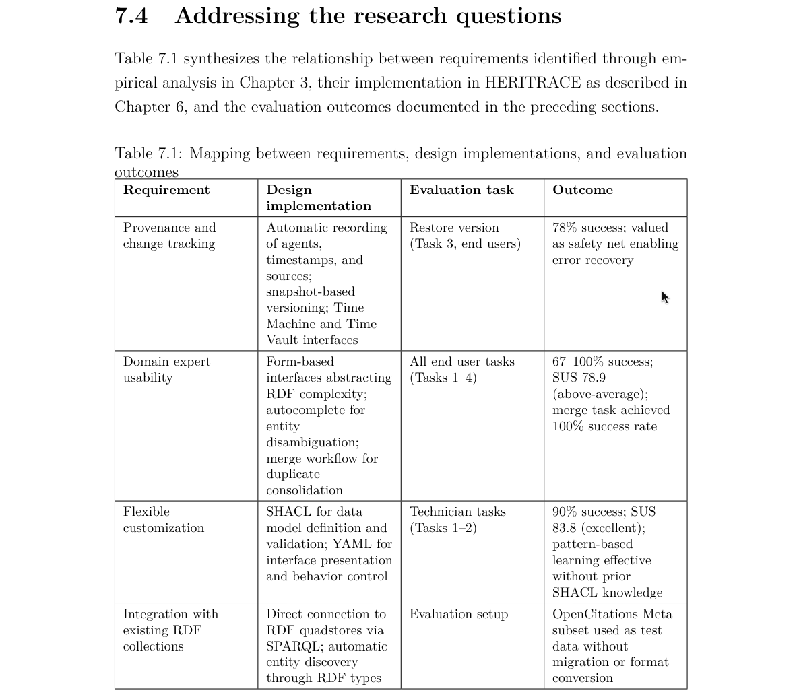
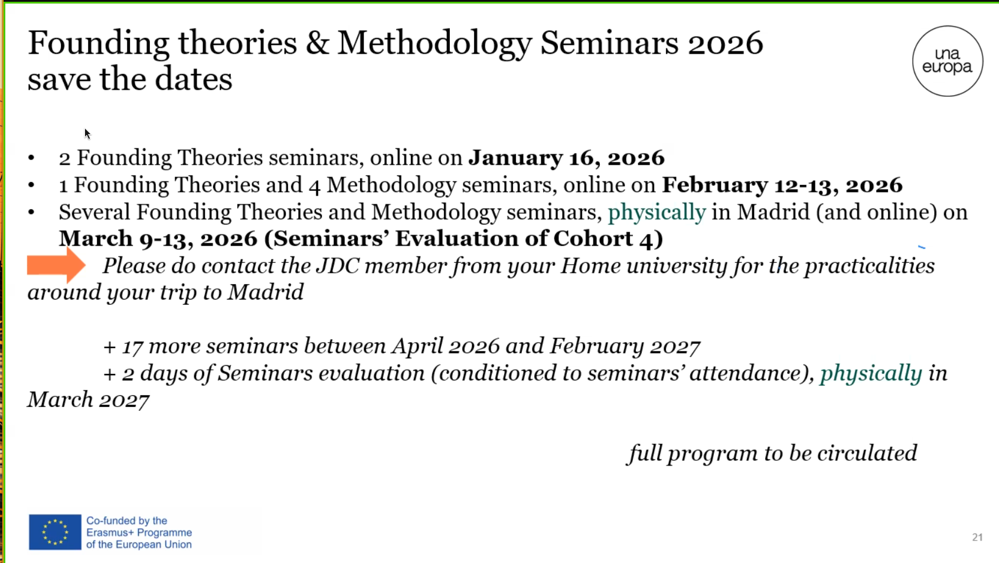

## La Novitade

### Aldrovandi

```python
FOLDER_TO_ID = {
    "S3-PT-DICAM_VetrinaMatriciXilografiche": "ptb",
    "S3-PT-DICAM_Matrice Xilografica Fiore": "ptb_1",
    "S3-PT-DICAM_Matrice Xilografica Pianta": "ptb_2",
    "S3-PT-DICAM_Matrice Xilografica Serpente": "ptb_3",
    "S3-VS6-DBC_Matrice 1 egizia": "ptb_4",
    "S5-s.n.-DBC_Busto di Ulisse Aldrovandi": "s_n",
    "S4-ManicoColtelloZoomorfo": 50,
    "S5-CNR-AAltoCentro_TestamentoUlisseAldrovandi": "a_alto_centro",
    "S5-B alto destra 1-FICLIT_Mammuthus1": "b_alto_destra_1",
    "S5-B alto destra 1-FICLIT_Mammuthus2": "b_alto_destra_2",
}
```

### Meta

```bash
--- File: 3627.csv ---
Rows: 1000, With IDs: 1000, Identifiers: 3915 (omid schema: 0)
With OMID: 3905, Without OMID: 10
Data graphs - Found: 37299, Missing: 0
Prov graphs - Found: 37299, Missing: 0
Provenance in DB - With: 2524, Without: 0

Problems in this file:
  - Identifier doi:10.35377/saucis..1418505 has no OMID (row 132, column id)
  - Identifier doi:10.35377/saucis..1402414 has no OMID (row 138, column id)
  - Identifier doi:10.35377/saucis..1341082 has no OMID (row 141, column id)
  - Identifier doi:10.35377/saucis..1444155 has no OMID (row 145, column id)
  - Identifier doi:10.35377/saucis..1381522 has no OMID (row 147, column id)
  - Identifier doi:10.35377/saucis..1339931 has no OMID (row 153, column id)
  - Identifier doi:10.35377/saucis..1359146 has no OMID (row 161, column id)
  - Identifier doi:10.35377/saucis..1402561 has no OMID (row 168, column id)
  - Identifier doi:10.35377/saucis..1391636 has no OMID (row 170, column id)
  - Identifier doi:10.1891/1540–4153.6.3.115 has no OMID (row 407, column id)

```

```csv
**doi:10.35377/saucis..1418505**,Automatic Maize Leaf Disease Recognition Using Deep Learning,"Çakmak, Muhammet [orcid:0000-0002-3752-6642]",2024-4-30,Sakarya University Journal of Computer and Information Sciences [issn:2636-8129],7,1,61-76,journal article,Sakarya University Journal of Computer and Information Sciences [crossref:20819],
```

Il DOI esiste, ma con tre punti: [https://doi.org/10.35377/saucis...1418505](https://doi.org/10.35377/saucis...1418505). Chi lo ha corrotto? In Crossref è giusto: [https://api.crossref.org/works/10.35377/saucis...1418505](https://api.crossref.org/works/10.35377/saucis...1418505)

Eccoti: [https://github.com/opencitations/oc\_ds\_converter/blob/18d0c76e31407a533d683ced4d166e86fcae9a05/oc\_ds\_converter/oc\_idmanager/doi.py#L184](https://github.com/opencitations/oc_ds_converter/blob/18d0c76e31407a533d683ced4d166e86fcae9a05/oc_ds_converter/oc_idmanager/doi.py#L184)

In realtà Meta ha incluso quei DOI ma mentre oc\_ds\_converter ha rimosso il primo punto, Meta ha rimosso il secondo e quindi i DOI sono finiti corrotti in Meta con un solo punto.

Li ho corretti con uno script ad hoc che usa il Meta Editor, non a mano con HERITRACE.

Ad ogni modo queste correzioni automatiche fatte da bendati sono a mio avviso folli. Queste correzioni automatiche hanno senso soltanto se non passa la prima validazione tramite API, dopodiché si cerca di correggere in automatico e infine si fa una seconda validazione tramite API. ma dato che abbiamo spento la validazione tramite API sia su Meta che sullo oc ds converter per ragioni di tempistiche il rischio che abbiamo corrotto una quantità importante di DOI è concreto.

### Tesi

> The relationship between specific design choices (Ch. 5) and the issues (positive or negative) in the evaluation (Ch. 7) should be made more clear. For example, relating requirements with results in a table.

> In Sec. 7.4 --> is the answer to the RQ mainly an interface to a database? It seems that most negative feedback is on the user interface. But isn't it the user interface that should reduce the barrier for non-experts?



> The first example on Open Citations (p18) motivating the need for manual intervention in the curation process is not entirely convincing: if new data link existing records that were previously distinct, one can re-assign new identifiers and update the related links? Are there cases where identifier information is wrong? To be clear, allowing curators to review and correct data is in general useful, I just feel that the provided example is not compelling enough. Or maybe a concrete example would make it clearer (for example, one where the title is the same but the publication different, for example a conference paper becoming a book chapter...).

Vuoi dei problemi? No problem bro, quanti ne vuoi:

* [https://pubmed.ncbi.nlm.nih.gov/15370649/](https://pubmed.ncbi.nlm.nih.gov/15370649/)
* [https://pubmed.ncbi.nlm.nih.gov/15849057/](https://pubmed.ncbi.nlm.nih.gov/15849057/)
  Due entità completamente diverse con lo stesso DOI. Può bastare?

> Even if an implementation of SPARQL-LTL does not exist, you should still discuss the difference in the approach as described by the paper.

> SPARQL-LTL \citep{fiondaGizeTimeWarp2016} extends SPARQL with an algorithm for rewriting queries into standard SPARQL, requiring triples annotated with revision numbers and available as named graphs. This strategy lacks known implementations. The fundamental difference between SPARQL-LTL and the Time Agnostic Library lies in where temporal logic is handled: SPARQL-LTL extends the query language with temporal operators (\texttt{NEXT}, \texttt{EVENTUALLY}, \texttt{ALWAYS}) that are rewritten into unions over revision-annotated graphs, while the Time Agnostic Library relies on temporal information in data mapped according to the OCDM data model and reconstructs states programmatically, preserving standard SPARQL 1.1 syntax.

### Co tutela



### Domande

* Email di Muriel Heisch
* Sto notando che a volte oggetti diversi sono stati raggruppati in una sola entità nel kg. Ad esempio: S6-98a-DA-Calchi facciali colorati, boscimani, S6-98b-DA-Calchi facciali colorati, boscimani e S6-98c-DA-Calchi facciali colorati, boscimani (ciacuno coi propri raw, rawp, dcho e dchoo) corrispondono tutti all'entità 98 nel kg. Non esistono 98a, 98b e 98c. Infatti crm:P3\_has\_note recita "Ricostruzioni plastiche sul vivente. Da sinistra a destra: boscimano Ai-hum maschio, boscimano Kung femmina, boscimano Ai-hum femmina". Cosa faccio in questo caso? Metto gli stessi metadati in 3 gruppi di cartelle diversi caricati come entità diverse su Zenodo? Noto anche che in altri casi le sotto entità sono state mappate come distinte nel kg: è il caso di 27a (Delphinium staphisagria), 27b (Adonis vernalis) e tutti gli altri 27x  che corrispondono a 6 piante diverse da volumi diversi dell'erbaio. Non esiste 27 senza suffisso
