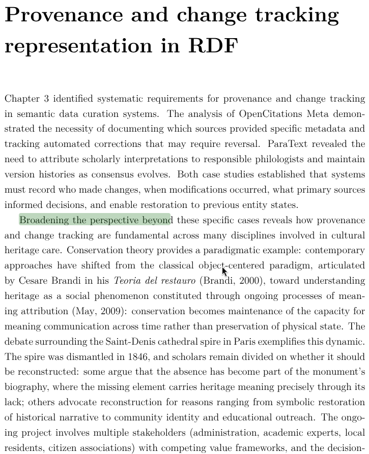

## La Novitade

### Meta

Zenodo, io mi fidavo di te...

  

    
    

      <strong style="display: block; color: #1f2328;">arcangelo7</strong>
      Jan 22, 2026
       · 
      <a href="https://github.com/opencitations/piccione" style="font-size: 0.85em; color: #0969da; text-decoration: none;">opencitations/piccione</a>
    

  

  

    
feat(zenodo): add metadata management, new deposition creation, and auto-publish

Add support for creating new depositions (not just updating existing ones),
configurable metadata fields (title, upload_type, creators, keywords, license,
description), User-Agent header requirement, and optional auto-publish flag.

Switch progress bar from tqdm to rich.progress for better UX.

  

  

    +261
    -43
    <a href="https://github.com/opencitations/piccione/commit/8a8be0c7c6966d5ddd73ed43f0b055686673fded" style="color: #0969da; text-decoration: none; font-weight: 500;">8a8be0c</a>
  

  

    
    

      <strong style="display: block; color: #1f2328;">arcangelo7</strong>
      Jan 25, 2026
       · 
      <a href="https://github.com/opencitations/piccione" style="font-size: 0.85em; color: #0969da; text-decoration: none;">opencitations/piccione</a>
    

  

  

    
feat(upload): add infinite retry with exponential backoff for figshare and zenodo

<ul>
<li>Figshare: add infinite retry for network and server errors (max 60s delay)</li>
<li>Figshare: skip files already uploaded with matching MD5</li>
<li>Figshare: automatic re-upload when MD5 differs</li>
<li>Zenodo: change from max 5 retries to infinite retry (max 60s delay)</li>
<li>Update tests to match refactored modules</li>
<li>Update documentation to reflect new features</li>
</ul>

[release]

  

  

    +364
    -175
    <a href="https://github.com/opencitations/piccione/commit/57649b39a855ebb32128d8fc2da50bf812714d55" style="color: #0969da; text-decoration: none; font-weight: 500;">57649b3</a>
  

  

    
    

      <strong style="display: block; color: #1f2328;">arcangelo7</strong>
      Jan 25, 2026
       · 
      <a href="https://github.com/opencitations/oc_download" style="font-size: 0.85em; color: #0969da; text-decoration: none;">opencitations/oc_download</a>
    

  

  

    
feat: update OpenCitations Meta to January 2026 dump

Update download links and statistics for the January 2026 release:

<ul>
<li>129,436,832 bibliographic entities</li>
<li>389,069,283 authors, 2,862,406 editors, 106,791,171 publishers</li>
<li>1,376,246 publication venues</li>
<li>Data sources: Crossref September 2025, DataCite 2025</li>
</ul>

Move June 2025 dump to previous dumps section.

  

  

    +32
    -19
    <a href="https://github.com/opencitations/oc_download/commit/5ea49b007c4a1371b3e0bda293db690a54bbd280" style="color: #0969da; text-decoration: none; font-weight: 500;">5ea49b0</a>
  

* multiple\_start\_nodes: 718
  * Publisher multipli non collegati da has next: [https://w3id.org/oc/meta/br/0601586824](https://w3id.org/oc/meta/br/0601586824)
* dangling\_has\_next: 26
  * Catene di autori che proseguono oltre il contesto della br: [https://w3id.org/oc/meta/br/0603913432](https://w3id.org/oc/meta/br/0603913432)
* self\_loop: 568
  * [https://ldd.opencitations.net/meta/ar/06304319601.html](https://ldd.opencitations.net/meta/ar/06304319601.html)
* multiple\_has\_next: 316
  * AR 06015796507 has 2 hasNext targets: [https://ldd.opencitations.net/meta/ar/06015796507.html](https://ldd.opencitations.net/meta/ar/06015796507.html)
* cycle: 161
  * 3-node cycle: 06208525988 -> 06208525986 -> 06208525987 -> 06208525988
    * [https://w3id.org/oc/meta/ar/06208525988](https://w3id.org/oc/meta/ar/06208525988)

  

    
    

      <strong style="display: block; color: #1f2328;">arcangelo7</strong>
      Jan 26, 2026
       · 
      <a href="https://github.com/opencitations/oc_meta" style="font-size: 0.85em; color: #0969da; text-decoration: none;">opencitations/oc_meta</a>
    

  

  

    
feat(fixer): add hasNext chain anomaly detection and fixer

Add analyser script to detect hasNext chain anomalies (cycles,
self-loops, dangling references, missing/multiple start nodes)
in RDF data using parallel processing.

Add fixer module with two modes:

<ul>
<li>dry-run: generates correction plan by matching ARs to external
APIs (Crossref, DataCite, PubMed) and produces CSV for Meta</li>
<li>execute: applies corrections by deleting broken AR chains</li>
</ul>
  

  

    +1302
    -36
    <a href="https://github.com/opencitations/oc_meta/commit/0fc9105de59a48f5e263882dc69c1887d08c20b6" style="color: #0969da; text-decoration: none; font-weight: 500;">0fc9105</a>
  

### Tesi

### Domande

* Occorrono delle slide per la difesa/pre-difesa?

### Aldrovandi

* Ho scaricato tutti i file in locale. Sono 566 GB. Pensavo peggio.  Ho esteso piccione in modo che controlli se il file remoto ha una data di aggiornamento successiva al file locale per riscaricarlo. Per sicurezza controlla anche le differenze di dimensione.
