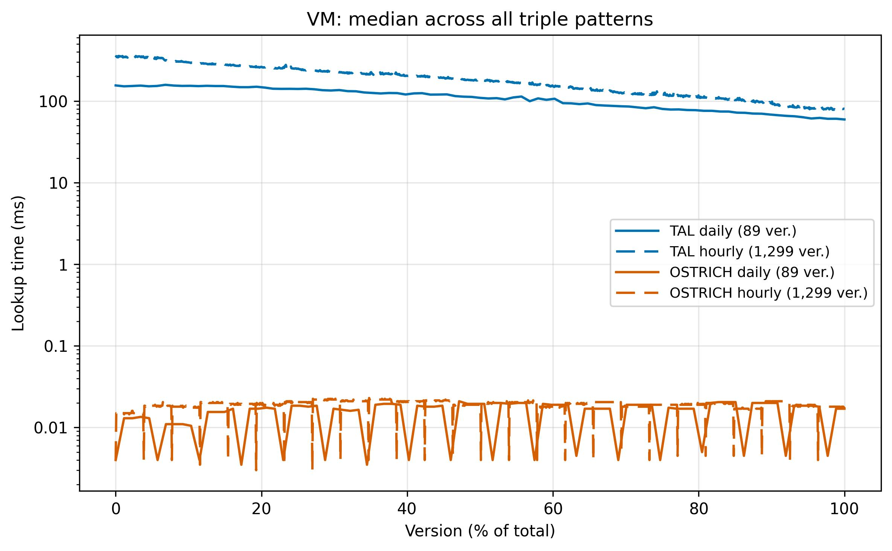
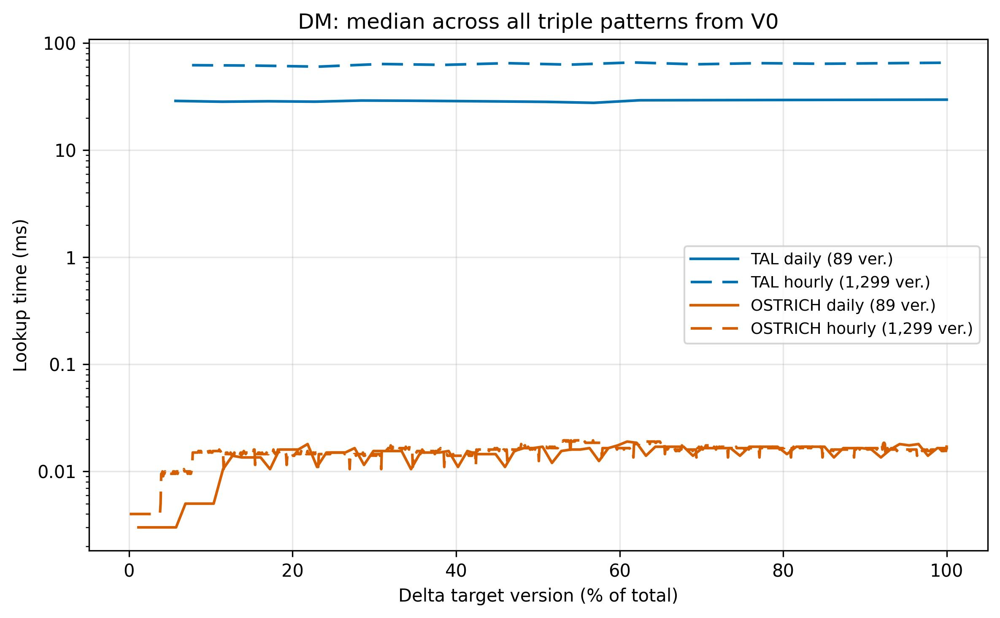
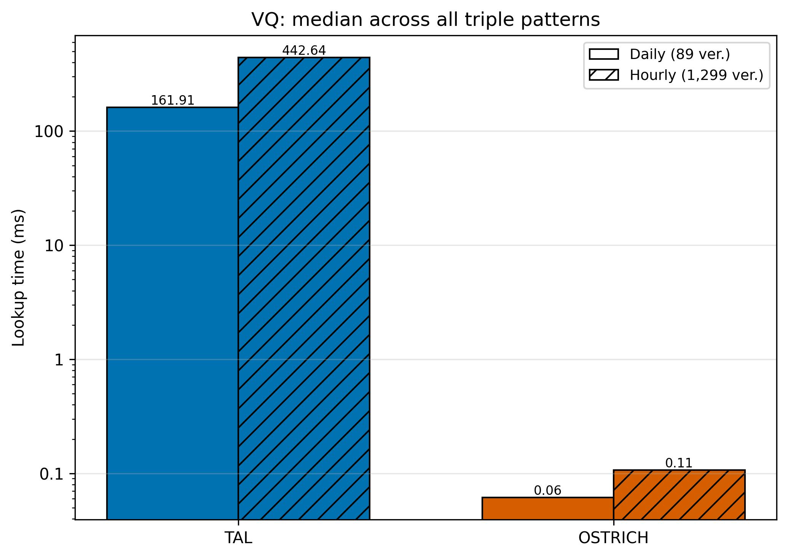

## La Novitade

### Meta

<strong style="display: block; color: #1f2328;">arcangelo7</strong>Feb 26, 2026 &middot; <a href="https://github.com/opencitations/oc_meta" style="font-size: 0.85em; color: #0969da; text-decoration: none;">opencitations/oc_meta</a>

refactor!: remove deprecated modules and add documentation site

+10201-11830<a href="https://github.com/opencitations/oc_meta/commit/a97ec23f6c61ab32129b493758314a57905772da" style="color: #0969da; text-decoration: none; font-weight: 500;">a97ec23</a>

* Bisogna rigenerare il DOI ORCID Index. Siamo fermi al 2024. È uscito quello del 2025.

### time-agnostic-library

### Aldrovandi

<strong style="display: block; color: #1f2328;">arcangelo7</strong>Feb 26, 2026 &middot; <a href="https://github.com/dharc-org/changes-metadata-manager" style="font-size: 0.85em; color: #0969da; text-decoration: none;">dharc-org/changes-metadata-manager</a>

fix(zenodo): use researcher role instead of datacollector for digitization authors

+9-9<a href="https://github.com/dharc-org/changes-metadata-manager/commit/94d97c3381d43b9d5385c25eb210800093635efd" style="color: #0969da; text-decoration: none; font-weight: 500;">94d97c3</a>

<strong style="display: block; color: #1f2328;">arcangelo7</strong>Feb 26, 2026 &middot; <a href="https://github.com/dharc-org/changes-metadata-manager" style="font-size: 0.85em; color: #0969da; text-decoration: none;">dharc-org/changes-metadata-manager</a>

feat(zenodo): add restricted notice for unlicensed entity stages

+49-15<a href="https://github.com/dharc-org/changes-metadata-manager/commit/30771b1e04cac15ca1acea20b3be546ca98716ef" style="color: #0969da; text-decoration: none; font-weight: 500;">30771b1</a>

[https://sandbox.zenodo.org/records/447317](https://sandbox.zenodo.org/records/447317)

### RML

<strong style="display: block; color: #1f2328;">arcangelo7</strong>Feb 24, 2026 &middot; <a href="https://github.com/arcangelo7/knowledge-graphs-inversion" style="font-size: 0.85em; color: #0969da; text-decoration: none;">arcangelo7/knowledge-graphs-inversion</a>

fix(test): improve R2RML test result classification accuracy

Reclassify 4 miscategorized &quot;failed&quot; test cases by detecting
their actual root causes: invalid mappings (multiple subjectMaps),
unmapped tables, NULL-caused row loss, and column-as-IRI distortion.

+132-11<a href="https://github.com/arcangelo7/knowledge-graphs-inversion/commit/a5dcd125547ee6f1133c94c50000d3929380fc67" style="color: #0969da; text-decoration: none; font-weight: 500;">a5dcd12</a>

<strong style="display: block; color: #1f2328;">arcangelo7</strong>Feb 24, 2026 &middot; <a href="https://github.com/arcangelo7/knowledge-graphs-inversion" style="font-size: 0.85em; color: #0969da; text-decoration: none;">arcangelo7/knowledge-graphs-inversion</a>

feat(inversion): reconstruct foreign key columns from RefObjectMap join conditions

Extract child column values from parent resource IRIs using the parent
subject template. Wrap RefObjectMap triple patterns in OPTIONAL to
preserve rows with NULL foreign keys. Move parent triples to be
processed last in SPARQL generation to ensure mandatory patterns bind
variables before the optional join.

+52-7<a href="https://github.com/arcangelo7/knowledge-graphs-inversion/commit/d182dd3b9c6e1460676e2159fcc86c33d3bdddfe" style="color: #0969da; text-decoration: none; font-weight: 500;">d182dd3</a>

<strong style="display: block; color: #1f2328;">arcangelo7</strong>Feb 25, 2026 &middot; <a href="https://github.com/arcangelo7/knowledge-graphs-inversion" style="font-size: 0.85em; color: #0969da; text-decoration: none;">arcangelo7/knowledge-graphs-inversion</a>

perf(query): skip subject template extraction when all references are already bound

When all subject template references are already available from
object triple patterns, the FILTER and BIND statements for
extracting values from the subject URI are unnecessary.

+8-1<a href="https://github.com/arcangelo7/knowledge-graphs-inversion/commit/731ff3e37339b8fbeeae5c93d4ac0f66e615d557" style="color: #0969da; text-decoration: none; font-weight: 500;">731ff3e</a>

<strong style="display: block; color: #1f2328;">arcangelo7</strong>Feb 25, 2026 &middot; <a href="https://github.com/arcangelo7/knowledge-graphs-inversion" style="font-size: 0.85em; color: #0969da; text-decoration: none;">arcangelo7/knowledge-graphs-inversion</a>

refactor(query): simplify SPARQL variable naming and eliminate redundant BINDs

Add _uri suffix to URI template variables so reference names
(ID, Name) remain clean in SELECT. Remove intermediate BIND
statements in subject IRI template extraction by binding
STRAFTER/STRBEFORE results directly to the target variable.

+41-15<a href="https://github.com/arcangelo7/knowledge-graphs-inversion/commit/bc9f4708e8bce76967882c633ec56ca974537ad3" style="color: #0969da; text-decoration: none; font-weight: 500;">bc9f470</a>

### Domande

* Qual è il distinguo per capire se un'istituzione ci ha o meno dato il permesso di caricare le immagini su Zenodo? è la presenza della licenza? È un certo tipo di licenza e non un altro? Io cosa devo andare a cercare?
