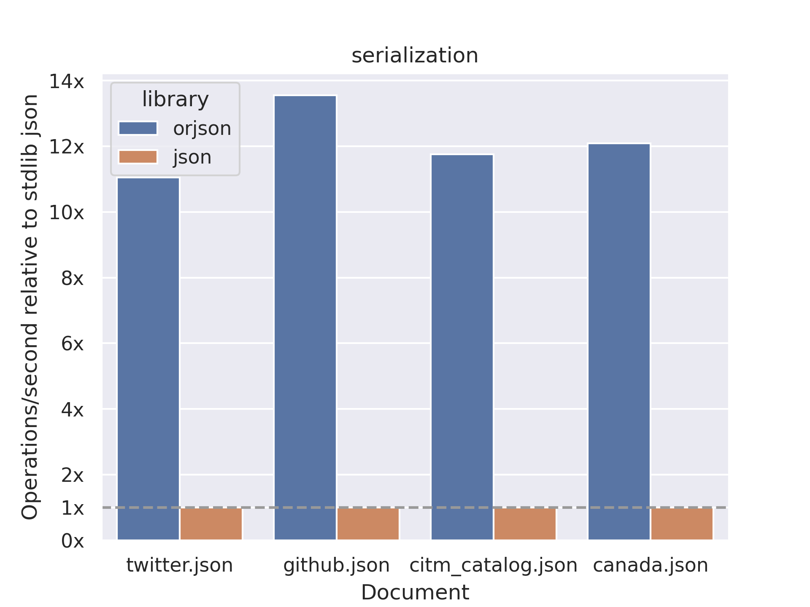
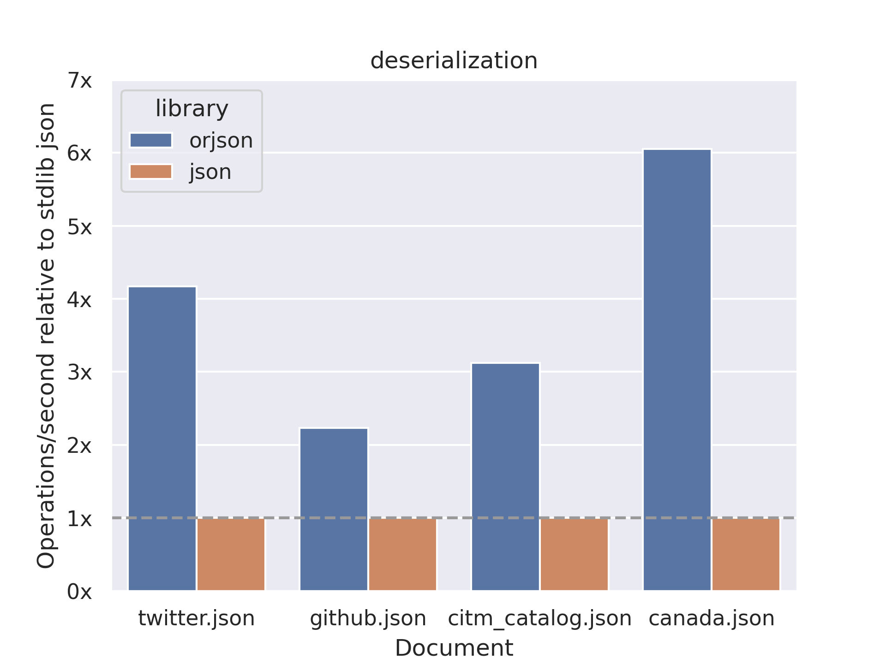

## La Novitade

### oc\_ds\_converter

```python
@pytest.fixture(params=["redis", "sqlite", "inmemory"])
def storage_manager(request: pytest.FixtureRequest, tmp_path):
    if request.param == "redis":
        sm = RedisStorageManager(testing=True)
    elif request.param == "sqlite":
        sm = SqliteStorageManager(str(tmp_path / "test.db"))
    else:
        sm = InMemoryStorageManager(str(tmp_path / "test.json"))
    yield sm
    sm.delete_storage()
```

<div style="border: 1px solid #d0d7de; border-radius: 8px; padding: 16px; margin: 8px 0; background: #ffffff; font-family: -apple-system, BlinkMacSystemFont, 'Segoe UI', Helvetica, Arial, sans-serif; color: #1f2328;"><div style="display: flex; align-items: center; gap: 12px; margin-bottom: 12px;"><div><strong style="display: block; color: #1f2328;">arcangelo7</strong><span style="font-size: 0.85em; color: #656d76;">Mar 12, 2026</span><span style="font-size: 0.85em; color: #656d76;"> &middot; </span><a href="https://github.com/opencitations/oc_ds_converter" style="font-size: 0.85em; color: #0969da; text-decoration: none;">opencitations/oc_ds_converter</a></div></div><div style="margin: 12px 0; color: #1f2328;"><p>feat(storage): restore SqliteStorageManager and InMemoryStorageManager</p>
<ul>
<li>Add parametrized pytest fixture to test all three storage managers
(redis, sqlite, inmemory) with single test code</li>
<li>Redis remains the default storage manager</li>
</ul></div><div style="display: flex; justify-content: space-between; align-items: center; font-size: 0.85em;"><span style="font-family: monospace; color: #1a7f37; font-weight: 600;">+641</span><span style="font-family: monospace; color: #cf222e; font-weight: 600;">-94</span><a href="https://github.com/opencitations/oc_ds_converter/commit/91f3ca71180b0d5cba1df39d9db80ce06f11dcef" style="color: #0969da; text-decoration: none; font-weight: 500;">91f3ca7</a></div></div>

<div style="border: 1px solid #d0d7de; border-radius: 8px; padding: 16px; margin: 8px 0; background: #ffffff; font-family: -apple-system, BlinkMacSystemFont, 'Segoe UI', Helvetica, Arial, sans-serif; color: #1f2328;"><div style="display: flex; align-items: center; gap: 12px; margin-bottom: 12px;"><div><strong style="display: block; color: #1f2328;">eliarizzetto</strong><span style="font-size: 0.85em; color: #656d76;">Sep 30, 2024</span><span style="font-size: 0.85em; color: #656d76;"> &middot; </span><a href="https://github.com/opencitations/oc_ds_converter" style="font-size: 0.85em; color: #0969da; text-decoration: none;">opencitations/oc_ds_converter</a></div></div><div style="margin: 12px 0; color: #1f2328;"><p>Update ROR id manager</p>
<ul>
<li>updated RORManager.syntax_ok() with more correct (restrictive) regex</li>
<li>extended the RORManager class to make its behaviour more similar to the one of ORCIDManager (as concerns the possibility to use multiple storage managers)</li>
<li>added tests for RORManager, which were missing (new testing functions and related data)</li>
</ul></div><div style="display: flex; justify-content: space-between; align-items: center; font-size: 0.85em;"><span style="font-family: monospace; color: #1a7f37; font-weight: 600;">+250</span><span style="font-family: monospace; color: #cf222e; font-weight: 600;">-16</span><a href="https://github.com/opencitations/oc_ds_converter/commit/ec9db309ee34a51eb87c14a68576a029e28fc7bc" style="color: #0969da; text-decoration: none; font-weight: 500;">ec9db30</a></div></div>

#### Cose non cose

```python
if isinstance(item['container-title'], list):
	ventit = str(item['container-title'][0])
```

[https://api.crossref.org/works/10.1007/978-3-030-00668-6\_8](https://api.crossref.org/works/10.1007/978-3-030-00668-6_8)

```json
"container-title": [
  "Lecture Notes in Computer Science",
  "The Semantic Web – ISWC 2018"
]
```

Secondo me bisognerebbe concatenare, non selezionare il primo

```bash
RaProcessor (base generica)
    |
    +-- CrossrefStyleProcessing (nuova - logica comune citing/cited)
    |       |
    |       +-- CrossrefAdapter (parsing JSON Crossref)
    |       +-- JalcAdapter (parsing JSON JALC)
    |
    +-- PubmedProcessing (resta separato)
    +-- DataciteProcessing (resta separato)
```

<div style="border: 1px solid #d0d7de; border-radius: 8px; padding: 16px; margin: 8px 0; background: #ffffff; font-family: -apple-system, BlinkMacSystemFont, 'Segoe UI', Helvetica, Arial, sans-serif; color: #1f2328;"><div style="display: flex; align-items: center; gap: 12px; margin-bottom: 12px;"><div><strong style="display: block; color: #1f2328;">arcangelo7</strong><span style="font-size: 0.85em; color: #656d76;">Mar 14, 2026</span><span style="font-size: 0.85em; color: #656d76;"> &middot; </span><a href="https://github.com/opencitations/oc_ds_converter" style="font-size: 0.85em; color: #0969da; text-decoration: none;">opencitations/oc_ds_converter</a></div></div><div style="margin: 12px 0; color: #1f2328;"><p>refactor: extract shared logic into CrossrefStyleProcessing base class</p>
<p>Extract common processing infrastructure from CrossrefProcessing and
JalcProcessing into a new CrossrefStyleProcessing abstract base class.
Move shared utility functions to process_utils.py.</p>
<p>Align jalc_process.py with crossref_process.py processing pattern.</p></div><div style="display: flex; justify-content: space-between; align-items: center; font-size: 0.85em;"><span style="font-family: monospace; color: #1a7f37; font-weight: 600;">+1080</span><span style="font-family: monospace; color: #cf222e; font-weight: 600;">-1074</span><a href="https://github.com/opencitations/oc_ds_converter/commit/2dc9419117f845041d9f963208dad5061fdce86e" style="color: #0969da; text-decoration: none; font-weight: 500;">2dc9419</a></div></div>

<div style="border: 1px solid #d0d7de; border-radius: 8px; padding: 16px; margin: 8px 0; background: #ffffff; font-family: -apple-system, BlinkMacSystemFont, 'Segoe UI', Helvetica, Arial, sans-serif; color: #1f2328;"><div style="display: flex; align-items: center; gap: 12px; margin-bottom: 12px;"><div><strong style="display: block; color: #1f2328;">arcangelo7</strong><span style="font-size: 0.85em; color: #656d76;">Mar 14, 2026</span><span style="font-size: 0.85em; color: #656d76;"> &middot; </span><a href="https://github.com/opencitations/oc_ds_converter" style="font-size: 0.85em; color: #0969da; text-decoration: none;">opencitations/oc_ds_converter</a></div></div><div style="margin: 12px 0; color: #1f2328;"><p>refactor: make Redis opt-in and share publisher lookup logic</p>
<p>Move publisher lookup by DOI prefix into CrossrefStyleProcessing base
class so both Crossref and JALC processors can use it. This also adds
CSV fallback for JALC when Redis is not available.</p>
<p>Redis usage is now controlled explicitly via --use-redis flag instead
of being implicitly required. Default behavior uses in-memory storage,
which works for single-threaded processing. Multiprocessing still
requires Redis and the CLI now warns when attempting to use multiple
workers without it.</p></div><div style="display: flex; justify-content: space-between; align-items: center; font-size: 0.85em;"><span style="font-family: monospace; color: #1a7f37; font-weight: 600;">+186</span><span style="font-family: monospace; color: #cf222e; font-weight: 600;">-114</span><a href="https://github.com/opencitations/oc_ds_converter/commit/c77733e3b38f198d2f6bc766020e032f0d10d698" style="color: #0969da; text-decoration: none; font-weight: 500;">c77733e</a></div></div>

### Il Giapporcid

Io non ci credo che i Giapponesi non usino gli ORCID

```python
data = json.load(zf.open(json_file))
content_str = json.dumps(data).lower()

has_orcid_field = 'orcid' in content_str
has_orcid_value = bool(ORCID_PATTERN.search(content_str))
```

```bash
┏━━━━━━━━━━━━━━━━━━━━━━━━━━┳━━━━━━━━━━━┓                                                           
┃ Metric                   ┃ Value     ┃                                                           
┡━━━━━━━━━━━━━━━━━━━━━━━━━━╇━━━━━━━━━━━┩                                                           
│ Total ZIP files          │ 2,792     │                                                           
│ Total JSON files         │ 9,847,719 │                                                           
│ Files with 'orcid' field │ 380,667   │                                                           
│ Files with ORCID values  │ 380,661   │                                                           
│ Unique ORCID values      │ 4,353     │                                                           
│ ZIPs containing ORCIDs   │ 217       │                                                           
│ % with 'orcid' field     │ 3.8655%   │                                                           
│ % with ORCID values      │ 3.8655%   │                                                           
```

```json
  {
	"sequence": "2",
	"type": "person",
	"names": [
	  {
		"lang": "en",
		"last_name": "LIN",
		"first_name": "Weiren"
	  }
	],
	"affiliation_list": [
	  {
		"sequence": "1",
		"affiliation_name_list": [
		  {
			"affiliation_name": "京都大学",
			"lang": "ja"
		  },
		  {
			"affiliation_name": "Kyoto University",
			"lang": "en"
		  }
		],
		"affiliation_identifier_list": [
		  {
			"affiliation_identifier": "https://ror.org/02kpeqv85",
			"type": "ROR"
		  }
		]
	  }
	],
	"researcher_id_list": [
	  {
		"id_code": "http://orcid.org/0000-0003-3228-2789",
		"type": "ORCID"
	  }
	]
  }
```

<div style="border: 1px solid #d0d7de; border-radius: 8px; padding: 16px; margin: 8px 0; background: #ffffff; font-family: -apple-system, BlinkMacSystemFont, 'Segoe UI', Helvetica, Arial, sans-serif; color: #1f2328;"><div style="display: flex; align-items: center; gap: 12px; margin-bottom: 12px;"><div><strong style="display: block; color: #1f2328;">arcangelo7</strong><span style="font-size: 0.85em; color: #656d76;">Mar 15, 2026</span><span style="font-size: 0.85em; color: #656d76;"> &middot; </span><a href="https://github.com/opencitations/oc_ds_converter" style="font-size: 0.85em; color: #0969da; text-decoration: none;">opencitations/oc_ds_converter</a></div></div><div style="margin: 12px 0; color: #1f2328;"><p>feat(jalc): extract ORCID from researcher_id_list in creator metadata</p></div><div style="display: flex; justify-content: space-between; align-items: center; font-size: 0.85em;"><span style="font-family: monospace; color: #1a7f37; font-weight: 600;">+77</span><span style="font-family: monospace; color: #cf222e; font-weight: 600;">-4</span><a href="https://github.com/opencitations/oc_ds_converter/commit/b03e9e0e05d963b94b001a908d2460b9c2b0c8e6" style="color: #0969da; text-decoration: none; font-weight: 500;">b03e9e0</a></div></div>

***

Tutto molto bello, e i publisher? In JALC in teoria non dovrei trovare nessun prefisso di Crossref. Vediamo.

| Categoria                        | Record    | Percentuale |
| -------------------------------- | --------- | ----------- |
| Totale record analizzati         | 9.840.132 | 100%        |
| Match (nome uguale)              | 5.014     | 0,1%        |
| Mismatch (nome diverso)          | 17.702    | 0,2%        |
| Prefisso non in mapping Crossref | 9.817.416 | 99,8%       |

| Prefisso | Nome Crossref                             | Nome JALC                                                                                                                     | Record |
| -------- | ----------------------------------------- | ----------------------------------------------------------------------------------------------------------------------------- | ------ |
| 10.1241  | Japan Science and Technology Agency (JST) | Japan Science and Technology Agency                                                                                           | 15.478 |
| 10.18934 | Wiley                                     | The Japanese Society for Dermatoallergology and Contact Dermatitis, The Japanese Society for Cutaneous Immunology and Allergy | 126    |
| 10.5834  | Japanese Society for Dental Health        | Japanese Society for Oral Health                                                                                              | 2.098  |

**10.1241** (differenza: manca "(JST)" nel nome JALC):

* 10.1241/johokanri.27.79
* 10.1241/johokanri.12.63
* 10.1241/johokanri.21.902

**10.18934** (Wiley vs società giapponese - probabile acquisizione/cambio editore):

* 10.18934/jedca.11.3\_215
* 10.18934/jscia.3.2\_299
* 10.18934/jedca.11.2\_154

**10.5834** (differenza: "Dental Health" vs "Oral Health"):

* 10.5834/jdh.53.3\_188
* 10.5834/jdh.49.2\_151
* 10.5834/jdh.40.287

JALC non ha un equivalente dell'endpoint /members di Crossref.

JALC: /prefixes restituisce solo prefix, ra, siteId, updated\_date

```json
  {                                                       
    "prefix": "10.11107",                                                            "ra": "JaLC",                                                                    "siteId": "SI/JST.JSTAGE",                                                       "updated_date": "2024-01-15"                                                 
  }  
```

<div style="border: 1px solid #d0d7de; border-radius: 8px; padding: 16px; margin: 8px 0; background: #ffffff; font-family: -apple-system, BlinkMacSystemFont, 'Segoe UI', Helvetica, Arial, sans-serif; color: #1f2328;"><div style="display: flex; align-items: center; gap: 12px; margin-bottom: 12px;"><div><strong style="display: block; color: #1f2328;">arcangelo7</strong><span style="font-size: 0.85em; color: #656d76;">Mar 15, 2026</span><span style="font-size: 0.85em; color: #656d76;"> &middot; </span><a href="https://github.com/opencitations/oc_ds_converter" style="font-size: 0.85em; color: #0969da; text-decoration: none;">opencitations/oc_ds_converter</a></div></div><div style="margin: 12px 0; color: #1f2328;"><p>refactor!(jalc): remove publisher prefix mapping</p>
<p>JALC is a separate DOI registration agency from Crossref and has no
equivalent /members API endpoint to provide authoritative publisher
names. Analysis showed 99.8% of JALC prefixes are not in the Crossref
mapping. Publisher names are now taken directly from the source data&#39;s
publisher_list field.</p>
<p>BREAKING CHANGE: JalcProcessing no longer accepts publishers_filepath
or use_redis_publishers parameters. The -p/--publishers CLI argument
has been removed from jalc_process.py.</p></div><div style="display: flex; justify-content: space-between; align-items: center; font-size: 0.85em;"><span style="font-family: monospace; color: #1a7f37; font-weight: 600;">+11</span><span style="font-family: monospace; color: #cf222e; font-weight: 600;">-53</span><a href="https://github.com/opencitations/oc_ds_converter/commit/a64328e8a644852bec8474db1d34e106a48d631a" style="color: #0969da; text-decoration: none; font-weight: 500;">a64328e</a></div></div>

***

I fixi su rimozione entità già presenti in Meta e duplicati in ds\_converter sembrano funzionare. In futuro, dovrei mettere nel ds\_converter anche la gestione del numero di righe dei file CSV, in modo da poter cancellare lo script di preprocessing di Meta in toto.

```bash
(oc-meta) arcangelo@serverGrosso:/mnt/arcangelo/repositories/oc_meta$ uv run '/mnt/arcangelo/repositories/oc_meta/oc_meta/run/meta/preprocess_input.py' /mnt/arcangelo/meta_input_2026_03/jalc/input/ /mnt/arcangelo/meta_input_2026_03/input_preprocessed --redis-port 6390 --rows-per-file 1000 --workers 16
Found 2349 CSV files to process with 16 workers
  Filtering existing IDs ━━━━━━━━━━━━━━━━━━━━━━━━━━━━━━━━━━━━━━━━ 100% 2349/2349 0:01:08 0:00:00
  Deduplicating and writing ━━━━━━━━━━━━━━━━━━━━━━━━━━━━━━━━━━━━━━━━ 100% 2349/2349 0:00:14 0:00:00
             Processing Report             
┏━━━━━━━━━━━━━━━━━━━━━━━━━━━━━━━┳━━━━━━━━━┓
┃ Metric                        ┃ Value   ┃
┡━━━━━━━━━━━━━━━━━━━━━━━━━━━━━━━╇━━━━━━━━━┩
│ Total input files processed   │ 2349    │
│ Total input rows              │ 2489489 │
│ Rows discarded (duplicates)   │ 0       │
│ Rows discarded (existing IDs) │ 0       │
│ Rows written to output        │ 2489489 │
│                               │         │
│ Duplicate rows %              │ 0.0%    │
│ Existing IDs %                │ 0.0%    │
│ Processed rows %              │ 100.0%  │
└───────────────────────────────┴─────────┘

  │ data.creator_list[].researcher_id_list[].id_code                                            │ 385,879     │                                                   
  │ data.contributor_list[].researcher_id_list[].id_code                                        │ 40          │                                                                        
```

<div style="border: 1px solid #d0d7de; border-radius: 8px; padding: 16px; margin: 8px 0; background: #ffffff; font-family: -apple-system, BlinkMacSystemFont, 'Segoe UI', Helvetica, Arial, sans-serif; color: #1f2328;"><div style="display: flex; align-items: center; gap: 12px; margin-bottom: 12px;"><div><strong style="display: block; color: #1f2328;">arcangelo7</strong><span style="font-size: 0.85em; color: #656d76;">Mar 16, 2026</span><span style="font-size: 0.85em; color: #656d76;"> &middot; </span><a href="https://github.com/opencitations/oc_ds_converter" style="font-size: 0.85em; color: #0969da; text-decoration: none;">opencitations/oc_ds_converter</a></div></div><div style="margin: 12px 0; color: #1f2328;"><p>fix: clean up PROCESS-DB after preprocessing completes</p>
<p>Previously, the PROCESS-DB Redis database retained DOI validation
records between runs. When re-executing the processor, all DOIs
were skipped as already processed, resulting in empty metadata output.</p>
<p>Changes:</p>
<ul>
<li>Rename cleanup_testing_storage to cleanup_storage and remove the
testing-only condition so the database is always cleaned</li>
<li>Optimize RedisDataSource.flushdb to use native Redis FLUSHDB</li>
<li>Add test verifying consecutive runs produce identical output</li>
</ul></div><div style="display: flex; justify-content: space-between; align-items: center; font-size: 0.85em;"><span style="font-family: monospace; color: #1a7f37; font-weight: 600;">+86</span><span style="font-family: monospace; color: #cf222e; font-weight: 600;">-12</span><a href="https://github.com/opencitations/oc_ds_converter/commit/1119b72b1801e2f9dc09b3c56067a0dc3a959e83" style="color: #0969da; text-decoration: none; font-weight: 500;">1119b72</a></div></div>

### Meta

#### Tutta la verità sugli UPDATE in Qlever

* Gli SPARQL UPDATE vengono salvati in un file separato chiamato \<index\_name>.update-triples. Questi dati non sono indicizzati come i dati principali.
* Ad ogni query, QLever deve combinare i dati dell'indice principale con i delta triples "al volo". Questo causa rallentamenti.
* Stanno lavorando su un sistema di rebuild automatico in background, ma non è ancora pronto per la produzione.
* Ora c'è l'opzione qlever rebuild-index
  * Combina indice originale + update-triples in un nuovo indice
  * Crea l'indice in una sottocartella rebuild.YYYY-MM-DDTHH:MM
  * Il nuovo indice ha tutte le triple già indicizzate (niente delta)
  * Il vecchio indice (con il suo file update-triples) rimane intatto finché non lo cancelli manualmente

<div style="border: 1px solid #d0d7de; border-radius: 8px; padding: 16px; margin: 8px 0; background: #ffffff; font-family: -apple-system, BlinkMacSystemFont, 'Segoe UI', Helvetica, Arial, sans-serif; color: #1f2328;"><div style="display: flex; align-items: center; gap: 12px; margin-bottom: 12px;"><div><strong style="display: block; color: #1f2328;">arcangelo7</strong><span style="font-size: 0.85em; color: #656d76;">Mar 12, 2026</span><span style="font-size: 0.85em; color: #656d76;"> &middot; </span><a href="https://github.com/opencitations/sparqlite" style="font-size: 0.85em; color: #0969da; text-decoration: none;">opencitations/sparqlite</a></div></div><div style="margin: 12px 0; color: #1f2328;"><p>fix: preserve query parameters in endpoint URL and add QLever test backend [release]</p>
<p>Endpoint URLs with query parameters (e.g. ?default-graph-uri=...) were
silently dropped when building request URLs. The fix parses the endpoint
URL and merges existing parameters with the query/update parameter.</p>
<p>Integration tests now run against both Virtuoso and QLever via
parametrized fixtures.</p></div><div style="display: flex; justify-content: space-between; align-items: center; font-size: 0.85em;"><span style="font-family: monospace; color: #1a7f37; font-weight: 600;">+190</span><span style="font-family: monospace; color: #cf222e; font-weight: 600;">-24</span><a href="https://github.com/opencitations/sparqlite/commit/1fb44f6c2e8d056c3d556e3e6ea35b73805916c0" style="color: #0969da; text-decoration: none; font-weight: 500;">1fb44f6</a></div></div>

> Please note that concrete syntaxes *MAY* support simple literals consisting of only a [lexical form](https://www.w3.org/TR/rdf11-concepts/#dfn-lexical-form) without any [datatype IRI](https://www.w3.org/TR/rdf11-concepts/#dfn-datatype-iri) or [language tag](https://www.w3.org/TR/rdf11-concepts/#dfn-language-tag). Simple literals are syntactic sugar for abstract syntax [literals](https://www.w3.org/TR/rdf11-concepts/#dfn-literal "literal") with the [datatype IRI](https://www.w3.org/TR/rdf11-concepts/#dfn-datatype-iri) `http://www.w3.org/2001/XMLSchema#string`. ([https://www.w3.org/TR/rdf11-concepts/#section-Graph-Literal](https://www.w3.org/TR/rdf11-concepts/#section-Graph-Literal))

<div style="border: 1px solid #d0d7de; border-radius: 8px; padding: 16px; margin: 8px 0; background: #ffffff; font-family: -apple-system, BlinkMacSystemFont, 'Segoe UI', Helvetica, Arial, sans-serif; color: #1f2328;"><div style="display: flex; align-items: center; gap: 12px; margin-bottom: 12px;"><div><strong style="display: block; color: #1f2328;">arcangelo7</strong><span style="font-size: 0.85em; color: #656d76;">Mar 13, 2026</span><span style="font-size: 0.85em; color: #656d76;"> &middot; </span><a href="https://github.com/opencitations/oc_ocdm" style="font-size: 0.85em; color: #0969da; text-decoration: none;">opencitations/oc_ocdm</a></div></div><div style="margin: 12px 0; color: #1f2328;"><p>fix: normalize RDF literals to xsd:string and tighten type annotations</p>
<p>Add sparql_binding_to_term and normalize_graph_literals for RDF 1.1
compliant literal handling.</p>
<p>Replace implicit None defaults with Optional,</p></div><div style="display: flex; justify-content: space-between; align-items: center; font-size: 0.85em;"><span style="font-family: monospace; color: #1a7f37; font-weight: 600;">+429</span><span style="font-family: monospace; color: #cf222e; font-weight: 600;">-93</span><a href="https://github.com/opencitations/oc_ocdm/commit/2164e19e74e338bdfd1256d35fb79cbe4093e742" style="color: #0969da; text-decoration: none; font-weight: 500;">2164e19</a></div></div>

<div style="border: 1px solid #d0d7de; border-radius: 8px; padding: 16px; margin: 8px 0; background: #ffffff; font-family: -apple-system, BlinkMacSystemFont, 'Segoe UI', Helvetica, Arial, sans-serif; color: #1f2328;"><div style="display: flex; align-items: center; gap: 12px; margin-bottom: 12px;"><div><strong style="display: block; color: #1f2328;">arcangelo7</strong><span style="font-size: 0.85em; color: #656d76;">Mar 13, 2026</span><span style="font-size: 0.85em; color: #656d76;"> &middot; </span><a href="https://github.com/opencitations/oc_ocdm" style="font-size: 0.85em; color: #0969da; text-decoration: none;">opencitations/oc_ocdm</a></div></div><div style="margin: 12px 0; color: #1f2328;"><p>test: replace Virtuoso with QLever and manage Docker via pytest fixtures</p></div><div style="display: flex; justify-content: space-between; align-items: center; font-size: 0.85em;"><span style="font-family: monospace; color: #1a7f37; font-weight: 600;">+108</span><span style="font-family: monospace; color: #cf222e; font-weight: 600;">-284</span><a href="https://github.com/opencitations/oc_ocdm/commit/b3074ab431863afa33a004c9e8111accbf738301" style="color: #0969da; text-decoration: none; font-weight: 500;">b3074ab</a></div></div>

<div style="border: 1px solid #d0d7de; border-radius: 8px; padding: 16px; margin: 8px 0; background: #ffffff; font-family: -apple-system, BlinkMacSystemFont, 'Segoe UI', Helvetica, Arial, sans-serif; color: #1f2328;"><div style="display: flex; align-items: center; gap: 12px; margin-bottom: 12px;"><div><strong style="display: block; color: #1f2328;">arcangelo7</strong><span style="font-size: 0.85em; color: #656d76;">Mar 13, 2026</span><span style="font-size: 0.85em; color: #656d76;"> &middot; </span><a href="https://github.com/opencitations/oc_meta" style="font-size: 0.85em; color: #0969da; text-decoration: none;">opencitations/oc_meta</a></div></div><div style="margin: 12px 0; color: #1f2328;"><p>refactor(test): migrate from Virtuoso to QLever triplestore</p></div><div style="display: flex; justify-content: space-between; align-items: center; font-size: 0.85em;"><span style="font-family: monospace; color: #1a7f37; font-weight: 600;">+556</span><span style="font-family: monospace; color: #cf222e; font-weight: 600;">-791</span><a href="https://github.com/opencitations/oc_meta/commit/c62683ac333e71c8a87a2bd304e8d4d40506926d" style="color: #0969da; text-decoration: none; font-weight: 500;">c62683a</a></div></div>

Ho lanciato Meta e mi sono accorto che le query sono lentissime. Non perché Qlever sia lento, ma perché erano scritte in maniera ottimizzata per Virtuoso. In particolare per quanto riguarda il match di stringhe con e senza datatype. Per tagliare la testa al toro, voglio aggiungere il datatype esplicito a tutte le stringhe.

<div style="border: 1px solid #d0d7de; border-radius: 8px; padding: 16px; margin: 8px 0; background: #ffffff; font-family: -apple-system, BlinkMacSystemFont, 'Segoe UI', Helvetica, Arial, sans-serif; color: #1f2328;"><div style="display: flex; align-items: center; gap: 12px; margin-bottom: 12px;"><div><strong style="display: block; color: #1f2328;">arcangelo7</strong><span style="font-size: 0.85em; color: #656d76;">Mar 14, 2026</span><span style="font-size: 0.85em; color: #656d76;"> &middot; </span><a href="https://github.com/opencitations/oc_meta" style="font-size: 0.85em; color: #0969da; text-decoration: none;">opencitations/oc_meta</a></div></div><div style="margin: 12px 0; color: #1f2328;"><p>feat(patches): add script to add xsd:string datatype to untyped literals</p>
<p>Uses RDFLib Dataset for named graph support, parallel
processing with ProcessPoolExecutor, and Rich for progress display.</p></div><div style="display: flex; justify-content: space-between; align-items: center; font-size: 0.85em;"><span style="font-family: monospace; color: #1a7f37; font-weight: 600;">+836</span><span style="font-family: monospace; color: #cf222e; font-weight: 600;">-0</span><a href="https://github.com/opencitations/oc_meta/commit/8855466c683efee7777ccb0e73024a43e3597cc4" style="color: #0969da; text-decoration: none; font-weight: 500;">8855466</a></div></div>

```bash
Found 2604349 ZIP files to process
  Processing files ━━━━━━━━━━━━━━━━━━━━━━━━━━━━━━━━━━━━━━━━ 2604349/2604349 14:21:08 0:00:00

Statistics:
  Files processed: 2604349
  Files modified: 2042735
  Files unchanged: 561614

Modifications by property:
  http://purl.org/dc/terms/description: 1338496617
  http://xmlns.com/foaf/0.1/familyName: 300471275
  http://xmlns.com/foaf/0.1/givenName: 298492984
  http://www.essepuntato.it/2010/06/literalreification/hasLiteralValue: 223214384
  http://purl.org/dc/terms/title: 110828015
  http://prismstandard.org/namespaces/basic/2.0/endingPage: 74981713
  http://prismstandard.org/namespaces/basic/2.0/startingPage: 74981712
  https://w3id.org/oc/ontology/hasUpdateQuery: 74525198
  http://xmlns.com/foaf/0.1/name: 41588595
  http://purl.org/spar/fabio/hasSequenceIdentifier: 8326449
  http://prismstandard.org/namespaces/basic/2.0/publicationDate: 687301

Total literals modified: 2546594243
```

<div style="border: 1px solid #d0d7de; border-radius: 8px; padding: 16px; margin: 8px 0; background: #ffffff; font-family: -apple-system, BlinkMacSystemFont, 'Segoe UI', Helvetica, Arial, sans-serif; color: #1f2328;"><div style="display: flex; align-items: center; gap: 12px; margin-bottom: 12px;"><div><strong style="display: block; color: #1f2328;">arcangelo7</strong><span style="font-size: 0.85em; color: #656d76;">Mar 15, 2026</span><span style="font-size: 0.85em; color: #656d76;"> &middot; </span><a href="https://github.com/opencitations/oc_meta" style="font-size: 0.85em; color: #0969da; text-decoration: none;">opencitations/oc_meta</a></div></div><div style="margin: 12px 0; color: #1f2328;"><p>feat(patches): add script to fix publication date datatypes</p></div><div style="display: flex; justify-content: space-between; align-items: center; font-size: 0.85em;"><span style="font-family: monospace; color: #1a7f37; font-weight: 600;">+888</span><span style="font-family: monospace; color: #cf222e; font-weight: 600;">-0</span><a href="https://github.com/opencitations/oc_meta/commit/a0b6ff574dd10d92d292e2c52b64fe519e2959a2" style="color: #0969da; text-decoration: none; font-weight: 500;">a0b6ff5</a></div></div>

```bash
Scanning /mnt/arcangelo/oc_meta_dev/rdf_datatyped for ZIP files...
Found 2604349 ZIP files to process
  Processing files ━━━━━━━━━━━━━━━━━━━━━━━━━━━━━━━━━━━━━━━━ 2604349/2604349 0:26:29 0:00:00

Statistics:
  Files processed: 2604349
  Files modified: 5271
  Files unchanged: 2599078

Modifications by datatype:
  http://www.w3.org/2001/XMLSchema#gYear: 336915
  http://www.w3.org/2001/XMLSchema#gYearMonth: 320342
  http://www.w3.org/2001/XMLSchema#date: 30044

Total dates fixed: 687301
```

<div style="border: 1px solid #d0d7de; border-radius: 8px; padding: 16px; margin: 8px 0; background: #ffffff; font-family: -apple-system, BlinkMacSystemFont, 'Segoe UI', Helvetica, Arial, sans-serif; color: #1f2328;"><div style="display: flex; align-items: center; gap: 12px; margin-bottom: 12px;"><div><strong style="display: block; color: #1f2328;">arcangelo7</strong><span style="font-size: 0.85em; color: #656d76;">Mar 15, 2026</span><span style="font-size: 0.85em; color: #656d76;"> &middot; </span><a href="https://github.com/opencitations/oc_meta" style="font-size: 0.85em; color: #0969da; text-decoration: none;">opencitations/oc_meta</a></div></div><div style="margin: 12px 0; color: #1f2328;"><p>refactor(patches): unify datatype fix scripts into single module</p></div><div style="display: flex; justify-content: space-between; align-items: center; font-size: 0.85em;"><span style="font-family: monospace; color: #1a7f37; font-weight: 600;">+341</span><span style="font-family: monospace; color: #cf222e; font-weight: 600;">-1137</span><a href="https://github.com/opencitations/oc_meta/commit/cf412c1971a5cc0620f656ab4b189a05570c98ef" style="color: #0969da; text-decoration: none; font-weight: 500;">cf412c1</a></div></div>

Applicare questo fix ha portato a un decremento del numero di triple da 13,556,089,823 a 13,556,086,129, ovvero 3,694 triple in meno. Questo si spiega con l'eliminazione dei duplicati. È possibile che per una stessa entità la stessa tripla fosse presente prima senza il datatype e poi con il datatype.

Trovato

```json
{
  "@id": "https://w3id.org/oc/meta/br/06704211544",
  "@type": [
    "http://purl.org/spar/fabio/Expression",
    "http://purl.org/spar/fabio/JournalArticle"
  ],
  "http://prismstandard.org/namespaces/basic/2.0/publicationDate": [
    {
      "@type": "http://www.w3.org/2001/XMLSchema#gYear",
      "@value": "2017"
    },
    {
      "@value": "2017"
    }
  ]
}
```

[https://w3id.org/oc/meta/br/06704211544.json](https://w3id.org/oc/meta/br/06704211544.json)

#### L'indice testuale di QLever viene usato per il match esatto di stringa?

No. L'indice testuale viene attivato **solo** quando la query SPARQL usa esplicitamente
i predicati `ql:contains-word` o `ql:contains-entity`. Un match esatto di stringa
(ad esempio `FILTER(?x = "valore")` oppure un letterale in un triple pattern) segue
un percorso di esecuzione completamente diverso, che usa le permutazioni standard
del knowledge graph (SPO, PSO, ecc.) senza mai toccare l'indice testuale.

[**Righe 520-547**](https://github.com/ad-freiburg/qlever/blob/af00534dede7d8ef2b463e50135e66efd6ae7db3/src/engine/QueryPlanner.cpp#L520-L547)

### meta\_prov\_fixer

Non mi ricordavo se avessi applicato o meno le correzioni di provenance di Elia alla cartella RDF su cui stavo lavorando. per cui ho sentito la necessità di lanciare una dry run dello strumento di Elia per verificare se ci fossero problemi di conformità. Tuttavia, ho riscontrato l'assenza di una modalità di dry run efficiente e quindi ho chiesto a Elia il permesso di crearne una.

<div style="border: 1px solid #d0d7de; border-radius: 8px; padding: 16px; margin: 8px 0; background: #ffffff; font-family: -apple-system, BlinkMacSystemFont, 'Segoe UI', Helvetica, Arial, sans-serif; color: #1f2328;"><div style="display: flex; align-items: center; gap: 12px; margin-bottom: 12px;"><div><strong style="display: block; color: #1f2328;">arcangelo7</strong><span style="font-size: 0.85em; color: #656d76;">Mar 16, 2026</span><span style="font-size: 0.85em; color: #656d76;"> &middot; </span><a href="https://github.com/opencitations/meta_prov_fixer" style="font-size: 0.85em; color: #0969da; text-decoration: none;">opencitations/meta_prov_fixer</a></div></div><div style="margin: 12px 0; color: #1f2328;"><p>build: migrate from Poetry to UV, add CI workflow and ISC license</p></div><div style="display: flex; justify-content: space-between; align-items: center; font-size: 0.85em;"><span style="font-family: monospace; color: #1a7f37; font-weight: 600;">+2136</span><span style="font-family: monospace; color: #cf222e; font-weight: 600;">-2905</span><a href="https://github.com/opencitations/meta_prov_fixer/commit/f7193bcc84604f938503941b4bc66ac4c7cf8615" style="color: #0969da; text-decoration: none; font-weight: 500;">f7193bc</a></div></div>

### Peffomance

#### OpenCitations è ~~Python~~ rdflibound

* Contare quante triple ci sono nei file rdf in parallelo con 16 core utilizzando rdflib impiega 3 giorni. Utilizzando parsing json impiega 20 minuti.
* [https://github.com/oxigraph/oxigraph/discussions/1092](https://github.com/oxigraph/oxigraph/discussions/1092)

##### I colli di bottiglia principali

##### 1. Creazione degli oggetti Term (URIRef, Literal, BNode)

Ogni singolo termine RDF parsato diventa un oggetto Python con validazione completa:

* **URIRef**: ogni creazione chiama `_is_valid_uri()` che controlla 11 caratteri invalidi, più `urljoin()` se c'è una base URI
* **Literal**: valida il language tag con regex, crea un nuovo `URIRef(datatype)` per il datatype (che a sua volta rivalida l'URI), esegue casting lessicale-Python, controlla well-formedness, valida Unicode
* **BNode**: lasciamo perdere
* **Nessun caching**: termini identici vengono ricreati da zero ogni volta. Un dataset con 1M di triple crea \~3M di oggetti term, ognuno con tutta la validazione

##### 2. Store in memoria

Il Memory store mantiene **5 strutture dati** per ogni tripla:

* 3 indici dizionario (`__spo`, `__pos`, `__osp`)
* `__tripleContexts`: mapping tripla -> contesto
* `__contextTriples`: mapping contesto -> set di triple

Il metodo `triples()` wrappa ogni `.keys()` con `list()`, creando copie complete ad ogni iterazione

##### 3. Parser: nessun batching

Tutti i parser aggiungono triple **una alla volta** con `Graph.add()`. Ogni chiamata:

1. Spacchetta la tripla per validare i tipi con `assert isinstance()`
2. Rimpacchetta in una nuova tupla
3. Chiama `store.add()` che indicizza in 3 dizionari + gestisce il contesto

Il buffer di lettura di NTriples è hardcoded a **2048 byte**. I file moderni beneficerebbero di 64KB+. Il parser JSON-LD carica l'intero documento in memoria prima di processarlo

##### 4. SPARQL: nessuna ottimizzazione del piano di query

##### E se facessi un fork? E se usassi pyoxigraph?

Contare le triple con pyoxigraph produce lo stesso risultato che contarle parsando il json e ci mette \~50 minuti vs \~15 minuti. rdflib ci mette più di due giorni.

```bash
arcangelo@serverGrosso:/mnt/arcangelo/repositories/oc_meta$ uv run python '/mnt/arcangelo/repositories/oc_meta/oc_meta/run/count/triples.py' /mnt/arcangelo/fixed/ --pattern *.zip --format json-ld --recursive --workers 16 --fast                                                                                                                               
  Counting triples ━━━━━━━━━━━━━━━━━━━━━━━━━━━━━━━━━━━━━━━━ 100% 1302184/1302184 0:15:56 0:00:00
Total triples: 8451129250
arcangelo@serverGrosso:/mnt/arcangelo/repositories/oc_meta$ uv run python '/mnt/arcangelo/repositories/oc_meta/oc_meta/run/count/triples.py' /mnt/arcangelo/fixed/ --pattern *.zip --format json-ld --recursive --workers 16 --backend pyoxigraph
  Counting triples ━━━━━━━━━━━━━━━━━━━━━━━━━━━━━━━━━━━━━━━━ 100% 1302184/1302184 0:47:13 0:00:00
Total triples: 8451129250
```

Convertire gli RDF con pyoxigraph e 29 processi impiega 21 minuti, con rdflib 1 ora e 17.

#### Esplorazione cartelle

os.walk: 152.128s sull'RDF di Meta
os.scandir BFS: 33.203s
parallel BFS: 378.310s
[scandir-rs](https://github.com/brmmm3/scandir-rs): 12.909s

#### Parsing json

[https://github.com/ijl/orjson](https://github.com/ijl/orjson)





### Domande

* Ho introdotto il meccanismo di integrazione tra DOI ORCID INDEX e sorgente, nonché il meccanismo di normalizzazione dei nomi dei publisher, basato solo sul prefisso e non sul member, anche per JALC dove non erano presenti. Ha senso?
* contributor\_list per JALC non viene usato, solo creator\_list. Ci piace?
* Gli studenti mi hanno chiesto un quinto laboratorio, ma mi sono accorto che il prossimo slot disponibile è l'8 aprile, cioè tra 3 settimane. Come mai? Io avevo intenzione di farlo tra 2 settimane, tra 3 mi sembra eccessivo.
* I risultati del workshop?
