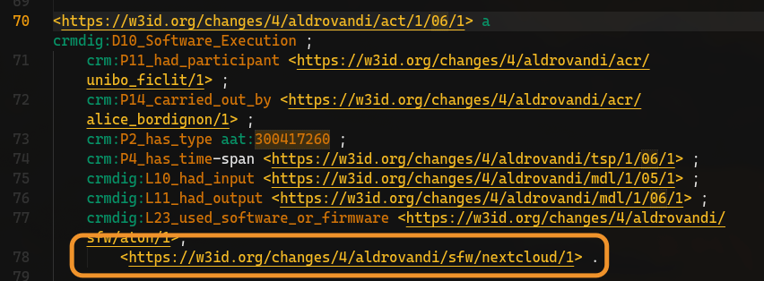
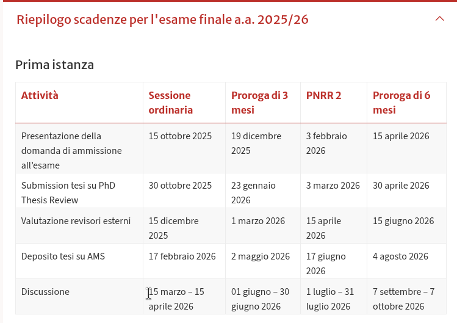
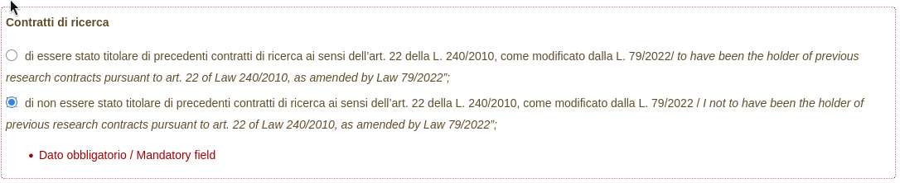

## La Novitade

### Aldrovandi

[https://github.com/dharc-org/morph-kgc-changes-metadata/blob/main/src/morph\_kgc\_changes\_metadata\_conversions/sample\_mapping\_file.yaml](https://github.com/dharc-org/morph-kgc-changes-metadata/blob/main/src/morph_kgc_changes_metadata_conversions/sample_mapping_file.yaml)

| Mapping                        | Tipo entità                     | Pattern IRI       | Esempio                   |
| ------------------------------ | ------------------------------- | ----------------- | ------------------------- |
| `expression_creation`          | lrmoo:F28\_Expression\_Creation | `act/{NR}/ob00/1` | `act/123/ob00/1`          |
| `expression_creation_activity` | crm:E7\_Activity                | `act/{NR}/ob01/1` | `act/123/ob01/1`          |
| `translation_02_activity`      | crm:E7\_Activity                | `act/{NR}/ob02/1` | `act/123/ob02/1`          |
| `engraving_03_activity`        | crm:E7\_Activity                | `act/{NR}/ob03/1` | `act/123/ob03/1`          |
| `publishing_04_activity`       | crm:E7\_Activity                | `act/{NR}/ob04/1` | `act/123/ob04/1`          |
| `preparation_05_activity`      | crm:E7\_Activity                | `act/{NR}/ob05/1` | `act/123/ob05/1`          |
| `commission_06_activity`       | crm:E7\_Activity                | `act/{NR}/ob06/1` | `act/123/ob06/1`          |
| `discovery_07_activity`        | crm:E7\_Activity                | `act/{NR}/ob07/1` | `act/123/ob07/1`          |
| `activity_08_curation`         | crm:E7\_Activity                | `act/{NR}/ob08/1` | `act/123/ob08/1`          |
| `work`                         | lrmoo:F1\_Work                  | `wrk/{NR}/ob00/1` | `wrk/123/ob00/1`          |
| `expression`                   | lrmoo:F2\_Expression            | `exp/{NR}/ob00/1` | `exp/123/ob00/1`          |
| `manifestation`                | lrmoo:F3\_Manifestation         | `mnf/{NR}/ob00/1` | `mnf/123/ob00/1`          |
| `item`                         | lrmoo:F5\_Item                  | `itm/{NR}/ob00/1` | `itm/123/ob00/1`          |
| `time_span`                    | crm:E52\_Time-Span              | `tsp/{NR}/ob00/1` | `tsp/123/ob00/1`          |
| `actor_*`                      | crm:E39\_Actor                  | `acr/{name}/1`    | `acr/ulisse_aldrovandi/1` |
| `place_*`                      | crm:E53\_Place                  | `plc/{place}/1`   | `plc/bologna/1`           |

[https://github.com/dharc-org/morph-kgc-changes-metadata/blob/main/src/morph\_kgc\_changes\_metadata\_conversions/mapping\_file\_acquisition.yaml](https://github.com/dharc-org/morph-kgc-changes-metadata/blob/main/src/morph_kgc_changes_metadata_conversions/mapping_file_acquisition.yaml)

| Step | Tipo RDF                         | Pattern IRI     | Descrizione      |
| ---- | -------------------------------- | --------------- | ---------------- |
| 00   | crmdig:D2\_Digitization\_Process | `act/{NR}/00/1` | Acquisizione 3D  |
| 01   | crmdig:D10\_Software\_Execution  | `act/{NR}/01/1` | Processing       |
| 02   | crmdig:D10\_Software\_Execution  | `act/{NR}/02/1` | Modellazione     |
| 03   | crmdig:D10\_Software\_Execution  | `act/{NR}/03/1` | Ottimizzazione   |
| 04   | crmdig:D10\_Software\_Execution  | `act/{NR}/04/1` | Esportazione     |
| 05   | crmdig:D10\_Software\_Execution  | `act/{NR}/05/1` | Metadatazione    |
| 06   | crmdig:D10\_Software\_Execution  | `act/{NR}/06/1` | Caricamento ATON |

Non vedo Sharepoint nell'RDF, solo Nextcloud



<div style="border: 1px solid #d0d7de; border-radius: 8px; padding: 16px; margin: 8px 0; background: #ffffff; font-family: -apple-system, BlinkMacSystemFont, 'Segoe UI', Helvetica, Arial, sans-serif; color: #1f2328;">
  <div style="display: flex; align-items: center; gap: 12px; margin-bottom: 12px;">
    
    <div>
      <strong style="display: block; color: #1f2328;">arcangelo7</strong>
      <span style="font-size: 0.85em; color: #656d76;">Dec 10, 2025</span>
      <span style="font-size: 0.85em; color: #656d76;"> · </span>
      <a href="https://github.com/dharc-org/aldrovandi-provenance" style="font-size: 0.85em; color: #0969da; text-decoration: none;">dharc-org/aldrovandi-provenance</a>
    </div>
  </div>
  <div style="margin: 12px 0; color: #1f2328;">
    <p>feat: add folder metadata builder</p>
<p>Add script to process SharePoint folder structure and generate metadata
files (meta.ttl) and provenance snapshots (prov.nq) for each processing
stage (raw, rawp, dcho, dchoo)</p>

  </div>
  <div style="display: flex; justify-content: space-between; align-items: center; font-size: 0.85em;">
    <span style="font-family: monospace; color: #1a7f37; font-weight: 600;">+15439</span>
    <span style="font-family: monospace; color: #cf222e; font-weight: 600;">-7531</span>
    <a href="https://github.com/dharc-org/aldrovandi-provenance/commit/ad8a6137e6bd8d93333b489ed9ec50348a30b9a0" style="color: #0969da; text-decoration: none; font-weight: 500;">ad8a613</a>
  </div>
</div>

Per me è pronto, quando vuoi puoi scaricarti i dati da Sharepoint e lanciare:

`git clone https://github.com/dharc-org/changes-metadata-manager.git`
`cd changes-metadata-manager`
`uv sync`
`uv run python -m changes_metadata_manager.folder_metadata_builder <root_directory>`

### python-package-template

<div style="border: 1px solid #d0d7de; border-radius: 8px; padding: 16px; margin: 8px 0; background: #ffffff; font-family: -apple-system, BlinkMacSystemFont, 'Segoe UI', Helvetica, Arial, sans-serif; color: #1f2328;">
  <div style="display: flex; align-items: center; gap: 12px; margin-bottom: 12px;">
    
    <div>
      <strong style="display: block; color: #1f2328;">arcangelo7</strong>
      <span style="font-size: 0.85em; color: #656d76;">Dec 11, 2025</span>
      <span style="font-size: 0.85em; color: #656d76;"> · </span>
      <a href="https://github.com/opencitations/python-package-template" style="font-size: 0.85em; color: #0969da; text-decoration: none;">opencitations/python-package-template</a>
    </div>
  </div>
  <div style="margin: 12px 0; color: #1f2328;">
    <p>feat: add coverage badge and HTML report to GitHub Pages</p>

  </div>
  <div style="display: flex; justify-content: space-between; align-items: center; font-size: 0.85em;">
    <span style="font-family: monospace; color: #1a7f37; font-weight: 600;">+459</span>
    <span style="font-family: monospace; color: #cf222e; font-weight: 600;">-4</span>
    <a href="https://github.com/opencitations/python-package-template/commit/164731c2c02f538e1893b99ffd3b65949bca2b95" style="color: #0969da; text-decoration: none; font-weight: 500;">164731c</a>
  </div>
</div>
https://opencitations.github.io/python-package-template/coverage/
<div style="border: 1px solid #d0d7de; border-radius: 8px; padding: 16px; margin: 8px 0; background: #ffffff; font-family: -apple-system, BlinkMacSystemFont, 'Segoe UI', Helvetica, Arial, sans-serif; color: #1f2328;">
  <div style="display: flex; align-items: center; gap: 12px; margin-bottom: 12px;">
    
    <div>
      <strong style="display: block; color: #1f2328;">arcangelo7</strong>
      <span style="font-size: 0.85em; color: #656d76;">Dec 11, 2025</span>
      <span style="font-size: 0.85em; color: #656d76;"> · </span>
      <a href="https://github.com/opencitations/repository_setup_guides" style="font-size: 0.85em; color: #0969da; text-decoration: none;">opencitations/repository_setup_guides</a>
    </div>
  </div>
  <div style="margin: 12px 0; color: #1f2328;">
    <p>docs: add coverage reports guide</p>

  </div>
  <div style="display: flex; justify-content: space-between; align-items: center; font-size: 0.85em;">
    <span style="font-family: monospace; color: #1a7f37; font-weight: 600;">+201</span>
    <span style="font-family: monospace; color: #cf222e; font-weight: 600;">-0</span>
    <a href="https://github.com/opencitations/repository_setup_guides/commit/dbe9c2a6145b7a6243ceb20c12304cbc3b03fbf2" style="color: #0969da; text-decoration: none; font-weight: 500;">dbe9c2a</a>
  </div>
</div>

<div style="border: 1px solid #d0d7de; border-radius: 8px; padding: 16px; margin: 8px 0; background: #ffffff; font-family: -apple-system, BlinkMacSystemFont, 'Segoe UI', Helvetica, Arial, sans-serif; color: #1f2328;">
  <div style="display: flex; align-items: center; gap: 12px; margin-bottom: 12px;">
    
    <div>
      <strong style="display: block; color: #1f2328;">arcangelo7</strong>
      <span style="font-size: 0.85em; color: #656d76;">Dec 11, 2025</span>
      <span style="font-size: 0.85em; color: #656d76;"> · </span>
      <a href="https://github.com/opencitations/python-package-template" style="font-size: 0.85em; color: #0969da; text-decoration: none;">opencitations/python-package-template</a>
    </div>
  </div>
  <div style="margin: 12px 0; color: #1f2328;">
    <p>refactor: include pre-built docs/ and simplify setup.py</p>
<p>Replace dynamic Starlight creation with pre-built docs/ directory.
This avoids npm downloads during setup and speeds up project initialization.</p>

  </div>
  <div style="display: flex; justify-content: space-between; align-items: center; font-size: 0.85em;">
    <span style="font-family: monospace; color: #1a7f37; font-weight: 600;">+6664</span>
    <span style="font-family: monospace; color: #cf222e; font-weight: 600;">-169</span>
    <a href="https://github.com/opencitations/python-package-template/commit/3893399dd1f70856cc1eb5a1bf9d931f937b0398" style="color: #0969da; text-decoration: none; font-weight: 500;">3893399</a>
  </div>
</div>

### virtuoso\_utilities

<div style="border: 1px solid #d0d7de; border-radius: 8px; padding: 16px; margin: 8px 0; background: #ffffff; font-family: -apple-system, BlinkMacSystemFont, 'Segoe UI', Helvetica, Arial, sans-serif; color: #1f2328;">
  <div style="display: flex; align-items: center; gap: 12px; margin-bottom: 12px;">
    
    <div>
      <strong style="display: block; color: #1f2328;">arcangelo7</strong>
      <span style="font-size: 0.85em; color: #656d76;">Dec 15, 2025</span>
      <span style="font-size: 0.85em; color: #656d76;"> · </span>
      <a href="https://github.com/opencitations/virtuoso_utilities" style="font-size: 0.85em; color: #0969da; text-decoration: none;">opencitations/virtuoso_utilities</a>
    </div>
  </div>
  <div style="margin: 12px 0; color: #1f2328;">
    <p>fix: prevent lock contention with AdjustVectorSize=0 and frequent checkpoints [release]</p>
<p>Change Virtuoso vector and checkpoint configuration to prevent &quot;locks are
held for a long time&quot; errors during parallel query execution:</p>
<ul>
<li>Set AdjustVectorSize=0 (recommended default since Virtuoso 7.2.2)</li>
<li>Replace MaxVectorSize with VectorSize=1000</li>
<li>Add CheckpointInterval=1 for frequent checkpoints</li>
</ul>
<p>These settings are applied in both virtuoso-launch and virtuoso-native-launch.</p>

  </div>
  <div style="display: flex; justify-content: space-between; align-items: center; font-size: 0.85em;">
    <span style="font-family: monospace; color: #1a7f37; font-weight: 600;">+27</span>
    <span style="font-family: monospace; color: #cf222e; font-weight: 600;">-13</span>
    <a href="https://github.com/opencitations/virtuoso_utilities/commit/b5fe65126de9793a8ef8e1ff59a9cc01ee2fc48d" style="color: #0969da; text-decoration: none; font-weight: 500;">b5fe651</a>
  </div>
</div>

<div style="border: 1px solid #d0d7de; border-radius: 8px; padding: 16px; margin: 8px 0; background: #ffffff; font-family: -apple-system, BlinkMacSystemFont, 'Segoe UI', Helvetica, Arial, sans-serif; color: #1f2328;">
  <div style="display: flex; align-items: center; gap: 12px; margin-bottom: 12px;">
    
    <div>
      <strong style="display: block; color: #1f2328;">arcangelo7</strong>
      <span style="font-size: 0.85em; color: #656d76;">Dec 15, 2025</span>
      <span style="font-size: 0.85em; color: #656d76;"> · </span>
      <a href="https://github.com/opencitations/virtuoso_utilities" style="font-size: 0.85em; color: #0969da; text-decoration: none;">opencitations/virtuoso_utilities</a>
    </div>
  </div>
  <div style="margin: 12px 0; color: #1f2328;">
    <p>feat: add ThreadCleanupInterval and ResourcesCleanupInterval parameters [release]</p>
<p>Add cleanup interval parameters to help prevent &quot;locks are held for a long
time&quot; errors by releasing unused threads and resources every minute:</p>
<ul>
<li>ThreadCleanupInterval = 1</li>
<li>ResourcesCleanupInterval = 1</li>
</ul>
<p>These are set both as environment variables and written to virtuoso.ini.
Default was changed to 1 in Virtuoso 7.2.12 for new installations.</p>

  </div>
  <div style="display: flex; justify-content: space-between; align-items: center; font-size: 0.85em;">
    <span style="font-family: monospace; color: #1a7f37; font-weight: 600;">+34</span>
    <span style="font-family: monospace; color: #cf222e; font-weight: 600;">-2</span>
    <a href="https://github.com/opencitations/virtuoso_utilities/commit/36c40ba3174e1b64ab2e77e48a151ee92462364b" style="color: #0969da; text-decoration: none; font-weight: 500;">36c40ba</a>
  </div>
</div>

Continuo ad avere quell'errore...

### piccione

[https://github.com/opencitations/piccione](https://github.com/opencitations/piccione)

### Altro

Nuova libreria preferita: [https://github.com/Textualize/rich](https://github.com/Textualize/rich)


Sto seguendo il corso C di Salvatore Sanfilippo (sviluppatore catanese autore di Redis). È gratis su YouTube [https://www.youtube.com/watch?v=HjXBXBgfKyk\&list=PLrEMgOSrS\_3cFJpM2gdw8EGFyRBZOyAKY](https://www.youtube.com/watch?v=HjXBXBgfKyk\&list=PLrEMgOSrS_3cFJpM2gdw8EGFyRBZOyAKY).

Obiettivo: implementare un database SPARQL in C dal nome "Vizioso".

## Domande

### Aldrovandi

Il repo di Ari si chiama [https://github.com/dharc-org/morph-kgc-changes-metadata](https://github.com/dharc-org/morph-kgc-changes-metadata). Di conseguenza il responsible agent si chiama [https://w3id.org/changes/4/agent/morph-kgc-changes-metadata1.0.1](https://w3id.org/changes/4/agent/morph-kgc-changes-metadata1.0.1), giusto?

Le tabelle CSV le carico io su Zenodo?

Nella Sala1 vedo S1-CNR\_SoffittoSala1, che non segue la convenzione sui nomi, manca il numero dell'oggetto. Tra l'altro dentro ci sono solo raw e rawp. È voluto?

### Contratto di ricerca

Lettere di referenza?

> Presentazione di una proposta di progetto attinente al tema del contratto della durata di due anni che si propone di svolgere nel contesto del contratto. Tale proposta dovrà: (a) avere una lunghezza massima di 20.000 caratteri, inclusi spazi ed eventuali formule, esclusi titolo, indice, bibliografia ed eventuale apparato illustrativo; (b) essere articolata nelle seguenti sezioni: stato dell'arte, descrizione del progetto, risultati attesi, cronoprogramma e tempi di realizzazione, bibliografia.

```
La task grossazione
```

Come data prevista per il conseguimento del titolo ho messo 15 aprile, va bene? 

L'assegno di ricerca è un contratto di ricerca? 

[https://cordis.europa.eu/project/id/101188018](https://cordis.europa.eu/project/id/101188018)
[https://opencitations.hypotheses.org/3869](https://opencitations.hypotheses.org/3869)
Io direi che mi focalizzo sull'SSH citation index. La parte degli LLM faccio finta che non esista perché non avrei nessun master in fuffology da allegare al cv

Noi come OC a che punto siamo sull'SSH citation index?

Qui vedo data extraction from PDF: [https://bsky.app/profile/opencitations.bsky.social/post/3ljpg3gxi2s22](https://bsky.app/profile/opencitations.bsky.social/post/3ljpg3gxi2s22)
Quindi direi [https://github.com/opencitations/cec](https://github.com/opencitations/cec), ma quello non era GraspOS? Si è transmigrato?

Come faccio a trovare tutti gli articoli pubblicati finanziati da GRAPHIA? Su OpenAIRE Explore non ho trovato specificamente GRAPHIA. Non c'è neanche su OpenAlex.

## Memo

* Aldrovandi
  * Da 00 a 03 sono mappati a raw-dhcoo. 04 è l'export, 05 creazione metadati, 06 presentazione. Nel dchoo metto da 03 a 06.
    * Chiedere ad Arianna
  * Quelli con ob stanno in tutte e 4 le cartelle (raw-dchoo)

* HERITRACE
  * C'è un bug che si verifica quando uno seleziona un'entità preesistente, poi clicca sulla X e inserisce i metadati a mano. Alcuni metadati vengono duplicati.
  * Se uno ripristina una sotto entità a seguito di un merge, l'entità principale potrebbe rompersi.

* Meta
  * Bisogna produrre la tabella che associa temp a OMID per produrre le citazioni.

* OpenCitations
  * Rifare dump (CrossRef e DataCite)
  * Risolvere la questione ORCID
  * Rilanciare processo eliminazione duplicati

* "reference": { "@id": "frbr:part", "@type": "@vocab" } → bibreference

* "crossref": { "@id": "biro:references", "@type": "@vocab"} → reference

* "crossref": "datacite:crossref"

* Ripubblicare dbpedia agnostica su Zenodo e si può usare time-agnostic-library su db pedia agnostica

* oc\_ocdm

  * Automatizzare mark\_as\_restored di default. è possibile disabilitare e fare a mano mark\_as\_restored.

* [https://opencitations.net/meta/api/v1/metadata/doi:10.1093/acprof:oso/9780199977628.001.0001](https://opencitations.net/meta/api/v1/metadata/doi:10.1093/acprof:oso/9780199977628.001.0001)

* Guida per Meta e cerotti

* DELETE con variabile

* Modificare Meta sulla base della tabella di Elia

* embodiment multipli devono essere purgati a monte

* Portare il Meta Editor fuori. oc\_editor

* Modificare documentazione API aggiungendo omid

* Heritrace
  * Per risolvere le performance del time-vault non usare la time-agnostic-library, ma guarda solo la query di update dello snapshot di cancellazione.
  * Ordine dato all’indice dell’elemento
  * date: formato
  * anni: essere meno stretto sugli anni. Problema ISO per 999. 0999?
  * Opzione per evitare counting
  * Opzione per non aggiungere la lista delle risorse, che posso comunque essere cercate
  * Configurabilità troppa fatica
  * Timer massimo. Timer configurabile. Messaggio in caso si stia per toccare il timer massimo.
  * Riflettere su @lang. SKOS come use case. skos:prefLabel, skos:altLabel
  * Possibilità di specificare l’URI a mano in fase di creazione
  * la base è non specificare la sorgente, perché non sarà mai quella iniziale.
  * desvription con l'entità e stata modificata. Tipo commit
  * display name è References Cited by VA bene
  * Avvertire l'utente del disastro imminente nel caso in cui provi a cancellare un volume

* Meta
  * Fusione: chi ha più metadati compilati. A parità di metadato si tiene l’omid più basso
  * Issue github parallelizzazione virtuoso
  * frbr:partOf non deve aggiungere nel merge: [https://opencitations.net/meta/api/v1/metadata/omid:br/06304322094](https://opencitations.net/meta/api/v1/metadata/omid:br/06304322094)
  * API v2
  * Usare il triplestore di provenance per fare 303 in caso di entità mergiate o mostrare la provenance in caso di cancellazione e basta.

* RML

  * Vedere come morh kgc rappresenta database internamente
  * [https://dylanvanassche.be/assets/pdf/iswc2024-krown-benchmark-rdf-graph-materialisation.pdf](https://dylanvanassche.be/assets/pdf/iswc2024-krown-benchmark-rdf-graph-materialisation.pdf)

  [https://github.com/oeg-upm/gtfs-bench](https://github.com/oeg-upm/gtfs-bench)

  * Chiedere Ionannisil diagramma che ha usato per auto rml.

* Crowdsourcing
  * Quando dobbiamo ingerire Crossref stoppo manualmente OJS. Si mette una nota nel repository per dire le cose. Ogni mese.
  * Aggiornamenti al dump incrementali. Si usa un nuovo prefisso e si aggiungono dati solo a quel CSV.
  * Bisogna usare il DOI di Zenodo come primary source. Un unico DOI per batch process.
  * Bisogna fare l’aggiornamento sulla copia e poi bisogna automatizzare lo switch
