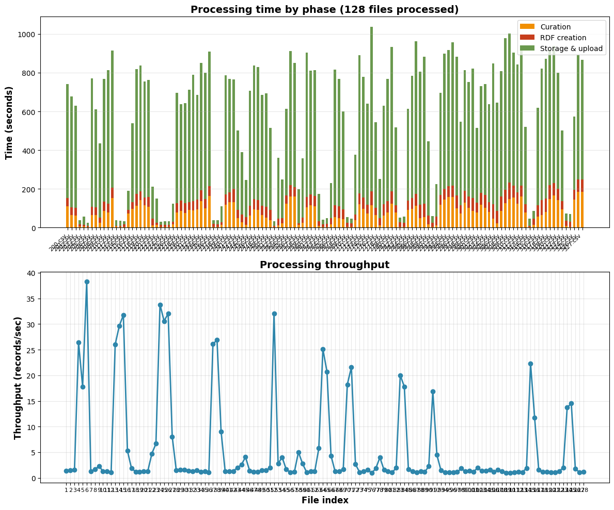
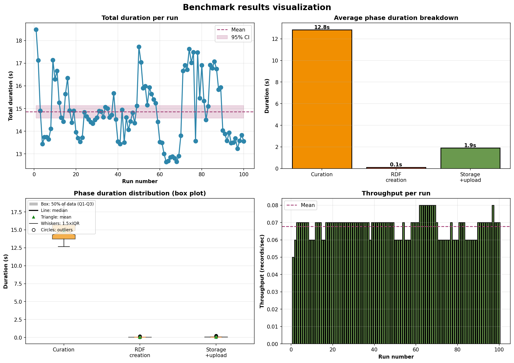
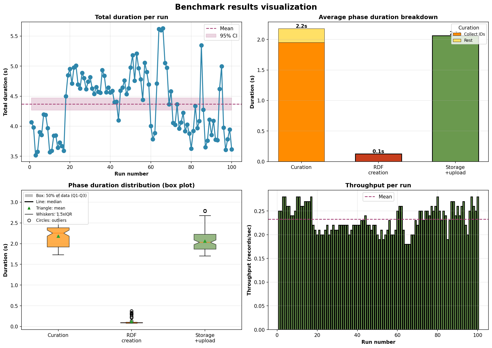
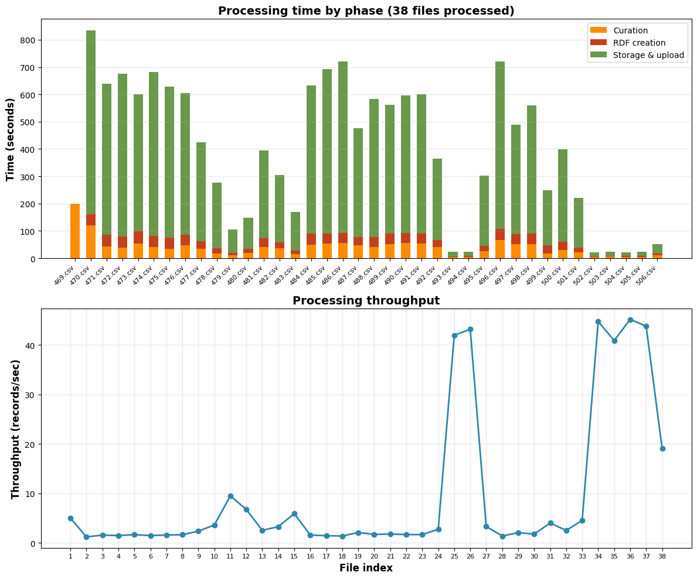
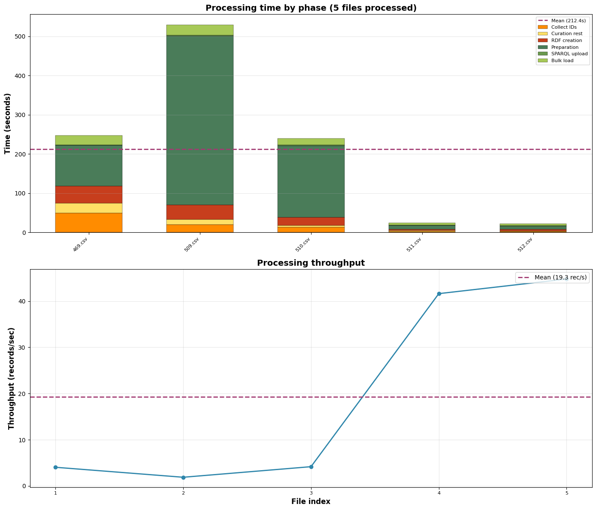
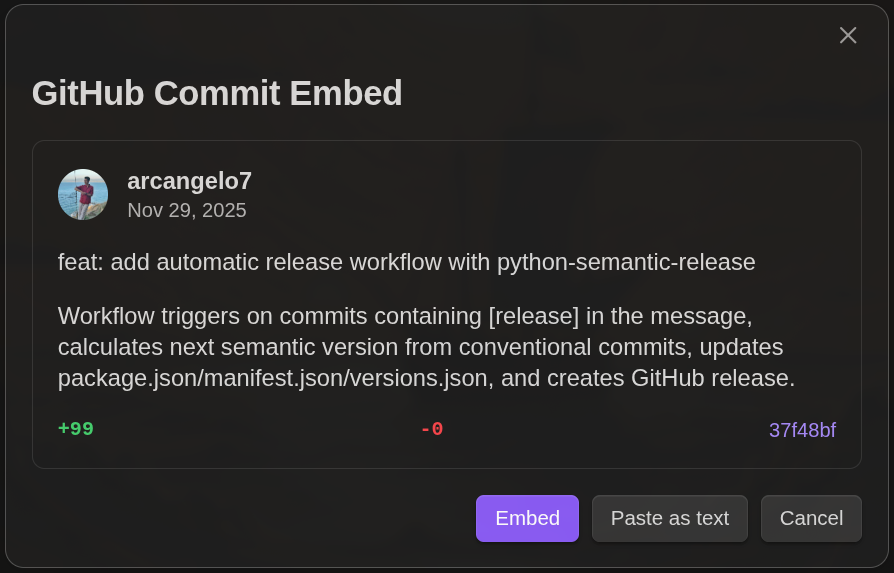

## La Novitade

### Meta

* Ricordate i 13 file in una notte di Meta? Ecco, si era bloccato. Era finito lo spazio su home, perché i log di docker non stavano ruotando e quello del database di provenance era arrivato a 70G a causa del bulk load.
  Prima: 
  Ora: 
* Ho provato a implementare un indice per soggetto, nonché un indice per valore letterale identificatore e omid identificatore risorse con quell'identificatore, per aumentare la velocità di look up delle informazioni in fase di curatela ma poi ho scoperto che RDF Lib internamente crea degli indici nel momento in cui si aggiunge una tripla a un grafo infatti ho provato, dopo aver implementato questa soluzione e aver rimosso il grafo RDF Lib locale ho provato a eseguire il benchmark e ho riscontrato sì dei miglioramenti ma molto marginali.
  Con rdflib: 
  Con indice custom: 

#### Fix

<div style="border: 1px solid #d0d7de; border-radius: 8px; padding: 16px; margin: 8px 0; background: #ffffff; font-family: -apple-system, BlinkMacSystemFont, 'Segoe UI', Helvetica, Arial, sans-serif; color: #1f2328;">
  <div style="display: flex; align-items: center; gap: 12px; margin-bottom: 12px;">
    
    <div>
      <strong style="display: block; color: #1f2328;">arcangelo7</strong>
      <span style="font-size: 0.85em; color: #656d76;">Nov 26, 2025</span>
    </div>
  </div>
  <div style="margin: 12px 0; color: #1f2328;">
    <p>refactor: fix deprecation warnings and remove obsolete scripts</p>
<ul>
<li>Fix Python 3.12+ SyntaxWarnings by using raw strings for regex patterns
in master_of_regex.py</li>
<li>Migrate from deprecated ConjunctiveGraph to Dataset across all modules</li>
<li>Replace deprecated Dataset.contexts() with Dataset.graphs()</li>
<li>Fix BeautifulSoup findAll deprecation (replaced by find_all)</li>
<li>Add spawn context to ProcessPoolExecutor and pebble.ProcessPool to
prevent fork deadlock warnings in multi-threaded environments</li>
<li>Remove obsolete scripts no longer needed in the codebase</li>
</ul>

  </div>
  <div style="display: flex; justify-content: space-between; align-items: center; font-size: 0.85em;">
    <span style="font-family: monospace; color: #1a7f37; font-weight: 600;">+37</span>
    <span style="font-family: monospace; color: #cf222e; font-weight: 600;">-1597</span>
    <a href="https://github.com/opencitations/oc_meta/commit/bbc8133b047435cd9fc9feea73901f3f5ff699e5" style="color: #0969da; text-decoration: none; font-weight: 500;">bbc8133</a>
  </div>
</div>

<div style="border: 1px solid #d0d7de; border-radius: 8px; padding: 16px; margin: 8px 0; background: #ffffff; font-family: -apple-system, BlinkMacSystemFont, 'Segoe UI', Helvetica, Arial, sans-serif; color: #1f2328;">
  <div style="display: flex; align-items: center; gap: 12px; margin-bottom: 12px;">
    
    <div>
      <strong style="display: block; color: #1f2328;">arcangelo7</strong>
      <span style="font-size: 0.85em; color: #656d76;">Nov 26, 2025</span>
    </div>
  </div>
  <div style="margin: 12px 0; color: #1f2328;">
    <p>refactor(cache): remove JSON file persistence, use Redis only</p>
<p>The cache now uses Redis exclusively for storing processed files.</p>
<ul>
<li>Make Redis a required dependency (raises RuntimeError if unavailable)</li>
<li>Update on_triplestore.py and meta_process.py to use new interface</li>
<li>Update tests to reflect Redis-only behavior</li>
</ul>

  </div>
  <div style="display: flex; justify-content: space-between; align-items: center; font-size: 0.85em;">
    <span style="font-family: monospace; color: #1a7f37; font-weight: 600;">+48</span>
    <span style="font-family: monospace; color: #cf222e; font-weight: 600;">-209</span>
    <a href="https://github.com/opencitations/oc_meta/commit/df74d0c37417fc0aebfadfa5423e2f3508bbf3f7" style="color: #0969da; text-decoration: none; font-weight: 500;">df74d0c</a>
  </div>
</div>

<div style="border: 1px solid #d0d7de; border-radius: 8px; padding: 16px; margin: 8px 0; background: #ffffff; font-family: -apple-system, BlinkMacSystemFont, 'Segoe UI', Helvetica, Arial, sans-serif; color: #1f2328;">
  <div style="display: flex; align-items: center; gap: 12px; margin-bottom: 12px;">
    
    <div>
      <strong style="display: block; color: #1f2328;">arcangelo7</strong>
      <span style="font-size: 0.85em; color: #656d76;">Nov 26, 2025</span>
    </div>
  </div>
  <div style="margin: 12px 0; color: #1f2328;">
    <p>refactor(upload): improve SPARQL upload progress bar clarity</p>
<p>Add descriptive labels to differentiate data vs provenance uploads
and hide progress bars when no SPARQL files need processing.</p>

  </div>
  <div style="display: flex; justify-content: space-between; align-items: center; font-size: 0.85em;">
    <span style="font-family: monospace; color: #1a7f37; font-weight: 600;">+11</span>
    <span style="font-family: monospace; color: #cf222e; font-weight: 600;">-7</span>
    <a href="https://github.com/opencitations/oc_meta/commit/3da0676ab13097449b744de18993c19b7bcc5cd7" style="color: #0969da; text-decoration: none; font-weight: 500;">3da0676</a>
  </div>
</div>

<div style="border: 1px solid #d0d7de; border-radius: 8px; padding: 16px; margin: 8px 0; background: #ffffff; font-family: -apple-system, BlinkMacSystemFont, 'Segoe UI', Helvetica, Arial, sans-serif; color: #1f2328;">
  <div style="display: flex; align-items: center; gap: 12px; margin-bottom: 12px;">
    
    <div>
      <strong style="display: block; color: #1f2328;">arcangelo7</strong>
      <span style="font-size: 0.85em; color: #656d76;">Nov 27, 2025</span>
    </div>
  </div>
  <div style="margin: 12px 0; color: #1f2328;">
    <p>refactor(curator): remove index file writing, keep data in RAM</p>
<p>Remove unnecessary I/O operations that wrote index files (index_id_ra.csv,
index_id_br.csv, index_ar.csv, index_re.csv, index_vi.json) to disk.
These files were never read back during processing - data flows entirely
in-memory via object attributes from Curator to Creator.</p>
<p>Changes:</p>
<ul>
<li>Remove path_index parameter from curator() and indexer() methods</li>
<li>Remove index file writing while keeping dict-to-list transformations</li>
<li>Remove indexes_dir creation in MetaProcess</li>
<li>Update tests to verify in-memory transformations</li>
<li>Remove unused json imports</li>
</ul>
<p>Enriched CSV output and test fixtures are preserved.</p>

  </div>
  <div style="display: flex; justify-content: space-between; align-items: center; font-size: 0.85em;">
    <span style="font-family: monospace; color: #1a7f37; font-weight: 600;">+6012</span>
    <span style="font-family: monospace; color: #cf222e; font-weight: 600;">-729</span>
    <a href="https://github.com/opencitations/oc_meta/commit/4a4fe156eb232ea5bc860423bfcb00c796f0c9af" style="color: #0969da; text-decoration: none; font-weight: 500;">4a4fe15</a>
  </div>
</div>
#### Feat

<div style="border: 1px solid #d0d7de; border-radius: 8px; padding: 16px; margin: 8px 0; background: #ffffff; font-family: -apple-system, BlinkMacSystemFont, 'Segoe UI', Helvetica, Arial, sans-serif; color: #1f2328;">
  <div style="display: flex; align-items: center; gap: 12px; margin-bottom: 12px;">
    
    <div>
      <strong style="display: block; color: #1f2328;">arcangelo7</strong>
      <span style="font-size: 0.85em; color: #656d76;">Nov 26, 2025</span>
    </div>
  </div>
  <div style="margin: 12px 0; color: #1f2328;">
    <p>feat(benchmark): add visualization for single-run benchmarks</p>
<p>Add plot_single_run_results function to generate graphs when running
benchmarks with runs=1. Previously no visualization was generated for
single runs. Also fix missing cache_db attribute in MetaBenchmark.</p>

  </div>
  <div style="display: flex; justify-content: space-between; align-items: center; font-size: 0.85em;">
    <span style="font-family: monospace; color: #1a7f37; font-weight: 600;">+84</span>
    <span style="font-family: monospace; color: #cf222e; font-weight: 600;">-946</span>
    <a href="https://github.com/opencitations/oc_meta/commit/2d68d3c4916107a029e28fe56fc5d9319ffcb55b" style="color: #0969da; text-decoration: none; font-weight: 500;">2d68d3c</a>
  </div>
</div>

<div style="border: 1px solid #d0d7de; border-radius: 8px; padding: 16px; margin: 8px 0; background: #ffffff; font-family: -apple-system, BlinkMacSystemFont, 'Segoe UI', Helvetica, Arial, sans-serif; color: #1f2328;">
  <div style="display: flex; align-items: center; gap: 12px; margin-bottom: 12px;">
    
    <div>
      <strong style="display: block; color: #1f2328;">arcangelo7</strong>
      <span style="font-size: 0.85em; color: #656d76;">Nov 28, 2025</span>
    </div>
  </div>
  <div style="margin: 12px 0; color: #1f2328;">
    <p>feat(benchmark): add granular curation timing with simplified 2-stack visualization</p>
<p>Add sub-phase instrumentation to Curator for performance profiling:</p>
<ul>
<li>collect_identifiers, clean_id, merge_duplicates, clean_vvi, clean_ra, finalize</li>
</ul>
<p>Simplify benchmark visualization to show only 2 stacks (Collect IDs vs Rest)
instead of 6 sub-phases, as collect_identifiers dominates processing time.</p>
<p>Extract _draw_phase_breakdown() to eliminate code duplication between
plot_single_run_results() and plot_benchmark_results().</p>

  </div>
  <div style="display: flex; justify-content: space-between; align-items: center; font-size: 0.85em;">
    <span style="font-family: monospace; color: #1a7f37; font-weight: 600;">+868</span>
    <span style="font-family: monospace; color: #cf222e; font-weight: 600;">-6186</span>
    <a href="https://github.com/opencitations/oc_meta/commit/f8ca8cdc1579d8064b0410a579f0da7cd63747e3" style="color: #0969da; text-decoration: none; font-weight: 500;">f8ca8cd</a>
  </div>
</div>


Questa immagine mostra le esecuzioni successive alla prima su un unico file con un'unica riga che contiene 3000 autori concatenati. E' inutile che io perda tempo a migliorare l'efficienza delle varie fasi del curator quando la fase di query SPARQL e di recupero delle informazioni occupa il 99% del tempo. Mi devo focalizzare esclusivamente su quella.

La soluzione è abbastanza ovvia: parallelizzare.

<div style="border: 1px solid #d0d7de; border-radius: 8px; padding: 16px; margin: 8px 0; background: #ffffff; font-family: -apple-system, BlinkMacSystemFont, 'Segoe UI', Helvetica, Arial, sans-serif; color: #1f2328;">
  <div style="display: flex; align-items: center; gap: 12px; margin-bottom: 12px;">
    
    <div>
      <strong style="display: block; color: #1f2328;">arcangelo7</strong>
      <span style="font-size: 0.85em; color: #656d76;">Nov 28, 2025</span>
    </div>
  </div>
  <div style="margin: 12px 0; color: #1f2328;">
    <p>perf(finder): parallelize SPARQL queries using ProcessPoolExecutor</p>
<p>Changes:</p>
<ul>
<li>Add module-level _execute_sparql_query() worker function for parallel execution</li>
<li>Refactor get_everything_about_res() to use ProcessPoolExecutor with spawn context</li>
<li>Parallelize batch processing at each depth level with visited subjects tracking</li>
<li>Parallelize identifier and VVI query execution</li>
<li>Remove unused blazegraph_full_text_search option</li>
<li>Use 4 workers according to benchmark results</li>
</ul>

  </div>
  <div style="display: flex; justify-content: space-between; align-items: center; font-size: 0.85em;">
    <span style="font-family: monospace; color: #1a7f37; font-weight: 600;">+9997</span>
    <span style="font-family: monospace; color: #cf222e; font-weight: 600;">-637</span>
    <a href="https://github.com/opencitations/oc_meta/commit/46c9b8c88b165d29d4e724df05a2ce3e5329b54b" style="color: #0969da; text-decoration: none; font-weight: 500;">46c9b8c</a>
  </div>
</div>

Direi che avevo ragione: 
Quanti worker? 4. Dai miei benchmark si ottengono i risultati migliori.

Risultato in produzione: 
Dal grafico non noto grandi cambiamenti, ma dal tempo previsto sì. Mancano 76 ore per completare Crossref. Prima ne mancavano tra le 400 e le 700. Devo introdurre il throughput medio perché altrimenti non si capisce niente.

<div style="border: 1px solid #d0d7de; border-radius: 8px; padding: 16px; margin: 8px 0; background: #ffffff; font-family: -apple-system, BlinkMacSystemFont, 'Segoe UI', Helvetica, Arial, sans-serif; color: #1f2328;">
  <div style="display: flex; align-items: center; gap: 12px; margin-bottom: 12px;">
    
    <div>
      <strong style="display: block; color: #1f2328;">arcangelo7</strong>
      <span style="font-size: 0.85em; color: #656d76;">Nov 29, 2025</span>
    </div>
  </div>
  <div style="margin: 12px 0; color: #1f2328;">
    <p>feat(benchmark): add granular storage timing with 3-stack visualization</p>
<p>Split storage phase into three sub-phases for bottleneck analysis:</p>
<ul>
<li>Preparation: RDF serialization + query generation (parallel)</li>
<li>SPARQL upload: query execution against triplestore</li>
<li>Bulk load: Virtuoso bulk loading (0 in standard mode)</li>
</ul>
<p>Update benchmark charts to show storage as stacked bar with legend.</p>

  </div>
  <div style="display: flex; justify-content: space-between; align-items: center; font-size: 0.85em;">
    <span style="font-family: monospace; color: #1a7f37; font-weight: 600;">+1310</span>
    <span style="font-family: monospace; color: #cf222e; font-weight: 600;">-9533</span>
    <a href="https://github.com/opencitations/oc_meta/commit/5ec6327c55650379877335e8da082efc324e7018" style="color: #0969da; text-decoration: none; font-weight: 500;">5ec6327</a>
  </div>
</div>

<div style="border: 1px solid #d0d7de; border-radius: 8px; padding: 16px; margin: 8px 0; background: #ffffff; font-family: -apple-system, BlinkMacSystemFont, 'Segoe UI', Helvetica, Arial, sans-serif; color: #1f2328;">
  <div style="display: flex; align-items: center; gap: 12px; margin-bottom: 12px;">

```
<div>
  <strong style="display: block; color: #1f2328;">arcangelo7</strong>
  <span style="font-size: 0.85em; color: #656d76;">Nov 29, 2025</span>
</div>
```

  </div>
  <div style="margin: 12px 0; color: #1f2328;">
    <p>feat(benchmark): unify production and benchmark timing charts</p>
<ul>
<li>Add 6-segment stacked bars to plot_incremental_progress matching
benchmark visualization (Collect IDs, Curation rest, RDF creation,
Preparation, SPARQL upload, Bulk load)</li>
<li>Add mean duration and throughput lines to production charts</li>
<li>Remove storage_and_upload wrapper timer to use granular sub-phases</li>
<li>Add helper functions for phase duration extraction from reports</li>
</ul>

  </div>
  <div style="display: flex; justify-content: space-between; align-items: center; font-size: 0.85em;">
    <span style="font-family: monospace; color: #1a7f37; font-weight: 600;">+218</span>
    <span style="font-family: monospace; color: #cf222e; font-weight: 600;">-2451</span>
    <a href="https://github.com/opencitations/oc_meta/commit/b2c803e302c1158985b9bd5d79b47c347fb26d53" style="color: #0969da; text-decoration: none; font-weight: 500;">b2c803e</a>
  </div>
</div>

In produzione: 

Mi sembra fuori dal mondo che la preparazione all'upload duri così tanto più dell'upload. Però non posso fare modifiche in produzione, ho bisogno di estendere il benchmark per riprodurre il caso in cui sto aggiornando tante entità preesistenti, nell'ipotesi che sia quello il problema.

<div style="border: 1px solid #d0d7de; border-radius: 8px; padding: 16px; margin: 8px 0; background: #ffffff; font-family: -apple-system, BlinkMacSystemFont, 'Segoe UI', Helvetica, Arial, sans-serif; color: #1f2328;">
  <div style="display: flex; align-items: center; gap: 12px; margin-bottom: 12px;">
    
    <div>
      <strong style="display: block; color: #1f2328;">arcangelo7</strong>
      <span style="font-size: 0.85em; color: #656d76;">Nov 29, 2025</span>
    </div>
  </div>
  <div style="margin: 12px 0; color: #1f2328;">
    <p>feat(benchmark): add update scenario</p>
<p>Add --update-scenario flag to benchmark that preloads partial data (DOI only)
then processes complete data (with venue/volume/issue/page), triggering
graph diff comparisons.</p>
<p>Changes:</p>
<ul>
<li>Add partial_data parameter to BenchmarkDataGenerator</li>
<li>Add run_update_scenario method with multi-run statistics support</li>
<li>Move config to oc_meta/run/benchmark/benchmark_config.yaml</li>
<li>Save reports to oc_meta/run/benchmark/reports/ with prefixes</li>
<li>Fix curator __meta_ar to initialize resolved_ra_metaid before loop</li>
</ul>

  </div>
  <div style="display: flex; justify-content: space-between; align-items: center; font-size: 0.85em;">
    <span style="font-family: monospace; color: #1a7f37; font-weight: 600;">+4329</span>
    <span style="font-family: monospace; color: #cf222e; font-weight: 600;">-1961</span>
    <a href="https://github.com/opencitations/oc_meta/commit/1d2d8215d1409d04b2c6deef6d25a8791a3238fd" style="color: #0969da; text-decoration: none; font-weight: 500;">1d2d821</a>
  </div>
</div>

Con 10 righe: 

Con 1000 righe: 

Ucci ucci ucci sento odor di O di n alla terzucci.

### Virtuoso utilities

#### Fix

<div style="border: 1px solid #d0d7de; border-radius: 8px; padding: 16px; margin: 8px 0; background: #ffffff; font-family: -apple-system, BlinkMacSystemFont, 'Segoe UI', Helvetica, Arial, sans-serif; color: #1f2328;">
  <div style="display: flex; align-items: center; gap: 12px; margin-bottom: 12px;">
    
    <div>
      <strong style="display: block; color: #1f2328;">arcangelo7</strong>
      <span style="font-size: 0.85em; color: #656d76;">Nov 26, 2025</span>
    </div>
  </div>
  <div style="margin: 12px 0; color: #1f2328;">
    <p>refactor(isql_helpers): always capture subprocess output</p>
<p>Remove the optional capture parameter from run_isql_command and
_run_subprocess functions. Output is now always captured, simplifying
the API and ensuring consistent behavior across all callers.</p>

  </div>
  <div style="display: flex; justify-content: space-between; align-items: center; font-size: 0.85em;">
    <span style="font-family: monospace; color: #1a7f37; font-weight: 600;">+9</span>
    <span style="font-family: monospace; color: #cf222e; font-weight: 600;">-12</span>
    <a href="https://github.com/opencitations/virtuoso_utilities/commit/ce5d3f9a7e254009aa9c0c3b539b8fc2c579d102" style="color: #0969da; text-decoration: none; font-weight: 500;">ce5d3f9</a>
  </div>
</div>

<div style="border: 1px solid #d0d7de; border-radius: 8px; padding: 16px; margin: 8px 0; background: #ffffff; font-family: -apple-system, BlinkMacSystemFont, 'Segoe UI', Helvetica, Arial, sans-serif; color: #1f2328;">
  <div style="display: flex; align-items: center; gap: 12px; margin-bottom: 12px;">
    
    <div>
      <strong style="display: block; color: #1f2328;">arcangelo7</strong>
      <span style="font-size: 0.85em; color: #656d76;">Nov 26, 2025</span>
    </div>
  </div>
  <div style="margin: 12px 0; color: #1f2328;">
    <p>fix(bulk_load): clean up load_list table before bulk load</p>
<p>[release]</p>

  </div>
  <div style="display: flex; justify-content: space-between; align-items: center; font-size: 0.85em;">
    <span style="font-family: monospace; color: #1a7f37; font-weight: 600;">+4</span>
    <span style="font-family: monospace; color: #cf222e; font-weight: 600;">-0</span>
    <a href="https://github.com/opencitations/virtuoso_utilities/commit/97d982a4039f3045f49c8bb09f23182af4c1e23f" style="color: #0969da; text-decoration: none; font-weight: 500;">97d982a</a>
  </div>
</div>

### Aldrovandi

* FIle organizzati con un criterio basato su un identificativo presente nei metadati
* Obiettivo: mettere su un sistema automatizzato per:
  * Estrarre i metadati descrittivi di ciascun oggetto
  * Provenance
* [https://github.com/dharc-org/chad-ap](https://github.com/dharc-org/chad-ap)
* Ontologia: [https://dharc-org.github.io/chad-ap/current/chad-ap.html](https://dharc-org.github.io/chad-ap/current/chad-ap.html)
  * Sviluppata da Sebastian, parlare con lui
* Dump del triplestore: [https://doi.org/10.5281/zenodo.16879033](https://doi.org/10.5281/zenodo.16879033)
* Io devo creare la provenance da caricare sullo stesso triplestore.
* Per ognuna di quelle cartelle che rappresentano un oggetto con vari file bisogna che lì dentro ci finiscano due file: meta.rdf e prov.rdf. meta.rdf deve contenere tutti i metadati delle entità per quella cartella, sia dell'oggetto fisico che dei processi per arrivarci. C'è della ridondanza. DCHOO dipende da DCHO, RWP e RAW. RAW non ha dipendenze. RAWP dipende da RAW. DCHO dipende da RAWP e RAW.
* Una volta ottenuti i file di meta.rdf e prov.rdf, Il contenuto di DCHOO e DCHO va caricato su Zenodo. Ogni cartella è un record Zenodo, per 2. 520 DOI.
* Su Zenodo solo la foglia, non l'albero, ma bisogna conservare un file di mapping tra il path e il DOI Zenodo. i metadati Zenodo li recupero dal file RDF.
* Gli autori sono gli autori dell'oggetto digitale. Sono nei metadati. Bisogna recuperare l'ORCID a mano. Sono una quindicina. Gli autori sono a cascata. Dato che per arrivare al DCHOO ho bisogno dei DCHO, gli autori di DCHOO sono entrambi. Dipende dall'oggetto.
  * Nei metadati descrittivi dell'autore c'è l'istituzione, ovvero l'affiliazione.
* Alice mi ha condiviso per mail il link a un documento Word che descrive l'organizzazione delle directory.
* Silvio mi dovrà dare accesso a un repo Sharepoint che contiene i dati veri e propri.
* Scadenza: prima di Natale

### SKG-IF Shacl extractor

Attualmente, quando una proprietà punta a un'altra classe (es. datacite:hasIdentifier -> datacite:Identifier), il codice genera:

`sh:or ( [ sh:class datacite:Identifier ] [ sh:nodeKind sh:BlankNodeOrIRI ] )`

Questo permette di avere entità oggetto senza classe specificata.

Il problema è che:

1. Se l'entità oggetto ha rdf:type datacite:Identifier, viene validata tramite datacite:IdentifierShape (perché ha sh:targetClass)
2. Se l'entità oggetto NON ha rdf:type, passa la validazione tramite sh:nodeKind sh:BlankNodeOrIRI ma NON viene validata la sua struttura interna (le proprietà che dovrebbe avere)

La soluzione è usare SH.node seguito dalla shape dell'oggetto, in modo che il nodo venga validato sulla base di una shape. La shape mantiene SH.targetClass, per consentire la validazione doppia.

## Domande

### Aldrovandi

* Nel file ttl su [https://doi.org/10.5281/zenodo.16879033](https://doi.org/10.5281/zenodo.16879033) gli URI non rispettano la naming convention. È una delle cose che verrà aggiornata nella nuova versione?
* Dov'è l'endpoint sparql? Va beh che posso anche crearmelo da solo a partire dal file ttl.
* Io cosa posso fare al momento presente?

### SKG-IF Shacl extractor

Per classi esterne senza descrizione nell'ontologia (owl:Thing, foaf:Document), cosa devo fare? Attualmente, uso sh:nodeKind sh:BlankNodeOrIRI.

Vogliamo la doppia validazione o vogliamo che le entità che possono comparire solo come oggetto siano valide solo quando compaiono come oggetto. Se ho un identificatore da solo con la sua classe datacite:Identifier voglio che sia valido o invalido?

### GitHub Commit Embed

Ho creato un plugin Obsidian per generare delle card automaticamente quando si incolla un link di un commit di GitHub: [https://github.com/arcangelo7/github-commit-embed](https://github.com/arcangelo7/github-commit-embed)

#### Stato dell'arte

| Plugin            | Funzionalità  | Supporta Commit         | Stile embeddato |
| ----------------- | ------------- | ----------------------- | --------------- |
| **GitHub Embeds** | Issues, PR    | No                      | No              |
| **GitHub Issues** | Issues        | No                      | No              |
| **Link Embed**    | Qualsiasi URL | Sì, ma preview troncato | No              |



Le card sono HTML con lo stile integrato, per essere renderizzate ovunque allo stesso modo indipendentemente dal plugin.

L'ho inviato al repo ufficiale di Obsidian, se lo accettano comparirà tra i plugin della community, altrimenti continuerò a usarlo localmente.

## Memo

* HERITRACE
  * C'è un bug che si verifica quando uno seleziona un'entità preesistente, poi clicca sulla X e inserisce i metadati a mano. Alcuni metadati vengono duplicati.
  * Se uno ripristina una sotto entità a seguito di un merge, l'entità principale potrebbe rompersi.

* Meta
  * Bisogna produrre la tabella che associa temp a OMID per produrre le citazioni.

* OpenCitations
  * Rifare dump (CrossRef e DataCite)
  * Risolvere la questione ORCID
  * Rilanciare processo eliminazione duplicati

* "reference": { "@id": "frbr:part", "@type": "@vocab" } → bibreference

* "crossref": { "@id": "biro:references", "@type": "@vocab"} → reference

* "crossref": "datacite:crossref"

* Ripubblicare dbpedia agnostica su Zenodo e si può usare time-agnostic-library su db pedia agnostica

* oc\_ocdm

  * Automatizzare mark\_as\_restored di default. è possibile disabilitare e fare a mano mark\_as\_restored.

* [https://opencitations.net/meta/api/v1/metadata/doi:10.1093/acprof:oso/9780199977628.001.0001](https://opencitations.net/meta/api/v1/metadata/doi:10.1093/acprof:oso/9780199977628.001.0001)

* Guida per Meta e cerotti

* DELETE con variabile

* Modificare Meta sulla base della tabella di Elia

* embodiment multipli devono essere purgati a monte

* Portare il Meta Editor fuori. oc\_editor

* Modificare documentazione API aggiungendo omid

* Heritrace
  * Per risolvere le performance del time-vault non usare la time-agnostic-library, ma guarda solo la query di update dello snapshot di cancellazione.
  * Ordine dato all’indice dell’elemento
  * date: formato
  * anni: essere meno stretto sugli anni. Problema ISO per 999. 0999?
  * Opzione per evitare counting
  * Opzione per non aggiungere la lista delle risorse, che posso comunque essere cercate
  * Configurabilità troppa fatica
  * Timer massimo. Timer configurabile. Messaggio in caso si stia per toccare il timer massimo.
  * Riflettere su @lang. SKOS come use case. skos:prefLabel, skos:altLabel
  * Possibilità di specificare l’URI a mano in fase di creazione
  * la base è non specificare la sorgente, perché non sarà mai quella iniziale.
  * desvription con l'entità e stata modificata. Tipo commit
  * display name è References Cited by VA bene
  * Avvertire l'utente del disastro imminente nel caso in cui provi a cancellare un volume

* Meta
  * Fusione: chi ha più metadati compilati. A parità di metadato si tiene l’omid più basso
  * Issue github parallelizzazione virtuoso
  * frbr:partOf non deve aggiungere nel merge: [https://opencitations.net/meta/api/v1/metadata/omid:br/06304322094](https://opencitations.net/meta/api/v1/metadata/omid:br/06304322094)
  * API v2
  * Usare il triplestore di provenance per fare 303 in caso di entità mergiate o mostrare la provenance in caso di cancellazione e basta.

* RML

  * Vedere come morh kgc rappresenta database internamente
  * [https://dylanvanassche.be/assets/pdf/iswc2024-krown-benchmark-rdf-graph-materialisation.pdf](https://dylanvanassche.be/assets/pdf/iswc2024-krown-benchmark-rdf-graph-materialisation.pdf)

  [https://github.com/oeg-upm/gtfs-bench](https://github.com/oeg-upm/gtfs-bench)

  * Chiedere Ionannisil diagramma che ha usato per auto rml.

* Crowdsourcing
  * Quando dobbiamo ingerire Crossref stoppo manualmente OJS. Si mette una nota nel repository per dire le cose. Ogni mese.
  * Aggiornamenti al dump incrementali. Si usa un nuovo prefisso e si aggiungono dati solo a quel CSV.
  * Bisogna usare il DOI di Zenodo come primary source. Un unico DOI per batch process.
  * Bisogna fare l’aggiornamento sulla copia e poi bisogna automatizzare lo switch
