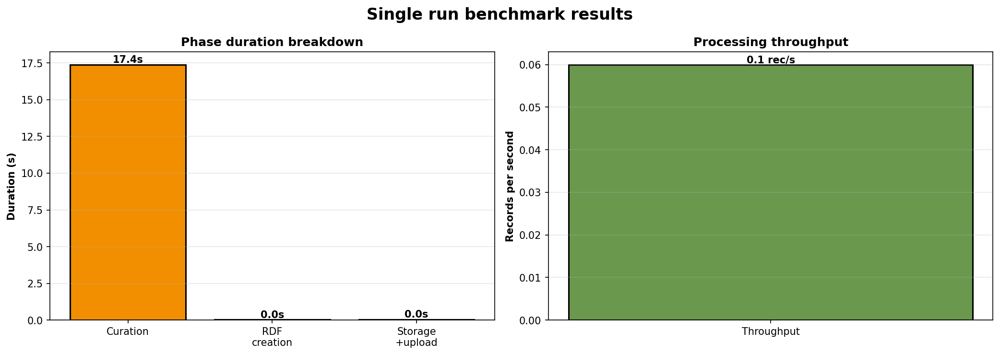

# La Novitade

## Meta

* Ricordate i 13 file in una notte di Meta? Ecco, si era bloccato. Era finito lo spazio su home, perché i log di docker non stavano ruotando e quello del database di provenance era arrivato a 70G a causa del bulk load.
  Prima: 
  Ora: 
* Ho provato a implementare un indice per soggetto, nonché un indice per valore letterale identificatore e omid identificatore risorse con quell'identificatore, per aumentare la velocità di look up delle informazioni in fase di curatela ma poi ho scoperto che RDF Lib internamente crea degli indici nel momento in cui si aggiunge una tripla a un grafo infatti ho provato, dopo aver implementato questa soluzione e aver rimosso il grafo RDF Lib locale ho provato a eseguire il benchmark e ho riscontrato sì dei miglioramenti ma molto marginali.
  Con rdflib: 
  Con indice custom: 

### Fix

```embed
title: "refactor: fix deprecation warnings and remove obsolete scripts · opencitations/oc_meta@bbc8133"
image: "https://opengraph.githubassets.com/099f31c022ae57804ecebda09b16f3d5bfbe33337cda2e5df4c5f14796b1997f/opencitations/oc_meta/commit/bbc8133b047435cd9fc9feea73901f3f5ff699e5"
description: "- Fix Python 3.12+ SyntaxWarnings by using raw strings for regex patterns   in master_of_regex.py - Migrate from deprecated ConjunctiveGraph to Dataset across all modules - Replace deprecated Datas..."
url: "https://github.com/opencitations/oc_meta/commit/bbc8133b047435cd9fc9feea73901f3f5ff699e5"
favicon: ""
aspectRatio: "50"
```

```embed
title: "refactor(cache): remove JSON file persistence, use Redis only · opencitations/oc_meta@df74d0c"
image: "https://opengraph.githubassets.com/d53cfb911c99a0b2d11c2ab7a06c62a07076b7c4b3f346a6438955aee16872a2/opencitations/oc_meta/commit/df74d0c37417fc0aebfadfa5423e2f3508bbf3f7"
description: "The cache now uses Redis exclusively for storing processed files.  - Make Redis a required dependency (raises RuntimeError if unavailable) - Update on_triplestore.py and meta_process.py to use new ..."
url: "https://github.com/opencitations/oc_meta/commit/df74d0c37417fc0aebfadfa5423e2f3508bbf3f7"
favicon: ""
aspectRatio: "50"
```

```embed
title: "refactor(upload): improve SPARQL upload progress bar clarity · opencitations/oc_meta@3da0676"
image: "https://opengraph.githubassets.com/32abdc7f3b520cc1ab37729488702e91cb0846a161f10aaf49b8aacd7bb67a33/opencitations/oc_meta/commit/3da0676ab13097449b744de18993c19b7bcc5cd7"
description: "Add descriptive labels to differentiate data vs provenance uploads and hide progress bars when no SPARQL files need processing."
url: "https://github.com/opencitations/oc_meta/commit/3da0676ab13097449b744de18993c19b7bcc5cd7"
favicon: ""
aspectRatio: "50"
```

```embed
title: "refactor(curator): remove index file writing, keep data in RAM · opencitations/oc_meta@4a4fe15"
image: "https://opengraph.githubassets.com/ed02ab02c44f7588d23152898e2b81cc17aeed7d2d2902dd597151d73a746c83/opencitations/oc_meta/commit/4a4fe156eb232ea5bc860423bfcb00c796f0c9af"
description: "Remove unnecessary I/O operations that wrote index files (index_id_ra.csv, index_id_br.csv, index_ar.csv, index_re.csv, index_vi.json) to disk. These files were never read back during processing - ..."
url: "https://github.com/opencitations/oc_meta/commit/4a4fe156eb232ea5bc860423bfcb00c796f0c9af"
favicon: ""
aspectRatio: "50"
```

### Feat

```embed
title: "feat(benchmark): add visualization for single-run benchmarks · opencitations/oc_meta@2d68d3c"
image: "https://opengraph.githubassets.com/452304cca921004124575dc1bdbea6123acd36b78f0834486055d05699f22de0/opencitations/oc_meta/commit/2d68d3c4916107a029e28fe56fc5d9319ffcb55b"
description: "Add plot_single_run_results function to generate graphs when running benchmarks with runs=1. Previously no visualization was generated for single runs. Also fix missing cache_db attribute in MetaBe..."
url: "https://github.com/opencitations/oc_meta/commit/2d68d3c4916107a029e28fe56fc5d9319ffcb55b"
favicon: ""
aspectRatio: "50"
```

```embed
title: "feat(benchmark): add granular curation timing with simplified 2-stack… · opencitations/oc_meta@f8ca8cd"
image: "https://opengraph.githubassets.com/5c885f5caadad9d8497b592695a0e186e43ff43a5d03b105e19a7c5ff3c65e6f/opencitations/oc_meta/commit/f8ca8cdc1579d8064b0410a579f0da7cd63747e3"
description: "… visualization  Add sub-phase instrumentation to Curator for performance profiling: - collect_identifiers, clean_id, merge_duplicates, clean_vvi, clean_ra, finalize  Simplify benchmark visualizati..."
url: "https://github.com/opencitations/oc_meta/commit/f8ca8cdc1579d8064b0410a579f0da7cd63747e3"
favicon: ""
aspectRatio: "50"
```


Questa immagine mostra le esecuzioni successive alla prima su un unico file con un'unica riga che contiene 3000 autori concatenati. E' inutile che io perda tempo a migliorare l'efficienza delle varie fasi del curator quando la fase di query SPARQL e di recupero delle informazioni occupa il 99% del tempo. Mi devo focalizzare esclusivamente su quella.

## Virtuoso utilities

### Fix

```embed
title: "refactor(isql_helpers): always capture subprocess output · opencitations/virtuoso_utilities@ce5d3f9"
image: "https://opengraph.githubassets.com/edc1cc52552c98825f9e5388f93da66287331e7e5e9aaa95429d41d05414d3d1/opencitations/virtuoso_utilities/commit/ce5d3f9a7e254009aa9c0c3b539b8fc2c579d102"
description: "Remove the optional capture parameter from run_isql_command and _run_subprocess functions. Output is now always captured, simplifying the API and ensuring consistent behavior across all callers."
url: "https://github.com/opencitations/virtuoso_utilities/commit/ce5d3f9a7e254009aa9c0c3b539b8fc2c579d102"
favicon: ""
aspectRatio: "50"
```

```embed
title: "fix(bulk_load): clean up load_list table before bulk load · opencitations/virtuoso_utilities@97d982a"
image: "https://opengraph.githubassets.com/6da48833cc9d3aa0ca6685db32db8cfd0444d7dc01c9edd4f09bb0fbceada6e6/opencitations/virtuoso_utilities/commit/97d982a4039f3045f49c8bb09f23182af4c1e23f"
description: "[release]"
url: "https://github.com/opencitations/virtuoso_utilities/commit/97d982a4039f3045f49c8bb09f23182af4c1e23f"
favicon: ""
aspectRatio: "50"
```

Prima: 
Dopo:

## Aldrovandi

* FIle organizzati con un criterio basato su un identificativo presente nei metadati
* Obiettivo: mettere su un sistema automatizzato per:
  * Estrarre i metadati descrittivi di ciascun oggetto
  * Provenance
* [https://github.com/dharc-org/chad-ap](https://github.com/dharc-org/chad-ap)
* Ontologia: [https://dharc-org.github.io/chad-ap/current/chad-ap.html](https://dharc-org.github.io/chad-ap/current/chad-ap.html)
  * Sviluppata da Sebastian, parlare con lui
* Dump del triplestore: [https://doi.org/10.5281/zenodo.16879033](https://doi.org/10.5281/zenodo.16879033)
* Io devo creare la provenance da caricare sullo stesso triplestore.
* Per ognuna di quelle cartelle che rappresentano un oggetto con vari file bisogna che lì dentro ci finiscano due file: meta.rdf e prov.rdf. meta.rdf deve contenere tutti i metadati delle entità per quella cartella, sia dell'oggetto fisico che dei processi per arrivarci. C'è della ridondanza. DCHOO dipende da DCHO, RWP e RAW. RAW non ha dipendenze. RAWP dipende da RAW. DCHO dipende da RAWP e RAW.
* Una volta ottenuti i file di meta.rdf e prov.rdf, Il contenuto di DCHOO e DCHO va caricato su Zenodo. Ogni cartella è un record Zenodo, per 2. 520 DOI.
* Su Zenodo solo la foglia, non l'albero, ma bisogna conservare un file di mapping tra il path e il DOI Zenodo. i metadati Zenodo li recupero dal file RDF.
* Gli autori sono gli autori dell'oggetto digitale. Sono nei metadati. Bisogna recuperare l'ORCID a mano. Sono una quindicina. Gli autori sono a cascata. Dato che per arrivare al DCHOO ho bisogno dei DCHO, gli autori di DCHOO sono entrambi. Dipende dall'oggetto.
  * Nei metadati descrittivi dell'autore c'è l'istituzione, ovvero l'affiliazione.
* Alice mi ha condiviso per mail il link a un documento Word che descrive l'organizzazione delle directory.
* Silvio mi dovrà dare accesso a un repo Sharepoint che contiene i dati veri e propri.
* Scadenza: prima di Natale

# Domande

### Aldrovandi

* Nel file ttl su [https://doi.org/10.5281/zenodo.16879033](https://doi.org/10.5281/zenodo.16879033) gli URI non rispettano la naming convention. È una delle cose che verrà aggiornata nella nuova versione?
* Dov'è l'endpoint sparql? Va beh che posso anche crearmelo da solo a partire dal file ttl.
* Io cosa posso fare al momento presente?

## Memo

* HERITRACE
  * C'è un bug che si verifica quando uno seleziona un'entità preesistente, poi clicca sulla X e inserisce i metadati a mano. Alcuni metadati vengono duplicati.
  * Se uno ripristina una sotto entità a seguito di un merge, l'entità principale potrebbe rompersi.

* Meta
  * Bisogna produrre la tabella che associa temp a OMID per produrre le citazioni.

* OpenCitations
  * Rifare dump (CrossRef e DataCite)
  * Risolvere la questione ORCID
  * Rilanciare processo eliminazione duplicati

* "reference": { "@id": "frbr:part", "@type": "@vocab" } → bibreference

* "crossref": { "@id": "biro:references", "@type": "@vocab"} → reference

* "crossref": "datacite:crossref"

* Ripubblicare dbpedia agnostica su Zenodo e si può usare time-agnostic-library su db pedia agnostica

* oc\_ocdm

  * Automatizzare mark\_as\_restored di default. è possibile disabilitare e fare a mano mark\_as\_restored.

* [https://opencitations.net/meta/api/v1/metadata/doi:10.1093/acprof:oso/9780199977628.001.0001](https://opencitations.net/meta/api/v1/metadata/doi:10.1093/acprof:oso/9780199977628.001.0001)

* Guida per Meta e cerotti

* DELETE con variabile

* Modificare Meta sulla base della tabella di Elia

* embodiment multipli devono essere purgati a monte

* Portare il Meta Editor fuori. oc\_editor

* Modificare documentazione API aggiungendo omid

* Heritrace
  * Per risolvere le performance del time-vault non usare la time-agnostic-library, ma guarda solo la query di update dello snapshot di cancellazione.
  * Ordine dato all’indice dell’elemento
  * date: formato
  * anni: essere meno stretto sugli anni. Problema ISO per 999. 0999?
  * Opzione per evitare counting
  * Opzione per non aggiungere la lista delle risorse, che posso comunque essere cercate
  * Configurabilità troppa fatica
  * Timer massimo. Timer configurabile. Messaggio in caso si stia per toccare il timer massimo.
  * Riflettere su @lang. SKOS come use case. skos:prefLabel, skos:altLabel
  * Possibilità di specificare l’URI a mano in fase di creazione
  * la base è non specificare la sorgente, perché non sarà mai quella iniziale.
  * desvription con l'entità e stata modificata. Tipo commit
  * display name è References Cited by VA bene
  * Avvertire l'utente del disastro imminente nel caso in cui provi a cancellare un volume

* Meta
  * Fusione: chi ha più metadati compilati. A parità di metadato si tiene l’omid più basso
  * Issue github parallelizzazione virtuoso
  * frbr:partOf non deve aggiungere nel merge: [https://opencitations.net/meta/api/v1/metadata/omid:br/06304322094](https://opencitations.net/meta/api/v1/metadata/omid:br/06304322094)
  * API v2
  * Usare il triplestore di provenance per fare 303 in caso di entità mergiate o mostrare la provenance in caso di cancellazione e basta.

* RML

  * Vedere come morh kgc rappresenta database internamente
  * [https://dylanvanassche.be/assets/pdf/iswc2024-krown-benchmark-rdf-graph-materialisation.pdf](https://dylanvanassche.be/assets/pdf/iswc2024-krown-benchmark-rdf-graph-materialisation.pdf)

  [https://github.com/oeg-upm/gtfs-bench](https://github.com/oeg-upm/gtfs-bench)

  * Chiedere Ionannisil diagramma che ha usato per auto rml.

* Crowdsourcing
  * Quando dobbiamo ingerire Crossref stoppo manualmente OJS. Si mette una nota nel repository per dire le cose. Ogni mese.
  * Aggiornamenti al dump incrementali. Si usa un nuovo prefisso e si aggiungono dati solo a quel CSV.
  * Bisogna usare il DOI di Zenodo come primary source. Un unico DOI per batch process.
  * Bisogna fare l’aggiornamento sulla copia e poi bisogna automatizzare lo switch
