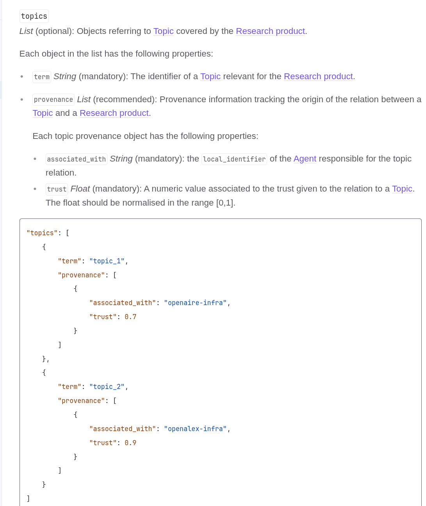

## La Novitade

### HERITRACE

<div style="border: 1px solid #d0d7de; border-radius: 8px; padding: 16px; margin: 8px 0; background: #ffffff; font-family: -apple-system, BlinkMacSystemFont, 'Segoe UI', Helvetica, Arial, sans-serif; color: #1f2328;"><div style="display: flex; align-items: center; gap: 12px; margin-bottom: 12px;"><div><strong style="display: block; color: #1f2328;">arcangelo7</strong><span style="font-size: 0.85em; color: #656d76;">May 21, 2026</span><span style="font-size: 0.85em; color: #656d76;"> &middot; </span><a href="https://github.com/opencitations/heritrace" style="font-size: 0.85em; color: #0969da; text-decoration: none;">opencitations/heritrace</a></div></div><div style="margin: 12px 0; color: #1f2328;"><p>fix(search): close entity search dropdown on outside click</p>
<p>Previously the dropdown only closed when clicking &quot;Create new entity&quot;.
Add focusout handler on the search input and a document-level mousedown
fallback so clicking anywhere outside the dropdown dismisses it.</p></div><div style="display: flex; justify-content: space-between; align-items: center; font-size: 0.85em;"><span style="font-family: monospace; color: #1a7f37; font-weight: 600;">+17</span><span style="font-family: monospace; color: #cf222e; font-weight: 600;">-10</span><a href="https://github.com/opencitations/heritrace/commit/91ba6f50ba5a9a1308bc88d7ed635d46472e2953" style="color: #0969da; text-decoration: none; font-weight: 500;">91ba6f5</a></div></div>

### CHANGES

<div style="border: 1px solid #d0d7de; border-radius: 8px; padding: 16px; margin: 8px 0; background: #ffffff; font-family: -apple-system, BlinkMacSystemFont, 'Segoe UI', Helvetica, Arial, sans-serif; color: #1f2328;"><div style="display: flex; align-items: center; gap: 12px; margin-bottom: 12px;"><div><strong style="display: block; color: #1f2328;">arcangelo7</strong><span style="font-size: 0.85em; color: #656d76;">May 22, 2026</span><span style="font-size: 0.85em; color: #656d76;"> &middot; </span><a href="https://github.com/dharc-org/changes-metadata-manager" style="font-size: 0.85em; color: #0969da; text-decoration: none;">dharc-org/changes-metadata-manager</a></div></div><div style="margin: 12px 0; color: #1f2328;"><p>fix: Fix metadata extraction to follow P1_is_identified_by two levels
deep so P190_has_symbolic_content reaches appellations</p>
<p>Update FOLDER_TO_ID for renamed SharePoint folders (vetrina_8_basso
split into _2, _3)</p></div><div style="display: flex; justify-content: space-between; align-items: center; font-size: 0.85em;"><span style="font-family: monospace; color: #1a7f37; font-weight: 600;">+14430</span><span style="font-family: monospace; color: #cf222e; font-weight: 600;">-11035</span><a href="https://github.com/dharc-org/changes-metadata-manager/commit/59da8f7bd2ea1a8229fb58b4512301aafb25997d" style="color: #0969da; text-decoration: none; font-weight: 500;">59da8f7</a></div></div>

<div style="border: 1px solid #d0d7de; border-radius: 8px; padding: 16px; margin: 8px 0; background: #ffffff; font-family: -apple-system, BlinkMacSystemFont, 'Segoe UI', Helvetica, Arial, sans-serif; color: #1f2328;"><div style="display: flex; align-items: center; gap: 12px; margin-bottom: 12px;"><div><strong style="display: block; color: #1f2328;">arcangelo7</strong><span style="font-size: 0.85em; color: #656d76;">May 22, 2026</span><span style="font-size: 0.85em; color: #656d76;"> &middot; </span><a href="https://github.com/dharc-org/changes-metadata-manager" style="font-size: 0.85em; color: #0969da; text-decoration: none;">dharc-org/changes-metadata-manager</a></div></div><div style="margin: 12px 0; color: #1f2328;"><p>fix(zenodo): determine license directly from meta.ttl instead of KG entity ID matching</p>
<p>The previous approach queried the knowledge graph with entity IDs to
build a licensed_stages set, which broke for grouped entities (98a/b/c)
whose base ID didn&#39;t match any license URI. Replace with two-pass
approach in create_stage_zip: first scan each folder&#39;s meta.ttl for
license triples, then zip all files accordingly.</p>
<p>Also adds a rate-limit sleep between Zenodo uploads.</p></div><div style="display: flex; justify-content: space-between; align-items: center; font-size: 0.85em;"><span style="font-family: monospace; color: #1a7f37; font-weight: 600;">+151</span><span style="font-family: monospace; color: #cf222e; font-weight: 600;">-42</span><a href="https://github.com/dharc-org/changes-metadata-manager/commit/29451cacc764077e5fbf0439df7e29fb36a0d736" style="color: #0969da; text-decoration: none; font-weight: 500;">29451ca</a></div></div>

<div style="border: 1px solid #d0d7de; border-radius: 8px; padding: 16px; margin: 8px 0; background: #ffffff; font-family: -apple-system, BlinkMacSystemFont, 'Segoe UI', Helvetica, Arial, sans-serif; color: #1f2328;"><div style="display: flex; align-items: center; gap: 12px; margin-bottom: 12px;"><div><strong style="display: block; color: #1f2328;">arcangelo7</strong><span style="font-size: 0.85em; color: #656d76;">May 22, 2026</span><span style="font-size: 0.85em; color: #656d76;"> &middot; </span><a href="https://github.com/dharc-org/changes-metadata-manager" style="font-size: 0.85em; color: #0969da; text-decoration: none;">dharc-org/changes-metadata-manager</a></div></div><div style="margin: 12px 0; color: #1f2328;"><p>feat(zenodo): add publish-drafts subcommand for two-phase upload workflow</p>
<p>Uploads without --publish now save draft IDs to drafts.json, allowing
deferred batch publishing via <code>publish-drafts</code></p></div><div style="display: flex; justify-content: space-between; align-items: center; font-size: 0.85em;"><span style="font-family: monospace; color: #1a7f37; font-weight: 600;">+99</span><span style="font-family: monospace; color: #cf222e; font-weight: 600;">-3</span><a href="https://github.com/dharc-org/changes-metadata-manager/commit/fab4a1ea3380db2107e029bdf6373f1c833e4be4" style="color: #0969da; text-decoration: none; font-weight: 500;">fab4a1e</a></div></div>

<div style="border: 1px solid #d0d7de; border-radius: 8px; padding: 16px; margin: 8px 0; background: #ffffff; font-family: -apple-system, BlinkMacSystemFont, 'Segoe UI', Helvetica, Arial, sans-serif; color: #1f2328;"><div style="display: flex; align-items: center; gap: 12px; margin-bottom: 12px;"><div><strong style="display: block; color: #1f2328;">arcangelo7</strong><span style="font-size: 0.85em; color: #656d76;">May 22, 2026</span><span style="font-size: 0.85em; color: #656d76;"> &middot; </span><a href="https://github.com/dharc-org/changes-metadata-manager" style="font-size: 0.85em; color: #0969da; text-decoration: none;">dharc-org/changes-metadata-manager</a></div></div><div style="margin: 12px 0; color: #1f2328;"><p>feat(zenodo): add crash-safe resume for upload and publish</p></div><div style="display: flex; justify-content: space-between; align-items: center; font-size: 0.85em;"><span style="font-family: monospace; color: #1a7f37; font-weight: 600;">+564</span><span style="font-family: monospace; color: #cf222e; font-weight: 600;">-66</span><a href="https://github.com/dharc-org/changes-metadata-manager/commit/ade0d0b9c4d179fbabcec349c264888a6877eeee" style="color: #0969da; text-decoration: none; font-weight: 500;">ade0d0b</a></div></div>

### RAMOSE

<div style="border: 1px solid #d0d7de; border-radius: 8px; padding: 16px; margin: 8px 0; background: #ffffff; font-family: -apple-system, BlinkMacSystemFont, 'Segoe UI', Helvetica, Arial, sans-serif; color: #1f2328;"><div style="display: flex; align-items: center; gap: 12px; margin-bottom: 12px;"><div><strong style="display: block; color: #1f2328;">arcangelo7</strong><span style="font-size: 0.85em; color: #656d76;">May 23, 2026</span><span style="font-size: 0.85em; color: #656d76;"> &middot; </span><a href="https://github.com/opencitations/ramose" style="font-size: 0.85em; color: #0969da; text-decoration: none;">opencitations/ramose</a></div></div><div style="margin: 12px 0; color: #1f2328;"><p>feat: expand SKG-IF converter to full product data model</p>
<p>Add proof-of-concept .hf configurations for ORKG and Wikidata, plus
documentation page</p></div><div style="display: flex; justify-content: space-between; align-items: center; font-size: 0.85em;"><span style="font-family: monospace; color: #1a7f37; font-weight: 600;">+944</span><span style="font-family: monospace; color: #cf222e; font-weight: 600;">-193</span><a href="https://github.com/opencitations/ramose/commit/7094f8c292c28a7339d7d6bf480d6fadc2c210b3" style="color: #0969da; text-decoration: none; font-weight: 500;">7094f8c</a></div></div>

<div style="border: 1px solid #d0d7de; border-radius: 8px; padding: 16px; margin: 8px 0; background: #ffffff; font-family: -apple-system, BlinkMacSystemFont, 'Segoe UI', Helvetica, Arial, sans-serif; color: #1f2328;"><div style="display: flex; align-items: center; gap: 12px; margin-bottom: 12px;"><div><strong style="display: block; color: #1f2328;">arcangelo7</strong><span style="font-size: 0.85em; color: #656d76;">May 23, 2026</span><span style="font-size: 0.85em; color: #656d76;"> &middot; </span><a href="https://github.com/opencitations/ramose" style="font-size: 0.85em; color: #0969da; text-decoration: none;">opencitations/ramose</a></div></div><div style="margin: 12px 0; color: #1f2328;"><p>fix(skg-if): single-entity endpoints now return 404 when the entity is not found</p></div><div style="display: flex; justify-content: space-between; align-items: center; font-size: 0.85em;"><span style="font-family: monospace; color: #1a7f37; font-weight: 600;">+196</span><span style="font-family: monospace; color: #cf222e; font-weight: 600;">-150</span><a href="https://github.com/opencitations/ramose/commit/5f24550d8fc05e566cfd6b12c926877c3585eddb" style="color: #0969da; text-decoration: none; font-weight: 500;">5f24550</a></div></div>

<div style="border: 1px solid #d0d7de; border-radius: 8px; padding: 16px; margin: 8px 0; background: #ffffff; font-family: -apple-system, BlinkMacSystemFont, 'Segoe UI', Helvetica, Arial, sans-serif; color: #1f2328;"><div style="display: flex; align-items: center; gap: 12px; margin-bottom: 12px;"><div><strong style="display: block; color: #1f2328;">arcangelo7</strong><span style="font-size: 0.85em; color: #656d76;">May 24, 2026</span><span style="font-size: 0.85em; color: #656d76;"> &middot; </span><a href="https://github.com/opencitations/ramose" style="font-size: 0.85em; color: #0969da; text-decoration: none;">opencitations/ramose</a></div></div><div style="margin: 12px 0; color: #1f2328;"><p>refactor(skg-if): move skgif_addon into the ramose package</p>
<p>The addon loader now supports dotted names (e.g. ramose.skgif_addon),
resolved as standard Python package imports rather than filesystem
paths.</p>
<p>A getting-started guide is added to the SKG-IF documentation.</p></div><div style="display: flex; justify-content: space-between; align-items: center; font-size: 0.85em;"><span style="font-family: monospace; color: #1a7f37; font-weight: 600;">+68</span><span style="font-family: monospace; color: #cf222e; font-weight: 600;">-12</span><a href="https://github.com/opencitations/ramose/commit/50f82bc49615c5adec2e5a86c340028d5ee241c0" style="color: #0969da; text-decoration: none; font-weight: 500;">50f82bc</a></div></div>

### oc-botwatch

<div style="border: 1px solid #d0d7de; border-radius: 8px; padding: 16px; margin: 8px 0; background: #ffffff; font-family: -apple-system, BlinkMacSystemFont, 'Segoe UI', Helvetica, Arial, sans-serif; color: #1f2328;"><div style="display: flex; align-items: center; gap: 12px; margin-bottom: 12px;"><div><strong style="display: block; color: #1f2328;">arcangelo7</strong><span style="font-size: 0.85em; color: #656d76;">May 19, 2026</span><span style="font-size: 0.85em; color: #656d76;"> &middot; </span><a href="https://github.com/arcangelo7/oc-botwatch" style="font-size: 0.85em; color: #0969da; text-decoration: none;">arcangelo7/oc-botwatch</a></div></div><div style="margin: 12px 0; color: #1f2328;"><p>feat: classify traffic by service (web, api, sparql)</p></div><div style="display: flex; justify-content: space-between; align-items: center; font-size: 0.85em;"><span style="font-family: monospace; color: #1a7f37; font-weight: 600;">+1306</span><span style="font-family: monospace; color: #cf222e; font-weight: 600;">-31</span><a href="https://github.com/arcangelo7/oc-botwatch/commit/15fbd0d6f2f15d2a281cf993d49d169b4439a839" style="color: #0969da; text-decoration: none; font-weight: 500;">15fbd0d</a></div></div>

[https://doi.org/10.5281/zenodo.20289872](https://doi.org/10.5281/zenodo.20289872)

### Domande

#### Aldrovandi

* Ho ad aggiornare le shapes di CHAD-AP utilizzando lo shacl-extracto, ma la generazione crasha perché il namespace di edtf è utilizzato come prefisso senza essere dichiarato. Ari, come hai fatto ad aggiornare le shapes?
  * Ho aggiornato le shapes manualmente per gestire edtf e la validazione ora passa. Mi ha detto Seba che il problema è complesso, perché Widoco toglie automaticamente i prefissi non utilizzati (noi li utilizziamo ma nella descrizione).
* Ho notato che la primary source su Zenodo contiene i CSV, ma non il KG generato da Morph-kgc. È voluto? [https://doi.org/10.5281/zenodo.19898905](https://doi.org/10.5281/zenodo.19898905)

#### SKG-IF

* In base a cosa vengono messe le maiuscole o le minuscole nelle colone delle label. Ho visto che Expression aveva la maiuscola, ma in [https://opencitations.github.io/ontology/current/ontology.html](https://opencitations.github.io/ontology/current/ontology.html) ha la minuscola.

* SKG-O usa fabio:Software, ma non è davvero definito in fabio, che invece definisce fabio:ComputerProgram

* fabio:ComputerProgram non è definito in oco

* Riutilizzare delle classi che in Fabio sono a livello Expression per utilizzarle a livello Work in SKG-O non è un errore logico?

* Perché SKG-O utilizza pro:isRelatedToRoleInTime con lo stesso significato di pro:isDocumentContextFor, ma solo per i research products, mentre usa pro:isDocumentContextFor per venues?

* Devo inserire tutte le classi e le proprietà che noi non mappiamo?

* Noi per campi tipo abstract dovremmo restituire il campo vuoto o non dovremmo proprio restituire il campo?
  
  Quel topic\_1 dovrebbe essere un local\_identifier, quindi un IRI, giusto? In ogni caso, la documentazione è incompleta, mancano tutte le altre proprietà dei topic, come ad esempio gli identificatori esterni e le label.

  In generale, a me sembra che la documentazione testuale non sia aggiornata, per esempio, declared affiliations, funding, relevant organizations, nella documentazione testuale sono liste di identificatori, mentre nella documentazione OpenAPI sono liste di oggetti.

C'è un'inconsistenza tra il comportamento di RAMOSE e la specifica SKG-IF per quanto riguarda le query che non trovano nessun risultato. RAMOSE attualmente ritorna a lista vuota, mentre SKG-IF dice che bisogna ritornare 404. Al momento sto gestendo la differenza via addon.

Secondo me c'è anche un'inconsistenza all'interno di SKG-IF, nel senso che SKG-IF dice di ritornare una lista vuota per operazioni che ritornano liste e 404 per operazioni su entità singole ([https://skg-if.github.io/api/openapi/ver/current/skg-if-openapi.yaml](https://skg-if.github.io/api/openapi/ver/current/skg-if-openapi.yaml)).

Mi sono accorto che le shapes di skg-if validano schemi non ammessi, come zenodo o sha, e che validano valori che non rispettano lo schema. Il primo problema si risolve con

```
* datacite:usesIdentifierScheme -[1]-> {datacite:doi datacite:isbn datacite:orcid}
```

sintassi già supportata dall'extractor. Il secondo?

## Memo

TAL

* Aggiungere skolemizzazione

Vizioso

* [https://en.wikipedia.org/wiki/Compilers:\_Principles,\_Techniques,\_and\_Tools](https://en.wikipedia.org/wiki/Compilers:_Principles,_Techniques,_and_Tools)
* [https://en.wikipedia.org/wiki/GNU\_Bison](https://en.wikipedia.org/wiki/GNU_Bison)
* [https://en.wikipedia.org/wiki/Yacc](https://en.wikipedia.org/wiki/Yacc)

HERITRACE

* C'è un bug che si verifica quando uno seleziona un'entità preesistente, poi clicca sulla X e inserisce i metadati a mano. Alcuni metadati vengono duplicati.
* Se uno ripristina una sotto entità a seguito di un merge, l'entità principale potrebbe rompersi.
* Per risolvere le performance del time-vault non usare la time-agnostic-library, ma guarda solo la query di update dello snapshot di cancellazione.
* Ordine dato all’indice dell’elemento
* date: formato
* anni: essere meno stretto sugli anni. Problema ISO per 999. 0999?
* Opzione per evitare counting
* Opzione per non aggiungere la lista delle risorse, che posso comunque essere cercate
* Configurabilità troppa fatica
* Timer massimo. Timer configurabile. Messaggio in caso si stia per toccare il timer massimo.
* Riflettere su @lang. SKOS come use case. skos:prefLabel, skos:altLabel
* Possibilità di specificare l’URI a mano in fase di creazione
* la base è non specificare la sorgente, perché non sarà mai quella iniziale.
* desvription con l'entità e stata modificata. Tipo commit
* display name è References Cited by VA bene
* Avvertire l'utente del disastro imminente nel caso in cui provi a cancellare un volume

Meta

* Matilda e OUTCITE nella prossima versione
* Rilanciare processo eliminazione duplicati
* Fusione: chi ha più metadati compilati. A parità di metadato si tiene l’omid più basso
* frbr:partOf non deve aggiungere nel merge: [https://opencitations.net/meta/api/v1/metadata/omid:br/06304322094](https://opencitations.net/meta/api/v1/metadata/omid:br/06304322094)
* API v2
* Usare il triplestore di provenance per fare 303 in caso di entità mergiate o mostrare la provenance in caso di cancellazione e basta.

oc\_ocdm

* Automatizzare mark\_as\_restored di default. è possibile disabilitare e fare a mano mark\_as\_restored.
* [https://opencitations.net/meta/api/v1/metadata/doi:10.1093/acprof:oso/9780199977628.001.0001](https://opencitations.net/meta/api/v1/metadata/doi:10.1093/acprof:oso/9780199977628.001.0001)
* DELETE con variabile
* Modificare Meta sulla base della tabella di Elia
* embodiment multipli devono essere purgati a monte
* Modificare documentazione API aggiungendo omid

RML

* Vedere come morh kgc rappresenta database internamente
* [https://github.com/oeg-upm/gtfs-bench](https://github.com/oeg-upm/gtfs-bench)
* Chiedere Ionannisil diagramma che ha usato per auto rml.

Crowdsourcing

* Quando dobbiamo ingerire Crossref stoppo manualmente OJS. Si mette una nota nel repository per dire le cose. Ogni mese.
* Aggiornamenti al dump incrementali. Si usa un nuovo prefisso e si aggiungono dati solo a quel CSV.
* Bisogna usare il DOI di Zenodo come primary source. Un unico DOI per batch process.
* Bisogna fare l’aggiornamento sulla copia e poi bisogna automatizzare lo switch
