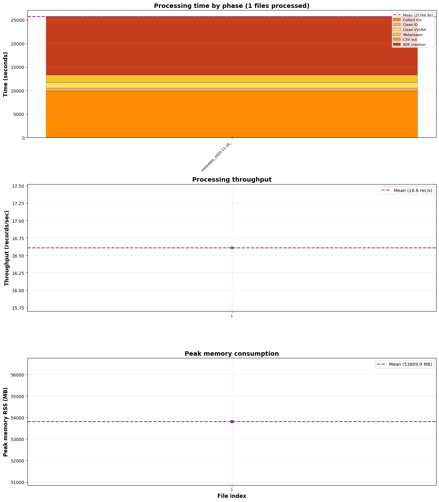

## La Novitade

### Meta

#### TripleLite

<div style="border: 1px solid #d0d7de; border-radius: 8px; padding: 16px; margin: 8px 0; background: #ffffff; font-family: -apple-system, BlinkMacSystemFont, 'Segoe UI', Helvetica, Arial, sans-serif; color: #1f2328;"><div style="display: flex; align-items: center; gap: 12px; margin-bottom: 12px;"><div><strong style="display: block; color: #1f2328;">arcangelo7</strong><span style="font-size: 0.85em; color: #656d76;">Apr 15, 2026</span><span style="font-size: 0.85em; color: #656d76;"> &middot; </span><a href="https://github.com/opencitations/triplelite" style="font-size: 0.85em; color: #0969da; text-decoration: none;">opencitations/triplelite</a></div></div><div style="margin: 12px 0; color: #1f2328;"><p>perf: intern strings and terms as integer IDs in internal indices</p>
<p>Store subjects, predicates, and objects as integer IDs internally,
mapping back to strings/RDFTerms only at the public API boundary.
Reduces memory for repeated URIs and speeds up set operations
(int hashing/comparison vs full string).</p>
<p>Add add_many() for batch insertion with cached lookups, avoiding
per-call method overhead. Update rdflib bridge and subgraph to
use it.</p></div><div style="display: flex; justify-content: space-between; align-items: center; font-size: 0.85em;"><span style="font-family: monospace; color: #1a7f37; font-weight: 600;">+422</span><span style="font-family: monospace; color: #cf222e; font-weight: 600;">-105</span><a href="https://github.com/opencitations/triplelite/commit/b631e9abec4bb9c47605455a13da5f5dbb43b502" style="color: #0969da; text-decoration: none; font-weight: 500;">b631e9a</a></div></div>

Stesse triple in 4 posti:

1. finder.graph, cache grande condivisa
2. subgraph temporaneo, vive durante `__init__`, poi GC'd
3. GraphEntity.g, TripleLite per-entità in oc\_ocdm
4. `GraphEntity._preexisting_triples`, frozenset per calcolo diff

No buono.

<div style="border: 1px solid #d0d7de; border-radius: 8px; padding: 16px; margin: 8px 0; background: #ffffff; font-family: -apple-system, BlinkMacSystemFont, 'Segoe UI', Helvetica, Arial, sans-serif; color: #1f2328;"><div style="display: flex; align-items: center; gap: 12px; margin-bottom: 12px;"><div><strong style="display: block; color: #1f2328;">arcangelo7</strong><span style="font-size: 0.85em; color: #656d76;">Apr 16, 2026</span><span style="font-size: 0.85em; color: #656d76;"> &middot; </span><a href="https://github.com/opencitations/triplelite" style="font-size: 0.85em; color: #0969da; text-decoration: none;">opencitations/triplelite</a></div></div><div style="margin: 12px 0; color: #1f2328;"><p>feat: replace subgraph copy with zero-copy SubgraphView [release]</p>
<p>subgraph() now returns a read-only SubgraphView that references
the parent graph&#39;s internal data directly. The view reflects
subsequent changes to the parent and supports iteration, length,
predicate_objects(), and set operations.</p></div><div style="display: flex; justify-content: space-between; align-items: center; font-size: 0.85em;"><span style="font-family: monospace; color: #1a7f37; font-weight: 600;">+120</span><span style="font-family: monospace; color: #cf222e; font-weight: 600;">-24</span><a href="https://github.com/opencitations/triplelite/commit/4326f1ad9c70b683a4de245772b0f01933745377" style="color: #0969da; text-decoration: none; font-weight: 500;">4326f1a</a></div></div>

 <span class="sl-obs-tag">#TODO</span> Questa libreria va chiaramente riscritta in C. È piccola, semplice, già scritta col C in mente.

#### JaLC

```bash
Total Duration: 28733.617s (7.9 ore)
Total Records: 2_504_478
Total Entities: 14_136_038
Peak Memory (RSS): 30283.4 MB
```

#### OUTCITE

```bash
Total Duration: 138883.274s (38,7 ore)
Total Records: 2_306_758
Total Entities: 15_707_992
Peak Memory (RSS): 53809.9 MB
```



### OC\_OCDM

<div style="border: 1px solid #d0d7de; border-radius: 8px; padding: 16px; margin: 8px 0; background: #ffffff; font-family: -apple-system, BlinkMacSystemFont, 'Segoe UI', Helvetica, Arial, sans-serif; color: #1f2328;"><div style="display: flex; align-items: center; gap: 12px; margin-bottom: 12px;"><div><strong style="display: block; color: #1f2328;">arcangelo7</strong><span style="font-size: 0.85em; color: #656d76;">Apr 14, 2026</span><span style="font-size: 0.85em; color: #656d76;"> &middot; </span><a href="https://github.com/opencitations/oc_ocdm" style="font-size: 0.85em; color: #0969da; text-decoration: none;">opencitations/oc_ocdm</a></div></div><div style="margin: 12px 0; color: #1f2328;"><p>refactor!: replace rdflib Graph/URIRef with lightweight LightGraph/str</p>
<p>BREAKING CHANGE: entity.res is now str (was URIRef), entity.g is now
LightGraph (was rdflib.Graph), all factory methods accept str instead
of URIRef, all getters return str instead of URIRef</p></div><div style="display: flex; justify-content: space-between; align-items: center; font-size: 0.85em;"><span style="font-family: monospace; color: #1a7f37; font-weight: 600;">+1179</span><span style="font-family: monospace; color: #cf222e; font-weight: 600;">-1019</span><a href="https://github.com/opencitations/oc_ocdm/commit/355f76a3ee2498ab853ba18a1333095cb2321f07" style="color: #0969da; text-decoration: none; font-weight: 500;">355f76a</a></div></div>

Rilascio un'autorizzazione a buongiorno principessarmi: ho capito solo ora a cosa serva il context nei file json-ld e mi piace molto.

<div style="border: 1px solid #d0d7de; border-radius: 8px; padding: 16px; margin: 8px 0; background: #ffffff; font-family: -apple-system, BlinkMacSystemFont, 'Segoe UI', Helvetica, Arial, sans-serif; color: #1f2328;"><div style="display: flex; align-items: center; gap: 12px; margin-bottom: 12px;"><div><strong style="display: block; color: #1f2328;">arcangelo7</strong><span style="font-size: 0.85em; color: #656d76;">Apr 16, 2026</span><span style="font-size: 0.85em; color: #656d76;"> &middot; </span><a href="https://github.com/opencitations/metadata" style="font-size: 0.85em; color: #0969da; text-decoration: none;">opencitations/metadata</a></div></div><div style="margin: 12px 0; color: #1f2328;"><p>feat: extend context with new types, identifiers, and restructured properties</p>
<p>Add type mappings for document parts (abstract, introduction,
discussion, methods, results, conclusion, related_work, materials),
document types (archival_document, audio_document, computer_program,
editorial, journal_editorial, newspaper, newspaper_article,
newspaper_editorial, newspaper_issue, presentation,
data_management_plan, retraction_notice), and has_annotation property.</p>
<p>Add identifier schemes: intrepid, jid, openalex, ror, wikidata,
wikipedia.</p></div><div style="display: flex; justify-content: space-between; align-items: center; font-size: 0.85em;"><span style="font-family: monospace; color: #1a7f37; font-weight: 600;">+29</span><span style="font-family: monospace; color: #cf222e; font-weight: 600;">-2</span><a href="https://github.com/opencitations/metadata/commit/708e1327fe61baef0628670793688751af077650" style="color: #0969da; text-decoration: none; font-weight: 500;">708e132</a></div></div>

<div style="border: 1px solid #d0d7de; border-radius: 8px; padding: 16px; margin: 8px 0; background: #ffffff; font-family: -apple-system, BlinkMacSystemFont, 'Segoe UI', Helvetica, Arial, sans-serif; color: #1f2328;"><div style="display: flex; align-items: center; gap: 12px; margin-bottom: 12px;"><div><strong style="display: block; color: #1f2328;">arcangelo7</strong><span style="font-size: 0.85em; color: #656d76;">Apr 16, 2026</span><span style="font-size: 0.85em; color: #656d76;"> &middot; </span><a href="https://github.com/opencitations/oc_ocdm" style="font-size: 0.85em; color: #0969da; text-decoration: none;">opencitations/oc_ocdm</a></div></div><div style="margin: 12px 0; color: #1f2328;"><p>refactor(context): add meta namespace prefixes and prune redundant aliases</p>
<p>Introduce short prefixes (<code>br</code>, <code>ar</code>, <code>ra</code>, <code>id</code>, <code>re</code>, <code>pa</code>) for the <code>https://w3id.org/oc/meta/</code> namespace.</p>
<p>Since <code>id</code> now points to the identifier namespace, the former <code>id</code> term for <code>literal:hasLiteralValue</code> is renamed to <code>literal_value</code>.</p>
<p>Drop three redundant aliases: <code>proceedings_series</code> duplicated <code>series</code> (both <code>fabio:Series</code>), and <code>xpath</code> / <code>xmlid</code> duplicated <code>localresource</code> (all three <code>datacite:local-resource-identifier-scheme</code>).</p></div><div style="display: flex; justify-content: space-between; align-items: center; font-size: 0.85em;"><span style="font-family: monospace; color: #1a7f37; font-weight: 600;">+9</span><span style="font-family: monospace; color: #cf222e; font-weight: 600;">-5</span><a href="https://github.com/opencitations/oc_ocdm/commit/6683869d598132a78e572624b1e5dd3c570a1073" style="color: #0969da; text-decoration: none; font-weight: 500;">6683869</a></div></div>

### JaLC

Trovato questo in JaLC

```json
"journal_title_name_list":[
    {"journal_title_name":"金大考古\nen: The Archaeological Journal of Kanazawa University"}
]
```

<div style="border: 1px solid #d0d7de; border-radius: 8px; padding: 16px; margin: 8px 0; background: #ffffff; font-family: -apple-system, BlinkMacSystemFont, 'Segoe UI', Helvetica, Arial, sans-serif; color: #1f2328;"><div style="display: flex; align-items: center; gap: 12px; margin-bottom: 12px;"><div><strong style="display: block; color: #1f2328;">arcangelo7</strong><span style="font-size: 0.85em; color: #656d76;">Apr 17, 2026</span><span style="font-size: 0.85em; color: #656d76;"> &middot; </span><a href="https://github.com/opencitations/oc_ds_converter" style="font-size: 0.85em; color: #0969da; text-decoration: none;">opencitations/oc_ds_converter</a></div></div><div style="margin: 12px 0; color: #1f2328;"><p>fix(jalc): split packed multilang entries to keep CSV cells single-line</p>
<p>JaLC records occasionally collapse multiple languages into a single
untagged title/journal entry separated by &#39;\n&#39; with an inline &quot;en:&quot;
prefix (observed on 10.24517/0002000619). The extractor
previously passed the raw string through, producing CSV rows with
embedded newlines. Detect the packed-lang pattern, split it into
per-language entries, and collapse residual whitespace on the chosen
value so single-line cells are preserved.</p></div><div style="display: flex; justify-content: space-between; align-items: center; font-size: 0.85em;"><span style="font-family: monospace; color: #1a7f37; font-weight: 600;">+111</span><span style="font-family: monospace; color: #cf222e; font-weight: 600;">-6</span><a href="https://github.com/opencitations/oc_ds_converter/commit/0c8e357e665030694c2bece70b9bdbac0b50252b" style="color: #0969da; text-decoration: none; font-weight: 500;">0c8e357</a></div></div>

<div style="border: 1px solid #d0d7de; border-radius: 8px; padding: 16px; margin: 8px 0; background: #ffffff; font-family: -apple-system, BlinkMacSystemFont, 'Segoe UI', Helvetica, Arial, sans-serif; color: #1f2328;"><div style="display: flex; align-items: center; gap: 12px; margin-bottom: 12px;"><div><strong style="display: block; color: #1f2328;">arcangelo7</strong><span style="font-size: 0.85em; color: #656d76;">Apr 17, 2026</span><span style="font-size: 0.85em; color: #656d76;"> &middot; </span><a href="https://github.com/opencitations/oc_ds_converter" style="font-size: 0.85em; color: #0969da; text-decoration: none;">opencitations/oc_ds_converter</a></div></div><div style="margin: 12px 0; color: #1f2328;"><p>fix(jalc): decode html entities before flattening whitespace</p>
<p>JaLC records occasionally encode control characters as numeric HTML
entities (<code>&amp;#13;&amp;#10;</code>) inside author, title, venue and publisher
fields. The previous collapse step ran before entity resolution, so the
decoded CR/LF survived into the CSV and broke downstream parsers.</p></div><div style="display: flex; justify-content: space-between; align-items: center; font-size: 0.85em;"><span style="font-family: monospace; color: #1a7f37; font-weight: 600;">+81</span><span style="font-family: monospace; color: #cf222e; font-weight: 600;">-17</span><a href="https://github.com/opencitations/oc_ds_converter/commit/24faa3cbcf3059c469de8f4b30d7bac4fbb85fd7" style="color: #0969da; text-decoration: none; font-weight: 500;">24faa3c</a></div></div>

Ingestione fatta.

### OUTCITE

2,306,758 righe, 650,682 fanno capo a br esistenti, 1,656,076 (il 71.8%) sono nuove.

Facciamo che le processo tutte come nuove, sia perché ora si può fare velocemente sia per ricompensare il philippahsannico sforzo.

<div style="border: 1px solid #d0d7de; border-radius: 8px; padding: 16px; margin: 8px 0; background: #ffffff; font-family: -apple-system, BlinkMacSystemFont, 'Segoe UI', Helvetica, Arial, sans-serif; color: #1f2328;"><div style="display: flex; align-items: center; gap: 12px; margin-bottom: 12px;"><div><strong style="display: block; color: #1f2328;">arcangelo7</strong><span style="font-size: 0.85em; color: #656d76;">Apr 25, 2026</span><span style="font-size: 0.85em; color: #656d76;"> &middot; </span><a href="https://github.com/opencitations/oc_meta" style="font-size: 0.85em; color: #0969da; text-decoration: none;">opencitations/oc_meta</a></div></div><div style="margin: 12px 0; color: #1f2328;"><p>fix(check_results): verify output CSVs instead of input CSVs</p>
<p>Input CSVs may contain only temporary identifiers with no OMID</p>
<p>The new logic distinguishes three identifier categories per entity group:
the OMID token (used as ground truth for file and provenance checks),
recognized external identifiers (doi, orcid, etc.) looked up in the
triplestore to detect mismatches with the expected OMID, and
unverifiable schemas that are simply counted and skipped.</p></div><div style="display: flex; justify-content: space-between; align-items: center; font-size: 0.85em;"><span style="font-family: monospace; color: #1a7f37; font-weight: 600;">+392</span><span style="font-family: monospace; color: #cf222e; font-weight: 600;">-280</span><a href="https://github.com/opencitations/oc_meta/commit/4a30a3d52b63355fd8c8f8d9b22893c668613870" style="color: #0969da; text-decoration: none; font-weight: 500;">4a30a3d</a></div></div>

In fase di verifica ho trovato un bug nel creator, il quale non era allineato alla logica del curator per quanto riguarda il collegare un editor al contenitore e non al contenuto per specifici tipi di entità come ad esempio i capitoli dei libri. Di conseguenza, nonostante il curator creasse le nuove entità da collegare al contenitore, il creator le marcava come già esistenti per entità per le quali l'editor era già stato collegato al contenuto e l'OMID, per quanto tracciato all'interno del CSV di output, non compariva nei dati finali.

<div style="border: 1px solid #d0d7de; border-radius: 8px; padding: 16px; margin: 8px 0; background: #ffffff; font-family: -apple-system, BlinkMacSystemFont, 'Segoe UI', Helvetica, Arial, sans-serif; color: #1f2328;"><div style="display: flex; align-items: center; gap: 12px; margin-bottom: 12px;"><div><strong style="display: block; color: #1f2328;">arcangelo7</strong><span style="font-size: 0.85em; color: #656d76;">Apr 25, 2026</span><span style="font-size: 0.85em; color: #656d76;"> &middot; </span><a href="https://github.com/opencitations/oc_meta" style="font-size: 0.85em; color: #0969da; text-decoration: none;">opencitations/oc_meta</a></div></div><div style="margin: 12px 0; color: #1f2328;"><p>fix(creator): query editor roles on the correct BR entity</p>
<p>When a row&#39;s editors belong to a container (venue/book) rather than the
row&#39;s own BR, skip_editor was evaluated against the row&#39;s BR roles.
Now resolves the actual edited BR via get_edited_br_metaid and queries
its existing roles separately when they differ.</p>
<p>Adds fix_misplaced_editor_ars patch script with tests to migrate
existing RDF data where editor ARs were misplaced on content entities
instead of their containers.</p></div><div style="display: flex; justify-content: space-between; align-items: center; font-size: 0.85em;"><span style="font-family: monospace; color: #1a7f37; font-weight: 600;">+431</span><span style="font-family: monospace; color: #cf222e; font-weight: 600;">-1</span><a href="https://github.com/opencitations/oc_meta/commit/4a0552055e8f0c1e664245a65c47af13a248419c" style="color: #0969da; text-decoration: none; font-weight: 500;">4a05520</a></div></div>

Mentre lanciavo la dry run per individuare l'entità del problema, mi sono accorto che c'è un problema preliminare, ovvero entità che hanno più di un part of. Fortunatamente nessuna di queste entità ha anche un problema di editor mal collocato.

<div style="border: 1px solid #d0d7de; border-radius: 8px; padding: 16px; margin: 8px 0; background: #ffffff; font-family: -apple-system, BlinkMacSystemFont, 'Segoe UI', Helvetica, Arial, sans-serif; color: #1f2328;"><div style="display: flex; align-items: center; gap: 12px; margin-bottom: 12px;"><div><strong style="display: block; color: #1f2328;">arcangelo7</strong><span style="font-size: 0.85em; color: #656d76;">Apr 26, 2026</span><span style="font-size: 0.85em; color: #656d76;"> &middot; </span><a href="https://github.com/opencitations/oc_meta" style="font-size: 0.85em; color: #0969da; text-decoration: none;">opencitations/oc_meta</a></div></div><div style="margin: 12px 0; color: #1f2328;"><p>fix(patch): detect duplicate editors during AR migration and fix duplicate partOf</p>
<p>The editor AR patch now resolves duplicate responsible agents by RA URI,
shared identifier, or name match before moving ARs to containers. Skipped
duplicates are removed from the content entity without being re-added.</p>
<p>New fix_duplicate_part_of script scans for BRs with multiple frbr:partOf
values, follows container chains to top-level venues, and auto-fixes when
chains converge to the same or equivalent venues. Divergent venues are
flagged for manual review with enriched identifier and candidate info.</p></div><div style="display: flex; justify-content: space-between; align-items: center; font-size: 0.85em;"><span style="font-family: monospace; color: #1a7f37; font-weight: 600;">+2181</span><span style="font-family: monospace; color: #cf222e; font-weight: 600;">-112</span><a href="https://github.com/opencitations/oc_meta/commit/b8c5b8a363bda5f7e9f663a6f59c8d2b8ae5dd42" style="color: #0969da; text-decoration: none; font-weight: 500;">b8c5b8a</a></div></div>

Found 82,794 misplaced editor ARs across 39,569 content entities. 61,931 to move, 62 skip (same RA), 3 skip (same identifier), 20,798 skip (same name)

<div style="border: 1px solid #d0d7de; border-radius: 8px; padding: 16px; margin: 8px 0; background: #ffffff; font-family: -apple-system, BlinkMacSystemFont, 'Segoe UI', Helvetica, Arial, sans-serif; color: #1f2328;"><div style="display: flex; align-items: center; gap: 12px; margin-bottom: 12px;"><div><strong style="display: block; color: #1f2328;">arcangelo7</strong><span style="font-size: 0.85em; color: #656d76;">Apr 26, 2026</span><span style="font-size: 0.85em; color: #656d76;"> &middot; </span><a href="https://github.com/opencitations/oc_meta" style="font-size: 0.85em; color: #0969da; text-decoration: none;">opencitations/oc_meta</a></div></div><div style="margin: 12px 0; color: #1f2328;"><p>fix(patch): handle content entities with multiple frbr:partOf containers</p>
<p>When a content entity belongs to multiple containers, the original AR is
moved to the first and a new AR (same RA) is created for each additional
one.</p></div><div style="display: flex; justify-content: space-between; align-items: center; font-size: 0.85em;"><span style="font-family: monospace; color: #1a7f37; font-weight: 600;">+100</span><span style="font-family: monospace; color: #cf222e; font-weight: 600;">-45</span><a href="https://github.com/opencitations/oc_meta/commit/6d8ae9e13adf8311942e0f4b946448023b80a8bc" style="color: #0969da; text-decoration: none; font-weight: 500;">6d8ae9e</a></div></div>

Ho deciso di non applicare la patch per ora. L'applicherò quando avrò un dataset di partenza più pulito con problemi preliminari risolti, a cominciare dalla rimozione dei duplicati, degli orfani, delle entità vuote, dei predicari doppi.

### RAMOSE

<div style="border: 1px solid #d0d7de; border-radius: 8px; padding: 16px; margin: 8px 0; background: #ffffff; font-family: -apple-system, BlinkMacSystemFont, 'Segoe UI', Helvetica, Arial, sans-serif; color: #1f2328;"><div style="display: flex; align-items: center; gap: 12px; margin-bottom: 12px;"><div><strong style="display: block; color: #1f2328;">arcangelo7</strong><span style="font-size: 0.85em; color: #656d76;">Apr 14, 2026</span><span style="font-size: 0.85em; color: #656d76;"> &middot; </span><a href="https://github.com/opencitations/ramose" style="font-size: 0.85em; color: #0969da; text-decoration: none;">opencitations/ramose</a></div></div><div style="margin: 12px 0; color: #1f2328;"><p>refactor(openapi): remove x-ramose vendor extensions from spec output</p>
<p>Implementation details like endpoint, addon, sparql method, preprocess,
and postprocess are not meaningful to API consumers.</p></div><div style="display: flex; justify-content: space-between; align-items: center; font-size: 0.85em;"><span style="font-family: monospace; color: #1a7f37; font-weight: 600;">+3</span><span style="font-family: monospace; color: #cf222e; font-weight: 600;">-50</span><a href="https://github.com/opencitations/ramose/commit/7b07d63d1797f9334b7bfc983d3837134ca915e7" style="color: #0969da; text-decoration: none; font-weight: 500;">7b07d63</a></div></div>

<div style="border: 1px solid #d0d7de; border-radius: 8px; padding: 16px; margin: 8px 0; background: #ffffff; font-family: -apple-system, BlinkMacSystemFont, 'Segoe UI', Helvetica, Arial, sans-serif; color: #1f2328;"><div style="display: flex; align-items: center; gap: 12px; margin-bottom: 12px;"><div><strong style="display: block; color: #1f2328;">arcangelo7</strong><span style="font-size: 0.85em; color: #656d76;">Apr 14, 2026</span><span style="font-size: 0.85em; color: #656d76;"> &middot; </span><a href="https://github.com/opencitations/ramose" style="font-size: 0.85em; color: #0969da; text-decoration: none;">opencitations/ramose</a></div></div><div style="margin: 12px 0; color: #1f2328;"><p>fix: use GET as default SPARQL HTTP method</p></div><div style="display: flex; justify-content: space-between; align-items: center; font-size: 0.85em;"><span style="font-family: monospace; color: #1a7f37; font-weight: 600;">+2</span><span style="font-family: monospace; color: #cf222e; font-weight: 600;">-2</span><a href="https://github.com/opencitations/ramose/commit/c0a101df986ec473d8b534327fa6f619adefde55" style="color: #0969da; text-decoration: none; font-weight: 500;">c0a101d</a></div></div>

```python
raise ValueError(f"Expected key=value option, got {token!r}")
```

Quel !r chiama repr sul valore. Produce la rappresentazione con le virgolette.

```python
token = "left"

f"{token}" # left
f"{token!r}" # 'left'
```

Rende visibili anche caratteri che altrimenti sarebbero invisibili (spazi iniziali/finali, tab, newline).

Ho capito a cosa serviva l'alias in @@foreach, per evitare questo

```
@@foreach ?br wait=0.1
PREFIX cito: <http://purl.org/spar/cito/>

SELECT ?br (COUNT(?citing) AS ?oc_citation_count) WHERE {
  BIND(<[[?br]]> AS ?br)
  ?cit a cito:Citation ;
       cito:hasCitedEntity  ?br ;
       cito:hasCitingEntity ?citing .
}
GROUP BY ?br
```

Si può aggiungere un parametro obbligatorio posizionale, quindi non chiave-valore, così

```
@@foreach ?br item wait=0.1
PREFIX cito: <http://purl.org/spar/cito/>

SELECT ?br (COUNT(?citing) AS ?oc_citation_count) WHERE {
  BIND(<[[item]]> AS ?br)
  ?cit a cito:Citation ;
       cito:hasCitedEntity  ?br ;
       cito:hasCitingEntity ?citing .
}
GROUP BY ?br
```

<div style="border: 1px solid #d0d7de; border-radius: 8px; padding: 16px; margin: 8px 0; background: #ffffff; font-family: -apple-system, BlinkMacSystemFont, 'Segoe UI', Helvetica, Arial, sans-serif; color: #1f2328;"><div style="display: flex; align-items: center; gap: 12px; margin-bottom: 12px;"><div><strong style="display: block; color: #1f2328;">arcangelo7</strong><span style="font-size: 0.85em; color: #656d76;">Apr 14, 2026</span><span style="font-size: 0.85em; color: #656d76;"> &middot; </span><a href="https://github.com/opencitations/ramose" style="font-size: 0.85em; color: #0969da; text-decoration: none;">opencitations/ramose</a></div></div><div style="margin: 12px 0; color: #1f2328;"><p>refactor: standardize directive syntax with key=value options and merged @@foreach</p>
<p>Directive optional parameters now use unambiguous key=value syntax
(e.g. type=left, wait=0.5) while required arguments stay positional.
This resolves parsing ambiguity when extending directives with new
options.</p>
<p>@@foreach absorbs the old @@values ?var:alias setup into a single
directive: @@foreach ?variable placeholder [wait=N].</p></div><div style="display: flex; justify-content: space-between; align-items: center; font-size: 0.85em;"><span style="font-family: monospace; color: #1a7f37; font-weight: 600;">+87</span><span style="font-family: monospace; color: #cf222e; font-weight: 600;">-91</span><a href="https://github.com/opencitations/ramose/commit/7ad324bb4444eb5dc21ca3c9e38f65f648c7a249" style="color: #0969da; text-decoration: none; font-weight: 500;">7ad324b</a></div></div>

Però così @@foreach ?br item wait=0.1 è poco leggibile, non si capisce cosa sia item. Inoltre non si capisce perché i parametri obbligatori debbano essere solo posizionali e non anche per keyword. Si potrebbe fare come in Python

```
@@name <arg>... [param=value]...

@@foreach ?br item wait=0.5
@@foreach ?br placeholder=item wait=0.5
@@foreach variable=?br placeholder=item wait=0.5
@@foreach wait=0.5 variable=?br placeholder=item
```

<div style="border: 1px solid #d0d7de; border-radius: 8px; padding: 16px; margin: 8px 0; background: #ffffff; font-family: -apple-system, BlinkMacSystemFont, 'Segoe UI', Helvetica, Arial, sans-serif; color: #1f2328;"><div style="display: flex; align-items: center; gap: 12px; margin-bottom: 12px;"><div><strong style="display: block; color: #1f2328;">arcangelo7</strong><span style="font-size: 0.85em; color: #656d76;">Apr 14, 2026</span><span style="font-size: 0.85em; color: #656d76;"> &middot; </span><a href="https://github.com/opencitations/ramose" style="font-size: 0.85em; color: #0969da; text-decoration: none;">opencitations/ramose</a></div></div><div style="margin: 12px 0; color: #1f2328;"><p>refactor: replace key-value-only parser with Python-style argument parser</p>
<p>_parse_kv_options only handled key=value tokens after positional args
were manually extracted by each handler. The new _parse_directive_args
supports positional, keyword, and mixed styles in the same call, with
free ordering when all arguments are keyword. A token containing = is
only treated as keyword if the key part matches a known parameter name,
so URLs with query strings work as positional values.</p>
<p>All directive handlers now delegate to _parse_directive_args with their
parameter schema.</p>
<p>Documentation now includes parameter tables for each directive.</p></div><div style="display: flex; justify-content: space-between; align-items: center; font-size: 0.85em;"><span style="font-family: monospace; color: #1a7f37; font-weight: 600;">+166</span><span style="font-family: monospace; color: #cf222e; font-weight: 600;">-41</span><a href="https://github.com/opencitations/ramose/commit/baeb15d06f37e227fe309b4e866e2b22e4eae1c1" style="color: #0969da; text-decoration: none; font-weight: 500;">baeb15d</a></div></div>

<div style="border: 1px solid #d0d7de; border-radius: 8px; padding: 16px; margin: 8px 0; background: #ffffff; font-family: -apple-system, BlinkMacSystemFont, 'Segoe UI', Helvetica, Arial, sans-serif; color: #1f2328;"><div style="display: flex; align-items: center; gap: 12px; margin-bottom: 12px;"><div><strong style="display: block; color: #1f2328;">arcangelo7</strong><span style="font-size: 0.85em; color: #656d76;">Apr 22, 2026</span><span style="font-size: 0.85em; color: #656d76;"> &middot; </span><a href="https://github.com/opencitations/ramose" style="font-size: 0.85em; color: #0969da; text-decoration: none;">opencitations/ramose</a></div></div><div style="margin: 12px 0; color: #1f2328;"><p>feat(skgif): add products/{local_identifier} endpoint with JSON-LD output</p>
<p>Implement the SKG-IF converter that transforms SPARQL results from
OpenCitations Meta and Index into JSON-LD conforming to the Scholarly
Knowledge Graph Interoperability Framework specification (v1.1.0).</p>
<p>The endpoint uses multi-source SPARQL with left joins across Meta
(bibliographic metadata, contributors, venue) and Index (citations),
producing a complete product representation including identifiers,
ordered contributions with linked-list rank preservation, manifestation
details, and citation references.</p></div><div style="display: flex; justify-content: space-between; align-items: center; font-size: 0.85em;"><span style="font-family: monospace; color: #1a7f37; font-weight: 600;">+513</span><span style="font-family: monospace; color: #cf222e; font-weight: 600;">-0</span><a href="https://github.com/opencitations/ramose/commit/86491f780f6083f3f22bbf60e2b2debf227ee2f4" style="color: #0969da; text-decoration: none; font-weight: 500;">86491f7</a></div></div>

<div style="border: 1px solid #d0d7de; border-radius: 8px; padding: 16px; margin: 8px 0; background: #ffffff; font-family: -apple-system, BlinkMacSystemFont, 'Segoe UI', Helvetica, Arial, sans-serif; color: #1f2328;"><div style="display: flex; align-items: center; gap: 12px; margin-bottom: 12px;"><div><strong style="display: block; color: #1f2328;">arcangelo7</strong><span style="font-size: 0.85em; color: #656d76;">Apr 22, 2026</span><span style="font-size: 0.85em; color: #656d76;"> &middot; </span><a href="https://github.com/opencitations/ramose" style="font-size: 0.85em; color: #0969da; text-decoration: none;">opencitations/ramose</a></div></div><div style="margin: 12px 0; color: #1f2328;"><p>test(skgif): validate converter output against upstream OpenAPI schema</p>
<p>Fetch the SKG-IF OpenAPI spec from skg-if/api at test time,
resolve $ref pointers, and validate JSON-LD responses against
the extracted Product response schema using jsonschema.</p></div><div style="display: flex; justify-content: space-between; align-items: center; font-size: 0.85em;"><span style="font-family: monospace; color: #1a7f37; font-weight: 600;">+220</span><span style="font-family: monospace; color: #cf222e; font-weight: 600;">-0</span><a href="https://github.com/opencitations/ramose/commit/1acce0dae5d4f7d7668d60e8436266261c0f4ee0" style="color: #0969da; text-decoration: none; font-weight: 500;">1acce0d</a></div></div>

### CEC

<div style="border: 1px solid #d0d7de; border-radius: 8px; padding: 16px; margin: 8px 0; background: #ffffff; font-family: -apple-system, BlinkMacSystemFont, 'Segoe UI', Helvetica, Arial, sans-serif; color: #1f2328;"><div style="display: flex; align-items: center; gap: 12px; margin-bottom: 12px;"><div><strong style="display: block; color: #1f2328;">arcangelo7</strong><span style="font-size: 0.85em; color: #656d76;">Apr 16, 2026</span><span style="font-size: 0.85em; color: #656d76;"> &middot; </span><a href="https://github.com/opencitations/cec" style="font-size: 0.85em; color: #0969da; text-decoration: none;">opencitations/cec</a></div></div><div style="margin: 12px 0; color: #1f2328;"><p>docs(extractor): add /cex prefix to api endpoint examples</p>
<p>The Flask app mounts the API blueprint at /cex/api (main.py sets
PREFIX=&quot;/cex&quot;), but the README endpoint and curl examples referenced
the bare /api path. Align the examples with the actual routing and
include the per-request UUID segment in the download URL example.</p></div><div style="display: flex; justify-content: space-between; align-items: center; font-size: 0.85em;"><span style="font-family: monospace; color: #1a7f37; font-weight: 600;">+4</span><span style="font-family: monospace; color: #cf222e; font-weight: 600;">-4</span><a href="https://github.com/opencitations/cec/commit/9b0852cce07f0a3c96e982a3d8e085fae265adab" style="color: #0969da; text-decoration: none; font-weight: 500;">9b0852c</a></div></div>

<div style="border: 1px solid #d0d7de; border-radius: 8px; padding: 16px; margin: 8px 0; background: #ffffff; font-family: -apple-system, BlinkMacSystemFont, 'Segoe UI', Helvetica, Arial, sans-serif; color: #1f2328;"><div style="display: flex; align-items: center; gap: 12px; margin-bottom: 12px;"><div><strong style="display: block; color: #1f2328;">arcangelo7</strong><span style="font-size: 0.85em; color: #656d76;">Apr 18, 2026</span><span style="font-size: 0.85em; color: #656d76;"> &middot; </span><a href="https://github.com/opencitations/cec" style="font-size: 0.85em; color: #0969da; text-decoration: none;">opencitations/cec</a></div></div><div style="margin: 12px 0; color: #1f2328;"><p>feat(grobid): release 1.1.0 with configurable crossref mailto</p>
<p>Add oc_cec_grobid wrapper image over opencitations/grobid-cec:1.0.0
that injects the crossref consolidation mailto at container startup via
the CROSSREF_MAILTO env var.</p>
<p>Register a dedicated build workflow and
document the required variable in the compose example.</p>
<p>Drop pull_request triggers and remove the master branch so
builds only fire on merges to main.</p></div><div style="display: flex; justify-content: space-between; align-items: center; font-size: 0.85em;"><span style="font-family: monospace; color: #1a7f37; font-weight: 600;">+135</span><span style="font-family: monospace; color: #cf222e; font-weight: 600;">-18</span><a href="https://github.com/opencitations/cec/commit/a0f0de89e6912d23778e0e40a1e2015a7114ffc7" style="color: #0969da; text-decoration: none; font-weight: 500;">a0f0de8</a></div></div>

[https://github.com/opencitations/cec/issues/13](https://github.com/opencitations/cec/issues/13)

<div style="border: 1px solid #d0d7de; border-radius: 8px; padding: 16px; margin: 8px 0; background: #ffffff; font-family: -apple-system, BlinkMacSystemFont, 'Segoe UI', Helvetica, Arial, sans-serif; color: #1f2328;"><div style="display: flex; align-items: center; gap: 12px; margin-bottom: 12px;"><div><strong style="display: block; color: #1f2328;">arcangelo7</strong><span style="font-size: 0.85em; color: #656d76;">Apr 18, 2026</span><span style="font-size: 0.85em; color: #656d76;"> &middot; </span><a href="https://github.com/opencitations/cec" style="font-size: 0.85em; color: #0969da; text-decoration: none;">opencitations/cec</a></div></div><div style="margin: 12px 0; color: #1f2328;"><p>feat: add bulk extraction script with configurable grobid concurrency</p></div><div style="display: flex; justify-content: space-between; align-items: center; font-size: 0.85em;"><span style="font-family: monospace; color: #1a7f37; font-weight: 600;">+254</span><span style="font-family: monospace; color: #cf222e; font-weight: 600;">-2</span><a href="https://github.com/opencitations/cec/commit/2d07db8f6e42945a93577ccf46a7d21210e883aa" style="color: #0969da; text-decoration: none; font-weight: 500;">2d07db8</a></div></div>

<div style="border: 1px solid #d0d7de; border-radius: 8px; padding: 16px; margin: 8px 0; background: #ffffff; font-family: -apple-system, BlinkMacSystemFont, 'Segoe UI', Helvetica, Arial, sans-serif; color: #1f2328;"><div style="display: flex; align-items: center; gap: 12px; margin-bottom: 12px;"><div><strong style="display: block; color: #1f2328;">arcangelo7</strong><span style="font-size: 0.85em; color: #656d76;">Apr 18, 2026</span><span style="font-size: 0.85em; color: #656d76;"> &middot; </span><a href="https://github.com/opencitations/cec" style="font-size: 0.85em; color: #0969da; text-decoration: none;">opencitations/cec</a></div></div><div style="margin: 12px 0; color: #1f2328;"><p>docs(extractor): document the consolidate form field</p>
<p>Add the new opt-in consolidate toggle to the API form-field table
and to the curl upload example.</p></div><div style="display: flex; justify-content: space-between; align-items: center; font-size: 0.85em;"><span style="font-family: monospace; color: #1a7f37; font-weight: 600;">+50</span><span style="font-family: monospace; color: #cf222e; font-weight: 600;">-86</span><a href="https://github.com/opencitations/cec/commit/66e245b180863bb8bb3aa9d121f49268e0a777e0" style="color: #0969da; text-decoration: none; font-weight: 500;">66e245b</a></div></div>

### This is your daily dose of rdflib antidote

Ultimo commit di due mesi fa, vorrei segnalare, e il repository è pieno zeppo di errori di tipizzazione e warning di deprecazione interni al repository stesso, oltre a 299 issue aperte e 61 PR: [https://github.com/rdflib/rdflib](https://github.com/rdflib/rdflib). Secondo me possiamo considerarlo archiviato, per il momento

### Duplicati nei CSV

<div style="border: 1px solid #d0d7de; border-radius: 8px; padding: 16px; margin: 8px 0; background: #ffffff; font-family: -apple-system, BlinkMacSystemFont, 'Segoe UI', Helvetica, Arial, sans-serif; color: #1f2328;"><div style="display: flex; align-items: center; gap: 12px; margin-bottom: 12px;"><div><strong style="display: block; color: #1f2328;">arcangelo7</strong><span style="font-size: 0.85em; color: #656d76;">Apr 21, 2026</span><span style="font-size: 0.85em; color: #656d76;"> &middot; </span><a href="https://github.com/opencitations/oc_meta" style="font-size: 0.85em; color: #0969da; text-decoration: none;">opencitations/oc_meta</a></div></div><div style="margin: 12px 0; color: #1f2328;"><p>fix(generate_csv): always rebuild Redis OMID set at startup</p>
<p>The previous logic skipped reloading processed OMIDs from output CSVs
if Redis already had entries. This caused incomplete deduplication on
restart: OMIDs written to output files during a prior run were absent
from Redis (workers never write to it), so a restarted run would
re-process already-output entities and produce duplicates.</p>
<p>Replace the early-return short-circuit with an unconditional delete +
reload to guarantee Redis always reflects all existing output CSVs at
startup.</p></div><div style="display: flex; justify-content: space-between; align-items: center; font-size: 0.85em;"><span style="font-family: monospace; color: #1a7f37; font-weight: 600;">+5</span><span style="font-family: monospace; color: #cf222e; font-weight: 600;">-7</span><a href="https://github.com/opencitations/oc_meta/commit/07bbc74be34c24de1a22c88db06062e3bb86d30a" style="color: #0969da; text-decoration: none; font-weight: 500;">07bbc74</a></div></div>

In pratica il sistema era fatto per permettere un solo riavvio, perché la lettura del Redis per caricare gli OMID già processati veniva fatta soltanto se il Redis era vuoto e il Redis non veniva aggiornato file per file, ma soltanto all'avvio. Il senso era evitare che degli OMID venissero marcati come già processati quando in realtà erano assenti dai CSV perché i CSV vengono scritti in batch. La soluzione è caricare gli OMID in Redis a ogni riavvio a partire dai CSV già processati.

### Produzione

Indicizzare Qlever per i dati di Meta (no provenance) ha impiegato su produzione 7.3 h vs 5.8 h su ServerGrosso. Io dico che è usabilissimo.

## Domande

### GRAPHIA

Documento di domande aperte per la stesura del rulebook della federazione GRAPHIA, organizzato per WP. Bisogna farne la review, commentandolo.

[https://docs.google.com/document/d/1g1N2W4ks59yTnSUG2oSKZyd\_bVdVxyJRsec8EwbEuLQ/edit?tab=t.0#heading=h.tag7a4psw9w](https://docs.google.com/document/d/1g1N2W4ks59yTnSUG2oSKZyd_bVdVxyJRsec8EwbEuLQ/edit?tab=t.0#heading=h.tag7a4psw9w)

### RAMOSE

Scapolottina numero 1

GET /skgif/v1/products/omid:br/0612058700

```json
{
	"local_identifier": "products/omid:br/0612058700",
	"contributions": [{"by": {"local_identifier": "persons/omid:ra/069012996"}}],
	"manifestations": [{"biblio": {"in": {"local_identifier": "venues/omid:br/0626055628"}}}],
	"related_products": {"cites": ["products/omid:br/0612058701"]}
}
```

Scapolottina numero 2

GET /skgif/v1/products/br/0612058700

```json
{
	"local_identifier": "products/br/0612058700",
	"contributions": [{"by": {"local_identifier": "persons/ra/069012996"}}],
	"manifestations": [{"biblio": {"in": {"local_identifier": "venues/br/0626055628"}}}],
	"related_products": {"cites": ["products/br/0612058701"]}
}
```

***

* Al momento la conversione al formato di skg-if si può triggerare con la query format `/skgif/v1/products/{omid}?format=skgif` Dovrebbe funzionare così? Al momento non c'è un modo per definire un formato di default, il formato di default è sempre CSV
* Per la lingua metto none, giusto?
* Per il publisher lo metto il rank?
* Al momento l'operazione products è nei test del repo di ramose. Devo metto gli hf di skg-if? Quale sarà l'endpoint in produzione?
* Abbiamo un jsonschema per validare gli output di SKG-IF? La validazione fatta su skg-id/api è overkill [https://github.com/skg-if/api/blob/main/.github/scripts/validate\_files.py](https://github.com/skg-if/api/blob/main/.github/scripts/validate_files.py)

### Pubblicazioni

* Se io cito un software utilizzando software Heritage, in teoria dovrei utilizzare l'SHA preciso della versione da cui è dipendente il mio software nel momento in cui scrivo l'articolo. Giusto? Inoltre, mi chiedo, che anno devo specificare? L'anno di creazione del software o l'anno in cui è stata rilasciata quella versione?

### Email

* Email Francesca
* Email licenza speciale

### Altro

* [https://w3id.org/oc/ontology/context.jsonld](https://w3id.org/oc/ontology/context.jsonld) questo è rotto. Come si aggiusta?
* Per evitare confusione a noi stessi e anche agli altri, io comincerei a marcare come archiviati/deprecati i repository che non stiamo più mantenendo. Tra questi c'è il corpus e aggiungerei anche le virtuoso\_utilities che non servono più.
  [https://github.com/opencitations/corpus](https://github.com/opencitations/corpus). Che ne pensate?

## Memo

Aldrovandi

* Ai related works c'è da aggiungere l'articolo su chad kg
* Mail con marcatura istituto
* Articolo del Twin

Vizioso

* [https://en.wikipedia.org/wiki/Compilers:\_Principles,\_Techniques,\_and\_Tools](https://en.wikipedia.org/wiki/Compilers:_Principles,_Techniques,_and_Tools)
* [https://en.wikipedia.org/wiki/GNU\_Bison](https://en.wikipedia.org/wiki/GNU_Bison)
* [https://en.wikipedia.org/wiki/Yacc](https://en.wikipedia.org/wiki/Yacc)

HERITRACE

* C'è un bug che si verifica quando uno seleziona un'entità preesistente, poi clicca sulla X e inserisce i metadati a mano. Alcuni metadati vengono duplicati.
* Se uno ripristina una sotto entità a seguito di un merge, l'entità principale potrebbe rompersi.
* Per risolvere le performance del time-vault non usare la time-agnostic-library, ma guarda solo la query di update dello snapshot di cancellazione.
* Ordine dato all’indice dell’elemento
* date: formato
* anni: essere meno stretto sugli anni. Problema ISO per 999. 0999?
* Opzione per evitare counting
* Opzione per non aggiungere la lista delle risorse, che posso comunque essere cercate
* Configurabilità troppa fatica
* Timer massimo. Timer configurabile. Messaggio in caso si stia per toccare il timer massimo.
* Riflettere su @lang. SKOS come use case. skos:prefLabel, skos:altLabel
* Possibilità di specificare l’URI a mano in fase di creazione
* la base è non specificare la sorgente, perché non sarà mai quella iniziale.
* desvription con l'entità e stata modificata. Tipo commit
* display name è References Cited by VA bene
* Avvertire l'utente del disastro imminente nel caso in cui provi a cancellare un volume

Meta

* Matilda e OUTCITE nella prossima versione
  * Da definire le sorgenti
  * Va su Trello
* Bisogna produrre la tabella che associa temp a OMID per produrre le citazioni.
* Rilanciare processo eliminazione duplicati
* Fusione: chi ha più metadati compilati. A parità di metadato si tiene l’omid più basso
* frbr:partOf non deve aggiungere nel merge: [https://opencitations.net/meta/api/v1/metadata/omid:br/06304322094](https://opencitations.net/meta/api/v1/metadata/omid:br/06304322094)
* API v2
* Usare il triplestore di provenance per fare 303 in caso di entità mergiate o mostrare la provenance in caso di cancellazione e basta.

oc\_ocdm

* Automatizzare mark\_as\_restored di default. è possibile disabilitare e fare a mano mark\_as\_restored.
* [https://opencitations.net/meta/api/v1/metadata/doi:10.1093/acprof:oso/9780199977628.001.0001](https://opencitations.net/meta/api/v1/metadata/doi:10.1093/acprof:oso/9780199977628.001.0001)
* DELETE con variabile
* Modificare Meta sulla base della tabella di Elia
* embodiment multipli devono essere purgati a monte
* Modificare documentazione API aggiungendo omid

RML

* Vedere come morh kgc rappresenta database internamente
* [https://github.com/oeg-upm/gtfs-bench](https://github.com/oeg-upm/gtfs-bench)
* Chiedere Ionannisil diagramma che ha usato per auto rml.

Crowdsourcing

* Quando dobbiamo ingerire Crossref stoppo manualmente OJS. Si mette una nota nel repository per dire le cose. Ogni mese.
* Aggiornamenti al dump incrementali. Si usa un nuovo prefisso e si aggiungono dati solo a quel CSV.
* Bisogna usare il DOI di Zenodo come primary source. Un unico DOI per batch process.
* Bisogna fare l’aggiornamento sulla copia e poi bisogna automatizzare lo switch
