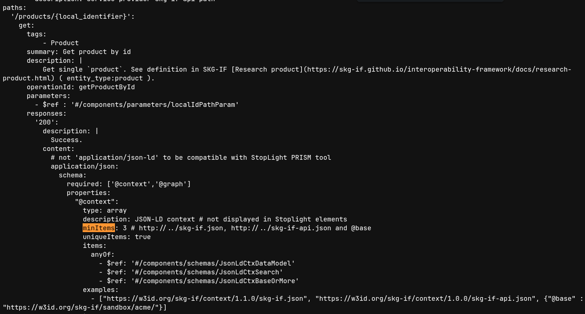

## La Novitade

### oc\_graphenricher

<strong style="display: block; color: #1f2328;">arcangelo7</strong>Jun 23, 2026 &middot; <a href="https://github.com/opencitations/oc_graphenricher" style="font-size: 0.85em; color: #0969da; text-decoration: none;">opencitations/oc_graphenricher</a>

build: migrate from poetry to uv

<a href="https://github.com/opencitations/oc_graphenricher/commit/a4dcdbb8f36b0b7da3bab15128d5a2c9d0fbe57b" style="color: #0969da; text-decoration: none; font-weight: 500;">a4dcdbb</a>

<strong style="display: block; color: #1f2328;">arcangelo7</strong>Jun 23, 2026 &middot; <a href="https://github.com/opencitations/oc_graphenricher" style="font-size: 0.85em; color: #0969da; text-decoration: none;">opencitations/oc_graphenricher</a>

test: migrate suite from unittest to pytest and add CI

<a href="https://github.com/opencitations/oc_graphenricher/commit/874fd6766d695ba5505d643838df446884eb852a" style="color: #0969da; text-decoration: none; font-weight: 500;">874fd67</a>

<strong style="display: block; color: #1f2328;">arcangelo7</strong>Jun 24, 2026 &middot; <a href="https://github.com/opencitations/oc_graphenricher" style="font-size: 0.85em; color: #0969da; text-decoration: none;">opencitations/oc_graphenricher</a>

fix(instancematching): avoid self-merging named contributors

Increase test coverage

<a href="https://github.com/opencitations/oc_graphenricher/commit/1e8e38bf1730a865c11706e3d51f7c6d0acf6563" style="color: #0969da; text-decoration: none; font-weight: 500;">1e8e38b</a>

<strong style="display: block; color: #1f2328;">arcangelo7</strong>Jun 25, 2026 &middot; <a href="https://github.com/opencitations/oc_graphenricher" style="font-size: 0.85em; color: #0969da; text-decoration: none;">opencitations/oc_graphenricher</a>

feat!: add storage factories for single-file and OCDM directory output

BREAKING CHANGE: GraphEnricher and InstanceMatching now require a storage factory, either single_file_storage or directory_storage. The graph_filename and provenance_filename constructor parameters were removed.

<a href="https://github.com/opencitations/oc_graphenricher/commit/5f20d941d95f765c42c45507ce95b9ee28b59e93" style="color: #0969da; text-decoration: none; font-weight: 500;">5f20d94</a>

### Index

<strong style="display: block; color: #1f2328;">arcangelo7</strong>Jun 23, 2026 &middot; <a href="https://github.com/opencitations/index" style="font-size: 0.85em; color: #0969da; text-decoration: none;">opencitations/index</a>

fix(cnc): read br omid index from redis sets, not semi-colon separated strings

<a href="https://github.com/opencitations/index/commit/f0821fb38deb49d17d8641835ba30e665e91ddc0" style="color: #0969da; text-decoration: none; font-weight: 500;">f0821fb</a>

Dump di Meta pubblicati su Zenodo

CSV: [https://doi.org/10.5281/zenodo.20965426](https://doi.org/10.5281/zenodo.20965426)
RDF: [https://doi.org/10.5281/zenodo.20965956](https://doi.org/10.5281/zenodo.20965956)
Virtuoso dati: [https://doi.org/10.5281/zenodo.21001553](https://doi.org/10.5281/zenodo.21001553)
QLever provenance: [https://doi.org/10.5281/zenodo.20970244](https://doi.org/10.5281/zenodo.20970244)

### RAMOSE

<strong style="display: block; color: #1f2328;">arcangelo7</strong>Jun 25, 2026 &middot; <a href="https://github.com/opencitations/ramose" style="font-size: 0.85em; color: #0969da; text-decoration: none;">opencitations/ramose</a>

docs(comparison): add shexpose comparison

<a href="https://github.com/opencitations/ramose/commit/7e016c346e8cd25dc5a786b2bcd4eff46def4d2f" style="color: #0969da; text-decoration: none; font-weight: 500;">7e016c3</a>

[https://opencitations.github.io/ramose/comparison/shexpose.html](https://opencitations.github.io/ramose/comparison/shexpose.html)

### Software citation sync

[https://github.com/marketplace/actions/software-citation-sync](https://github.com/marketplace/actions/software-citation-sync)

## Domande

### Index

Ho provato a correggere i test in maniera tale da procedere con ulteriori ottimizzazioni in maniera sicura, ma mi sono accorto che al momento è viscoso lavorare con questa libreria perché conserva ancora tutta la logica legacy sia nel codice che nei test. Non ha alcun senso correggere i test per farli passare con la logica nuova perché mischierebbero logiche diverse. Secondo me la cosa più sensata è togliere tutta la logica legacy. Cosa ne pensate?

Sui dataset dei nuovi dump pubblicati su Zenodo metto il finanziamento? Se sì, quale?

### RAMOSE

Servono una bio, una foto e l'ORCID di Sergei, gli scrivo io?

### SKG-IF

[https://skg-if.github.io/api/openapi/ver/current/skg-if-openapi.yaml](https://skg-if.github.io/api/openapi/ver/current/skg-if-openapi.yaml)

### Altro

Email Czesary

## Memo

RAMOSE

* Confronto performance
* Aggiungere connextion
* Chiarire di non usare LIMIT con @@page

TAL

* Aggiungere skolemizzazione

Vizioso

* [https://en.wikipedia.org/wiki/Compilers:\_Principles,\_Techniques,\_and\_Tools](https://en.wikipedia.org/wiki/Compilers:_Principles,_Techniques,_and_Tools)
* [https://en.wikipedia.org/wiki/GNU\_Bison](https://en.wikipedia.org/wiki/GNU_Bison)
* [https://en.wikipedia.org/wiki/Yacc](https://en.wikipedia.org/wiki/Yacc)

HERITRACE

* C'è un bug che si verifica quando uno seleziona un'entità preesistente, poi clicca sulla X e inserisce i metadati a mano. Alcuni metadati vengono duplicati.
* Per risolvere le performance del time-vault non usare la time-agnostic-library, ma guarda solo la query di update dello snapshot di cancellazione.
* Ordine dato all’indice dell’elemento
* date: formato
* anni: essere meno stretto sugli anni. Problema ISO per 999. 0999?
* Opzione per evitare counting
* Opzione per non aggiungere la lista delle risorse, che posso comunque essere cercate
* Configurabilità troppa fatica
* Timer massimo. Timer configurabile. Messaggio in caso si stia per toccare il timer massimo.
* Riflettere su @lang. SKOS come use case. skos:prefLabel, skos:altLabel
* Possibilità di specificare l’URI a mano in fase di creazione
* la base è non specificare la sorgente, perché non sarà mai quella iniziale.
* desvription con l'entità e stata modificata. Tipo commit
* display name è References Cited by VA bene
* Avvertire l'utente del disastro imminente nel caso in cui provi a cancellare un volume

Meta

* Matilda e OUTCITE nella prossima versione
* Rilanciare processo eliminazione duplicati
* Fusione: chi ha più metadati compilati. A parità di metadato si tiene l’omid più basso
* frbr:partOf non deve aggiungere nel merge: [https://opencitations.net/meta/api/v1/metadata/omid:br/06304322094](https://opencitations.net/meta/api/v1/metadata/omid:br/06304322094)
* API v2
* Usare il triplestore di provenance per fare 303 in caso di entità mergiate o mostrare la provenance in caso di cancellazione e basta.

oc\_ocdm

* Automatizzare mark\_as\_restored di default. è possibile disabilitare e fare a mano mark\_as\_restored.
* [https://opencitations.net/meta/api/v1/metadata/doi:10.1093/acprof:oso/9780199977628.001.0001](https://opencitations.net/meta/api/v1/metadata/doi:10.1093/acprof:oso/9780199977628.001.0001)
* DELETE con variabile
* Modificare Meta sulla base della tabella di Elia
* embodiment multipli devono essere purgati a monte
* Modificare documentazione API aggiungendo omid
* aggiungere Relation sovraclasse di Citazione e Menzione

RML

* Vedere come morh kgc rappresenta database internamente
* [https://github.com/oeg-upm/gtfs-bench](https://github.com/oeg-upm/gtfs-bench)
* Chiedere Ionannisil diagramma che ha usato per auto rml.

Crowdsourcing

* Quando dobbiamo ingerire Crossref stoppo manualmente OJS. Si mette una nota nel repository per dire le cose. Ogni mese.
* Aggiornamenti al dump incrementali. Si usa un nuovo prefisso e si aggiungono dati solo a quel CSV.
* Bisogna usare il DOI di Zenodo come primary source. Un unico DOI per batch process.
* Bisogna fare l’aggiornamento sulla copia e poi bisogna automatizzare lo switch

Citazioni

* Fare diff DataCite per togliere le citazioni che non sono più citazioni. è da fare in post. Snapshot 2 di provenance. Fare lo snapshot 3 con la creazione con il derived from al nuovo dump. La lineage viene data dallo specialization of. Colleghi sia al 2 che al dump.
* Repo cerotti. meta/index/sorgenti

OC di converter

Riguardare perché viene fuori una seconda tabella object per DataCite.
