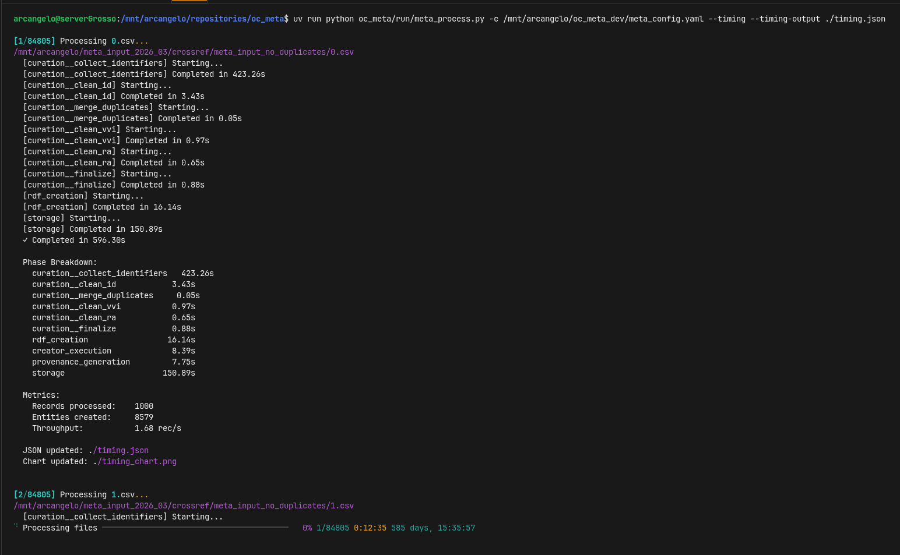
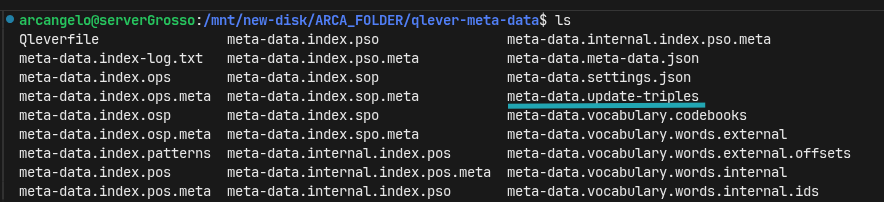
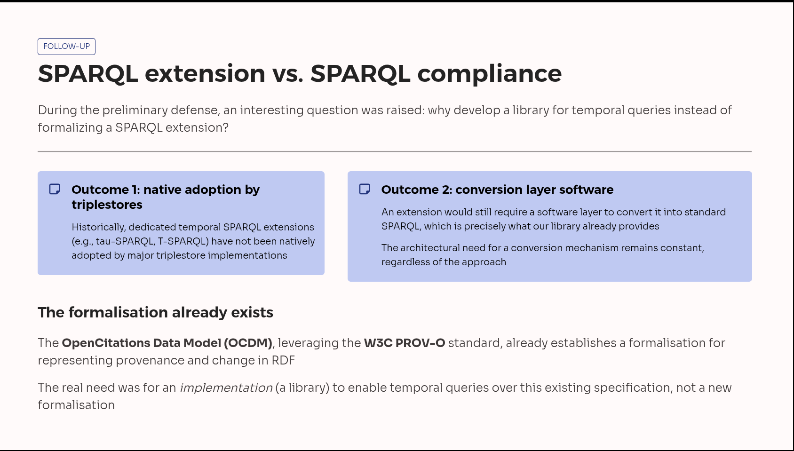
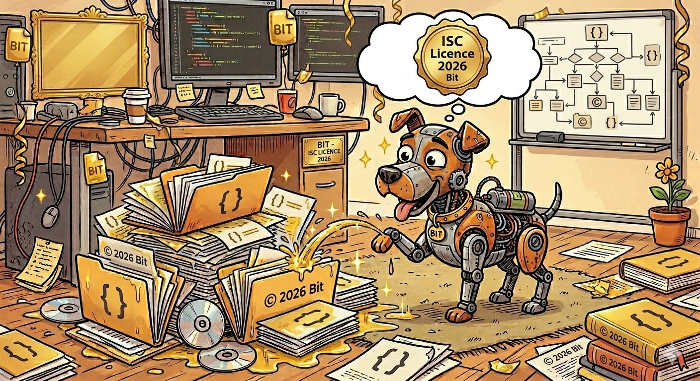

## La Novitade

### OC Meta

<div style="border: 1px solid #d0d7de; border-radius: 8px; padding: 16px; margin: 8px 0; background: #ffffff; font-family: -apple-system, BlinkMacSystemFont, 'Segoe UI', Helvetica, Arial, sans-serif; color: #1f2328;"><div style="display: flex; align-items: center; gap: 12px; margin-bottom: 12px;"><div><strong style="display: block; color: #1f2328;">arcangelo7</strong><span style="font-size: 0.85em; color: #656d76;">Mar 21, 2026</span><span style="font-size: 0.85em; color: #656d76;"> &middot; </span><a href="https://github.com/opencitations/oc_meta" style="font-size: 0.85em; color: #0969da; text-decoration: none;">opencitations/oc_meta</a></div></div><div style="margin: 12px 0; color: #1f2328;"><p>refactor: standardize string literals to use explicit xsd:string datatype</p>
<p>Remove UNION patterns that handled both typed and untyped string
literals. All string literals now use explicit xsd:string datatype,
eliminating the need for redundant query branches in SPARQL and
dual-literal searches in local graph traversal.</p></div><div style="display: flex; justify-content: space-between; align-items: center; font-size: 0.85em;"><span style="font-family: monospace; color: #1a7f37; font-weight: 600;">+15227</span><span style="font-family: monospace; color: #cf222e; font-weight: 600;">-15286</span><a href="https://github.com/opencitations/oc_meta/commit/1d947fe6e0419b32fae2c6746f5da7192908edcf" style="color: #0969da; text-decoration: none; font-weight: 500;">1d947fe</a></div></div>

L'indice testuale di qlever è rotto:

* [https://github.com/ad-freiburg/qlever/issues/2082](https://github.com/ad-freiburg/qlever/issues/2082)
* [https://github.com/ad-freiburg/qlever/issues/2688](https://github.com/ad-freiburg/qlever/issues/2688)

Nel Qleverfile che definisce le regole per costruire l'indice bisogna fissare l'immagine di docker e dev'essere la stessa con cui viene avviato il container, altrimenti alcune query non funzionano. Se non si fissa l'immagine si rischia che il CLI usi una versione di docker diversa da quella con cui viene avviato il container.

```
[runtime]
SYSTEM = docker
IMAGE = docker.io/adfreiburg/qlever:commit-5c6a72a
```

Ce l'abbiamo un anno e mezzo per produrre il prossimo dump?\


#### Skibidiboppi



### RDFLib alla foce della Magra?

* Purtroppo, a differenza di RDFlib, pyoxigraph non indica il data type stringa nelle nquads. Questo è corretto da specifica, anzi pyoxigraph è più corretto di RDFlib in questo senso e si avvicina anche di più al comportamento di Qlever. Tuttavia, io ci terrei, almeno in questa fase, a mantenere il data type esplicito per essere il più possibili agnostici rispetto al database, date le esperienze passate, e quindi almeno per questa operazione per il momento preferisco continuare a utilizzare RDFLib.
* Morph-kgc usa pyoxigraph: [https://github.com/morph-kgc/morph-kgc/blob/main/pyproject.toml](https://github.com/morph-kgc/morph-kgc/blob/main/pyproject.toml)
  * Usa anche rdflib, a dire il vero
  * RDFLib viene usato esclusivamente per il parsing e la trasformazione dei file di mapping RML/R2RML
  * Pyoxigraph (pyoxigraph.Store) viene usato solo come formato di output alternativo per le triple materializzate
    * materialize() restituisce un rdflib.Graph() con le triple generate
    * materialize\_oxigraph() restituisce un pyoxigraph.Store() con le triple generate

### Ruben uno di noi

[https://github.com/w3c/sparql-dev/issues/112](https://github.com/w3c/sparql-dev/issues/112)

[https://github.com/w3c/sparql-query/pull/57](https://github.com/w3c/sparql-query/pull/57)

### shacl-extractor

[https://github.com/skg-if/shacl-extractor/pull/3](https://github.com/skg-if/shacl-extractor/pull/3)

[https://github.com/skg-if/shacl-extractor/issues/4](https://github.com/skg-if/shacl-extractor/issues/4)

[https://github.com/skg-if/shacl-extractor/issues/5](https://github.com/skg-if/shacl-extractor/issues/5)

### Difesa



### Machine readable vanity



[https://opencitations.github.io/repository\_setup\_guides/licensing/reuse\_compliance/](https://opencitations.github.io/repository_setup_guides/licensing/reuse_compliance/)

[https://api.reuse.software/projects](https://api.reuse.software/projects) Esistono solo 3824 progetti compliant e 1 di questi è il mio. Oppure l'API non è più mantenuta anche perché la Free Software Foundation Europe sta avendo problemi finanziari: [https://fsfe.org/news/2026/Cnews-20260316-01.en.html](https://fsfe.org/news/2026/Cnews-20260316-01.en.html)

<div style="border: 1px solid #d0d7de; border-radius: 8px; padding: 16px; margin: 8px 0; background: #ffffff; font-family: -apple-system, BlinkMacSystemFont, 'Segoe UI', Helvetica, Arial, sans-serif; color: #1f2328;"><div style="display: flex; align-items: center; gap: 12px; margin-bottom: 12px;"><div><strong style="display: block; color: #1f2328;">arcangelo7</strong><span style="font-size: 0.85em; color: #656d76;">Mar 21, 2026</span><span style="font-size: 0.85em; color: #656d76;"> &middot; </span><a href="https://github.com/opencitations/python-package-template" style="font-size: 0.85em; color: #0969da; text-decoration: none;">opencitations/python-package-template</a></div></div><div style="margin: 12px 0; color: #1f2328;"><p>feat: add REUSE 3.3 license compliance automation</p></div><div style="display: flex; justify-content: space-between; align-items: center; font-size: 0.85em;"><span style="font-family: monospace; color: #1a7f37; font-weight: 600;">+296</span><span style="font-family: monospace; color: #cf222e; font-weight: 600;">-0</span><a href="https://github.com/opencitations/python-package-template/commit/84e98dd99a655dcae5027fe470c1fde99feafd71" style="color: #0969da; text-decoration: none; font-weight: 500;">84e98dd</a></div></div>

<div style="border: 1px solid #d0d7de; border-radius: 8px; padding: 16px; margin: 8px 0; background: #ffffff; font-family: -apple-system, BlinkMacSystemFont, 'Segoe UI', Helvetica, Arial, sans-serif; color: #1f2328;"><div style="display: flex; align-items: center; gap: 12px; margin-bottom: 12px;"><div><strong style="display: block; color: #1f2328;">arcangelo7</strong><span style="font-size: 0.85em; color: #656d76;">Mar 21, 2026</span><span style="font-size: 0.85em; color: #656d76;"> &middot; </span><a href="https://github.com/opencitations/oc_ocdm" style="font-size: 0.85em; color: #0969da; text-decoration: none;">opencitations/oc_ocdm</a></div></div><div style="margin: 12px 0; color: #1f2328;"><p>chore: add REUSE 3.3 license compliance</p></div><div style="display: flex; justify-content: space-between; align-items: center; font-size: 0.85em;"><span style="font-family: monospace; color: #1a7f37; font-weight: 600;">+876</span><span style="font-family: monospace; color: #cf222e; font-weight: 600;">-1150</span><a href="https://github.com/opencitations/oc_ocdm/commit/411c0fe8abb49b51ae5fe5bdfd3018d8d530a3da" style="color: #0969da; text-decoration: none; font-weight: 500;">411c0fe</a></div></div>

<div style="border: 1px solid #d0d7de; border-radius: 8px; padding: 16px; margin: 8px 0; background: #ffffff; font-family: -apple-system, BlinkMacSystemFont, 'Segoe UI', Helvetica, Arial, sans-serif; color: #1f2328;"><div style="display: flex; align-items: center; gap: 12px; margin-bottom: 12px;"><div><strong style="display: block; color: #1f2328;">arcangelo7</strong><span style="font-size: 0.85em; color: #656d76;">Mar 21, 2026</span><span style="font-size: 0.85em; color: #656d76;"> &middot; </span><a href="https://github.com/opencitations/piccione" style="font-size: 0.85em; color: #0969da; text-decoration: none;">opencitations/piccione</a></div></div><div style="margin: 12px 0; color: #1f2328;"><p>chore: add REUSE 3.3 license compliance</p></div><div style="display: flex; justify-content: space-between; align-items: center; font-size: 0.85em;"><span style="font-family: monospace; color: #1a7f37; font-weight: 600;">+393</span><span style="font-family: monospace; color: #cf222e; font-weight: 600;">-13</span><a href="https://github.com/opencitations/piccione/commit/a9cab3e87ac433ccb94d1cca368da9318a450255" style="color: #0969da; text-decoration: none; font-weight: 500;">a9cab3e</a></div></div>

<div style="border: 1px solid #d0d7de; border-radius: 8px; padding: 16px; margin: 8px 0; background: #ffffff; font-family: -apple-system, BlinkMacSystemFont, 'Segoe UI', Helvetica, Arial, sans-serif; color: #1f2328;"><div style="display: flex; align-items: center; gap: 12px; margin-bottom: 12px;"><div><strong style="display: block; color: #1f2328;">arcangelo7</strong><span style="font-size: 0.85em; color: #656d76;">Mar 21, 2026</span><span style="font-size: 0.85em; color: #656d76;"> &middot; </span><a href="https://github.com/opencitations/time-agnostic-library" style="font-size: 0.85em; color: #0969da; text-decoration: none;">opencitations/time-agnostic-library</a></div></div><div style="margin: 12px 0; color: #1f2328;"><p>chore: add REUSE 3.3 license compliance</p></div><div style="display: flex; justify-content: space-between; align-items: center; font-size: 0.85em;"><span style="font-family: monospace; color: #1a7f37; font-weight: 600;">+483</span><span style="font-family: monospace; color: #cf222e; font-weight: 600;">-259</span><a href="https://github.com/opencitations/time-agnostic-library/commit/8fcc1083f0fd7e21a6aa7de01399a069880cd834" style="color: #0969da; text-decoration: none; font-weight: 500;">8fcc108</a></div></div>

<div style="border: 1px solid #d0d7de; border-radius: 8px; padding: 16px; margin: 8px 0; background: #ffffff; font-family: -apple-system, BlinkMacSystemFont, 'Segoe UI', Helvetica, Arial, sans-serif; color: #1f2328;"><div style="display: flex; align-items: center; gap: 12px; margin-bottom: 12px;"><div><strong style="display: block; color: #1f2328;">arcangelo7</strong><span style="font-size: 0.85em; color: #656d76;">Mar 21, 2026</span><span style="font-size: 0.85em; color: #656d76;"> &middot; </span><a href="https://github.com/opencitations/oc_meta" style="font-size: 0.85em; color: #0969da; text-decoration: none;">opencitations/oc_meta</a></div></div><div style="margin: 12px 0; color: #1f2328;"><p>chore: add REUSE 3.3 license compliance</p></div><div style="display: flex; justify-content: space-between; align-items: center; font-size: 0.85em;"><span style="font-family: monospace; color: #1a7f37; font-weight: 600;">+1879</span><span style="font-family: monospace; color: #cf222e; font-weight: 600;">-1422</span><a href="https://github.com/opencitations/oc_meta/commit/8a4c1694a44c84d9762d606b39213d73bd25ea74" style="color: #0969da; text-decoration: none; font-weight: 500;">8a4c169</a></div></div>

<div style="border: 1px solid #d0d7de; border-radius: 8px; padding: 16px; margin: 8px 0; background: #ffffff; font-family: -apple-system, BlinkMacSystemFont, 'Segoe UI', Helvetica, Arial, sans-serif; color: #1f2328;"><div style="display: flex; align-items: center; gap: 12px; margin-bottom: 12px;"><div><strong style="display: block; color: #1f2328;">arcangelo7</strong><span style="font-size: 0.85em; color: #656d76;">Mar 21, 2026</span><span style="font-size: 0.85em; color: #656d76;"> &middot; </span><a href="https://github.com/opencitations/heritrace" style="font-size: 0.85em; color: #0969da; text-decoration: none;">opencitations/heritrace</a></div></div><div style="margin: 12px 0; color: #1f2328;"><p>chore: add REUSE 3.3 spec compliance</p></div><div style="display: flex; justify-content: space-between; align-items: center; font-size: 0.85em;"><span style="font-family: monospace; color: #1a7f37; font-weight: 600;">+1445</span><span style="font-family: monospace; color: #cf222e; font-weight: 600;">-14</span><a href="https://github.com/opencitations/heritrace/commit/6c7c2ab4ff3ef222af4921b3e4ca4fbe67967f71" style="color: #0969da; text-decoration: none; font-weight: 500;">6c7c2ab</a></div></div>

<div style="border: 1px solid #d0d7de; border-radius: 8px; padding: 16px; margin: 8px 0; background: #ffffff; font-family: -apple-system, BlinkMacSystemFont, 'Segoe UI', Helvetica, Arial, sans-serif; color: #1f2328;"><div style="display: flex; align-items: center; gap: 12px; margin-bottom: 12px;"><div><strong style="display: block; color: #1f2328;">arcangelo7</strong><span style="font-size: 0.85em; color: #656d76;">Mar 21, 2026</span><span style="font-size: 0.85em; color: #656d76;"> &middot; </span><a href="https://github.com/opencitations/virtuoso_utilities" style="font-size: 0.85em; color: #0969da; text-decoration: none;">opencitations/virtuoso_utilities</a></div></div><div style="margin: 12px 0; color: #1f2328;"><p>chore: add REUSE 3.3 spec compliance</p></div><div style="display: flex; justify-content: space-between; align-items: center; font-size: 0.85em;"><span style="font-family: monospace; color: #1a7f37; font-weight: 600;">+474</span><span style="font-family: monospace; color: #cf222e; font-weight: 600;">-1</span><a href="https://github.com/opencitations/virtuoso_utilities/commit/3159b2570908eea484dce0eae7c8932119f18e1a" style="color: #0969da; text-decoration: none; font-weight: 500;">3159b25</a></div></div>

<div style="border: 1px solid #d0d7de; border-radius: 8px; padding: 16px; margin: 8px 0; background: #ffffff; font-family: -apple-system, BlinkMacSystemFont, 'Segoe UI', Helvetica, Arial, sans-serif; color: #1f2328;"><div style="display: flex; align-items: center; gap: 12px; margin-bottom: 12px;"><div><strong style="display: block; color: #1f2328;">arcangelo7</strong><span style="font-size: 0.85em; color: #656d76;">Mar 21, 2026</span><span style="font-size: 0.85em; color: #656d76;"> &middot; </span><a href="https://github.com/skg-if/shacl-extractor" style="font-size: 0.85em; color: #0969da; text-decoration: none;">skg-if/shacl-extractor</a></div></div><div style="margin: 12px 0; color: #1f2328;"><p>chore: add REUSE 3.3 license compliance</p></div><div style="display: flex; justify-content: space-between; align-items: center; font-size: 0.85em;"><span style="font-family: monospace; color: #1a7f37; font-weight: 600;">+376</span><span style="font-family: monospace; color: #cf222e; font-weight: 600;">-0</span><a href="https://github.com/skg-if/shacl-extractor/commit/638a43e1d0c346dd3f2976a75027db48ce5ff554" style="color: #0969da; text-decoration: none; font-weight: 500;">638a43e</a></div></div>

<div style="border: 1px solid #d0d7de; border-radius: 8px; padding: 16px; margin: 8px 0; background: #ffffff; font-family: -apple-system, BlinkMacSystemFont, 'Segoe UI', Helvetica, Arial, sans-serif; color: #1f2328;"><div style="display: flex; align-items: center; gap: 12px; margin-bottom: 12px;"><div><strong style="display: block; color: #1f2328;">arcangelo7</strong><span style="font-size: 0.85em; color: #656d76;">Mar 21, 2026</span><span style="font-size: 0.85em; color: #656d76;"> &middot; </span><a href="https://github.com/dharc-org/changes-metadata-manager" style="font-size: 0.85em; color: #0969da; text-decoration: none;">dharc-org/changes-metadata-manager</a></div></div><div style="margin: 12px 0; color: #1f2328;"><p>chore: add REUSE 3.3 license compliance</p></div><div style="display: flex; justify-content: space-between; align-items: center; font-size: 0.85em;"><span style="font-family: monospace; color: #1a7f37; font-weight: 600;">+361</span><span style="font-family: monospace; color: #cf222e; font-weight: 600;">-0</span><a href="https://github.com/dharc-org/changes-metadata-manager/commit/2b1aa8bb8d92e9f570dcb03a45ff468772ebf265" style="color: #0969da; text-decoration: none; font-weight: 500;">2b1aa8b</a></div></div>

<div style="border: 1px solid #d0d7de; border-radius: 8px; padding: 16px; margin: 8px 0; background: #ffffff; font-family: -apple-system, BlinkMacSystemFont, 'Segoe UI', Helvetica, Arial, sans-serif; color: #1f2328;"><div style="display: flex; align-items: center; gap: 12px; margin-bottom: 12px;"><div><strong style="display: block; color: #1f2328;">arcangelo7</strong><span style="font-size: 0.85em; color: #656d76;">Mar 21, 2026</span><span style="font-size: 0.85em; color: #656d76;"> &middot; </span><a href="https://github.com/opencitations/crowdsourcing" style="font-size: 0.85em; color: #0969da; text-decoration: none;">opencitations/crowdsourcing</a></div></div><div style="margin: 12px 0; color: #1f2328;"><p>feat: add REUSE 3.3 spec compliance</p></div><div style="display: flex; justify-content: space-between; align-items: center; font-size: 0.85em;"><span style="font-family: monospace; color: #1a7f37; font-weight: 600;">+266</span><span style="font-family: monospace; color: #cf222e; font-weight: 600;">-134</span><a href="https://github.com/opencitations/crowdsourcing/commit/6a7703a0cd25ce9815b45a1a3174454eafccab41" style="color: #0969da; text-decoration: none; font-weight: 500;">6a7703a</a></div></div>

<div style="border: 1px solid #d0d7de; border-radius: 8px; padding: 16px; margin: 8px 0; background: #ffffff; font-family: -apple-system, BlinkMacSystemFont, 'Segoe UI', Helvetica, Arial, sans-serif; color: #1f2328;"><div style="display: flex; align-items: center; gap: 12px; margin-bottom: 12px;"><div><strong style="display: block; color: #1f2328;">arcangelo7</strong><span style="font-size: 0.85em; color: #656d76;">Mar 21, 2026</span><span style="font-size: 0.85em; color: #656d76;"> &middot; </span><a href="https://github.com/thinkcompute/thinkcompute.github.io" style="font-size: 0.85em; color: #0969da; text-decoration: none;">thinkcompute/thinkcompute.github.io</a></div></div><div style="margin: 12px 0; color: #1f2328;"><p>chore: add REUSE 3.3 license compliance</p></div><div style="display: flex; justify-content: space-between; align-items: center; font-size: 0.85em;"><span style="font-family: monospace; color: #1a7f37; font-weight: 600;">+1197</span><span style="font-family: monospace; color: #cf222e; font-weight: 600;">-1274</span><a href="https://github.com/thinkcompute/thinkcompute.github.io/commit/0c6a477bcdb50fd73b3b06d08a8f56324c86454f" style="color: #0969da; text-decoration: none; font-weight: 500;">0c6a477</a></div></div>

<div style="border: 1px solid #d0d7de; border-radius: 8px; padding: 16px; margin: 8px 0; background: #ffffff; font-family: -apple-system, BlinkMacSystemFont, 'Segoe UI', Helvetica, Arial, sans-serif; color: #1f2328;"><div style="display: flex; align-items: center; gap: 12px; margin-bottom: 12px;"><div><strong style="display: block; color: #1f2328;">arcangelo7</strong><span style="font-size: 0.85em; color: #656d76;">Mar 21, 2026</span><span style="font-size: 0.85em; color: #656d76;"> &middot; </span><a href="https://github.com/opencitations/oc_ds_converter" style="font-size: 0.85em; color: #0969da; text-decoration: none;">opencitations/oc_ds_converter</a></div></div><div style="margin: 12px 0; color: #1f2328;"><p>chore: add REUSE 3.3 license compliance</p></div><div style="display: flex; justify-content: space-between; align-items: center; font-size: 0.85em;"><span style="font-family: monospace; color: #1a7f37; font-weight: 600;">+1297</span><span style="font-family: monospace; color: #cf222e; font-weight: 600;">-1138</span><a href="https://github.com/opencitations/oc_ds_converter/commit/eeb8161b7acf98b843b9c05fe24861f9871b636e" style="color: #0969da; text-decoration: none; font-weight: 500;">eeb8161</a></div></div>

### Domande

## Memo

Aldrovandi

* Ai related works c'è da aggiungere l'articolo su chad kg
  Vizioso

* [https://en.wikipedia.org/wiki/Compilers:\_Principles,\_Techniques,\_and\_Tools](https://en.wikipedia.org/wiki/Compilers:_Principles,_Techniques,_and_Tools)

* [https://en.wikipedia.org/wiki/GNU\_Bison](https://en.wikipedia.org/wiki/GNU_Bison)

* [https://en.wikipedia.org/wiki/Yacc](https://en.wikipedia.org/wiki/Yacc)

* HERITRACE
  * C'è un bug che si verifica quando uno seleziona un'entità preesistente, poi clicca sulla X e inserisce i metadati a mano. Alcuni metadati vengono duplicati.
  * Se uno ripristina una sotto entità a seguito di un merge, l'entità principale potrebbe rompersi.

* Meta
  * Bisogna rigenerare il DOI ORCID Index
  * Matilda e OUTCITE nella prossima versione
    * Da definire le sorgenti
    * Va su Trello
  * Bisogna produrre la tabella che associa temp a OMID per produrre le citazioni.

* OpenCitations
  * Rilanciare processo eliminazione duplicati
  * trovare tutti quelli che ci usano

* "reference": { "@id": "frbr:part", "@type": "@vocab" } → bibreference

* "crossref": { "@id": "biro:references", "@type": "@vocab"} → reference

* "crossref": "datacite:crossref"

* oc\_ocdm

  * Automatizzare mark\_as\_restored di default. è possibile disabilitare e fare a mano mark\_as\_restored.

* [https://opencitations.net/meta/api/v1/metadata/doi:10.1093/acprof:oso/9780199977628.001.0001](https://opencitations.net/meta/api/v1/metadata/doi:10.1093/acprof:oso/9780199977628.001.0001)

* DELETE con variabile

* Modificare Meta sulla base della tabella di Elia

* embodiment multipli devono essere purgati a monte

* Modificare documentazione API aggiungendo omid

* Heritrace
  * Per risolvere le performance del time-vault non usare la time-agnostic-library, ma guarda solo la query di update dello snapshot di cancellazione.
  * Ordine dato all’indice dell’elemento
  * date: formato
  * anni: essere meno stretto sugli anni. Problema ISO per 999. 0999?
  * Opzione per evitare counting
  * Opzione per non aggiungere la lista delle risorse, che posso comunque essere cercate
  * Configurabilità troppa fatica
  * Timer massimo. Timer configurabile. Messaggio in caso si stia per toccare il timer massimo.
  * Riflettere su @lang. SKOS come use case. skos:prefLabel, skos:altLabel
  * Possibilità di specificare l’URI a mano in fase di creazione
  * la base è non specificare la sorgente, perché non sarà mai quella iniziale.
  * desvription con l'entità e stata modificata. Tipo commit
  * display name è References Cited by VA bene
  * Avvertire l'utente del disastro imminente nel caso in cui provi a cancellare un volume

* Meta
  * Fusione: chi ha più metadati compilati. A parità di metadato si tiene l’omid più basso
  * Issue github parallelizzazione virtuoso
  * frbr:partOf non deve aggiungere nel merge: [https://opencitations.net/meta/api/v1/metadata/omid:br/06304322094](https://opencitations.net/meta/api/v1/metadata/omid:br/06304322094)
  * API v2
  * Usare il triplestore di provenance per fare 303 in caso di entità mergiate o mostrare la provenance in caso di cancellazione e basta.

* RML
  * Vedere come morh kgc rappresenta database internamente
  * [https://github.com/oeg-upm/gtfs-bench](https://github.com/oeg-upm/gtfs-bench)
  * Chiedere Ionannisil diagramma che ha usato per auto rml.

* Crowdsourcing
  * Quando dobbiamo ingerire Crossref stoppo manualmente OJS. Si mette una nota nel repository per dire le cose. Ogni mese.
  * Aggiornamenti al dump incrementali. Si usa un nuovo prefisso e si aggiungono dati solo a quel CSV.
  * Bisogna usare il DOI di Zenodo come primary source. Un unico DOI per batch process.
  * Bisogna fare l’aggiornamento sulla copia e poi bisogna automatizzare lo switch
