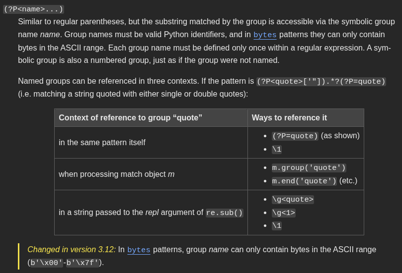
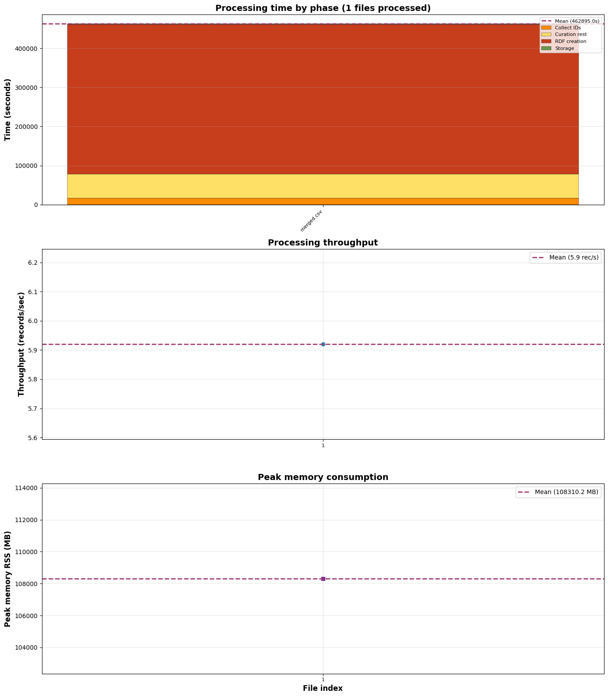

## La Novitade

### RAMOSE

<div style="border: 1px solid #d0d7de; border-radius: 8px; padding: 16px; margin: 8px 0; background: #ffffff; font-family: -apple-system, BlinkMacSystemFont, 'Segoe UI', Helvetica, Arial, sans-serif; color: #1f2328;"><div style="display: flex; align-items: center; gap: 12px; margin-bottom: 12px;"><div><strong style="display: block; color: #1f2328;">arcangelo7</strong><span style="font-size: 0.85em; color: #656d76;">Apr 7, 2026</span><span style="font-size: 0.85em; color: #656d76;"> &middot; </span><a href="https://github.com/opencitations/ramose" style="font-size: 0.85em; color: #0969da; text-decoration: none;">opencitations/ramose</a></div></div><div style="margin: 12px 0; color: #1f2328;"><p>test: add tests for multi-source exec, OpenAPI export, and pluggable formats</p></div><div style="display: flex; justify-content: space-between; align-items: center; font-size: 0.85em;"><span style="font-family: monospace; color: #1a7f37; font-weight: 600;">+808</span><span style="font-family: monospace; color: #cf222e; font-weight: 600;">-2</span><a href="https://github.com/opencitations/ramose/commit/288bde66567b0b7cf3509588ebcc2ab8dc36fdb2" style="color: #0969da; text-decoration: none; font-weight: 500;">288bde6</a></div></div>

<div style="border: 1px solid #d0d7de; border-radius: 8px; padding: 16px; margin: 8px 0; background: #ffffff; font-family: -apple-system, BlinkMacSystemFont, 'Segoe UI', Helvetica, Arial, sans-serif; color: #1f2328;"><div style="display: flex; align-items: center; gap: 12px; margin-bottom: 12px;"><div><strong style="display: block; color: #1f2328;">arcangelo7</strong><span style="font-size: 0.85em; color: #656d76;">Apr 7, 2026</span><span style="font-size: 0.85em; color: #656d76;"> &middot; </span><a href="https://github.com/opencitations/ramose" style="font-size: 0.85em; color: #0969da; text-decoration: none;">opencitations/ramose</a></div></div><div style="margin: 12px 0; color: #1f2328;"><p>refactor: split monolithic ramose.py into package modules</p></div><div style="display: flex; justify-content: space-between; align-items: center; font-size: 0.85em;"><span style="font-family: monospace; color: #1a7f37; font-weight: 600;">+2973</span><span style="font-family: monospace; color: #cf222e; font-weight: 600;">-2848</span><a href="https://github.com/opencitations/ramose/commit/e5b73146b4b8b1c9ac3836da4b3dfc8b0a8bd4e8" style="color: #0969da; text-decoration: none; font-weight: 500;">e5b7314</a></div></div>

La documentazione non è aggiornata. Tanto vale copiare quello che c'è di buono ed estenderla nel solito sito Astro Starlight, così mentre scrivo capisco meglio le cose.

<div style="border: 1px solid #d0d7de; border-radius: 8px; padding: 16px; margin: 8px 0; background: #ffffff; font-family: -apple-system, BlinkMacSystemFont, 'Segoe UI', Helvetica, Arial, sans-serif; color: #1f2328;"><div style="display: flex; align-items: center; gap: 12px; margin-bottom: 12px;"><div><strong style="display: block; color: #1f2328;">arcangelo7</strong><span style="font-size: 0.85em; color: #656d76;">Apr 7, 2026</span><span style="font-size: 0.85em; color: #656d76;"> &middot; </span><a href="https://github.com/opencitations/ramose" style="font-size: 0.85em; color: #0969da; text-decoration: none;">opencitations/ramose</a></div></div><div style="margin: 12px 0; color: #1f2328;"><p>docs: migrate from Sphinx to Starlight and update documentation</p></div><div style="display: flex; justify-content: space-between; align-items: center; font-size: 0.85em;"><span style="font-family: monospace; color: #1a7f37; font-weight: 600;">+7408</span><span style="font-family: monospace; color: #cf222e; font-weight: 600;">-1229</span><a href="https://github.com/opencitations/ramose/commit/dff647678ca0d15c029dcb16b94f4d2c7ba722f0" style="color: #0969da; text-decoration: none; font-weight: 500;">dff6476</a></div></div>

<div style="border: 1px solid #d0d7de; border-radius: 8px; padding: 16px; margin: 8px 0; background: #ffffff; font-family: -apple-system, BlinkMacSystemFont, 'Segoe UI', Helvetica, Arial, sans-serif; color: #1f2328;"><div style="display: flex; align-items: center; gap: 12px; margin-bottom: 12px;"><div><strong style="display: block; color: #1f2328;">arcangelo7</strong><span style="font-size: 0.85em; color: #656d76;">Apr 7, 2026</span><span style="font-size: 0.85em; color: #656d76;"> &middot; </span><a href="https://github.com/opencitations/ramose" style="font-size: 0.85em; color: #0969da; text-decoration: none;">opencitations/ramose</a></div></div><div style="margin: 12px 0; color: #1f2328;"><p>docs: add citation info</p></div><div style="display: flex; justify-content: space-between; align-items: center; font-size: 0.85em;"><span style="font-family: monospace; color: #1a7f37; font-weight: 600;">+112</span><span style="font-family: monospace; color: #cf222e; font-weight: 600;">-1669</span><a href="https://github.com/opencitations/ramose/commit/1d97bab83d122c2bbec5d15baf2141433456d4c8" style="color: #0969da; text-decoration: none; font-weight: 500;">1d97bab</a></div></div>

<div style="border: 1px solid #d0d7de; border-radius: 8px; padding: 16px; margin: 8px 0; background: #ffffff; font-family: -apple-system, BlinkMacSystemFont, 'Segoe UI', Helvetica, Arial, sans-serif; color: #1f2328;"><div style="display: flex; align-items: center; gap: 12px; margin-bottom: 12px;"><div><strong style="display: block; color: #1f2328;">arcangelo7</strong><span style="font-size: 0.85em; color: #656d76;">Apr 8, 2026</span><span style="font-size: 0.85em; color: #656d76;"> &middot; </span><a href="https://github.com/opencitations/ramose" style="font-size: 0.85em; color: #0969da; text-decoration: none;">opencitations/ramose</a></div></div><div style="margin: 12px 0; color: #1f2328;"><p>refactor: remove allow_inline_endpoints gate</p>
<p>The @@endpoint directive now works unconditionally without requiring
opt-in via #allow_inline_endpoints in spec files. The extra
configuration added friction without meaningful safety benefit.</p></div><div style="display: flex; justify-content: space-between; align-items: center; font-size: 0.85em;"><span style="font-family: monospace; color: #1a7f37; font-weight: 600;">+6</span><span style="font-family: monospace; color: #cf222e; font-weight: 600;">-59</span><a href="https://github.com/opencitations/ramose/commit/6abf69e542a0ed692fefc929e332a70786f946f5" style="color: #0969da; text-decoration: none; font-weight: 500;">6abf69e</a></div></div>

### Index

<div style="border: 1px solid #d0d7de; border-radius: 8px; padding: 16px; margin: 8px 0; background: #ffffff; font-family: -apple-system, BlinkMacSystemFont, 'Segoe UI', Helvetica, Arial, sans-serif; color: #1f2328;"><div style="display: flex; align-items: center; gap: 12px; margin-bottom: 12px;"><div><strong style="display: block; color: #1f2328;">arcangelo7</strong><span style="font-size: 0.85em; color: #656d76;">Apr 9, 2026</span><span style="font-size: 0.85em; color: #656d76;"> &middot; </span><a href="https://github.com/opencitations/index" style="font-size: 0.85em; color: #0969da; text-decoration: none;">opencitations/index</a></div></div><div style="margin: 12px 0; color: #1f2328;"><p>build!: migrate from setup.py to uv with pyproject.toml</p>
<p>Refactor get_config() to accept an explicit path instead of reading from ~/.opencitations/index/config.ini. Add --config CLI argument to every script entry point.</p>
<p>BREAKING CHANGE: all scripts now require --config flag pointing to the
configuration file. The implicit ~/.opencitations/index/ convention and
the setup.py that populated it are removed.</p></div><div style="display: flex; justify-content: space-between; align-items: center; font-size: 0.85em;"><span style="font-family: monospace; color: #1a7f37; font-weight: 600;">+1118</span><span style="font-family: monospace; color: #cf222e; font-weight: 600;">-330</span><a href="https://github.com/opencitations/index/commit/61aec16c81f4270ce819119d48fe8ee354325046" style="color: #0969da; text-decoration: none; font-weight: 500;">61aec16</a></div></div>

<div style="border: 1px solid #d0d7de; border-radius: 8px; padding: 16px; margin: 8px 0; background: #ffffff; font-family: -apple-system, BlinkMacSystemFont, 'Segoe UI', Helvetica, Arial, sans-serif; color: #1f2328;"><div style="display: flex; align-items: center; gap: 12px; margin-bottom: 12px;"><div><strong style="display: block; color: #1f2328;">arcangelo7</strong><span style="font-size: 0.85em; color: #656d76;">Apr 9, 2026</span><span style="font-size: 0.85em; color: #656d76;"> &middot; </span><a href="https://github.com/opencitations/index" style="font-size: 0.85em; color: #0969da; text-decoration: none;">opencitations/index</a></div></div><div style="margin: 12px 0; color: #1f2328;"><p>refactor!: restructure project from namespace package to standard layout</p>
<p>Move source from index/python/src/ to oc_index/, scripts from scripts/
to oc_index/scripts/, and tests from index/python/test/ to tests/.
Switch build backend from setuptools to hatchling.</p>
<p>BREAKING CHANGE: the import path changes from oc.index to oc_index</p></div><div style="display: flex; justify-content: space-between; align-items: center; font-size: 0.85em;"><span style="font-family: monospace; color: #1a7f37; font-weight: 600;">+176</span><span style="font-family: monospace; color: #cf222e; font-weight: 600;">-392</span><a href="https://github.com/opencitations/index/commit/384c7e9cdb253d5de5146b45158e4dd9e65db1f5" style="color: #0969da; text-decoration: none; font-weight: 500;">384c7e9</a></div></div>

### Svolta della vita



[https://docs.python.org/3/library/re.html#regular-expression-syntax](https://docs.python.org/3/library/re.html#regular-expression-syntax)

```python
_DURATION_PATTERN = re_compile(
    r"P"
    r"(?:(?P<years>\d+)Y)?"
    r"(?:(?P<months>\d+)M)?"
    r"(?:(?P<days>\d+)D)?"
    r"(?:T"
    r"(?:(?P<hours>\d+)H)?"
    r"(?:(?P<minutes>\d+)M)?"
    r"(?:(?P<seconds>\d+(?:\.\d+)?)S)?"
    r")?"
)

class _ISODuration(NamedTuple):
    years: int
    months: int
    remainder: timedelta

def _parse_duration(duration_str: str) -> _ISODuration:
    duration_match = _DURATION_PATTERN.fullmatch(duration_str)
    parts = {key: value or "0" for key, value in duration_match.groupdict().items()}
    return _ISODuration(
        years=int(parts["years"]),
        months=int(parts["months"]),
        remainder=timedelta(
            days=int(parts["days"]),
            hours=int(parts["hours"]),
            minutes=int(parts["minutes"]),
            seconds=float(parts["seconds"])
        )
    )
```

### Meta



```bash
============================================================
Aggregate Timing Summary
============================================================
Total Files: 1
Total Duration: 460676.125s (5,3 giorni)
Total Records: 2_728_607
Total Entities: 43_778_738
Overall Throughput: 5.92 rec/s
Peak Memory (RSS): 108310.2 MB (108 GB)
Avg Peak Memory:   108310.2 MB
============================================================
```

Perché esportare in nquads per indicizzare in Qlever? Si possono indicizzare direttamente i file RDF JSON-LD compressi, visto che Qlever prende in input un comando shell che ritorna testo per capire cosa indicizzare.

Ah no, Qlever non supporta JSON-LD. Posso comunque convertire in streaming, in un solo passaggio e senza occupare TB sul disco per niente.

Flag -f: The file with the knowledge graph data to be parsed from. If omitted, will read from stdin.

Potremmo fare

```bash
CAT_INPUT_FILES | qlever-index -F nq -f -
```

```sh
uv run python --project "${OC_META}" -m oc_meta.run.migration.stream_nquads "${RDF_DIR}" --mode data --workers "${WORKERS}" | \
docker run -i --entrypoint qlever-index "docker.io/adfreiburg/qlever:commit-5c6a72a"-F nq -f -
```

<div style="border: 1px solid #d0d7de; border-radius: 8px; padding: 16px; margin: 8px 0; background: #ffffff; font-family: -apple-system, BlinkMacSystemFont, 'Segoe UI', Helvetica, Arial, sans-serif; color: #1f2328;"><div style="display: flex; align-items: center; gap: 12px; margin-bottom: 12px;"><div><strong style="display: block; color: #1f2328;">arcangelo7</strong><span style="font-size: 0.85em; color: #656d76;">Apr 12, 2026</span><span style="font-size: 0.85em; color: #656d76;"> &middot; </span><a href="https://github.com/opencitations/oc_meta" style="font-size: 0.85em; color: #0969da; text-decoration: none;">opencitations/oc_meta</a></div></div><div style="margin: 12px 0; color: #1f2328;"><p>feat(migration): add stream_nquads tool</p>
<p>stream_nquads streams N-Quads from JSON-LD ZIPs to stdout via
multiprocessing, designed to pipe directly into QLever&#39;s indexer
without intermediate files.</p></div><div style="display: flex; justify-content: space-between; align-items: center; font-size: 0.85em;"><span style="font-family: monospace; color: #1a7f37; font-weight: 600;">+372</span><span style="font-family: monospace; color: #cf222e; font-weight: 600;">-117</span><a href="https://github.com/opencitations/oc_meta/commit/ad112e11a7cbe12f197df6d53d18c42bd05df77a" style="color: #0969da; text-decoration: none; font-weight: 500;">ad112e1</a></div></div>

### RML

[https://openreview.net/forum?id=XUc9rtTsHp](https://openreview.net/forum?id=XUc9rtTsHp)

Mi hanno accettato l'RML paperazione. Voti meh. In sintesi: ottima metodologia, ma quello che stai cercando di fare non serve a niente. Ha ricevuto scarso interesse finora perché è scarsamente interessante. Ci sta. Non mi è mai piaciuto Sanremo.

La conferenza si svolgerà a Dubrovnik, Croatia tra il 10 e l'11 maggio ([https://kg-construct.github.io/workshop/](https://kg-construct.github.io/workshop/)).

## Domande

### RAMOSE

* Gli elementi specifici di Ramose che non hanno un equivalente in OpenAPI vengono messi in un unico oggetto in fondo allo YAML generato. Ma secondo me nel contesto di OpenAPI non hanno alcun senso perché sono dettagli implementativi.

  ```yaml
    x-ramose:
  	preprocess: lower(dois) --> split_dois(dois)
  	call: /metadata/10.1108/jd-12-2013-0166__10.1038/nature12373
  	sparql_in_description: true
  ```

  call, tra l'altro, viene già mappato nel campo example di OpenAPI. sparql\_in\_description invece è inventato ed è un mistero. Io toglierei tutto questo blocco.
* Per <span class="sl-obs-tag">#method</span> il default su POST è sbagliato, secondo me. È un hack e non sempre funziona. Ad esempio, Qlever non permette i SELECT con POST.
* Al momento gli unici formati supportati nativamente sono CSV e JSON. XML può essere aggiunto come formato custom grazie alle modifiche di Sergei. Ma XML non è un formato custom, è un formato standard, dovrebbe essere gestito di default, no?

#### Filter sul pre-processing

Io lo farei così

```hf
[...]

#url /products
#type operation
#method get
#custom_params filter,handle_skgif_filter,SKG-IF filter parameter. Syntax: field:value pairs separated by comma.
#call /products?filter=title:semantics
#format skgif,to_skgif
[...]
```

La riga nuova è <span class="sl-obs-tag">#custom_params</span>. Segue lo stesso pattern di <span class="sl-obs-tag">#format</span>: nome,funzione\_handler,descrizione separati da ; se ce ne sono più di uno. Il contro è che questo filter andrebbe a sovrascrivere il filter standard di RAMOSE, ma quello è inevitabile, non vedo un modo sensato per usare la stessa parola per fare due cose diverse.

Insisto sul fatto che il formato HF sia difficile da leggere e che utilizzare la libreria YAML di Python annullerebbe il problema di parsing di file YAML, che non andrebbero parsati a mano. Tra l'altro, YAML è già una dipendenza di RAMOSE, dato che produciamo lo YAML di OpenAPI. Da questo punto di vista si potrebbe utilizzare direttamente il linguaggio di OpenAPI per produrre API REST su SPARQL Endpoint, eliminando completamente il formato HF. Questo avrebbe il vantaggio di estendere la semantica di un linguaggio ben noto, di uno standard, un po' come abbiamo fatto per SHACL in HERITRACE, senza la necessità che uno impari da zero un nuovo formato.

Nella pratica quotidiana di uno sviluppatore si utilizza un editor che evidenzia la sintassi dei linguaggi che utilizza. Ovviamente il formato HF non ha nessun tipo di evidenziazione o di segnalazione automatica degli errori, cosa che invece c'è per YAML. Per rendere più utilizzabile il formato HF bisognerebbe creare un'estensione di Visual Studio Code che aggiunga il syntax highlighting.

#### Ambiguità di @@values

@@values ?var1 ?var2 → inietta SPARQL VALUES nella query successiva

@@values ?var:alias  → dichiara un alias per un'iterazione @@foreach

Schema generale:
@@direttiva \<arg\_obbligatori...> \[modificatore | chiave valore]...

@@with index
@@join ?doi ?id left

@@foreach ?br wait 0.1

Anziché

@@values ?br:a
@@foreach a 0.1

Estensibile

@@foreach ?br wait 0.1 batch 50
@@join ?doi ?id left normalize off (per disattivare la normalizzazione http/https che il join fa di default sulle chiavi)

Problema, con questa sintassi non c'è modo di sapere se normalize è un secondo modificatore singolo o la chiave di off.

Bisogna rendere tutto chiave-valore

@@join ?doi type left anziché @@join ?doi left

@@direttiva \<arg\_obbligatori...> \[chiave valore]

### oc\_ocdm

sostituirei Dataset con questo

```python
class RDFTerm(NamedTuple):
    type: str
    value: str
    datatype: str = ""

Triple = tuple[str, str, RDFTerm]
SPOIndex = dict[str, dict[str, set[RDFTerm]]]

class LightGraph:
    __slots__ = ("_spo", "_triples", "identifier")

    def __init__(self, identifier: str | None = None) -> None:
        self._spo: SPOIndex = {}
        self._triples: set[Triple] = set()
        self.identifier: str | None = identifier
```

Continuerei a usare rdflib solo per parsare RDF in input e scriverne in output.

### Index

Il codice scritto da Giuseppe non viene usato da nessuna parte nel codice di Index, vi risulta?

### Dubrovnik

Io seguo solo il workshop, giusto? Non ESWC. Anche perché significherebbe acquistare un (immagino costoso) biglietto d'ingresso senza presentare nulla. Quindi: arrivo il 9 e riparto il 12? Posso usare i fondi di GRAPHIA?

## Memo

Aldrovandi

* Ai related works c'è da aggiungere l'articolo su chad kg
  Vizioso

* [https://en.wikipedia.org/wiki/Compilers:\_Principles,\_Techniques,\_and\_Tools](https://en.wikipedia.org/wiki/Compilers:_Principles,_Techniques,_and_Tools)

* [https://en.wikipedia.org/wiki/GNU\_Bison](https://en.wikipedia.org/wiki/GNU_Bison)

* [https://en.wikipedia.org/wiki/Yacc](https://en.wikipedia.org/wiki/Yacc)

* HERITRACE
  * C'è un bug che si verifica quando uno seleziona un'entità preesistente, poi clicca sulla X e inserisce i metadati a mano. Alcuni metadati vengono duplicati.
  * Se uno ripristina una sotto entità a seguito di un merge, l'entità principale potrebbe rompersi.

* Meta
  * Bisogna rigenerare il DOI ORCID Index
  * Matilda e OUTCITE nella prossima versione
    * Da definire le sorgenti
    * Va su Trello
  * Bisogna produrre la tabella che associa temp a OMID per produrre le citazioni.

* OpenCitations
  * Rilanciare processo eliminazione duplicati
  * trovare tutti quelli che ci usano

* "reference": { "@id": "frbr:part", "@type": "@vocab" } → bibreference

* "crossref": { "@id": "biro:references", "@type": "@vocab"} → reference

* "crossref": "datacite:crossref"

* oc\_ocdm

  * Automatizzare mark\_as\_restored di default. è possibile disabilitare e fare a mano mark\_as\_restored.

* [https://opencitations.net/meta/api/v1/metadata/doi:10.1093/acprof:oso/9780199977628.001.0001](https://opencitations.net/meta/api/v1/metadata/doi:10.1093/acprof:oso/9780199977628.001.0001)

* DELETE con variabile

* Modificare Meta sulla base della tabella di Elia

* embodiment multipli devono essere purgati a monte

* Modificare documentazione API aggiungendo omid

* Heritrace
  * Per risolvere le performance del time-vault non usare la time-agnostic-library, ma guarda solo la query di update dello snapshot di cancellazione.
  * Ordine dato all’indice dell’elemento
  * date: formato
  * anni: essere meno stretto sugli anni. Problema ISO per 999. 0999?
  * Opzione per evitare counting
  * Opzione per non aggiungere la lista delle risorse, che posso comunque essere cercate
  * Configurabilità troppa fatica
  * Timer massimo. Timer configurabile. Messaggio in caso si stia per toccare il timer massimo.
  * Riflettere su @lang. SKOS come use case. skos:prefLabel, skos:altLabel
  * Possibilità di specificare l’URI a mano in fase di creazione
  * la base è non specificare la sorgente, perché non sarà mai quella iniziale.
  * desvription con l'entità e stata modificata. Tipo commit
  * display name è References Cited by VA bene
  * Avvertire l'utente del disastro imminente nel caso in cui provi a cancellare un volume

* Meta
  * Fusione: chi ha più metadati compilati. A parità di metadato si tiene l’omid più basso
  * Issue github parallelizzazione virtuoso
  * frbr:partOf non deve aggiungere nel merge: [https://opencitations.net/meta/api/v1/metadata/omid:br/06304322094](https://opencitations.net/meta/api/v1/metadata/omid:br/06304322094)
  * API v2
  * Usare il triplestore di provenance per fare 303 in caso di entità mergiate o mostrare la provenance in caso di cancellazione e basta.

* RML
  * Vedere come morh kgc rappresenta database internamente
  * [https://github.com/oeg-upm/gtfs-bench](https://github.com/oeg-upm/gtfs-bench)
  * Chiedere Ionannisil diagramma che ha usato per auto rml.

* Crowdsourcing
  * Quando dobbiamo ingerire Crossref stoppo manualmente OJS. Si mette una nota nel repository per dire le cose. Ogni mese.
  * Aggiornamenti al dump incrementali. Si usa un nuovo prefisso e si aggiungono dati solo a quel CSV.
  * Bisogna usare il DOI di Zenodo come primary source. Un unico DOI per batch process.
  * Bisogna fare l’aggiornamento sulla copia e poi bisogna automatizzare lo switch
