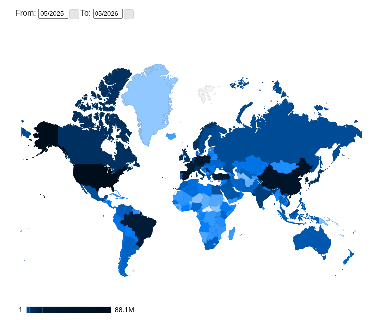

## La Novitade

<div style="border: 1px solid #d0d7de; border-radius: 8px; padding: 16px; margin: 8px 0; background: #ffffff; font-family: -apple-system, BlinkMacSystemFont, 'Segoe UI', Helvetica, Arial, sans-serif; color: #1f2328;"><div style="display: flex; align-items: center; gap: 12px; margin-bottom: 12px;"><div><strong style="display: block; color: #1f2328;">arcangelo7</strong><span style="font-size: 0.85em; color: #656d76;">Jun 30, 2026</span><span style="font-size: 0.85em; color: #656d76;"> &middot; </span><a href="https://github.com/opencitations/ramose" style="font-size: 0.85em; color: #0969da; text-decoration: none;">opencitations/ramose</a></div></div><div style="margin: 12px 0; color: #1f2328;"><p>fix(skg-if): emit json-ld base placeholder [release]</p></div><div style="display: flex; justify-content: flex-end; align-items: center; font-size: 0.85em;"><a href="https://github.com/opencitations/ramose/commit/e14ffed25ff7730a713a1a18e5d3f05cab47b4c0" style="color: #0969da; text-decoration: none; font-weight: 500;">e14ffed</a></div></div>

### Articolo RAMOSE

Ho rimosso l'affermazione secondo cui le statistiche dimostrano che Ramose permette di gestire un elevato carico. Non è vero. Questo andrebbe dimostrato mostrando statistiche di uptime, che non stiamo mostrando, e queste statistiche dovrebbero rimuovere la variabile Virtuoso, il che non è possibile.

### HERITRACE

<div style="border: 1px solid #d0d7de; border-radius: 8px; padding: 16px; margin: 8px 0; background: #ffffff; font-family: -apple-system, BlinkMacSystemFont, 'Segoe UI', Helvetica, Arial, sans-serif; color: #1f2328;"><div style="display: flex; align-items: center; gap: 12px; margin-bottom: 12px;"><div><strong style="display: block; color: #1f2328;">arcangelo7</strong><span style="font-size: 0.85em; color: #656d76;">Jul 2, 2026</span><span style="font-size: 0.85em; color: #656d76;"> &middot; </span><a href="https://github.com/opencitations/heritrace" style="font-size: 0.85em; color: #0969da; text-decoration: none;">opencitations/heritrace</a></div></div><div style="margin: 12px 0; color: #1f2328;"><p>perf(catalog): avoid repeated label and class queries</p>
<p>Cache SHACL shape query results and parallelize labels formatting</p></div><div style="display: flex; justify-content: flex-end; align-items: center; font-size: 0.85em;"><a href="https://github.com/opencitations/heritrace/commit/30809bca82ab9dfc656fb7add00403a2ec87e4cc" style="color: #0969da; text-decoration: none; font-weight: 500;">30809bc</a></div></div>

### Meta

<div style="border: 1px solid #d0d7de; border-radius: 8px; padding: 16px; margin: 8px 0; background: #ffffff; font-family: -apple-system, BlinkMacSystemFont, 'Segoe UI', Helvetica, Arial, sans-serif; color: #1f2328;"><div style="display: flex; align-items: center; gap: 12px; margin-bottom: 12px;"><div><strong style="display: block; color: #1f2328;">arcangelo7</strong><span style="font-size: 0.85em; color: #656d76;">Jul 2, 2026</span><span style="font-size: 0.85em; color: #656d76;"> &middot; </span><a href="https://github.com/opencitations/oc_meta" style="font-size: 0.85em; color: #0969da; text-decoration: none;">opencitations/oc_meta</a></div></div><div style="margin: 12px 0; color: #1f2328;"><p>feat: add SPARQL Service Description generator</p></div><div style="display: flex; justify-content: flex-end; align-items: center; font-size: 0.85em;"><a href="https://github.com/opencitations/oc_meta/commit/3daa7d3f2bc4647427d06c1fa7b89a7c24bc980f" style="color: #0969da; text-decoration: none; font-weight: 500;">3daa7d3</a></div></div>

```turtle
@prefix dcterms: <http://purl.org/dc/terms/> .
@prefix foaf: <http://xmlns.com/foaf/0.1/> .
@prefix formats: <http://www.w3.org/ns/formats/> .
@prefix rdf: <http://www.w3.org/1999/02/22-rdf-syntax-ns#> .
@prefix sd: <http://www.w3.org/ns/sparql-service-description#> .
@prefix void: <http://rdfs.org/ns/void#> .
@prefix xsd: <http://www.w3.org/2001/XMLSchema#> .

[] a sd:Service ;
    sd:defaultDataset [ a void:Dataset,
                sd:Dataset ;
            dcterms:description "OpenCitations Meta entity data"@en ;
            dcterms:title "OpenCitations Meta"@en ;
            void:classPartition [ void:class <http://purl.org/spar/fabio/Expression> ;
                    void:entities 147369096 ],
                [ void:class <http://purl.org/spar/datacite/Identifier> ;
                    void:entities 259332879 ],
                [ void:class <http://purl.org/spar/fabio/DataFile> ;
                    void:entities 2860580 ],
                [ void:class <http://purl.org/spar/fr/ReviewVersion> ;
                    void:entities 5608 ],
                [ void:class <http://purl.org/spar/fabio/Journal> ;
                    void:entities 4755832 ],
                [ void:class foaf:Agent ;
                    void:entities 390541078 ],
                [ void:class <http://purl.org/spar/fabio/Preprint> ;
                    void:entities 256957 ],
                [ void:class <http://purl.org/spar/fabio/Thesis> ;
                    void:entities 65125 ],
                [ void:class <http://purl.org/spar/fabio/DataManagementPlan> ;
                    void:entities 4 ],
                [ void:class <http://purl.org/spar/fabio/ReportDocument> ;
                    void:entities 411417 ],
                [ void:class <http://purl.org/spar/fabio/JournalVolume> ;
                    void:entities 4336587 ],
                [ void:class <http://purl.org/spar/fabio/ProceedingsPaper> ;
                    void:entities 6504081 ],
                [ void:class <http://purl.org/spar/fabio/SpecificationDocument> ;
                    void:entities 14901 ],
                [ void:class <http://purl.org/spar/fabio/ReferenceBook> ;
                    void:entities 241168 ],
                [ void:class <http://purl.org/spar/pro/RoleInTime> ;
                    void:entities 541544410 ],
                [ void:class <http://purl.org/spar/fabio/AcademicProceedings> ;
                    void:entities 6638384 ],
                [ void:class <http://purl.org/spar/fabio/JournalIssue> ;
                    void:entities 7614242 ],
                [ void:class <http://purl.org/spar/fabio/Presentation> ;
                    void:entities 2 ],
                [ void:class <http://purl.org/spar/fabio/Book> ;
                    void:entities 7649106 ],
                [ void:class <http://purl.org/spar/fabio/BookSet> ;
                    void:entities 48 ],
                [ void:class <http://purl.org/spar/fabio/Manifestation> ;
                    void:entities 82546121 ],
                [ void:class <http://purl.org/spar/fabio/BookSeries> ;
                    void:entities 144213 ],
                [ void:class <http://purl.org/spar/fabio/ReferenceEntry> ;
                    void:entities 203258 ],
                [ void:class <http://purl.org/spar/doco/Part> ;
                    void:entities 4167 ],
                [ void:class <http://purl.org/spar/fabio/ExpressionCollection> ;
                    void:entities 23525 ],
                [ void:class <http://purl.org/spar/fabio/BookChapter> ;
                    void:entities 8300803 ],
                [ void:class <http://purl.org/spar/fabio/ComputerProgram> ;
                    void:entities 2330 ],
                [ void:class <http://purl.org/spar/fabio/Series> ;
                    void:entities 14088 ],
                [ void:class <http://purl.org/spar/fabio/JournalArticle> ;
                    void:entities 88373339 ],
                [ void:class <http://purl.org/spar/fabio/WebContent> ;
                    void:entities 992645 ] ;
            void:classes 30 ;
            void:distinctObjects 1680503691 ;
            void:distinctSubjects 1421333585 ;
            void:properties 18 ;
            void:propertyPartition [ void:property foaf:familyName ;
                    void:triples 342844564 ],
                [ void:property <http://purl.org/spar/datacite/usesIdentifierScheme> ;
                    void:triples 259332878 ],
                [ void:property <http://purl.org/spar/pro/withRole> ;
                    void:triples 541544409 ],
                [ void:property foaf:givenName ;
                    void:triples 340076746 ],
                [ void:property <http://purl.org/spar/fabio/hasSequenceIdentifier> ;
                    void:triples 11948142 ],
                [ void:property <http://purl.org/vocab/frbr/core#embodiment> ;
                    void:triples 82507304 ],
                [ void:property <http://purl.org/spar/pro/isHeldBy> ;
                    void:triples 541543125 ],
                [ void:property <http://purl.org/spar/datacite/hasIdentifier> ;
                    void:triples 260774629 ],
                [ void:property <http://purl.org/vocab/frbr/core#partOf> ;
                    void:triples 115198136 ],
                [ void:property <http://purl.org/spar/pro/isDocumentContextFor> ;
                    void:triples 534260004 ],
                [ void:property <http://www.essepuntato.it/2010/06/literalreification/hasLiteralValue> ;
                    void:triples 259332878 ],
                [ void:property <http://prismstandard.org/namespaces/basic/2.0/startingPage> ;
                    void:triples 81134704 ],
                [ void:property <http://prismstandard.org/namespaces/basic/2.0/endingPage> ;
                    void:triples 81134715 ],
                [ void:property dcterms:title ;
                    void:triples 129215401 ],
                [ void:property rdf:type ;
                    void:triples 1560745994 ],
                [ void:property <http://prismstandard.org/namespaces/basic/2.0/publicationDate> ;
                    void:triples 112453159 ],
                [ void:property <https://w3id.org/oc/ontology/hasNext> ;
                    void:triples 316466954 ],
                [ void:property foaf:name ;
                    void:triples 47742692 ] ;
            void:sparqlEndpoint <https://sparql.opencitations.net/meta> ;
            void:triples 5618256434 ;
            void:uriSpace "https://w3id.org/oc/meta/" ;
            sd:namedGraph [ a sd:NamedGraph ;
                    sd:graph [ a sd:Graph ;
                            void:classPartition [ void:class <http://purl.org/spar/datacite/Identifier> ;
                                    void:entities 259332879 ] ;
                            void:classes 1 ;
                            void:properties 3 ;
                            void:propertyPartition [ void:property rdf:type ;
                                    void:triples 259332879 ],
                                [ void:property <http://www.essepuntato.it/2010/06/literalreification/hasLiteralValue> ;
                                    void:triples 259332878 ],
                                [ void:property <http://purl.org/spar/datacite/usesIdentifierScheme> ;
                                    void:triples 259332878 ] ;
                            void:triples 777998635 ;
                            void:uriSpace "https://w3id.org/oc/meta/id/" ] ;
                    sd:name <https://w3id.org/oc/meta/id/> ],
                [ a sd:NamedGraph ;
                    sd:graph [ a sd:Graph ;
                            void:classPartition [ void:class <http://purl.org/spar/pro/RoleInTime> ;
                                    void:entities 541544410 ] ;
                            void:classes 1 ;
                            void:properties 4 ;
                            void:propertyPartition [ void:property <https://w3id.org/oc/ontology/hasNext> ;
                                    void:triples 316466954 ],
                                [ void:property <http://purl.org/spar/pro/withRole> ;
                                    void:triples 541544409 ],
                                [ void:property rdf:type ;
                                    void:triples 541544410 ],
                                [ void:property <http://purl.org/spar/pro/isHeldBy> ;
                                    void:triples 541543125 ] ;
                            void:triples 1941098898 ;
                            void:uriSpace "https://w3id.org/oc/meta/ar/" ] ;
                    sd:name <https://w3id.org/oc/meta/ar/> ],
                [ a sd:NamedGraph ;
                    sd:graph [ a sd:Graph ;
                            void:classPartition [ void:class <http://purl.org/spar/fabio/Manifestation> ;
                                    void:entities 82546121 ] ;
                            void:classes 1 ;
                            void:properties 3 ;
                            void:propertyPartition [ void:property rdf:type ;
                                    void:triples 82546121 ],
                                [ void:property <http://prismstandard.org/namespaces/basic/2.0/startingPage> ;
                                    void:triples 81134704 ],
                                [ void:property <http://prismstandard.org/namespaces/basic/2.0/endingPage> ;
                                    void:triples 81134715 ] ;
                            void:triples 244815540 ;
                            void:uriSpace "https://w3id.org/oc/meta/re/" ] ;
                    sd:name <https://w3id.org/oc/meta/re/> ],
                [ a sd:NamedGraph ;
                    sd:graph [ a sd:Graph ;
                            void:classPartition [ void:class foaf:Agent ;
                                    void:entities 390541078 ] ;
                            void:classes 1 ;
                            void:properties 5 ;
                            void:propertyPartition [ void:property foaf:familyName ;
                                    void:triples 342844564 ],
                                [ void:property rdf:type ;
                                    void:triples 390541078 ],
                                [ void:property foaf:name ;
                                    void:triples 47742692 ],
                                [ void:property foaf:givenName ;
                                    void:triples 340076746 ],
                                [ void:property <http://purl.org/spar/datacite/hasIdentifier> ;
                                    void:triples 12400527 ] ;
                            void:triples 1133605607 ;
                            void:uriSpace "https://w3id.org/oc/meta/ra/" ] ;
                    sd:name <https://w3id.org/oc/meta/ra/> ],
                [ a sd:NamedGraph ;
                    sd:graph [ a sd:Graph ;
                            void:classPartition [ void:class <http://purl.org/spar/fabio/BookSeries> ;
                                    void:entities 144213 ],
                                [ void:class <http://purl.org/spar/fabio/ExpressionCollection> ;
                                    void:entities 23525 ],
                                [ void:class <http://purl.org/spar/fabio/ReferenceBook> ;
                                    void:entities 241168 ],
                                [ void:class <http://purl.org/spar/fabio/JournalVolume> ;
                                    void:entities 4336587 ],
                                [ void:class <http://purl.org/spar/fabio/BookSet> ;
                                    void:entities 48 ],
                                [ void:class <http://purl.org/spar/fabio/DataFile> ;
                                    void:entities 2860580 ],
                                [ void:class <http://purl.org/spar/fabio/WebContent> ;
                                    void:entities 992645 ],
                                [ void:class <http://purl.org/spar/fabio/DataManagementPlan> ;
                                    void:entities 4 ],
                                [ void:class <http://purl.org/spar/doco/Part> ;
                                    void:entities 4167 ],
                                [ void:class <http://purl.org/spar/fabio/Thesis> ;
                                    void:entities 65125 ],
                                [ void:class <http://purl.org/spar/fabio/Book> ;
                                    void:entities 7649106 ],
                                [ void:class <http://purl.org/spar/fabio/ComputerProgram> ;
                                    void:entities 2330 ],
                                [ void:class <http://purl.org/spar/fabio/JournalIssue> ;
                                    void:entities 7614242 ],
                                [ void:class <http://purl.org/spar/fabio/BookChapter> ;
                                    void:entities 8300803 ],
                                [ void:class <http://purl.org/spar/fabio/Journal> ;
                                    void:entities 4755832 ],
                                [ void:class <http://purl.org/spar/fabio/JournalArticle> ;
                                    void:entities 88373339 ],
                                [ void:class <http://purl.org/spar/fr/ReviewVersion> ;
                                    void:entities 5608 ],
                                [ void:class <http://purl.org/spar/fabio/Series> ;
                                    void:entities 14088 ],
                                [ void:class <http://purl.org/spar/fabio/SpecificationDocument> ;
                                    void:entities 14901 ],
                                [ void:class <http://purl.org/spar/fabio/ProceedingsPaper> ;
                                    void:entities 6504081 ],
                                [ void:class <http://purl.org/spar/fabio/Expression> ;
                                    void:entities 147369096 ],
                                [ void:class <http://purl.org/spar/fabio/ReferenceEntry> ;
                                    void:entities 203258 ],
                                [ void:class <http://purl.org/spar/fabio/Presentation> ;
                                    void:entities 2 ],
                                [ void:class <http://purl.org/spar/fabio/Preprint> ;
                                    void:entities 256957 ],
                                [ void:class <http://purl.org/spar/fabio/ReportDocument> ;
                                    void:entities 411417 ],
                                [ void:class <http://purl.org/spar/fabio/AcademicProceedings> ;
                                    void:entities 6638384 ] ;
                            void:classes 26 ;
                            void:properties 8 ;
                            void:propertyPartition [ void:property <http://purl.org/vocab/frbr/core#partOf> ;
                                    void:triples 115198136 ],
                                [ void:property <http://prismstandard.org/namespaces/basic/2.0/publicationDate> ;
                                    void:triples 112453159 ],
                                [ void:property rdf:type ;
                                    void:triples 286781506 ],
                                [ void:property <http://purl.org/spar/pro/isDocumentContextFor> ;
                                    void:triples 534260004 ],
                                [ void:property <http://purl.org/spar/fabio/hasSequenceIdentifier> ;
                                    void:triples 11948142 ],
                                [ void:property <http://purl.org/vocab/frbr/core#embodiment> ;
                                    void:triples 82507304 ],
                                [ void:property dcterms:title ;
                                    void:triples 129215401 ],
                                [ void:property <http://purl.org/spar/datacite/hasIdentifier> ;
                                    void:triples 248374102 ] ;
                            void:triples 1520737754 ;
                            void:uriSpace "https://w3id.org/oc/meta/br/" ] ;
                    sd:name <https://w3id.org/oc/meta/br/> ] ] ;
    sd:endpoint <https://sparql.opencitations.net/meta> ;
    sd:feature sd:BasicFederatedQuery,
        sd:UnionDefaultGraph ;
    sd:resultFormat formats:SPARQL_Results_CSV,
        formats:SPARQL_Results_JSON,
        formats:SPARQL_Results_TSV,
        formats:SPARQL_Results_XML,
        formats:Turtle ;
    sd:supportedLanguage sd:SPARQL11Query .
```

<div style="border: 1px solid #d0d7de; border-radius: 8px; padding: 16px; margin: 8px 0; background: #ffffff; font-family: -apple-system, BlinkMacSystemFont, 'Segoe UI', Helvetica, Arial, sans-serif; color: #1f2328;"><div style="display: flex; align-items: center; gap: 12px; margin-bottom: 12px;"><div><strong style="display: block; color: #1f2328;">arcangelo7</strong><span style="font-size: 0.85em; color: #656d76;">Jul 5, 2026</span><span style="font-size: 0.85em; color: #656d76;"> &middot; </span><a href="https://github.com/opencitations/oc_graphenricher" style="font-size: 0.85em; color: #0969da; text-decoration: none;">opencitations/oc_graphenricher</a></div></div><div style="margin: 12px 0; color: #1f2328;"><p>fix(deduplication): preserve more informative duplicate survivor [release]</p>
<p>Automatic deduplication now selects the cluster member with more functional metadata when no preferred survivor is configured.</p></div><div style="display: flex; justify-content: flex-end; align-items: center; font-size: 0.85em;"><a href="https://github.com/opencitations/oc_graphenricher/commit/732e8648d4faeb02573211d17520ed2ad0fe1a7f" style="color: #0969da; text-decoration: none; font-weight: 500;">732e864</a></div></div>

<div style="border: 1px solid #d0d7de; border-radius: 8px; padding: 16px; margin: 8px 0; background: #ffffff; font-family: -apple-system, BlinkMacSystemFont, 'Segoe UI', Helvetica, Arial, sans-serif; color: #1f2328;"><div style="display: flex; align-items: center; gap: 12px; margin-bottom: 12px;"><div><strong style="display: block; color: #1f2328;">arcangelo7</strong><span style="font-size: 0.85em; color: #656d76;">Jul 6, 2026</span><span style="font-size: 0.85em; color: #656d76;"> &middot; </span><a href="https://github.com/opencitations/oc_graphenricher" style="font-size: 0.85em; color: #0969da; text-decoration: none;">opencitations/oc_graphenricher</a></div></div><div style="margin: 12px 0; color: #1f2328;"><p>fix(deduplication): avoid merging distinct containers [release]</p>
<p>Container chains can contain same-typed volumes and issues that belong to different records. Match containers from the top of the hierarchy and merge only pairs with matching identity data so conflicting containers remain separate.</p></div><div style="display: flex; justify-content: flex-end; align-items: center; font-size: 0.85em;"><a href="https://github.com/opencitations/oc_graphenricher/commit/3a1da2f0e8b36d8f627e559e53df23d60db0e1bf" style="color: #0969da; text-decoration: none; font-weight: 500;">3a1da2f</a></div></div>

<div style="border: 1px solid #d0d7de; border-radius: 8px; padding: 16px; margin: 8px 0; background: #ffffff; font-family: -apple-system, BlinkMacSystemFont, 'Segoe UI', Helvetica, Arial, sans-serif; color: #1f2328;"><div style="display: flex; align-items: center; gap: 12px; margin-bottom: 12px;"><div><strong style="display: block; color: #1f2328;">arcangelo7</strong><span style="font-size: 0.85em; color: #656d76;">Jul 6, 2026</span><span style="font-size: 0.85em; color: #656d76;"> &middot; </span><a href="https://github.com/opencitations/oc_graphenricher" style="font-size: 0.85em; color: #0969da; text-decoration: none;">opencitations/oc_graphenricher</a></div></div><div style="margin: 12px 0; color: #1f2328;"><p>fix(deduplication): keep distinct publisher roles [release]</p>
<p>Merged bibliographic resources were merging publisher roles whenever both sides had one. This keeps disagreeing publishers separate and only merges roles when their responsible agents share an identifier or normalized name.</p></div><div style="display: flex; justify-content: flex-end; align-items: center; font-size: 0.85em;"><a href="https://github.com/opencitations/oc_graphenricher/commit/e1aa5cdf29700ec5662b69631a545f843826d128" style="color: #0969da; text-decoration: none; font-weight: 500;">e1aa5cd</a></div></div>

<div style="border: 1px solid #d0d7de; border-radius: 8px; padding: 16px; margin: 8px 0; background: #ffffff; font-family: -apple-system, BlinkMacSystemFont, 'Segoe UI', Helvetica, Arial, sans-serif; color: #1f2328;"><div style="display: flex; align-items: center; gap: 12px; margin-bottom: 12px;"><div><strong style="display: block; color: #1f2328;">arcangelo7</strong><span style="font-size: 0.85em; color: #656d76;">Jul 6, 2026</span><span style="font-size: 0.85em; color: #656d76;"> &middot; </span><a href="https://github.com/opencitations/oc_graphenricher" style="font-size: 0.85em; color: #0969da; text-decoration: none;">opencitations/oc_graphenricher</a></div></div><div style="margin: 12px 0; color: #1f2328;"><p>fix(deduplication): Reject manual BR merges that would collapse a typed container into an incompatible BR type [release]</p>
<p>Also, BR merges can acquire a container or publisher from an earlier merged entity. Re-reading survivor links before each merge lets later equivalent containers and publishers merge into the survivor state.</p>
<p>Also add the software citation sync workflow</p></div><div style="display: flex; justify-content: flex-end; align-items: center; font-size: 0.85em;"><a href="https://github.com/opencitations/oc_graphenricher/commit/ed7ead33ab5a5b435790e5c84eabb4c29b967203" style="color: #0969da; text-decoration: none; font-weight: 500;">ed7ead3</a></div></div>

<div style="border: 1px solid #d0d7de; border-radius: 8px; padding: 16px; margin: 8px 0; background: #ffffff; font-family: -apple-system, BlinkMacSystemFont, 'Segoe UI', Helvetica, Arial, sans-serif; color: #1f2328;"><div style="display: flex; align-items: center; gap: 12px; margin-bottom: 12px;"><div><strong style="display: block; color: #1f2328;">arcangelo7</strong><span style="font-size: 0.85em; color: #656d76;">Jul 7, 2026</span><span style="font-size: 0.85em; color: #656d76;"> &middot; </span><a href="https://github.com/opencitations/oc_graphenricher" style="font-size: 0.85em; color: #0969da; text-decoration: none;">opencitations/oc_graphenricher</a></div></div><div style="margin: 12px 0; color: #1f2328;"><p>fix(deduplication): order merge clusters before mutation [release]</p>
<p>Run identifier clusters before resource clusters and merge bibliographic containers by depth (journal&gt;volume&gt;issue&gt;article)</p></div><div style="display: flex; justify-content: flex-end; align-items: center; font-size: 0.85em;"><a href="https://github.com/opencitations/oc_graphenricher/commit/9c0a1eab569a580a9f308842d78316018f8bc894" style="color: #0969da; text-decoration: none; font-weight: 500;">9c0a1ea</a></div></div>

<div style="border: 1px solid #d0d7de; border-radius: 8px; padding: 16px; margin: 8px 0; background: #ffffff; font-family: -apple-system, BlinkMacSystemFont, 'Segoe UI', Helvetica, Arial, sans-serif; color: #1f2328;"><div style="display: flex; align-items: center; gap: 12px; margin-bottom: 12px;"><div><strong style="display: block; color: #1f2328;">arcangelo7</strong><span style="font-size: 0.85em; color: #656d76;">Jul 4, 2026</span><span style="font-size: 0.85em; color: #656d76;"> &middot; </span><a href="https://github.com/opencitations/oc_meta" style="font-size: 0.85em; color: #0969da; text-decoration: none;">opencitations/oc_meta</a></div></div><div style="margin: 12px 0; color: #1f2328;"><p>fix(merge): use graphenricher merge workflow</p></div><div style="display: flex; justify-content: flex-end; align-items: center; font-size: 0.85em;"><a href="https://github.com/opencitations/oc_meta/commit/ca5ba592822923ad0eb2cd17fc475cbde377999e" style="color: #0969da; text-decoration: none; font-weight: 500;">ca5ba59</a></div></div>

<div style="border: 1px solid #d0d7de; border-radius: 8px; padding: 16px; margin: 8px 0; background: #ffffff; font-family: -apple-system, BlinkMacSystemFont, 'Segoe UI', Helvetica, Arial, sans-serif; color: #1f2328;"><div style="display: flex; align-items: center; gap: 12px; margin-bottom: 12px;"><div><strong style="display: block; color: #1f2328;">arcangelo7</strong><span style="font-size: 0.85em; color: #656d76;">Jul 6, 2026</span><span style="font-size: 0.85em; color: #656d76;"> &middot; </span><a href="https://github.com/opencitations/oc_meta" style="font-size: 0.85em; color: #0969da; text-decoration: none;">opencitations/oc_meta</a></div></div><div style="margin: 12px 0; color: #1f2328;"><p>fix(merge): load the full container closure to prevent over-merge corruption</p>
<p>The batch merge cascades onto frbr:partOf containers through oc_graphenricher
but only loaded a one-hop neighbourhood. Merging duplicate articles could delete
a shared issue, volume or journal while sibling entities kept pointing at the
deleted resource.</p>
<p>Load the whole closure a merge touches instead: the seeds, their partOf ancestor
chain and the one-hop neighbourhood of that set, so every entity referencing a
container that may be deleted is present and gets redirected. entities.py and
group_entities.py now share compute_related_closure, which also keeps merges
reaching a common container in the same worker so parallel runs cannot diverge
on it.</p></div><div style="display: flex; justify-content: flex-end; align-items: center; font-size: 0.85em;"><a href="https://github.com/opencitations/oc_meta/commit/2a57de568ebb729d78169536df53a45f33e2d015" style="color: #0969da; text-decoration: none; font-weight: 500;">2a57de5</a></div></div>

## Domande

88M dagli Stati Uniti e 69M dalla Repubblica Ceca. Cosa sta succedendo in Czechia?



## Memo

RAMOSE

* Confronto performance
* Aggiungere connextion
* Chiarire di non usare LIMIT con @@page

TAL

* Aggiungere skolemizzazione

Vizioso

* [https://en.wikipedia.org/wiki/Compilers:\_Principles,\_Techniques,\_and\_Tools](https://en.wikipedia.org/wiki/Compilers:_Principles,_Techniques,_and_Tools)
* [https://en.wikipedia.org/wiki/GNU\_Bison](https://en.wikipedia.org/wiki/GNU_Bison)
* [https://en.wikipedia.org/wiki/Yacc](https://en.wikipedia.org/wiki/Yacc)

HERITRACE

* Per risolvere le performance del time-vault non usare la time-agnostic-library, ma guarda solo la query di update dello snapshot di cancellazione.
* anni: essere meno stretto sugli anni. Problema ISO per 999. 0999?
* Timer massimo. Timer configurabile. Messaggio in caso si stia per toccare il timer massimo.
* Riflettere su @lang. SKOS come use case. skos:prefLabel, skos:altLabel
* Possibilità di specificare l’URI a mano in fase di creazione
* description con l'entità e stata modificata. Tipo commit
* display name è References Cited by VA bene
* Avvertire l'utente del disastro imminente nel caso in cui provi a cancellare un volume

Meta

* Rilanciare processo eliminazione duplicati
* Fusione: chi ha più metadati compilati. A parità di metadato si tiene l’omid più basso
* frbr:partOf non deve aggiungere nel merge: [https://opencitations.net/meta/api/v1/metadata/omid:br/06304322094](https://opencitations.net/meta/api/v1/metadata/omid:br/06304322094)
* API v2
* Usare il triplestore di provenance per fare 303 in caso di entità mergiate o mostrare la provenance in caso di cancellazione e basta.

oc\_ocdm

* Automatizzare mark\_as\_restored di default. è possibile disabilitare e fare a mano mark\_as\_restored.
* [https://opencitations.net/meta/api/v1/metadata/doi:10.1093/acprof:oso/9780199977628.001.0001](https://opencitations.net/meta/api/v1/metadata/doi:10.1093/acprof:oso/9780199977628.001.0001)
* DELETE con variabile
* Modificare Meta sulla base della tabella di Elia
* embodiment multipli devono essere purgati a monte
* Modificare documentazione API aggiungendo omid
* aggiungere Relation sovraclasse di Citazione e Menzione

RML

* Vedere come morh kgc rappresenta database internamente
* [https://github.com/oeg-upm/gtfs-bench](https://github.com/oeg-upm/gtfs-bench)
* Chiedere Ionannisil diagramma che ha usato per auto rml.

Crowdsourcing

* Quando dobbiamo ingerire Crossref stoppo manualmente OJS. Si mette una nota nel repository per dire le cose. Ogni mese.
* Aggiornamenti al dump incrementali. Si usa un nuovo prefisso e si aggiungono dati solo a quel CSV.
* Bisogna usare il DOI di Zenodo come primary source. Un unico DOI per batch process.
* Bisogna fare l’aggiornamento sulla copia e poi bisogna automatizzare lo switch

Citazioni

* Fare diff DataCite per togliere le citazioni che non sono più citazioni. è da fare in post. Snapshot 2 di provenance. Fare lo snapshot 3 con la creazione con il derived from al nuovo dump. La lineage viene data dallo specialization of. Colleghi sia al 2 che al dump.
* Repo cerotti. meta/index/sorgenti

OC di converter

* Riguardare perché viene fuori una seconda tabella object per DataCite.
