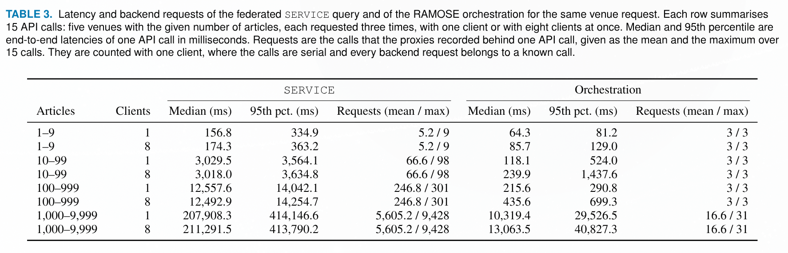
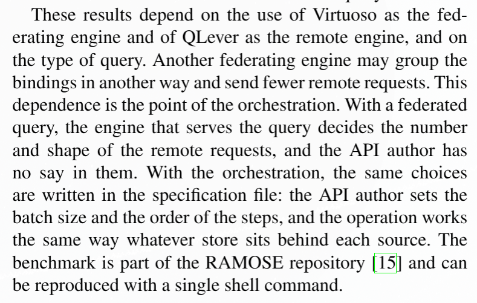
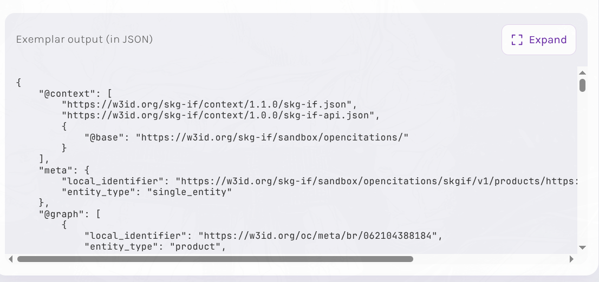
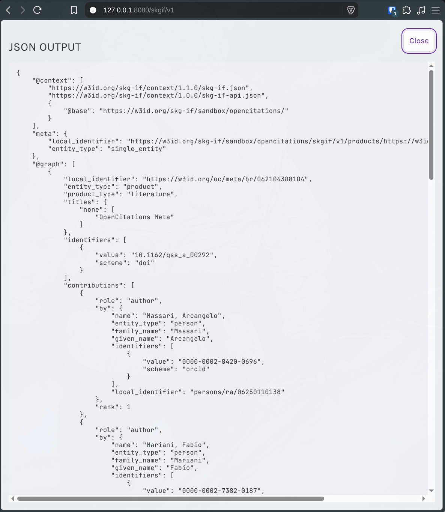
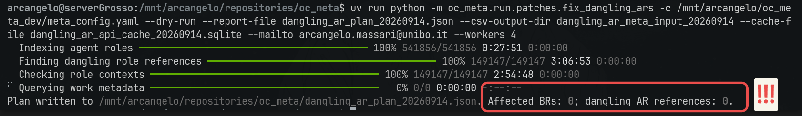

import { Image } from 'astro:assets'

import uhyngt from '../../../assets/notes/attachments/pasted-image-20260910085939.png'

import hygfix from '../../../assets/notes/attachments/pasted-image-20260910085939.png'

import remjli from '../../../assets/notes/attachments/pasted-image-20260910085939.png'

import pvlhsm from '../../../assets/notes/attachments/pasted-image-20260910085939.png'

import zpgkkf from '../../../assets/notes/attachments/pasted-image-20260911181409.png'

import gliywl from '../../../assets/notes/attachments/pasted-image-20260911181455.png'

import obwlhx from '../../../assets/notes/attachments/pasted-image-20260911182027.png'

import codhjn from '../../../assets/notes/attachments/pasted-image-20260911182215.png'

import avjmyh from '../../../assets/notes/attachments/pasted-image-20260911184143.png'

import vmrgmp from '../../../assets/notes/attachments/pasted-image-20260911184201.png'

import xjygqv from '../../../assets/notes/attachments/pasted-image-20260911191839.png'

import cdevua from '../../../assets/notes/attachments/pasted-image-20260911192859.png'

import gtuozl from '../../../assets/notes/attachments/pasted-image-20260911193425.png'

import sgnrnz from '../../../assets/notes/attachments/pasted-image-20260911193600.png'

import rseqgo from '../../../assets/notes/attachments/pasted-image-20260911193955.png'

import zwnacs from '../../../assets/notes/attachments/pasted-image-20260911194126.png'

import xqjdqg from '../../../assets/notes/attachments/pasted-image-20260911194256.png'

import juupfl from '../../../assets/notes/attachments/pasted-image-20260911194507.png'

## La Novitade

### SPARQL

**Descrizioni dei servizi**

* [http://sparql-stg.opencitations.net/index/description](http://sparql-stg.opencitations.net/index/description)
* [http://sparql-stg.opencitations.net/meta/description](http://sparql-stg.opencitations.net/meta/description)
* [http://sparql-stg.opencitations.net/.well-known/void](http://sparql-stg.opencitations.net/.well-known/void)

**Index**

* [http://sparql-stg.opencitations.net/static/service-descriptions/index.html](http://sparql-stg.opencitations.net/static/service-descriptions/index.html)
* [http://sparql-stg.opencitations.net/static/service-descriptions/index.ttl](http://sparql-stg.opencitations.net/static/service-descriptions/index.ttl)
* [http://sparql-stg.opencitations.net/static/service-descriptions/index.jsonld](http://sparql-stg.opencitations.net/static/service-descriptions/index.jsonld)
* [http://sparql-stg.opencitations.net/static/service-descriptions/index.rdf](http://sparql-stg.opencitations.net/static/service-descriptions/index.rdf)
* [http://sparql-stg.opencitations.net/static/service-descriptions/index.nt](http://sparql-stg.opencitations.net/static/service-descriptions/index.nt)

**Meta**

* [http://sparql-stg.opencitations.net/static/service-descriptions/meta.html](http://sparql-stg.opencitations.net/static/service-descriptions/meta.html)
* [http://sparql-stg.opencitations.net/static/service-descriptions/meta.ttl](http://sparql-stg.opencitations.net/static/service-descriptions/meta.ttl)
* [http://sparql-stg.opencitations.net/static/service-descriptions/meta.jsonld](http://sparql-stg.opencitations.net/static/service-descriptions/meta.jsonld)
* [http://sparql-stg.opencitations.net/static/service-descriptions/meta.rdf](http://sparql-stg.opencitations.net/static/service-descriptions/meta.rdf)
* [http://sparql-stg.opencitations.net/static/service-descriptions/meta.nt](http://sparql-stg.opencitations.net/static/service-descriptions/meta.nt)

**VoID**

* [http://sparql-stg.opencitations.net/static/service-descriptions/void.html](http://sparql-stg.opencitations.net/static/service-descriptions/void.html)
* [http://sparql-stg.opencitations.net/static/service-descriptions/void.ttl](http://sparql-stg.opencitations.net/static/service-descriptions/void.ttl)
* [http://sparql-stg.opencitations.net/static/service-descriptions/void.jsonld](http://sparql-stg.opencitations.net/static/service-descriptions/void.jsonld)
* [http://sparql-stg.opencitations.net/static/service-descriptions/void.rdf](http://sparql-stg.opencitations.net/static/service-descriptions/void.rdf)
* [http://sparql-stg.opencitations.net/static/service-descriptions/void.nt](http://sparql-stg.opencitations.net/static/service-descriptions/void.nt)

### RAMOSE

Ho trovato un bug di performance. RAMOSE usava una sola sessione HTTP condivisa (requests.Session) e il valore predefinito della libreria teneva aperte solo dieci connessioni. Oltre quella soglia requests butta via la connessione TCP e ne crea una nuova. Ho sovrascritto con 100.

#### Benchmark

##### Esperimento 1

**Input**: un DOI
**Output**: OMID dell'opera richiesta, citazioni in entrata e metadati delle opere citanti
**Query remote**: una federazione su un singolo articolo
**Campionamento**: 100 DOI, 20 con 0 opere citanti, 20 con 1-9, 20 con 10-49, 20 con 50-99 e 20 con almeno 100
**Livelli di concorrenza**: 1, 4, 16
**Misurazioni**: 6.000 = 100 DOI \* 2 strategie \* 10 ripetizioni \* 3 livelli di concorrenza

Primi risultati, SERVICE è più veloce, con una leggera inversione oltre le 100 opere citanti. Ecco le mediane

| Opere citanti  | Concorrenza 1, SERVICE / orchestrazione | Concorrenza 4, SERVICE / orchestrazione | Concorrenza 16, SERVICE / orchestrazione |
| -------------- | --------------------------------------: | --------------------------------------: | ---------------------------------------: |
| Tutte le fasce |                          48,5 / 65,5 ms |                          59,1 / 80,9 ms |                         391,1 / 398,8 ms |
| 0              |                          48,5 / 52,8 ms |                          51,8 / 55,9 ms |                         184,5 / 234,8 ms |
| 1-9            |                          52,4 / 57,6 ms |                          55,0 / 63,3 ms |                         254,3 / 293,9 ms |
| 10-49          |                          26,2 / 69,0 ms |                          41,9 / 77,1 ms |                         327,3 / 355,6 ms |
| 50-99          |                          47,0 / 86,9 ms |                         67,0 / 101,3 ms |                         492,7 / 501,7 ms |
| 100+           |                        148,0 / 149,2 ms |                        210,5 / 202,0 ms |                   1.072,9 / **970,6 ms** |

E qui interviene la sofisticata arte del benchmarkmaxxing. <Image src={uhyngt} alt="" width="170" height="auto" /><Image src={hygfix} alt="" width="170" height="auto" /><Image src={remjli} alt="" width="170" height="auto" /><Image src={pvlhsm} alt="" width="171" height="auto" />

Stiamo mettendo sotto stress il SERVICE? Manco penniente.

Ci sono delle operazioni sulle API di OC che metterebbero sotto sforzo il SERVICE? Sì: quelle che chiedono più entità alla volta, perché il numero di chiamate al server federato aumentano.

Ok, e volendo essere ancora più stronzi? Si potrebbe fare una cosa tipo /venue-citation-count. Si parte da un ISSN, si trovano tutti gli articoli associati e per ciascuno si federa a Index

##### Esperimento 2

**Input**: un ISSN
**Output**: OMID degli articoli della rivista, loro citazioni in entrata e metadati delle opere citanti
**Query remote**: da 6 a 9.427 articoli per rivista
**Campionamento**: 4 ISSN scelti nelle fasce 1-9, 10-99, 100-999 e 1.000-9.999 articoli
**Misurazioni**: 240 = 5 ISSN \* 4 fasce \* 2 livelli di concorrenza \* 2 strategie \* 3 ripetizioni

|                                                                                                          Articoli | Concorrenza | SERVICE: latenza / successo / chiamate medie-massime | Orchestrazione: latenza / successo / chiamate medie-massime |
| ----------------------------------------------------------------------------------------------------------------: | ----------: | ---------------------------------------------------- | ----------------------------------------------------------- |
|                                                                                                               1-9 |           1 | 168,1 ms / 100% / 4,8-9                              | 58,1 ms / 100% / 1-1                                        |
|                                                                                                               1-9 |          16 | 304,7 ms / 100% / 4,8-9                              | 585,3 ms / 100% / 1-1                                       |
|                                                                                                             10-99 |           1 | 3.295,4 ms / 100% / 65,6-97                          | 667,7 ms / 100% / 1-1                                       |
|                                                                                                             10-99 |          16 | 5.028,8 ms / 100% / 65,6-97                          | 4.589,8 ms / 100% / 1-1                                     |
|                                                                                                           100-999 |           1 | 13.131,7 ms / 100% / 245,8-300                       | 794,7 ms / 100% / 1-1                                       |
|                                                                                                           100-999 |          16 | 15.499,1 ms / 100% / 245,8-300                       | 13.785,5 ms / 100% / 1-1                                    |
|                                                                                                       1.000-9.999 |           1 | nessuna / 0% / 3.752,4-3.983                         | 1.466,1 ms / 20% / 1-1                                      |
|                                                                                                       1.000-9.999 |          16 | nessuna / 0% / 3.752,4-3.983                         | 15.106,7 ms / 20% / 1-1                                     |
| Già meglio. L'orchestrazione fallisce perché Virtuoso manda a QLever tutti gli OMID in un colpo solo con @@values |             |                                                      |                                                             |

Aggiungo: `@@values <var>... [batch_size=<positive integer>]`

|    Articoli | Concorrenza | SERVICE: latenza / successo / richieste backend medie-massime | Orchestrazione: latenza / successo / richieste backend medie-massime |
| ----------: | ----------: | ------------------------------------------------------------- | -------------------------------------------------------------------- |
|         1-9 |           1 | 200,6 ms / 100% / 5,2-9                                       | 87,2 ms / 100% / 3-3                                                 |
|         1-9 |          16 | 388,3 ms / 100% / 5,2-9                                       | 439,6 ms / 100% / 3-3                                                |
|       10-99 |           1 | 4.093,8 ms / 100% / 66,6-98                                   | 902,5 ms / 100% / 3-3                                                |
|       10-99 |          16 | 7.869,5 ms / 100% / 66,6-98                                   | 10.252,4 ms / 100% / 3-3                                             |
|     100-999 |           1 | 14.843,1 ms / 100% / 246,8-301                                | 1.742,0 ms / 100% / 3-3                                              |
|     100-999 |          16 | 18.219,4 ms / 100% / 246,8-301                                | 18.607,9 ms / 100% / 3-3                                             |
| 1.000-9.999 |           1 | 374.998,0 ms / 86,7% / 16.815,6-28.284                        | 77.036,5 ms / 100% / 16,6-31                                         |
| 1.000-9.999 |          16 | 153.507,0 ms / 53,3% / 16.815,6-28.284                        | 257.809,9 ms / 100% / 16,6-31                                        |

<strong style="display: block; color: #1f2328;">arcangelo7</strong>Sep 13, 2026 &middot; <a href="https://github.com/opencitations/ramose" style="font-size: 0.85em; color: #0969da; text-decoration: none;">opencitations/ramose</a>

chore(benchmark): give both stores enough memory and CPU and measure at 8 clients

Virtuoso now holds most of Meta in 44 GB of buffers and QLever runs without a CPU cap, so timeouts no longer come from a starved database. Concurrency drops from 16 to 8 because 16 heavy requests saturate the host and the benchmark would measure the machine rather than the two federation strategies.

<a href="https://github.com/opencitations/ramose/commit/a9236d601994714f8ef4903c835977a792d960f7" style="color: #0969da; text-decoration: none; font-weight: 500;">a9236d6</a>

|    Articoli | Concorrenza | SERVICE: latenza / successo / richieste backend medie-massime | Orchestrazione: latenza / successo / richieste backend medie-massime |
| ----------: | ----------: | ------------------------------------------------------------- | -------------------------------------------------------------------- |
|         1-9 |           1 | 156,8 ms / 100% / 5,2-9                                       | 64,3 ms / 100% / 3-3                                                 |
|         1-9 |           8 | 174,3 ms / 100% / 5,2-9                                       | 85,7 ms / 100% / 3-3                                                 |
|       10-99 |           1 | 3.029,5 ms / 100% / 66,6-98                                   | 118,1 ms / 100% / 3-3                                                |
|       10-99 |           8 | 3.018,0 ms / 100% / 66,6-98                                   | 239,9 ms / 100% / 3-3                                                |
|     100-999 |           1 | 12.557,6 ms / 100% / 246,8-301                                | 215,6 ms / 100% / 3-3                                                |
|     100-999 |           8 | 12.492,9 ms / 100% / 246,8-301                                | 435,6 ms / 100% / 3-3                                                |
| 1.000-9.999 |           1 | 207.908,3 ms / 100% / 5.605,2-9.428                           | 10.319,4 ms / 100% / 16,6-31                                         |
| 1.000-9.999 |           8 | 211.291,5 ms / 100% / 5.605,2-9.428                           | 13.063,5 ms / 100% / 16,6-31                                         |
|             |             |                                                               |                                                                      |

E questo direi che va nell'articolo

<strong style="display: block; color: #1f2328;">arcangelo7</strong>Sep 14, 2026 &middot; <a href="https://github.com/opencitations/ramose" style="font-size: 0.85em; color: #0969da; text-decoration: none;">opencitations/ramose</a>

fix: drop the @@foreach directive

@@values covers the same ground with far fewer requests: paired with GROUP BY
it yields per-item aggregates, and it sends one query per batch instead of one
per value.

<a href="https://github.com/opencitations/ramose/commit/943f83fbd7d762a46274df12b99840e0beb86d91" style="color: #0969da; text-decoration: none; font-weight: 500;">943f83f</a>

<strong style="display: block; color: #1f2328;">arcangelo7</strong>Sep 14, 2026 &middot; <a href="https://github.com/opencitations/ramose" style="font-size: 0.85em; color: #0969da; text-decoration: none;">opencitations/ramose</a>

fix: bind client values before sparql substitution

Escape literals and validate IRIs in reads, updates, and YAML templates, returning HTTP 400 for rejected placeholder values.

<a href="https://github.com/opencitations/ramose/commit/8bc813327a2bbd2612b2e8e5c92665844cb1f147" style="color: #0969da; text-decoration: none; font-weight: 500;">8bc8133</a>

<strong style="display: block; color: #1f2328;">arcangelo7</strong>Sep 18, 2026 &middot; <a href="https://github.com/opencitations/ramose" style="font-size: 0.85em; color: #0969da; text-decoration: none;">opencitations/ramose</a>

feat(filters): automatically split searched values like the QLever tokenizer does if ql:has-word is found in the query

<a href="https://github.com/opencitations/ramose/commit/bddabc5894754da213517ed5ba294ad47b21bce9" style="color: #0969da; text-decoration: none; font-weight: 500;">bddabc5</a>

#### Documentazione

<strong style="display: block; color: #1f2328;">arcangelo7</strong>Sep 11, 2026 &middot; <a href="https://github.com/opencitations/ramose" style="font-size: 0.85em; color: #0969da; text-decoration: none;">opencitations/ramose</a>

fix(docs): preserve code casing and wrap long headings

<a href="https://github.com/opencitations/ramose/commit/6a59e65a611bf338b56986492a279eedd3c86f27" style="color: #0969da; text-decoration: none; font-weight: 500;">6a59e65</a>

<Image src={zpgkkf} alt="" width="348" height="auto" /><Image src={gliywl} alt="" width="351" height="auto" />

<strong style="display: block; color: #1f2328;">arcangelo7</strong>Sep 11, 2026 &middot; <a href="https://github.com/opencitations/ramose" style="font-size: 0.85em; color: #0969da; text-decoration: none;">opencitations/ramose</a>

fix(docs): reduce horizontal margins on small screens

<a href="https://github.com/opencitations/ramose/commit/b972d2c57d0d06993a6f629bcf91b599a603babc" style="color: #0969da; text-decoration: none; font-weight: 500;">b972d2c</a>

<Image src={obwlhx} alt="" width="345" height="auto" /><Image src={codhjn} alt="" width="345" height="auto" />

<strong style="display: block; color: #1f2328;">arcangelo7</strong>Sep 11, 2026 &middot; <a href="https://github.com/opencitations/ramose" style="font-size: 0.85em; color: #0969da; text-decoration: none;">opencitations/ramose</a>

fix(docs): adapt navigation to available space and align operation cards

<a href="https://github.com/opencitations/ramose/commit/d8cd04fd05258d8c73ba16003bba829e879d5d86" style="color: #0969da; text-decoration: none; font-weight: 500;">d8cd04f</a>

<Image src={avjmyh} alt="" width="349" height="auto" /><Image src={vmrgmp} alt="" width="347" height="auto" />

<strong style="display: block; color: #1f2328;">arcangelo7</strong>Sep 11, 2026 &middot; <a href="https://github.com/opencitations/ramose" style="font-size: 0.85em; color: #0969da; text-decoration: none;">opencitations/ramose</a>

fix(docs): size operation cards to content

<a href="https://github.com/opencitations/ramose/commit/2ae49a25e141515e5df4c30684bb758498cbd8dd" style="color: #0969da; text-decoration: none; font-weight: 500;">2ae49a2</a>

<Image src={xjygqv} alt="" width="347" height="auto" /><Image src={cdevua} alt="" width="342" height="auto" />

<strong style="display: block; color: #1f2328;">arcangelo7</strong>Sep 11, 2026 &middot; <a href="https://github.com/opencitations/ramose" style="font-size: 0.85em; color: #0969da; text-decoration: none;">opencitations/ramose</a>

fix(docs): up to 850px give labels and values the full available width

<a href="https://github.com/opencitations/ramose/commit/50f1af51c53ffde5b5a1fd96ba8d150a934fa224" style="color: #0969da; text-decoration: none; font-weight: 500;">50f1af5</a>

<Image src={gtuozl} alt="" width="351" height="auto" /><Image src={sgnrnz} alt="" width="349" height="auto" />

<strong style="display: block; color: #1f2328;">arcangelo7</strong>Sep 11, 2026 &middot; <a href="https://github.com/opencitations/ramose" style="font-size: 0.85em; color: #0969da; text-decoration: none;">opencitations/ramose</a>

fix(docs): reduce nested list indentation on small screens

<a href="https://github.com/opencitations/ramose/commit/a65435469ed15ebaa6344c02909e2baaa551edbc" style="color: #0969da; text-decoration: none; font-weight: 500;">a654354</a>

<Image src={rseqgo} alt="" width="349" height="auto" /><Image src={zwnacs} alt="" width="347" height="auto" />

<strong style="display: block; color: #1f2328;">arcangelo7</strong>Sep 11, 2026 &middot; <a href="https://github.com/opencitations/ramose" style="font-size: 0.85em; color: #0969da; text-decoration: none;">opencitations/ramose</a>

fix(docs): left-align text on small screens to avoid stretched word spacing

<a href="https://github.com/opencitations/ramose/commit/4102842e18c8bb4c8dbb9699a7d82c1100246c4d" style="color: #0969da; text-decoration: none; font-weight: 500;">4102842</a>

<Image src={xqjdqg} alt="" width="342" height="auto" /><Image src={juupfl} alt="" width="340" height="auto" />

<strong style="display: block; color: #1f2328;">arcangelo7</strong>Sep 11, 2026 &middot; <a href="https://github.com/opencitations/ramose" style="font-size: 0.85em; color: #0969da; text-decoration: none;">opencitations/ramose</a>

feat(docs): expand JSON examples in a full-screen dialog

<a href="https://github.com/opencitations/ramose/commit/12456227bc94d5993908e2bb8b0e61deec782dd2" style="color: #0969da; text-decoration: none; font-weight: 500;">1245622</a>

### TAL

<strong style="display: block; color: #1f2328;">arcangelo7</strong>Sep 12, 2026 &middot; <a href="https://github.com/opencitations/time-agnostic-library" style="font-size: 0.85em; color: #0969da; text-decoration: none;">opencitations/time-agnostic-library</a>

feat: search provenance through a custom QLever URI index

<a href="https://github.com/opencitations/time-agnostic-library/commit/582f3451cd87a729d8a89c40bcef19c451dff3f6" style="color: #0969da; text-decoration: none; font-weight: 500;">582f345</a>

Qvindi si può lanciare il benchmark con BEAR. Per fare un confronto, per tirare su BEAR A Fuseki impiega 34 h 39 m, QLever 1 h 55 m. BEAR A ha

Bear A non è piccolo

Dataset: 65,926,511 quad
Provenance: 1,984,865,652 quads
Totale: 2,050,792,163 quads

### Meta

Ho corretto a mano le 29 br (non 42) non correggibili automaticamente

## Domande

* Serve una seconda cover letter per la resubmission di IEEE Access?
* Che ne dite di switchare da Virtuoso a Qlever per Meta? L'indice testuale più o meno va. Non ci sono ancora i merge ma intanto recuperiamo un sacco di risorse (che mi servono per i benchmark di BEAR)

## Memo

META

* Disambiguare gli editori. Inserirla nel processo di patch. Completare il merge.
* Prossimo dump. Eliminare citazioni duplicate.
* Aggiornare oc\_sparql per la provenance

RAMOSE

* Confronto performance
* Aggiungere connextion
* Chiarire di non usare LIMIT con @@page

TAL

* Aggiungere skolemizzazione

Vizioso

* [https://en.wikipedia.org/wiki/Compilers:\_Principles,\_Techniques,\_and\_Tools](https://en.wikipedia.org/wiki/Compilers:_Principles,_Techniques,_and_Tools)
* [https://en.wikipedia.org/wiki/GNU\_Bison](https://en.wikipedia.org/wiki/GNU_Bison)
* [https://en.wikipedia.org/wiki/Yacc](https://en.wikipedia.org/wiki/Yacc)

HERITRACE

* anni: essere meno stretto sugli anni. Problema ISO per 999. 0999?
* Timer massimo. Timer configurabile. Messaggio in caso si stia per toccare il timer massimo.
* Riflettere su @lang. SKOS come use case. skos:prefLabel, skos:altLabel
* Possibilità di specificare l’URI a mano in fase di creazione
* description con l'entità e stata modificata. Tipo commit
* display name è References Cited by VA bene
* Avvertire l'utente del disastro imminente nel caso in cui provi a cancellare un volume

Meta

* Usare il triplestore di provenance per fare 303 in caso di entità mergiate o mostrare la provenance in caso di cancellazione e basta.

oc\_ocdm

* Automatizzare mark\_as\_restored di default. è possibile disabilitare e fare a mano mark\_as\_restored.
* [https://opencitations.net/meta/api/v1/metadata/doi:10.1093/acprof:oso/9780199977628.001.0001](https://opencitations.net/meta/api/v1/metadata/doi:10.1093/acprof:oso/9780199977628.001.0001)
* DELETE con variabile
* Modificare Meta sulla base della tabella di Elia
* embodiment multipli devono essere purgati a monte
* Modificare documentazione API aggiungendo omid
* aggiungere Relation sovraclasse di Citazione e Menzione

RML

* Chiedere Ionannis il diagramma che ha usato per auto rml.

Crowdsourcing

* Quando dobbiamo ingerire Crossref stoppo manualmente OJS. Si mette una nota nel repository per dire le cose. Ogni mese.
* Aggiornamenti al dump incrementali. Si usa un nuovo prefisso e si aggiungono dati solo a quel CSV.
* Bisogna usare il DOI di Zenodo come primary source. Un unico DOI per batch process.
* Bisogna fare l’aggiornamento sulla copia e poi bisogna automatizzare lo switch

Citazioni

* Fare diff DataCite per togliere le citazioni che non sono più citazioni. è da fare in post. Snapshot 2 di provenance. Fare lo snapshot 3 con la creazione con il derived from al nuovo dump. La lineage viene data dallo specialization of. Colleghi sia al 2 che al dump.
* Repo cerotti. meta/index/sorgenti

OC di converter

* Riguardare perché viene fuori una seconda tabella object per DataCite.
